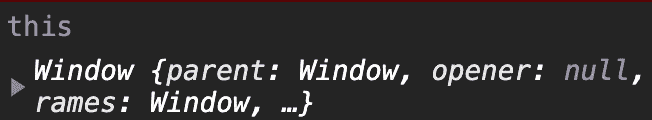
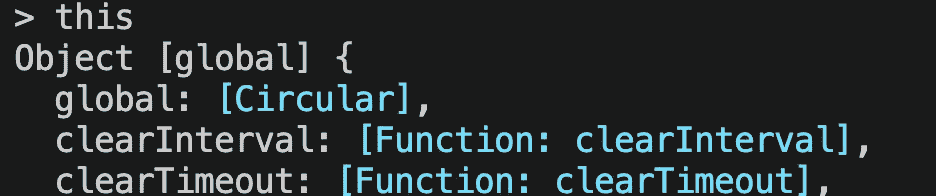
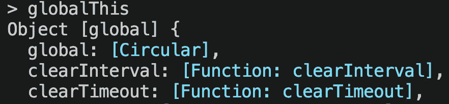
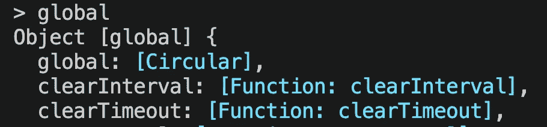

# 关于 JavaScript 中的“this ”,你需要知道什么

> 原文：<https://javascript.plainenglish.io/this-javascript-bca2b028e5ac?source=collection_archive---------6----------------------->

## 常见问题&一个 ES6 故事


Photo by [Jamie Templeton](https://unsplash.com/@jamietempleton?utm_source=medium&utm_medium=referral) on [Unsplash](https://unsplash.com?utm_source=medium&utm_medium=referral)

# 基础知识—为什么是“这个”？

如果你已经知道，就跳过这个。我希望我警告过你，这个词可能会和混淆。

让我们建立一个类。这将导致一个错误:

```
class Car {
  drive() {
    console.log(“driving”, speed, “fast”)
  }
}const blueCar = new Car()blueCar.speed = “120 mph”
blueCar.drive()
```

## **速度无法定义。**为什么？

因为默认情况下，我们要在驱动方法中使用的速度会在外部搜索这个变量。为了说明这一点，下面是一个不会出现错误的示例:

```
let speed = "160 mph"
class Car {
  drive() {
    console.log(“driving”, speed, “fast”)
  }
}const blueCar = new Car()blueCar.speed = “120 mph”
blueCar.drive()
```

“*开 160 mph 快*会被打印出来，因为*速度*指的是班外的变量。

所以，如果我们只想解决我们班上的一些问题，我们不会走得很远。这就是这个关键字的用途。它总是引用它所属的对象——在我们的例子中，是类。

正如你在下面的例子中看到的，我们也可以在之后为一个类设置属性。我们分配的所有这些属性都将存储在 *this:*

```
class Car {
  drive() {
    console.log(this)  // Car { speed: "120 mph" }
    console.log(“driving”, this.speed, “fast”) 
  }
}const blueCar = new Car()blueCar.speed = “120 mph”
blueCar.drive()
```

## 构造函数的作用

构造函数是一个任何类都可以拥有的函数——它必须被同样地调用，并且总是在我们创建一个新的实例时被执行——也就是说，当类被使用时。

顾名思义，它负责构造我们的类。通过构造函数，我们可以赋值，然后我们可以访问这个关键字。

说到底，构造函数只是一个函数，它获取参数并可以处理参数。

```
class Car {
  constructor(speed) {
    console.log(speed) *// 120 mph* } drive() {
    console.log("driving", speed, "fast")
  }
}const blueCar = new Car("120 mph")
blueCar.drive()
```

上面的代码将导致一个错误——在驱动方法中，没有定义速度。

这是和以前一样的问题。仅仅因为我们现在有了一个构造函数，并不能改变被搜索的变量是在类外搜索的事实。

但是多亏了构造函数，我们可以使用 this 在类中设置有效性:

```
class Car {
  constructor(speed) {
    this.speed = speed
  }

  drive() {
    console.log(“driving”, this.speed, “fast”)
  }
}
```

现在让我们了解更多关于 this-关键字的信息。

# 问题—“这个”丢失了

现在我给你看一些乍一看非常奇怪的东西。

这将是我们的又一堂课:

```
class Car {
    constructor(speed) {
        this.speed = speed
    }
    drive() {
        console.log(this.speed)
    }
}
```

让我们创建一个新实例并执行它的驱动方法:

```
const mercedes = new Car(120)
mercedes.drive()  // 120 - as expected
```

一切如预期。我们传递一些东西给构造函数，构造函数将它绑定到*这个*，当然，drive-method 现在可以访问速度*。*

这是执行驱动方法的第二种方式，用于打印我们的速度:

```
const driveMethod = mercedes.drive 
driveMethod() // error - this.speed is not defined
```

将会出现错误。这是一个完全正确的语法，我们可以在任何地方使用它——但是有一个关于类的问题。

函数被执行，但是*这个*丢失了——因为*这个*是点前面的东西——如果我们只调用函数，它就会丢失。是啊，真奇怪。

# 更多问题—窗口对象折叠

如前所述，这总是指它所围绕/所属的物体。这可能成为一个问题；让我们看一个例子:

```
class Car {
  constructor(speed) {
    this.speed = speed
  } drive() {
    console.log(“driving”, this.speed, “fast”)
    setTimeout(function() { }, 1000)
  }
}const blueCar = new Car(“120 mph”)blueCar.drive()
```

上面的代码工作正常。但是当我们把 console.log 放入 setTimeout()时，就像下面这样，我们会得到一个错误:

```
drive() {
  setTimeout(function() {
    console.log(“driving”, this.speed, “fast”)
  }, 1000)
}
```

速度未定义。因为*窗口*不提供*速度*。

*setTimeout* 属于全局窗口对象。我们可以改为编写*window . settimeout()—*现在指的是窗口对象。

当然，这是一个问题——我们的这个也几乎丢失了。但是有两种不同的解决方法。让我们从现在被认为是多余的一个开始:

**我们可以复制正确的*这个*。**

```
drive() {
  let _this = this
  setTimeout(function() {
    console.log(“driving”, _this.speed, “fast”)
  }, 1000)
}
```

这种方法非常有效，但是还有一种更现代的方法。也许你听说过箭头函数。

## Arrow 与常规函数——使用“this”示例

箭头函数和常规/经典函数有一些不同。一个重要的问题是你如何处理这个问题。

在 Arrow 函数中， *this* 总是表示定义 Arrow 函数的对象，因此 *this* 具有封闭上下文中的原始含义——在我们的示例中是我们的 drive-method。

这里有一个例子:

```
drive() {
  setTimeout(() => {
    console.log(“driving”, this.speed, “fast”)
  }, 1000)
}
```

这现在工作没有任何错误。

以下是 JavaScript 中箭头函数的更多信息:

[](https://medium.com/javascript-in-plain-english/arrow-functions-vs-regular-functions-in-javascript-f98687f23a6d) [## JavaScript 中的箭头函数与常规函数

### 旧的常规函数和 JavaScript 中的 ES6 箭头函数之间的终极对决。它们的工作方式和时间…

medium.com](https://medium.com/javascript-in-plain-english/arrow-functions-vs-regular-functions-in-javascript-f98687f23a6d) 

# 这在全球范围内

基本上，在 JavaScript 中，默认情况下这是指顶级对象。在浏览器中，它是窗口对象，这是 JavaScript 中几乎每个对象的起源。不仅*文档*而且例如数学。



source: the author, Chrome Devtools

```
window.document // #document window.Math.PI // 3.141….
```

所以在 JavaScript 中，它是窗口对象。但是 Node.js 中没有浏览器窗口，所以没有窗口对象——最高的对象叫做*全局*。

如果您打开 Node.js 命令行并键入以下内容，您将看到:



source: the author, Node.js command line

您也可以通过以下方式访问全局对象:



source: the author, Node.js command line



source: the author, Node.js command line

尽管如此，当然有交集:在浏览器中， *setTimeout* 是 window 对象的子对象；在 Node.js 中， *setTimeout* 函数会转到全局对象。

[**加入我的邮件列表保持联系**](http://eepurl.com/hacY0v)

## 简单英语的 JavaScript

喜欢这篇文章吗？如果有，通过 [**订阅解码获得更多类似内容，我们的 YouTube 频道**](https://www.youtube.com/channel/UCtipWUghju290NWcn8jhyAw) **！**