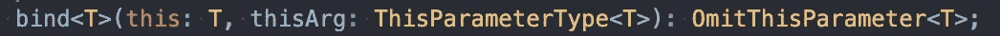

# JavaScript 中的“this”关键字

> 原文：<https://javascript.plainenglish.io/this-keyword-in-javascript-87f9feb89b95?source=collection_archive---------3----------------------->

## Java Script 语言

## JavaScript 中“this”关键字的解释


Photo by [Zachary Keimig](https://unsplash.com/@zacharykeimig?utm_source=medium&utm_medium=referral) on [Unsplash](https://unsplash.com?utm_source=medium&utm_medium=referral)

“this”关键字是我们每天在 JavaScript 中使用的。它被广泛应用于项目中的每个地方。但是你有没有把“这个”用在强理解上？你应该知道“这个”的特点，以避免潜在的副作用。在这篇文章中，我将介绍 JavaScript 中“this”的特性。

# 阅读前

如果你不了解 JavaScript 的执行上下文，我推荐你阅读[我之前关于执行上下文和词法环境的](https://medium.com/better-programming/execution-context-lexical-environment-and-closure-in-javascript-b57c979341a5)来获得它们的基础知识。那么你就更容易理解“这个”关键词了。

# “这个”是什么？

首先，你要知道“这个”是什么，它在 JavaScript 中是做什么的。JavaScript 中有一个称为“执行上下文”的区域，它是在 JavaScript 第一次运行代码或调用函数时创建的。如果连续调用 5 个函数，那么将创建 6 个执行上下文——全局执行上下文和其他 5 个函数执行上下文。每个执行上下文包含一个名为 *ThisBinding* 的值，该值与“this”关键字有关。

那是关于什么的？在 JavaScript 中，“this”是一个特殊的关键字，它允许你在当前范围内直接访问某个对象，不管你当前的函数在哪里。默认情况下，它引用全局对象。在节点中。Js，它将是`global`，在浏览器中，它将是`window`。

但更重要的是要记住，“this”所指出的东西是由哪个上下文调用包含“this”的函数决定的。我马上会给你们看一些例子。

# 如何在函数中使用“this”

看看如何在 JavaScript 中使用“this”的简单例子。

在函数中调用“this”有两种可能的情况。`obj.foo`正在引用`foo`的地址。`foo`被`obj`和`window`召唤。即使没有`window`。`obj.foo`印出 2 张，`window.foo`印出 1 张。那是因为“这”是由哪个上下文调用函数决定的。

当`foo`被`obj`调用时，`foo`执行上下文的 *ThisBinding* 引用`obj`作为其 *thisArg。*换句话说，`obj`所称的`foo`的“这个”就是指`obj`。所以当执行`this.x`时，“this”在`obj`中寻找`x`。但是，`foo()`等于`window.foo()`，所以`window`就成了“这个”所指的对象。

在全局范围内，“这个”就是`window`。

```
// In the global execution context (scope)
this === window // true
```

# “这个”的棘手之处

尽管“this”是由调用函数的上下文决定的，但“this”并不总是遵循这个规则。

Image source is from [GIPHY](https://giphy.com/gifs/snl-saturday-night-live-kenan-thompson-5b5OU7aUekfdSAER5I/links)

在这个例子中，函数`bar`中的`console.log`输出 2，这是一个全局变量。即使`bar`是在`foo`内部声明的，并且`bar`是在`foo`的执行上下文中调用的，听起来`bar`也应该打印出 1，但是它的“this”指向`window`。为什么会这样？

可悲的是，这是 JavaScript 在架构层面的一个缺陷。每个内部函数的“this”指出`window`——它可能是一个对象的方法，一些函数的回调函数，或者上下文中的一个普通函数。没关系。他们的“这个”总是朝向`window`。

# 如何避免这种瑕疵？

幸运的是，有几种方法可以避免这种情况。

## 函数.原型.绑定

`bind`创建一个新函数，以“this”为参数。无论你传递给`bind`函数什么，它都是函数的“this”。它接受任何类型的值。



bind takes any value for thisArg

例如，如果将`{x: 10}`作为第一个参数传递给`bind`，则`bind`会将`{x: 10}`绑定到原始函数的“this”并返回它。

那这个怎么用？

注意这部分。

```
bar.bind(this)();
```

由于`bind`将`foo`的当前“this”作为其绑定到“this”的参数，所以来自`bar`的新函数有“this”指出`foo`的“this”。然后你应该再次运行那个函数来执行里面的代码。

## 函数.原型.调用和函数.原型.应用

`call`和`apply`与`bind`类似，但是它们执行函数，而不是创建并返回一个新函数。两者都考虑“this”将引用的第一个参数 *thisArg* 。

你需要做的就是写这个。

```
bar.call(this);
bar.apply(this);
```

注意不像`bar.bind(this)()`，你不用再执行一次。

`call`和`apply`彼此也很相似，但也有一点点不同。`apply`接受包含所有参数的数组，`call`则分别接受每个参数。

```
theFunction.apply(valueForThis, arrayOfArgs)theFunction.call(valueForThis, arg1, arg2, ...)
```

在这个 stackoverkflow 问题中，有一个很好的评论。

> 想想申请参数数组中的`a`和调用参数列中的`c`。

## 范围链

这可能是避免这个问题的老方法，但这仍然受到许多开发人员的喜爱，因为它非常简单。

您可以让任何内部函数获取包含“this”的外部函数中声明的变量，如下例所示。

这种方式既方便又有用，但是缺点是你应该声明一个新的变量`that`并且内部函数应该总是携带它。

## 箭头功能

ECMAScript 2015 起，发布了 function 的新特性。箭头函数也可以避免这个问题。

之所以有效，是因为 arrow 函数的 *ThisBinding* 指出了其外部执行环境的*词汇环境*，换句话说，`bar`在调用“this”时使用了`foo`的“this”。

> 箭头功能没有自己的`this`。使用封闭词法范围的`this`值；箭头函数遵循正常的变量查找规则。

因此，在这种情况下，箭头函数不会按照您预期的方式工作。

# 构造函数中的“this”

在 JavaScript 中，任何函数都可以用作构造函数。但推荐的约定是第一个字母用大写字母，称为“帕斯卡格”。在构造函数中，“this”关键字的工作方式略有不同。

当用关键字`new`调用构造函数时，会创建一个新的原型函数对象。在内部，为返回值生成了一个新对象(`{}`),“this”被绑定到将被新对象使用的那个对象——在本例中，它是`person`。

所以当`Person`被调用时`Person`中的`this.name`被`John`置位。`John`被分配给新对象，如下图所示。

```
function Person() {
  var this = {};
  this.name = 'John';
  return this;
}
```

于是第一个控制台打印`John`。并且我们在它的原型上增加了一个函数`sayName`，而不是函数本身。绑定到原型的函数中的“this”将自动引用 JavaScript 引擎新创建的对象。但是，请记住，这不会像预期的那样起作用。

```
var name = 'Jane'; // Global variable...
Person.prototype.sayName = () => {
  console.log(this.name);
};var person = new Person();
person.sayName(); // Jane
```

为什么会这样？因为一个箭头函数不在乎哪个上下文调用它。此外，它没有自己的“this ”,所以当在箭头函数中调用“this”时，JavaScript 开始将“this”作为范围链接来查找。全局上下文中的“这个”是`window`，因此，箭头函数`sayName`中的`this.name`等于`window.name`，也就是`Jane`。

# 结论

JavaScript 中的“this”关键字被许多开发人员广泛使用，实际上使用起来非常方便。但是“this”不是 JS hack，所以你应该正确地意识到它的概念。我希望你记住“这”是很容易改变的，取决于你如何使用它。

# 资源

*   [MDN 中的“this”关键字](https://developer.mozilla.org/en-US/docs/Web/JavaScript/Reference/Operators/this)
*   [MDN 中的 function . prototype . bind](https://developer.mozilla.org/en-US/docs/Web/JavaScript/Reference/Global_objects/Function/bind)
*   [MDN 中的 function . prototype . call](https://developer.mozilla.org/en-US/docs/Web/JavaScript/Reference/Global_Objects/Function/call)
*   [stack overflow 中的不同调用与应用](https://stackoverflow.com/questions/1986896/what-is-the-difference-between-call-and-apply)
*   [数组函数 ins MDN](https://developer.mozilla.org/en-US/docs/Web/JavaScript/Reference/Functions/Arrow_functions)