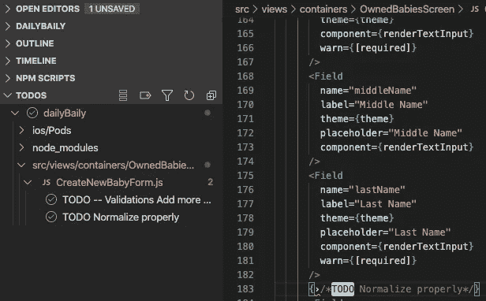
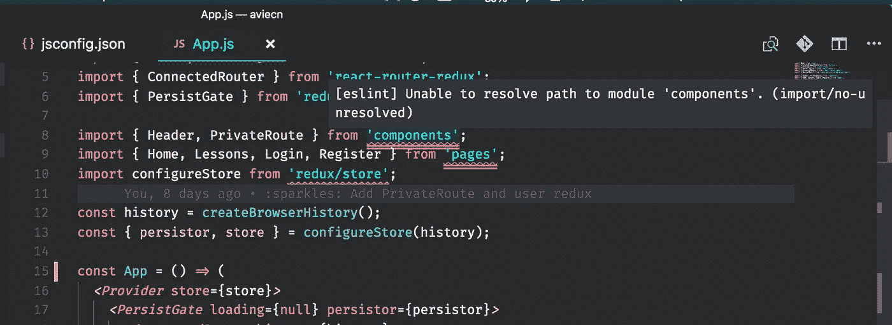

# VSCode 中对初学编码的人有帮助的三个扩展

> 原文：<https://javascript.plainenglish.io/three-helpful-extensions-in-vscode-for-beginners-to-coding-6c8b309cb9df?source=collection_archive---------7----------------------->

## 使用 VSCode 时，使编码更容易并有助于保持代码一致性的扩展。

目前市场上有成千上万种不同的“集成开发环境”(IDE)，每一种都允许你使用不同的语言和框架。任何不熟悉用 JavaScript 开发任何东西的人都可能不知道使用哪种 IDE。目前最首选的是 [Visual Studio 代码](https://code.visualstudio.com/) (VSCode)。

VSCode 是微软为 Windows、Linux 和 macOS 开发的源代码编辑器，具有许多不同的 IDE 特性，如调试、语法高亮、Git 等。更强大的是，它允许开发人员进行扩展，为开发框架提供更多的功能。

本文将介绍三种扩展，它们使开发 JavaScript 应用程序(包括 React、Angular、Vue 或 React-Native 等框架)变得更加容易，同时允许我们遵循更好的编码实践。

## 扩展 1: [进口成本](https://marketplace.visualstudio.com/items?itemName=wix.vscode-import-cost)

Import-Cost 显示了导入第三方库时的大小。该工具有助于确定特定进口的规模，并尽可能提高进口效率。管理导入的大小是很好的编码实践——对于较大的项目，这有助于提高最终用户体验到的性能——您的应用程序下载较少。

Simple example of how effective this library can be

## 扩展 2: [待办事项高亮](https://marketplace.visualstudio.com/items?itemName=wayou.vscode-todo-highlight)

ToDo 允许开发人员在开发特性时捕获他们发现的代码中的任何问题，或者捕获他们以后可以参考的想法。当您有一个由多个开发人员参与的大型项目、有截止日期的特性，并且您想要捕获快速笔记以供以后参考时，这是非常方便的。当您在代码中发现一些可能不正确的东西，或者通常有更好的方法来解决您想回头再看的问题时，这也很方便。

这个扩展的酷之处在于，它提供了 VSCodes 文件导航器中所有待办事项的列表，因此您可以快速方便地引用它们。

Example of a todo and the file structure to reference TODOs later

## 扩展 3: [ESLint](https://marketplace.visualstudio.com/items?itemName=dbaeumer.vscode-eslint)

林挺工具有助于标记编程错误、bug 和文体错误。因为 JavaScript 是一种松散类型的语言，所以需要执行代码来识别是否有语法错误。ESLint 允许开发人员在不执行 JavaScript 代码的情况下发现代码的问题。

这个工具的一个优点是，它还可以作为一个更漂亮的工具来帮助格式化您的代码，使其在文件之间保持一致。

ESLint indicating a file-path cannot be resolved.

有许多不同的其他库有助于使 VSCode 中的编码更容易——如果有其他库您已经使用过并推荐——请在下面留下您的回复！

## **简明英语团队的一份说明**

你知道我们有四种出版物吗？给他们一个关注来表达爱意:[**JavaScript in Plain English**](https://medium.com/javascript-in-plain-english)[**AI in Plain English**](https://medium.com/ai-in-plain-english)[**UX in Plain English**](https://medium.com/ux-in-plain-english)[**Python in Plain English**](https://medium.com/python-in-plain-english)**——谢谢，继续学习！**

**此外，我们总是有兴趣帮助推广好的内容。如果您有一篇文章想要提交给我们的任何出版物，请发送电子邮件至[**submissions @ plain English . io**](mailto:submissions@plainenglish.io)**，附上您的媒体用户名和您感兴趣的内容，我们将会回复您！****