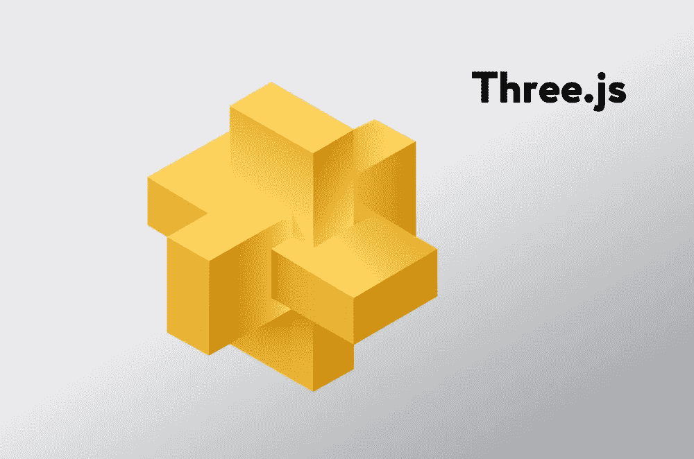
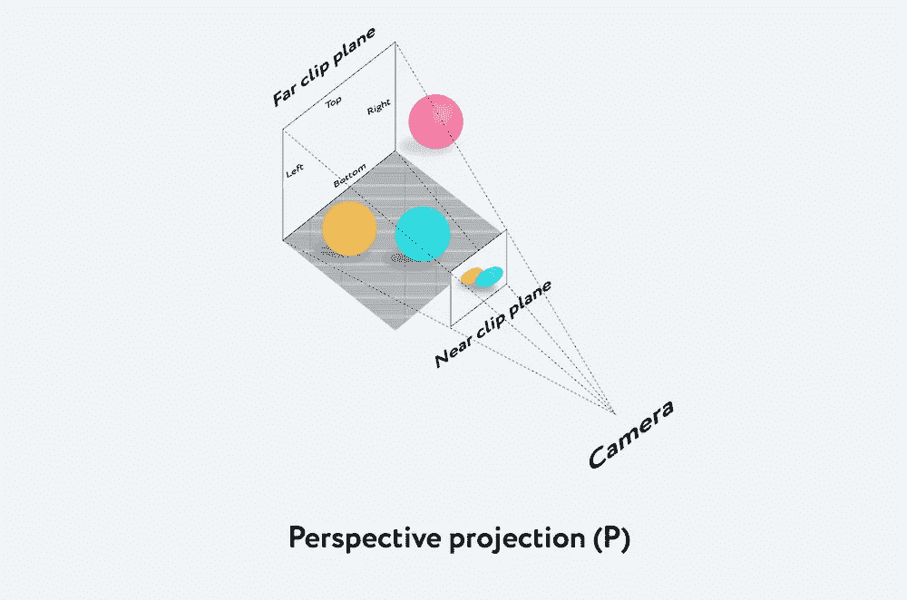
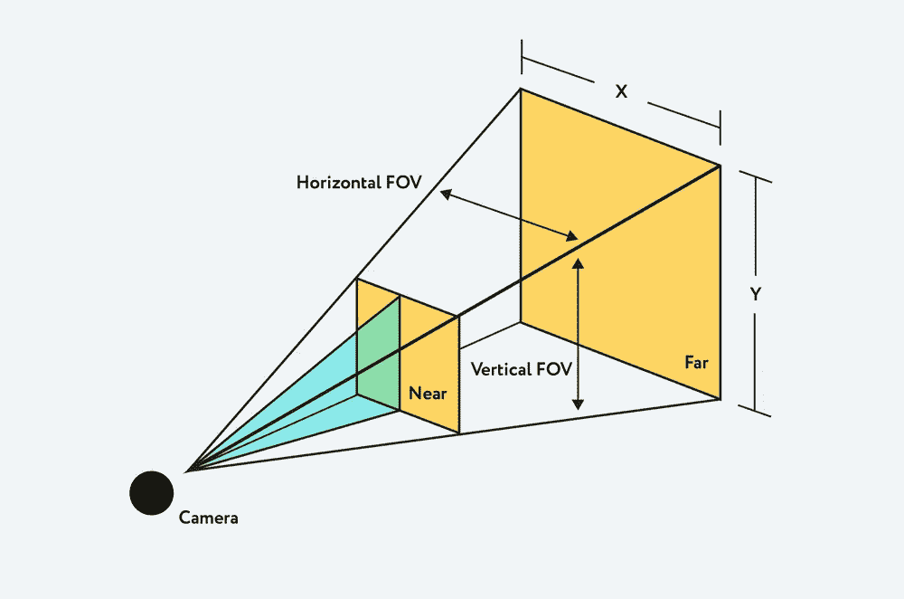
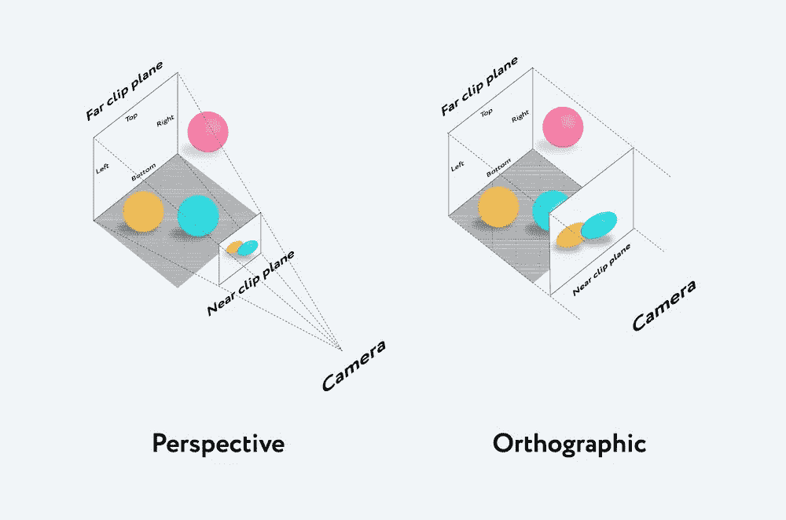
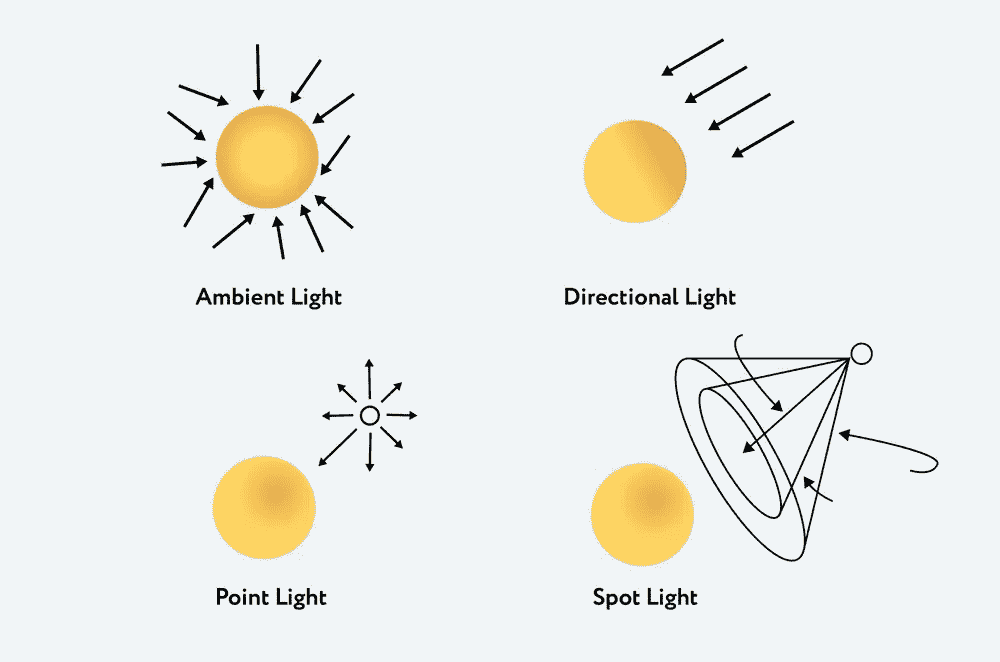

# 3D web 开发简介

> 原文：<https://javascript.plainenglish.io/three-js-basics-c5bf2ab6773b?source=collection_archive---------8----------------------->

## 网络的复杂性每天都在变化，其范围也在快速增长，尤其是在 3D 渲染方面。



WebGL 是一个 JavaScript 库，用于在浏览器中渲染 2D 图形和交互式 3D 图形。它基于 [OpenGL](https://www.opengl.org/) 的架构。WebGL 使用带有 C 语法的 [GLSL](https://www.khronos.org/opengl/wiki/Core_Language_(GLSL)) 着色器语言。WebGL 使用 HTML5 < canvas >元素将 3D 图形放入浏览器页面。

使用 WebGL，尤其是使用着色器是相当耗时的。在开发过程中，你需要描述每个点、线、面等等。为了呈现所有这些，我们需要编写一段相当庞大的代码。为了提高开发速度，开发了 Three.js 库。

Three.js 是一个 JavaScript 库，包含一组预定义的类，用于在 WebGL 中创建和显示交互式 3D 图形。

WebGL 的 Three.js 与 JavaScript 的 jQuery 相同。该库提供了声明性语法，并减轻了浏览器中与 3D 相关的头痛。

让我们看看 Three.js 的概况，看看如果你是 3D 世界的新手，该如何开始。

# 关于 Three.js 的更多信息

如前所述，Three.js 库使得使用 WebGL 更加容易。当使用 Three.js 时，不需要编写着色器(但可能性仍然存在)，并且可以使用熟悉的概念。

大量的开发人员在库上工作。策划者和开发者是里卡多·卡韦略，他的创作笔名是“杜布先生”。

使用 Three.js 的图形建模可以与电影场景进行比较，因为我们有机会管理场景、光线、相机、对象和材料等概念。

图书馆的三大支柱包括:

*   *场景*——一种放置我们创造的所有物体的平台；
*   *摄像机* —这是指向场景的“眼睛”。摄像机拍摄并显示舞台上的物体；
*   *渲染器* —一个可视化工具，允许你显示摄像机捕捉到的场景。

Three.js 提供几种类型的相机:

*   透视照相机
*   立体摄像机
*   正交照相机
*   立方体照相机

最常见的是透视和正交相机。

# 透视照相机

这是渲染 3D 场景最常用的投影模式。

透视相机被设计成模拟人眼所看到的。相机感知透视投影中的所有物体:物体越远，看起来就越小。



透视摄像机有 4 个参数:

*   *FOV* 或*视野* —定义你可以看到的围绕摄像机中心的角度。
*   *长宽比* —屏幕的宽高比。当视野值较大时，物体的外观尺寸在远处会迅速减小。相反，对于小数值，物体的表观尺寸几乎不取决于距离。
*   *近&远* —进入渲染的摄像机的最小和最大距离。因此，非常远的点和非常近的点都不会被渲染。



# 正交照相机

在这种投影模式下，对象的大小保持不变，不管它与相机的距离如何。也就是说，它是一个远离物体无限远的摄像机。

在这种情况下，所有垂直线保持垂直，所有平行线保持平行。如果我们移动摄像机，线条和物体就不会变形。

这在显示 2D 场景和 UI 元素时非常有用。



# 光

没有舞台上的灯光，我们似乎在一个黑暗的房间里，只能看到轮廓。此外，通过灯光舞台，我们增加了更多的真实感。从技术上来说，每种光都是可以着色的。

灯的类型:

*   *环境光* —背景照明，用于均匀照亮场景中的所有物体；不能用于创建阴影，因为它没有方向。
*   *平行光* —向特定方向发射的光。这种光的行为就好像它无限远，从它产生的光线都是平行的。它可以投射阴影，因为它是针对一个特定的对象。
*   *点光*——从一个点向所有方向发射的光。它的一个常见用途是重复从一个简单的灯泡发出的光。
*   *聚光灯* —这种光从一个方向的一点发出，沿着一个圆锥体，随着远离光源而扩大。



# 创建对象

在场景中创建的对象称为网格。网格是一种表示由三角形多边形组成的对象的类。

使用两个对象构建网格:

*   *几何图形*-定义对象形状(顶点、面、半径等的位置)。)
*   *材质* —定义对象外观(颜色、纹理、透明度等)。)

让我们尝试创建两个简单的形状:一个立方体和一个球体。

首先，我们去[https://threejs.org/](https://threejs.org/,)下载最新版本的库。然后，我们在文档的头部分或主体部分的开头连接库，我们就完成了:

```
<!DOCTYPE html>
<html>
  <head>
    <meta charset=utf-8>
    <title>First Three.js app</title>
    <style>
      body { margin: 0; }
      canvas { width: 100%; height: 100% }
      </style>
  </head>
  <body>
    <script src="/js/three.js"></script>
    <script>
      // Javascript code here.
    </script>
  </body>
</html>
```

为了能够显示我们未来的对象，首先，我们需要创建一个场景，添加一个摄像机，并设置一个渲染。

添加一个场景:

```
var scene = new THREE.Scene();
```

现在我们添加一个*透视摄像机*:

```
var camera = new THREE.PerspectiveCamera( 75, window.innerWidth / window.innerHeight, 0.1, 1000 );
```

摄像机有 4 个参数，如前所述:

*   FOV 或视场，在我们的例子中它是一个 75°的标准角；
*   第二个参数是长宽比；
*   最后两个参数是近剪裁平面和远剪裁平面(距离相机比“远”或“近”的值远的对象不会被渲染)

添加和设置一个*渲染器*:

```
var renderer = new THREE.WebGLRenderer();
renderer.setSize( window.innerWidth, window.innerHeight );
document.body.appendChild( renderer.domElement );
```

这里我们有什么:我们首先创建一个渲染器，然后根据可见区域的大小设置其大小，最后将其添加到页面中，以创建一个我们将使用的空的 **canvas** 元素。

为了创建立方体本身，首先，我们定义一个几何图形*:*

```
*var geometry = new THREE.BoxGeometry( 10, 10, 10);*
```

**BoxGeometry* 类用于创建长方体或盒子。这是一个包含立方体的顶点和面的类。这里我们设置了三个变量:*

*   **宽度*:平行于 X 轴的边的长度*
*   **高度*:平行于 Y 轴的边的长度*
*   **深度*:平行于 Z 轴的边的长度*

***所有变量默认为 1**

*为了给立方体上色，我们需要设置一个*材质*:*

```
*var material = new THREE.MeshBasicMaterial( { color: 0x00ff00 } );*
```

*在我们的例子中，我们有 *MeshBasicMaterial* 和 *0x00ff00* 颜色属性，即绿色。这种材料基本上用于制造颜色均匀的物体。缺点是物体失去了深度。但是当使用 *{wireframe: true}* 参数创建线框对象时，该材质非常有用。*

*现在我们需要一个*网格*，它接受几何体，并对其应用材质:*

```
*var cube = new THREE.Mesh( geometry, material );
scene.add( cube );

camera.position.z = 25;*
```

*我们将*网格*插入场景，然后将相机移出一点。这是为了避免相机和立方体在同一点，因为默认情况下，当我们调用 scene.add()时，图形将被添加到坐标(0，0，0)中。*

*为了制作立方体的动画，我们需要使用[*requestAnimationFrame*](https://developer.mozilla.org/en-US/docs/Web/API/window/requestAnimationFrame)绘制渲染循环中的所有内容:*

```
*function render() {
        requestAnimationFrame( render );
  cube.rotation.x += 0.01;
  cube.rotation.y += 0.01;      
  renderer.render( scene, camera );
}
render();*
```

**requestAnimationFrame* 是对浏览器的一个请求，表示你希望制作一些动画。我们传递一个函数来调用，就是 *render ()* 。*

*这里我们还设置了旋转速度参数。结果，循环每秒渲染我们的场景 60 次，并使立方体旋转。*

*结果是这样的:*

*让我们创建一个球体:*

```
*var geometry = new THREE.SphereGeometry(1, 32, 32);*
```

*对于一个球体，使用了*球面几何*类，它采用以下参数:*

*   **半径*(默认值为 1)；*
*   **宽度段* —水平段(三角形)的数量。最小值为 3，默认值为 8；*
*   **高度段* —垂直段的数量。最小值为 2，默认值为 6。*

*顺便说一下，分段或三角形的数量越多，球体的表面就越光滑。*

*现在让我们使用另一种材质——*meshnormal material*——一种将法向量映射到 RGB 颜色的多色材质:*

```
*var material = new THREE.MeshNormalMaterial(); var sphere = new THREE.Mesh( geometry, material ); scene.add( sphere ); camera.position.z = 3;*
```

*Three.js 提供了大约 15 种类型的材质，其中一些可以组合起来同时应用于一个对象。在这里阅读更多。*

*最后一步是设置渲染循环:*

```
*function render() {
	requestAnimationFrame( render );
	sphere.rotation.x += 0.01;
  sphere.rotation.y += 0.01;
  renderer.render( scene, camera );
}
render();*
```

*这是我们得到的结果:*

*现在让我们试着创建一个形状稍微复杂一点的物体，并应用另一种材质。*

*作为一个例子，我们将采取*网状材料*，这是受光的影响。因此，我们首先需要给场景添加一些光线。下面我们添加一个黄色的*聚光灯*，并设置其在坐标轴上的位置:*

```
*var scene = new THREE.Scene();
var spotLight = new THREE.SpotLight(0xeeeece);
spotLight.position.set(1000, 1000, 1000);
scene.add(spotLight);
var spotLight2 = new THREE.SpotLight(0xffffff);
spotLight2.position.set( -200, -200, -200);
scene.add(spotLight2);*
```

**如上所述，聚光灯*从一个点向一个方向发射，沿着一个圆锥体，其大小随着离光越远而增加。除了颜色，聚光灯还可以带以下参数:*强度、距离、角度、半影和衰减*。它也可以投射阴影。*

*现在是一份*材料*的时候了:*

```
*var material = new THREE.MeshPhongMaterial( {
color: 0xdaa520,
specular: 0xbcbcbc,
 } );*
```

*这种材料用于有光泽的表面。我们在这里传递了一个金色的颜色，并添加了一个高光属性，它定义了反射的亮度和颜色。默认颜色为 *0x111111* 深灰色。*

*现在我们渲染它，得到如下结果:*

# *关于 Three.js 的更多信息*

*要将 Three.js 包含到您的项目中，您需要做的就是运行 *npm install three* 。*

*如果你用 [Webpack](https://webpack.github.io/) 或 [Browserify](https://github.com/substack/node-browserify) 捆绑你的文件，它们允许你通过捆绑你所有的依赖项在浏览器中“要求(‘模块’)”，你能够将模块导入到你的源文件中并继续正常使用它。*

```
*var THREE = require('three');

var scene = new THREE.Scene();
...*
```

*您还可以利用 [ES6 导入语法](https://developer.mozilla.org/en-US/docs/Web/JavaScript/Reference/Statements/import):*

```
*import * as THREE from 'three';

const scene = new THREE.Scene();
...*
```

*如果需要，可以只导入 Three.js 库的选定部分，例如:*

```
*import { Scene } from 'three';

const scene = new Scene();
...*
```

# *结论*

*在几行代码的帮助下，我们创建了两个简单的形状，还有一个有点复杂。自然，Three.js 有更多的功能。Three.js 有许多开箱即用的形状、材料、照明类型等。这只是基础的一小部分。*

*Three.js 库允许你创造真正伟大的东西。以下是一些朗朗上口的例子:*

*   *[例 1](https://threejs.org/examples/#webgl_helpers)*
*   *[例二](https://threejs.org/examples/#webgl_effects_anaglyph)*
*   *[例 3](https://threejs.org/examples/#webgl_lines_sphere)*

*如果你想开始学习 JavaScript 中的 3D，你可以在这里找到你需要的一切[。](https://threejs.org/)*

**原载于 2020 年 4 月 9 日*[*https://intexsoft.com*](https://intexsoft.com/blog/introduction-to-3d-three-js-basics/)*。**

## *JavaScript 用简单的英语写的一个注释:*

*我们已经推出了三种新的出版物！请关注我们的新出版物:[**AI in Plain English**](https://medium.com/ai-in-plain-english)，[**UX in Plain English**](https://medium.com/ux-in-plain-english)，[**Python in Plain English**](https://medium.com/python-in-plain-english)**——谢谢，继续学习！***