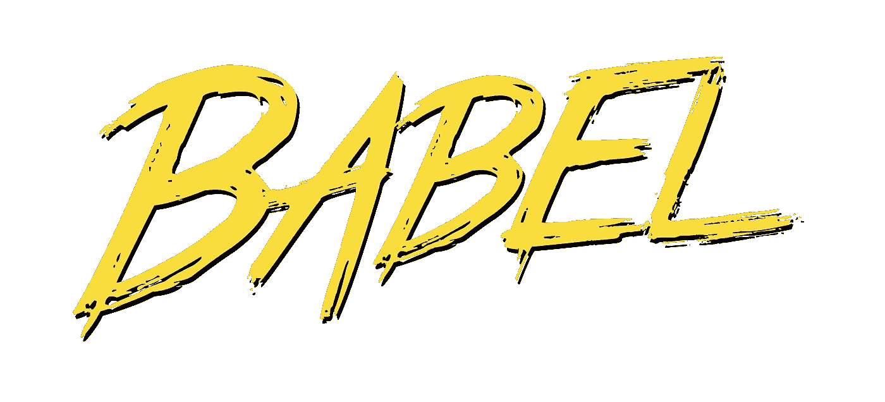

# 使用 Babel 和 React 的三种方法

> 原文：<https://javascript.plainenglish.io/three-ways-to-use-babel-with-react-9faf3c0e846b?source=collection_archive---------1----------------------->



# 巴别塔是什么

*   JavaScript 转换程序
*   最初，babel 的主要重点是将 ECMAScript 2015+ (ES6+)代码转换为向后兼容的 JavaScript 版本，可以由旧的 JavaScript 引擎运行
*   现在，巴别塔被用来转换(trans file)JSX 语法，打字稿，代码压缩，以及任何提案阶段的语法。例如，在 ES6 中指定的箭头函数被转换成常规函数声明
*   另外，Babel 提供了 polyfills 来支持 JavaScript 环境中完全没有的特性。例如，像`Array.from`这样的静态方法和像`Promise`这样的内置方法只在 ES6+中可用，但是如果使用了 Babel polyfill，它们可以用在较旧的环境中

# 有 4 种方法来运行巴别塔

1.  @babel/cli
2.  webpack babel-loader
3.  @babel/core
4.  @babel/register

**@babel/register** 经常在 Node.js 中使用，它让 babel 在执行`require`代码时动态运行。由于在 React 中运行 babel 的方式并不流行，我们不打算用 **@babel/register** 的方式来处理

# 创建一个示例项目

*首先，让我们创建一个示例项目*

**—创建一个目录和 package.json**

*   让我们创建一个名为`test-babel-how`的目录
*   移动到目录
*   通过运行`npm init -y`将 package.json 包含在目录中

```
mkdir test-babel-how
cd test-babel-how
npm init -y
```

**—安装必要的软件包**

*   **@ babel/core**:@ babel/core 包是执行 babel 所必须的
*   **@babel/cli** :内置 cli，可用于从命令行编译文件
*   **@ babel/plugin-transform-arrow-functions**:将 ES2015 (ES6)箭头函数编译成 ES5
*   **@ babel/plugin-transform-template-literals**:将 ES2015 (ES6)模板文字编译成 ES5
*   **@babel/preset-react** :所有 react 插件的 babel 预设

```
npm i [@babel/core](http://twitter.com/babel/core) [@babel/cli](http://twitter.com/babel/cli) [@babel/plugin-transform-arrow-fu](http://twitter.com/babel/plugin-transform-arrow-fu)nctions [@babel/plugin-transform-template](http://twitter.com/babel/plugin-transform-template)-literals [@babel/preset-react](http://twitter.com/babel/preset-react)
```

**—创建一个样本代码**

*   创建一个`src`文件夹，并在`src`文件夹中创建`code.js`

```
test-babel-how
|
 -- node_modules
 -- src
   |
    -- code.js
 -- package-lock.json
 -- package.json
```

*   code.js

code.js

**我们将要:**

1:使用**反应预设**的 trans file JSX 语法

2:使用**模板文字插件**传输模板文字

3:使用**箭头功能插件**的传输箭头功能

# 1.@babel/cli

**—在终端**中运行以下命令

```
npx babel src/code.js **// 1**
--presets=[@babel](http://twitter.com/babel)/preset-react **// 2**
--plugins=[@babel/plugin-transform-template](http://twitter.com/babel/plugin-transform-template)-literals, **// 3**
[@babel/pl](http://twitter.com/babel/pl)ugin-transform-arrow-functions
```

1: Babel 命令并告知代码存在于何处`src/code.js`

2:我们正在使用预设的`@babel/preset-react`

3:我们使用 2 个插件`@babel/plugin-transform-template-literals` & `@babel/plugin-transform-arrow-functions`

**—终端中的后续输出**

```
const element = /*#__PURE__*/React.createElement("div", null, "babel test"
); **// 1**const text = "element type is ".concat(element.type); **// 2**const add = (a, b) > a + b; **// 3**
```

// 1 : JSX 语法转换为 createElement 函数调用

// 2:用`concat`方法将模板文字转换成字符串

// 3:箭头函数转换为普通函数

# 2.webpack babel-loader

**—安装软件包以使用 webpack**

```
npm i webpack webpack-cli babel-loader
```

**—创建一个** `**babel.config.js**` **文件**

*   代替在终端中运行**预置** & **插件**，我们制作一个名为`babel.config.js`的配置文件来指定预置&插件

**—创建一个** `**webpackge.config.js**` **文件**

webpack.config.js

1:使用 webpack 指定要捆绑的文件

2:将结果保存到`dist/code.bundle.js`文件

3:让`babel-loader`来处理 JavaScript 文件

4: webpack 默认压缩 JavaScript 文件以进行优化。但是，让我们不要优化(压缩 JavaScript 文件)来查看输出是否如预期的那样

*   我们使用`babel.config.js`文件中的配置

**—运行 webpack**

```
npx webpack
```

— `dist/code.bundle.js`通过以下输出创建

*   `// ...`部分是 webpack 的运行时代码
*   我们可以发现生成了相同的输出

# 3.直接使用@bael/core

*   @babel/core 是执行 babel 的基础，我们通过@babel/cli 和 babel-loader 间接使用@babel/core

**—创建** `**runBabel.js**` **文件**

runBabel.js

1:获取@ babel/核心模块

2:获取要编译的文件`code.js`

3:设置预设和插件

4:使用`transformSync`功能执行通天塔

5:让不要使用`babel.config.js`配置文件

6:打印转换后的代码

**—运行文件**

```
node runBabel.js
```

*   在终端中检查相同的输出

```
const element = /*#__PURE__*/React.createElement("div", null, "babel test"
); // 1const text = "element type is ".concat(element.type); // 2const add = (a, b) > a + b; // 3
```

# 结论

*   从 ECMAScript 2015 (ES6)推出开始，JavaScript 社区几乎每年都会推出新版本(ECMAScript 2016、2017、2018)
*   因此，在当今快速发展的 JavaScript 社区中，Babel 的 transpiling 功能是非常必要的工具
*   希望你能多理解巴别塔一点:)

> 在本文中，我们通过 3 种方式来运行 Babel
> 
> 谢谢:)


Photo by [Jan Tinneberg](https://unsplash.com/@craft_ear?utm_source=medium&utm_medium=referral) on [Unsplash](https://unsplash.com?utm_source=medium&utm_medium=referral)