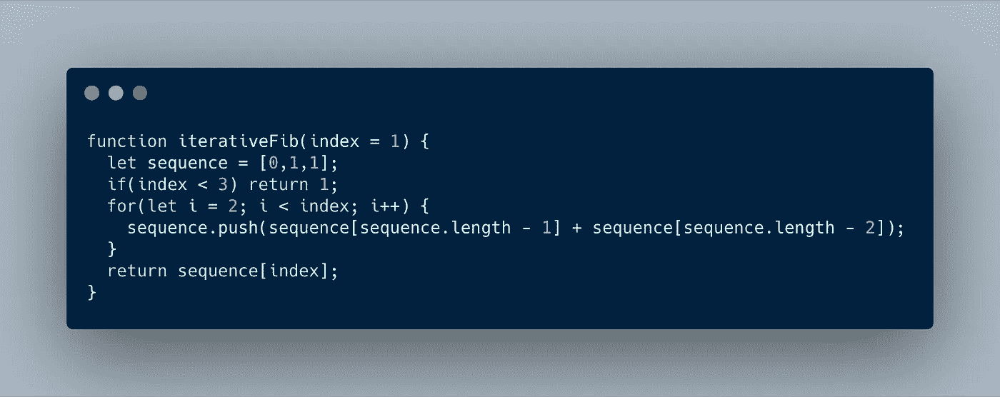
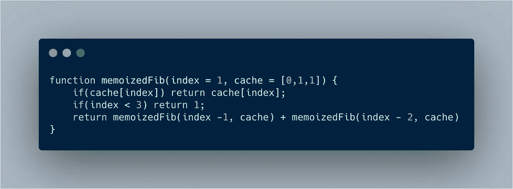

# 用 JavaScript 编写斐波那契函数的三种方法

> 原文：<https://javascript.plainenglish.io/three-ways-to-write-a-fibonacci-function-in-javascript-a711db62788e?source=collection_archive---------3----------------------->

‘The Golden Ratio Coloring Book’ by Artist Rafael Araujo

斐波那契数列是数学界最著名的计算之一。关于它的意义，我就不多说了，但是我建议你如果对它感兴趣的话，就去读一读——当然是在你读完之后！

无论如何，编写一个可以计算斐波那契数列的函数是计算机科学领域经常出现的事情。它可能会在学习递归时出现，也可能会在软件工程面试中出现。不管是什么原因，知道这一点是很有用的，也很好。

我们将看看计算斐波纳契数列的三种方法，并讨论为什么某些方法比其他方法“更好”。说得够多了，我们开始吧。

# 1.迭代方法

Iterative Fibonacci

这里我们有一个利用 for 循环的方法。关于这个实现，有一些事情值得注意:

1.  我们设置了一个已经用`0,1,1`初始化的`sequence`数组。如果传递给函数的`index`参数小于 3，我们只需返回`1`。这一部分可能有其他的实现方式，也有关于斐波纳契数列应该从 0 还是 1 开始的争论。然而，我们选择只保留`1`作为最低的数字。
2.  因为在我们的`sequence`数组中已经有了 Fibonacci 序列的前三个值，所以我们的 for 循环将`i`设置为`2`。你可能想知道为什么我们没有从`3`开始——这是因为，虽然我们可能已经有了序列的前三个值，但是如果我们使用零索引来引用这些值，我们实际上只有第零、第一和第二个值。
3.  在我们的循环中，我们将`sequence[sequence.length — 1] + sequence[sequence.length — 2]`的值推入`sequence`数组。由于所有的序列字，这可能看起来有点难懂，但我们基本上是说，假设斐波那契序列中的下一个值是序列中前两个数字的和，那么两个值相加，然后将其推入`sequence`数组。
4.  最后，我们给函数的参数`index`一个默认值`1`。这是不必要的，只是为了让我们的函数在没有参数传入的情况下也能运行。我们在第二个和第三个例子中也使用了同样的方法。

使用迭代方法是非常好的，因为它做了我们想要它做的事情，但是它不是特别优雅。让我们看看我们是否能在这方面有所改进。

# 2.递归方法

Recursive Fibonacci

在我看来，递归 Fibonacci 函数是编程世界中最优雅的模式之一。我们有一个只有三行长的函数，但是对于任何理解递归工作原理的人来说，它的表达能力还是足够的。让我们花点时间来分析一下:

1.  与递归函数一样，我们有一个防止无限循环的基本情况。这是`if(index < 3) return 1;`的基本情况，我们也在我们的迭代斐波那契函数中使用过，第三个例子你稍后会看到。
2.  最后，我们返回两个对`recursiveFib()`的递归调用。这与我们的`iterativeFib()`函数的工作方式非常相似，我们的循环返回斐波那契数列中前两个数的和。这里的不同之处在于，我们通过递归调用自身来计算相同的值。

因此，虽然这种递归方法非常适合计算斐波那契数列——也可以说更优雅——但如果没有特定的处理机制，递归函数通常会占用大量内存。如果你不太确定递归是如何工作的，我强烈推荐你阅读一下这个主题，这样你就能更好地理解递归是如何影响调用栈的——如果需要的话，也可以查一下“调用栈”。

无论如何，因为函数调用自己，而自己又调用自己，以此类推，直到到达基本情况，函数调用的数量基于传入的原始`index`参数呈指数级上升。简而言之，如果你试图传入任何大于 50 的数字，你的计算机可能会讨厌你。因此，我们的递归斐波那契函数感觉有点多余。我们能做些什么来补救吗？

# 3.记忆递归方法

Memoized Recursive Fibonacci

记忆本质上是存储函数输出的概念，以便将来可以再次使用。我们基本上是从缓存中检索值，而不是再次调用函数。记忆化的概念可以让我们的递归斐波那契函数更加有效。那么这是如何工作的呢？

1.  我们的函数现在接受两个参数，而不是一个。第一个是`index`和之前一样。第二个是`cache`，你会看到我们默认为一个`[0,1,1]`数组。这与我们在`iterativeFibonacci()`函数中初始化`sequence`值时所做的基本相同。实际上，在我们的内存化示例中，我们可以将它设置为一个空数组，但我选择了不这样做，因为这会导致我们的数组有三个空值，我不太喜欢这种外观——稍后我会解释为什么会出现这种情况。
2.  然后我们需要一行额外的代码`if(cache[index]) return cache[index]`。在这里，我们基本上是说，如果我们已经在缓存中存储了我们需要的值，那么就返回那个值，而不是以后再去计算它。
3.  第三行是我们的基本情况，我们也在之前的斐波那契函数中使用过。
4.  最后，我们返回斐波纳契数列中前两个数之和的值。这与我们在之前的递归斐波纳契函数中所做的一样。这里的关键区别是递归调用的数量减少了，因为我们缓存每个结果并返回它，而不是每次都计算它。因此，如果您想象我们通过一起计算前面两个值来返回斐波纳契数列中一个索引的值，总和的第一部分将通过递归序列来查找每个值，但第二部分将简单地依赖于缓存的值。

这种记忆方法意味着我们的计算机在处理传入的大量数据时不太可能失败。当然，你可以说我们的迭代方法是我们的计算机最容易处理的方法，但同时你也可以说我们的递归调用更优雅，更容易推理。

## 我们做到了！

计算斐波纳契数列的三种方法。我希望你已经学会了一两件事，并且很想听听你的想法，你更喜欢哪个，为什么。