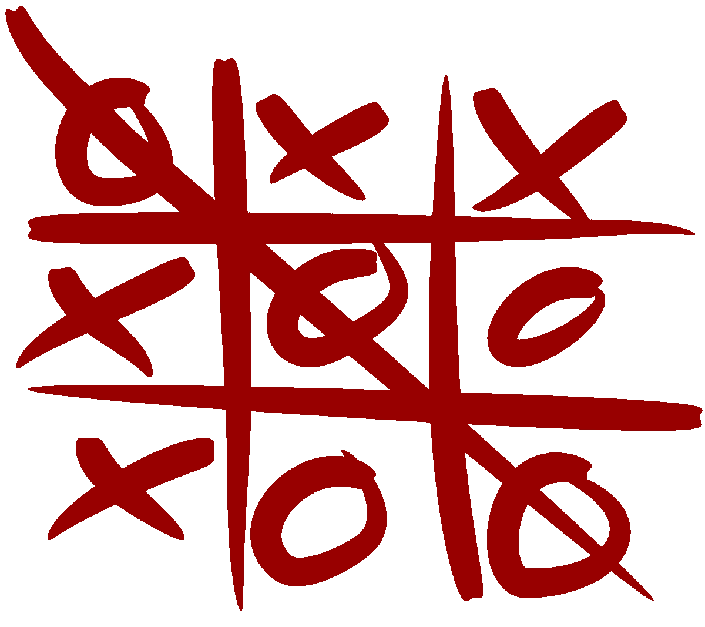
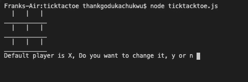
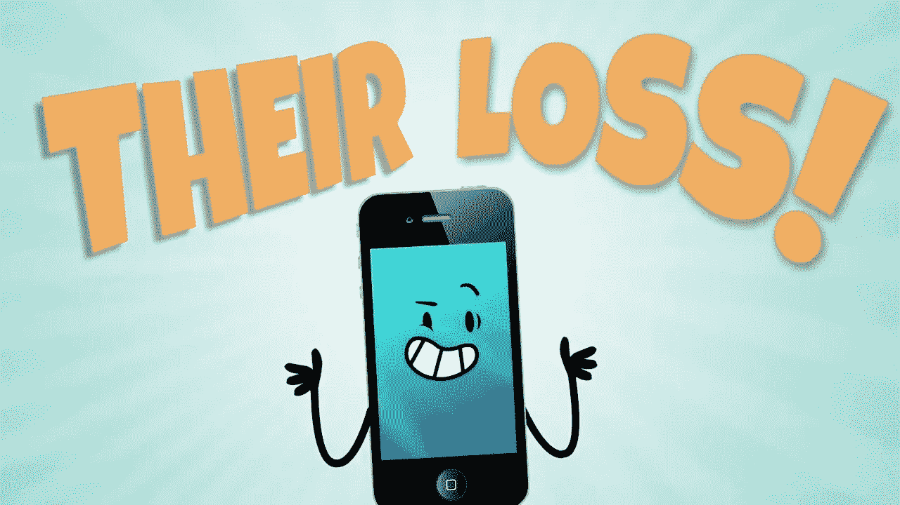

# 初学 JavaScript 的井字游戏

> 原文：<https://javascript.plainenglish.io/tic-tac-toe-in-javascript-for-beginners-befbb55c0da?source=collection_archive---------2----------------------->



这是一个简单游戏的简单实现之一，初学者可以用它来测试自己对编程语言的理解水平。事实上，在一次采访中，我被要求用 JavaScript 实现这一点。首先，我预计会被问到与该职位相关的技术问题(Node.js 和 React.js ),因为我已经在远程工作平台上完成了初步的算法评估，但我遇到了一位面试官，他将我带到一个在线 IDE，并要求我用几个框架函数实现井字游戏。与此同时，我们在 30 分钟的会议中花了 10 分钟讨论技术问题，从 zoom 到 google meet，声音问题，浪费的时间没有得到补偿。面试官比我早 6 个小时。我没有通过。令人沮丧。唷！


虽然井字游戏可能微不足道，但我不确定 30 分钟够不够，可能一个小时就够了。在那次不愉快的遭遇之后，我决定实施井字游戏，而不去搜索谷歌寻求帮助(我在面试中被给予了搜索谷歌的选项)。

对于这个实现，我从 Google 得到的唯一部分是如何从 Node.js 中的命令行读取输入，我不太熟悉，但实现这个帮助我内在化了如何让 [readline 对象](https://nodejs.org/en/knowledge/command-line/how-to-prompt-for-command-line-input/)从 Node.js 中的命令行获取输入

## 井字游戏

据[维基百科](https://en.wikipedia.org/wiki/Tic-tac-toe)(见标题图片)。井字游戏，**noughts and cross**或 **Xs 和 Os** 是两个玩家的[纸笔游戏](https://en.wikipedia.org/wiki/Paper-and-pencil_game)， *X* 和 *O* ，他们轮流标记 3×3 网格中的空间。成功在水平、垂直或对角线上放置三个标记的玩家获胜。

## **实施**

所以井字游戏的第一部分是游戏的再现。并且使用了一个数组。一维数组。我们也可以使用 2D 或二维数组 3×3 数组(会改变实现)，并使 winner 的计算更简单(如果您是初学者，请尝试一下)。并将数组初始化为空字符串以拥有一个空板。我们将给予玩家更换首发球员的能力。玩家知道棋盘上的数字是 1-9。

```
let player = ‘X’;
let ticktacktoe = [
  ’ ', ’ ', ‘ ',
  ’ ’, ’ ’, ‘ ’,
  ’ ’, ’ ’, ‘ ’
];
```

在每一出戏中，我们都需要打印出显示戏剧状态的纸板。所以我们编码一个`printboard()`。用 for 循环遍历数组(游戏板)。我们可以使用也可以使用`map()`。我们使用模数运算符来打印新行。



Empty Board

```
const printBoard = () => {
    let line = “”;
    for (let i = 1; i < 10; i++) {
        line += ticktacktoe[i-1] + ‘ | ‘;
        if (i % 3 === 0) {
          console.log(line);
          console.log(‘____________’)
          line = “”;
     }
   }
}
```

我们必须给玩家设定第一个玩家的能力。 `defaultPlayer()`功能检查玩家是否应该继续 x。首先我们声明 readline `rl`对象从标准输入中读取。它依赖于*全局* `process`对象。如果我们得到“是”，我们就调用`setPlayer()`，这就调用`changePlayer().`。如果没有，我们就`printBoard() playTickTacToe()`开始游戏。

```
const rl = readline.createInterface({ input: process.stdin,
   output: process.stdout
});const defaultPlayer = () => { 
    rl.question(“Default player is X, Do you want to change it, y or n “, function (defaultOrChoose) {
     let choice = defaultOrChoose.toLowerCase();
     if (choice == ‘y’) {
       setPlayer();
     } else if (choice === ’n’) {
       console.log(`Starting player is X`);
       printBoard();
       playTickTacToe();
     } else {
       defaultPlayer();
     }
  });}const setPlayer = () => {
    rl.question(“Default player is X, Do you want to change it, enter O? “, function (whichPlayer) {
    changePlayer(whichPlayer);
  });
}const changePlayer = (playerChange) => {
     let mov = playerChange.toUpperCase();
     if (mov === ‘O’ || mov === ‘X’) {
        console.log(`Starting player is ${mov}`)
        player = mov;
        printBoard();
        playTickTacToe();
      } else {
        setPlayer();
     }
}
```

下一步是对剧本进行编码。`playTickTacToe()`初始化一个标志`continuePlay`来检查是否还有剩余的游戏空位，并请求玩家移动。

```
const playTickTacToe = () => {
  let continePlay = false;
  for (i = 0; i < ticktacktoe.length; i++) { 
     if (ticktacktoe[i] === ‘ ‘) {
     continePlay = true;
     }
  }
  if (continePlay === true) {
     rl.question(“Play Game ? “, function (movve) {
     gameplayer(movve)
  }); }};
```

`playTickTacToe()`称`gameplayer(movve)`为引擎，游戏逻辑。玩家从 1-9 开始玩游戏。1–3 =第一行，4–6 =第二行，7–9 =第三行。在内部，我们的董事会代表指数从 0 到 8。因此，我们首先在 `let moveToCheck`解析字符串时对齐移动，这是我们从命令行得到的。然后我们继续遍历或迭代数组(游戏板)。当我们找到与玩家移动相匹配的索引时，我们会检查它是否是一个空槽`moveToCheck == i && ticktacktoe[i] === ‘ ‘`。如果是，我们给玩家设置一个空位。否则我们什么也不做，要求球员再做一次动作。如果移动有效，我们设置玩家的移动。重复！

```
const gameplayer = (move) => {
   let moveToCheck = parseInt(move) — 1;
   let i;
   for (i = 0; i < ticktacktoe.length; i++) {
       if (moveToCheck == i && ticktacktoe[i] === ‘ ‘) {
          ticktacktoe[i] = player;
          if (player === ‘X’) {
             player = ‘O’;
          } else if (player === ‘O’) {
             player = ‘X’
          }
       }else{
         playTickTacToe();
       }
   }
   console.log(‘\n’);
   printBoard();
   const winner = calculateWinner();
   if (winner != ‘ ‘) {
      console.log(`Winner is ${winner}`)
      process.exit(0);
   }
   playTickTacToe();
}
```

然后我们继续打印纸板。计算获胜者。接下来我们将描述`calculateWinner()`。每一步都是这样。在至少移动 3 步之前，我们可能不会计算赢家。这就是优化。对于一个学习者来说，重点应该是蛮力。首先获得一个可行的解决方案。在[软件工程原理中被称为“早熟优化”。](https://dev.to/luminousmen/what-are-the-best-software-engineering-principles--3p8n)著名计算机科学家唐纳德·克努特在他的一篇文章中提到了这一点。

> **“过早的优化是编程中所有罪恶(或者至少是大部分罪恶)的根源”——唐纳德·克努特**

`calculateWinner()`功能检查 8 种获胜可能性是否发生。阵列索引的获胜可能性是:

水平=> 0，1，2；3,4,5;6,7,8

垂直=> 0，3，6；1,4,7;2,5,8

对角=>0，4，8；2,4,6

```
 const calculateWinner = () => {// We can improve this to make it less verbose by declaring the 
// slots as const like const zero = ticktacktoe[0];
// and replace all occurancesif (ticktacktoe[0] == ticktacktoe[1] && ticktacktoe[0] == ticktacktoe[2]) {
       return ticktacktoe[0];
   } else if (ticktacktoe[3] == ticktacktoe[4] && ticktacktoe[3] == ticktacktoe[5]) {
       return ticktacktoe[3];
   } else if (ticktacktoe[6] == ticktacktoe[7] && ticktacktoe[6] == ticktacktoe[8]) {
       return ticktacktoe[6];
   } else if (ticktacktoe[0] == ticktacktoe[3] && ticktacktoe[0] == ticktacktoe[6]) {
       return ticktacktoe[0];
   } else if (ticktacktoe[1] == ticktacktoe[4] && ticktacktoe[1] == ticktacktoe[7]) {
       return ticktacktoe[1];
   } else if (ticktacktoe[2] == ticktacktoe[5] && ticktacktoe[2] == ticktacktoe[8]) {
       return winner = ticktacktoe[2];
   } else if (ticktacktoe[0] == ticktacktoe[4] && ticktacktoe[0] == ticktacktoe[8]) {
       return ticktacktoe[0];
   }else if (ticktacktoe[2] == ticktacktoe[4] && ticktacktoe[2] == ticktacktoe[6]) {
       return ticktacktoe[2];
   }
  return ‘ ‘;
}
```

至此，这个简单的练习就结束了。我们所做的就是调用我们的`printboard()`和`defaultPlayer()`来开始游戏。安装 Node.js 后，你可以在命令行上运行这个命令，就像`node ticktacktoe.js`一样，我们正在玩。这是 github gist 上的完整游戏。

那个认为我不能实现井字游戏的面试官/公司错过了一个有能力的程序员。



# **用简单英语写的便条**

你知道我们有四份出版物和一个 YouTube 频道吗？你可以在我们的主页 [**plainenglish.io**](https://plainenglish.io/) 找到所有这些内容——关注我们的出版物并 [**订阅我们的 YouTube 频道**](https://www.youtube.com/channel/UCtipWUghju290NWcn8jhyAw) **来表达你的爱吧！**