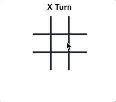
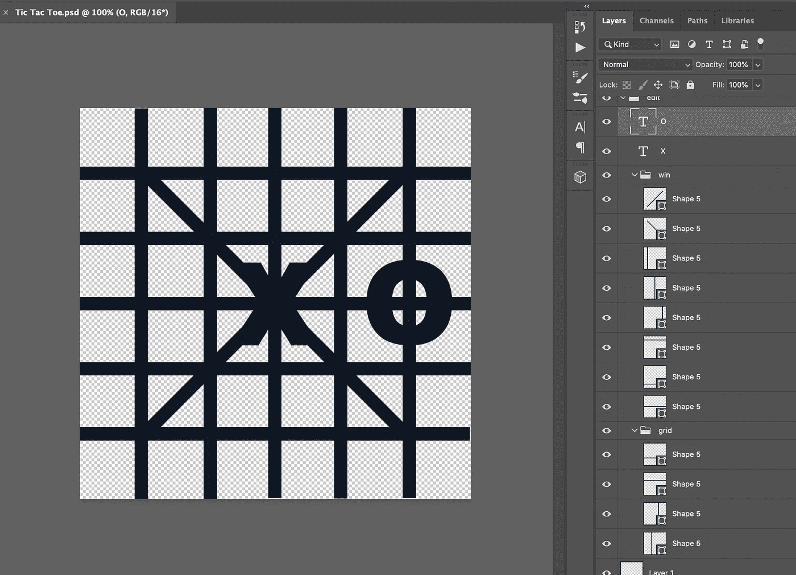
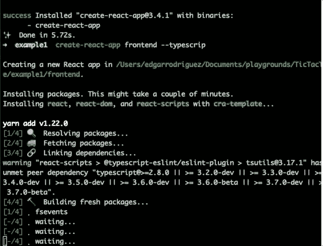
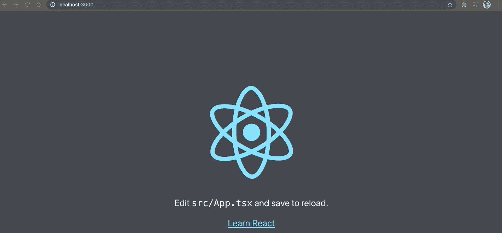
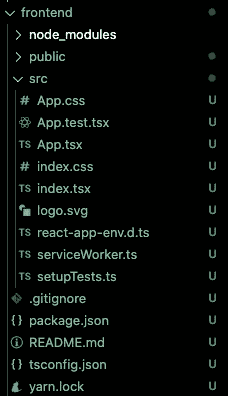

# 井字游戏脚趾:反应，打字脚本，XState，fp-ts & CSS 网格

> 原文：<https://javascript.plainenglish.io/tic-tac-toe-react-typescript-xstate-fp-ts-css-grid-cbbb6455cbf7?source=collection_archive---------6----------------------->

## 一系列井字游戏

## 第一部分

嗨！我正在用我能想到的最简单的领域，井字游戏探索技术，看看这个系列:

1.  井字游戏脚趾:反应，打字脚本，XState，fp-ts & CSS 网格(本文)-[西班牙语](https://medium.com/codingedgar/tes-en-l%C3%ADnea-react-typescript-xstate-fp-ts-css-grid-esp-1373236189d1?source=friends_link&sk=acd495a60f69e43c68e3f6970fa9da60)
2.  [HTML Canvas is fire](https://medium.com/javascript-in-plain-english/html-canvas-is-fire-1320b2b40c37?source=friends_link&sk=ac1326ad70cbc7ff71128bb341477e20)——espa ol

在本文中，我们将使用[reactor](https://reactjs.org/)、 [Typescript](https://www.typescriptlang.org/) 、[xsstate](http://xstate.js.org/)、 [fp-ts](https://gcanti.github.io/fp-ts/) 和 [CSS Grid](https://developer.mozilla.org/en-US/docs/Web/CSS/CSS_Grid_Layout) 来构建井字游戏。



demo

# 0.先决条件

*   [JavaScript](https://en.wikipedia.org/wiki/JavaScript) 和[type script](https://en.wikipedia.org/wiki/TypeScript)t 的概念。
*   [HTML](https://developer.mozilla.org/en-US/docs/Web/HTML) 和 [CSS](https://developer.mozilla.org/en-US/docs/Web/CSS/Reference) 的概念。
*   [节点](https://nodejs.org/en/)安装完毕。
*   [npm](https://www.npmjs.com/get-npm) 或[纱线](https://yarnpkg.com/)安装完毕。
*   [端子](https://www.quora.com/q/ukcyqvwilydvkdpe/What-is-Terminal)的概念。
*   安装了代码编辑器(如 [vscode](https://code.visualstudio.com/) )。
*   任何绘图程序。

# 1.资产

首先，我们需要一些[资产](https://www.quora.com/q/ukcyqvwilydvkdpe/What-are-assets-in-game-development)来制作我们的小游戏。我们需要一个**棋盘**、**玩家** ( **X** 和 **O** )，以及胜利者的**线**(水平、垂直和对角线)。

使用任何绘图程序，在我的情况下，我会使用 Photoshop。

制作一个 1080x1080 px 的画布，画一些线，每条线在各自的图层中，导出每张图片。



Assets in Photoshop

## 格子

将**板**导出为 1080x1080 px 的图像。

## 演员

一定要导出每个**玩家**的字母 **X** 和 **O** 的大小(大约 250x250 px)，以编程的方式将他们放置在网格中，

## 线

将每一行导出为 1080x1080 像素的图像。

在我的第一次尝试中，我分别导出了每个图层，但是这使得图像的大小与形状相同，例如，水平线不是 1080x1080 px，而是 1080x10 px，然后需要放置。

我们不想过多关注**线条**的放置，所以一定要导出整个图像，切换每个图层的可见性，这样，每个图像都是 1080x1080，当在屏幕上可见时，它被完美地放置，现在我们可以专注于打开和关闭图像。

# 2.引导反应和类型脚本

现在我们有了资产，我们可以开始编码了。

首先，让我们用 [Create React App](https://create-react-app.dev/) 引导 React 项目，在您的终端中写入:

```
mkdir example1 
cd example1
yarn global add create-react-app
create-react-app frontend --template typescript
yarn start
```



这需要一段时间，但是很简单，现在您已经有了一个在`localhost:3000`中运行 Typescript 的 React 项目。



# 3.域和状态机类型

现在让我们从领域建模开始，我将首先向您展示要点，然后我将逐行分解它。

让我们从模拟我们的基本类型开始:

*   `1`选手:`X` & `O`的`[Union](https://www.typescriptlang.org/docs/handbook/unions-and-intersections.html#union-types)`。
*   `3`坐标:`1`、`2`、`3`中的`Union`，而不是`number`来限制可能情况的数量。
*   `5`坐标:行列记录。
*   `7`单元格状态:`Playable`和`Played`中的`Union`，`Playable`描述可能被点击的单元格，以及`Played`播放该单元格的模特。
*   `9` Cell:是`Coordinates`和`CellState`的`[Intersection](https://www.typescriptlang.org/docs/handbook/unions-and-intersections.html#intersection-types)`。
*   `11`板:我们可以将我们的`Board`建模为一个`Cells`的数组，但是让我们利用元组来建模有限数量的单元，9。
*   `13` ResultType:这是游戏所有可能的结果。
*   `24`结果:`Result`将是匹配的结果，在 8 个可能的位置中的任何一个位置，它要么是一个`Draw`要么是连续的 3 个。

## x 状态

我们可以将 XState 简化为一个状态管理库(是的，这意味着它可以替代 [Redux](https://redux.js.org/) ，但是它能做的更多。)

如果你了解有限状态机，那么理解这个库就容易多了，我推荐你去看看他们的文档，里面很好地解释了它背后的概念，以及它需要解决的问题。

> 形式上，有限状态机有五个部分:
> 
> -有限数量的状态
> 
> -有限数量的事件
> 
> -初始状态
> 
> -在给定当前状态和事件的情况下确定下一个状态的转移函数
> 
> -一组(可能是空的)最终状态

XState 不仅仅是有限状态机，它是状态图和 Actor 模型的实现，但是我们将只使用它的有限状态机部分。

现在我们有了基本类型，让我们构建我们的状态机类型，它们是 3 个:[上下文](https://xstate.js.org/docs/guides/context.html#context)、[状态模式](https://xstate.js.org/docs/guides/states.html#states)和[事件](https://xstate.js.org/docs/guides/events.html#sending-events)。

## 事件

我们的机器将接受两个事件，`Played`和`Restarted`，每个事件都非常详细地描述了它们所做的事情。

*   `Played`事件应将单元状态从`Playable`更改为`Played`。
*   `Restarted`事件应该会重启游戏。

## 语境

上下文代表了我们机器的无界的一面，就像 Redux Store 一样。

我们将有 3 个属性，`matchScore`，`board`，`result`。

我们将使用`matchScore`来代表每个`ResultTypes`分数，就像游戏的 9 种可能结局中的每一种的累加器，当任何累加器达到 3 时，游戏结束，或者如果`Draw`累加器达到 9。

`board`表示 9 个单元格的状态，`result`是一个`[Option](https://gcanti.github.io/fp-ts/modules/Option.ts.html)`类型(可空类型的容器)，表示游戏结束后结果的存在(或不存在)。

那么`Result`要么是`Draw`要么不是一个玩家获胜的`Draw`。

## (计划或理论的)纲要

最后，我们的状态模式，它将模拟我们机器的有限部分(Redux 所缺少的)。

我们会有三种状态:

*   **X** : **玩家 X** 轮到出场。
*   **O** : **玩家 O** 轮到玩了。
*   **完成**:游戏完成。

# 4.状态机

现在让我们为我们的机器行为建模，看看要点，然后检查深入的描述。

这是我们机器的配置，`strict`使我们的机器在一个状态和其他更严格的行为中没有处理一个事件时抛出。

`initial`代表我们机器初始状态的名称，我们放置了`X`，意思是**玩家 X** 总是先开始。

`context`与`const` `DEFAULT_CONTEXT`相同，我们可以内联编写我们机器的默认上下文，但是我们在两个地方需要它，这里和当我们重启游戏时，所以让我们在不同的机器中编写它。

现在有趣的是，美国:

## X & O 状态

这些状态几乎是相同的，所以我将它们描述为相同的。

状态可以有很多属性，但是我们只使用两个`[always](https://xstate.js.org/docs/guides/transitions.html#eventless-transitions)`和`[on](https://xstate.js.org/docs/guides/transitions.html#selecting-enabled-transitions)`。

> 无事件转换是指当机器处于定义的状态，且其`cond`保护评估为`true`时，**总是**发生的转换。在处理任何其他事件之前，总是在第一次进入状态时检查它们。无事件转换是在状态节点的`always`属性上定义的。

在我们的例子中，`always`检查条件`IS_DONE`，如果是，它转换到`DONE`状态。

我们定义的另一个转换在我们接收到`PLAYED`事件时被评估，并且仅当播放有效时(单元格不是`PLAYED`)；如果有效，那么我们将更新我们的`Context`的`matchScore`、`board`和`result`，并过渡到另一个玩家回合。

## 完成状态

如果机器进入`DONE`状态，那么我们将只对`RESTARTED`事件做出反应，分配一个默认上下文(与机器的初始化相同)，并返回到**玩家 X** 回合。

# 5.用户界面

现在我们已经定义了我们的行为，我们可以开始做我们的 UI 了！

让我们使用 [CSS 网格](https://developer.mozilla.org/en-US/docs/Web/CSS/CSS_Grid_Layout)来构建我们的 UI。

首先，我们将定义我们的网格，3 列，棋盘的每列一个，5 行，1 行显示回合或赢家，3 行显示棋盘的行，1 行显示结果按钮。

## 标题

我们的标题依赖于`result`值，让我们记住，它的类型是`Option<Result>`。

为了决定显示什么值，我们将`fold`这个值，你问`fold`什么？

> [Fold](https://gcanti.github.io/fp-ts/modules/Option.ts.html#fold) :取一个默认值、一个函数和一个`Option`值，如果`Option`值为`None`则返回默认值，否则函数应用于`Some`内的值并返回结果。

所以，默认值，意味着，“没有结果的时候怎么办”，在我们的例子中，我们将显示玩家的回合(`22`)。

当我们有一个`result`的时候，那就要看它是不是一个`Draw`，如果是我们显示`'Draw'`T3，否则，我们就显示哪个玩家赢了`25`。

## 格子

电网是我们的第一资产；我们将始终把它显示为图像，而不是可拖动的。

## 细胞

下一部分是细胞。

单元格是 9 `divs`，它将发送`PLAYED`的事件，如果单元格被播放，那么它将显示玩家谁播放了资产。

> 一个观察:我们不需要运行验证来确定我们是否应该发送`PLAYED`事件，这要感谢我们在机器中描述的所有逻辑。

## 结果行

现在让我们渲染我们的线条。

和我们处理标题一样，我们将`fold`第`result`个，但是首先，让我们考虑结果。

当比赛抽签时，没有线显示，所以我们可以认为`Draw`没有结果。

我们需要一个只在有`some`值时运行的函数，并且允许我们在有`Draw`时返回`none`，在有`Draw`以外的值时返回`some`。

我们需要类似于`[flatMap](https://developer.mozilla.org/en-US/docs/Web/JavaScript/Reference/Global_Objects/Array/flatMap)`的东西，但是对于`Option`类型，谢天谢地，fp-ts 有`chain`:

> [链](https://gcanti.github.io/fp-ts/modules/Option.ts.html#chain):按顺序组合计算，使用一个计算的返回值来确定下一个计算。

有点神秘，你不觉得吗？让我再试一次:

当我想只在成功分支中运行一个函数并返回一个相同类型容器的新值时，我使用`chain`，但不是嵌套的(不是`Option<Option<T>>`而是`Option<T>`)。

如果`result`是`none`或者`result`是`some({result: 'Draw',...})`(将通过`chain`操作转换为`none`)，那么我们返回`null`，不渲染任何线条。

如果结果不是这些值，我们将结果类型映射到我们的行(`diagonal1`、`column1`等)。).

## 重新开始

最后，只玩一个游戏太无聊了，所以我们展示了重启按钮！

就像我们以前做过的那样，我们将`fold`越过`result` : `none`？然后`null`、`some`？然后是我们的按钮。

在我们的按钮内部，我们将发送`RESTARTED`事件`onClick`，我们的机器将完成所有的魔术，然后 React 将重新呈现我们的功能组件，并显示与开始时相同的匹配。

# 7.参考

检查整个结果文件`App.tsx`:

如果想看完整个项目，还可以访问:[https://github.com/codingedgar/TicTacToe](https://github.com/codingedgar/TicTacToe)，搜索`Example1`。

# 8.反思我们的良好做法

我希望您观察到了一些好的实践:

1.  我们用过去时态宣布我们的事件，因为它们发生了(`PLAYED`，`RESTARTED`)。
2.  我们声明了我们所有的行为，并且在一个地方声明了我们的状态机，而不是用`UI`来分散逻辑。
3.  我们试图约束我们的领域建模，以尽可能避免不可能的状态。
4.  你能找到其他的吗？

# 9.其他考虑

我想实现井字游戏一百万种探索技术的方法；这是我能想到的最简单的型号。

在下一个例子中，让我知道您想要我使用哪些库或技术，我已经考虑了一些不同的挑战:

*   如果每个细胞本身就是一个状态机会怎么样？
*   使用 [rxjs](https://www.learnrxjs.io/) 会是什么样子？
*   那么[棱角](https://angular.io/)、 [Vue](https://vuejs.org/) 、[苗条](https://svelte.dev/)和[余烬](https://emberjs.com/)呢？
*   编译成 js langs、 [Elm](https://elm-lang.org/) 、[寓言](https://fable.io/)、 [PureScript](https://www.purescript.org/) 、 [Scala.js](https://www.scala-js.org/) 怎么样？
*   为什么要创造资产？那么 [canvas](https://developer.mozilla.org/en-US/docs/Web/API/Canvas_API) 和 [WebGL](https://developer.mozilla.org/en-US/docs/Web/API/WebGL_API) 呢？
*   在线服务器用[号](https://deno.land/)🤩、 [F#](https://fsharp.org/) 、 [scala](https://www.scala-lang.org/) ？
*   那 deploy 呢， [Netlify](https://www.netlify.com/) ，[数字海洋](https://www.digitalocean.com/)， [AWS](https://aws.amazon.com/) ， [Azure](https://azure.microsoft.com/) ， [Google Cloud](https://cloud.google.com/) ？

我渴望为你制作所有这些技术的例子，让我知道你接下来想看哪一个🔥。

如果你喜欢这篇文章，也许你会喜欢[订阅我的时事通讯](http://eepurl.com/hg7AeP)和我的更多作品:[为我改变 JavaScript 的 6 个工具](https://medium.com/javascript-in-plain-english/the-6tools-that-changed-javascript-for-me-3ee1faf40585)、[永远不要使用箭头函数的两种情况](https://medium.com/javascript-in-plain-english/you-should-never-use-an-arrow-function-in-any-of-these-two-situations-8bc2fbbc39b8)，以及[F #如何让我欣赏 JavaScript](https://medium.com/javascript-in-plain-english/how-f-made-me-appreciate-javascript-227260796b70) ，希望我的故事能给你带来一些价值。