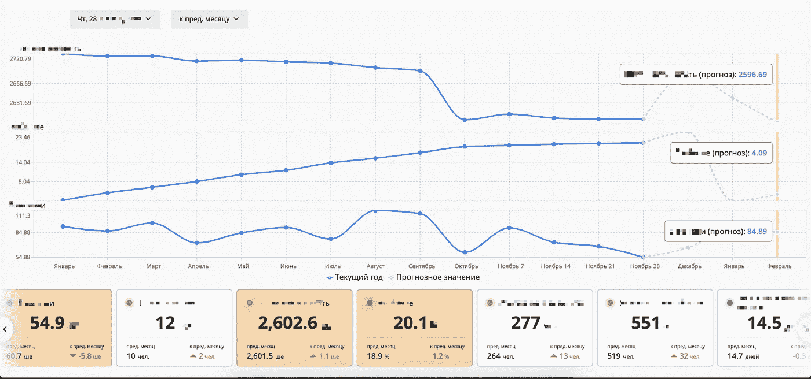

# 用 JS 进行时间序列预测

> 原文：<https://javascript.plainenglish.io/time-series-forecasting-with-js-9cc327570071?source=collection_archive---------1----------------------->

在这篇文章中，我将讲述为什么在某些时候前端数据分析是一个好的和可行的解决方案的一般方法，并将在下一篇文章中提供一些实践材料。

# 有什么意义？

在我作为前端开发人员的全职工作中，我通常使用仪表板和不同种类的数据。在某种程度上，我们意识到我们需要增加对指标的预测。团队中没有数据科学的人来做这件事。

而我们的栈是 React + Java。

## 问题 1。

要预测的数据量非常大，而记录量却很少。(当数千个数据切片的可用历史数据量很低时)

## 问题二。

后端人员的工作量非常大，所以他们实际上无法完成这项任务+公司对该项目的 Java 实例配额紧张。

所以我们决定在前端做这件事。

# 可能的方法

一般来说，有几种算法可以完成这项工作。(考虑到我们需要季节性预测)

首先，我决定测试它看起来是什么样子，并尝试 Excel。

预测。ETS()函数做得很好，这意味着是时候编写代码了！

# 动手时间到了

有几个算法可以很好地处理这个问题，包括一些机器学习的东西

> 我用 Tensorflow.js RNN 模型从[到本文](https://towardsdatascience.com/time-series-forecasting-with-tensorflow-js-1efd48ff2201)进行了实验，但是在给定的数据集上训练需要很多时间，数据集本身应该足够大，预测也不是很快，所以我们不能在项目中使用它。我们有 1000 多家公司向他们提供预测数据，但在过去的 2-3 年里有 40-50 条记录，所以它不能用于这个目的。

所以，ARIMA 算法和指数平滑就留下了，我做了一些研究，没有找到一些实现 ARIMA 的库，但是找到了 npm 中 Holt-Winters 算法的*预测库。*

*所以，它工作得非常好和容易*

*Forecast 函数返回一个元素数组，其中最后的 ***p*** 元素是预测值。干净又容易。*

## *但是…不是一切*

> *否则，我不会写这篇文章:)*

*我遇到了一些问题，这些问题减缓了我在项目中完成这些东西的速度。*

1.  *你应该记住，你不能预测一个以上的季节。如果你的季节是几个月，每个季节(一年)有 12 次观测，你不能预测超过 12 个周期的未来。*
2.  *如果您的数据集有不同的结构(我们的情况)，您应该动态调整 alpha/beta/gamma 参数，测量误差并使用尽可能低的误差率进行预测。这意味着你每次都需要做很多预测。如果您有大型数据集，它会影响您的性能。在我们的例子中，数千次计算并没有显著影响性能。(误差计算的要点将作为奖金❤️提供)*
3.  *如果你的数据少于至少两个完整的季节，你就无法进行正确的计算。如果你的季节包含 12 个记录(例如每月一个)，那么至少应该有 24 个记录。*
4.  *如果您传递的观察值没有除以季节的周期数，则计算可能不正确。我的意思是，如果你每季有 12 次观察，你应该给出最后 24、36、48 等项。*
5.  *还有一件事。我不确定为什么，但是如果我们想得到不同数量的数据来预测，在相同的时期会有不同的数字。例如，如果我想得到未来一年的预测，我将得到下个月的一个结果，但是如果我只预测未来一个月的结果，我将得到不同的数字。由于我们需要预测未来 3 个月，如果我只预测 3 个月，如果我预测一年，并且只得到前 3 个元素，那么我最终会得到两种情况下的计算错误。之后，我以最小的错误率得到结果并显示出来。*

**

*One metric prediction (dotted). Current year — blue line, Prev year — purple.*

**

*Three independent metrics predictions (dotted lines). Current year — blue line.*

***奖金***

*误差计算的依据*

*感谢您的阅读，请通过*

*电子邮件—mitia2022@gmail.com*

*电报—@轩尼诗 81*

*在 Medium 上关注我，拍拍这篇文章，祝你有美好的一天！*

**