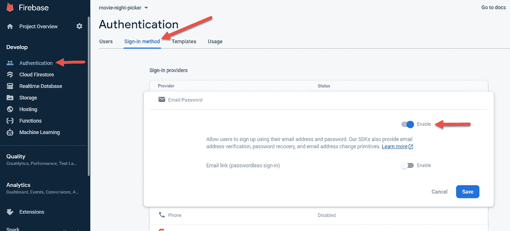

# 火绒风格的电影夜采摘与 VueJs，Vuetify，VueFire，和 Firebase

> 原文：<https://javascript.plainenglish.io/tinder-style-movie-night-picker-with-vuejs-vuetify-vuefire-and-firebase-part-2-authentication-6969c27cdad0?source=collection_archive---------19----------------------->

## 第 2 部分—身份验证


Image by [Igor Ovsyannykov](https://pixabay.com/users/igorovsyannykov-6222956/?utm_source=link-attribution&utm_medium=referral&utm_campaign=image&utm_content=2974645) from [Pixabay](https://pixabay.com/?utm_source=link-attribution&utm_medium=referral&utm_campaign=image&utm_content=2974645)

在[第 1 部分](https://medium.com/javascript-in-plain-english/tinder-style-movie-night-picker-with-vuejs-vuetify-vuexfire-and-firebase-part-1-app-setup-4f08840eef11)中，我们建立了我们的项目，以包括我们开发所需要的一切。现在，我们实际上可以开始编写应用程序了。我们首先需要的是身份认证。我们将使用 [Firebase 认证](https://firebase.google.com/products/auth)来认证我们的用户。

# Firebase 身份验证设置

要设置 Firebase 身份验证，请前往 firebase.google.com 的，选择您在第一部分中设置的项目，然后单击左侧菜单中的身份验证。然后，单击登录方法选项卡，选择电子邮件/密码，并启用它。



Firebase Email/Password Authentication

# 向 Vue 添加 Firebase 身份验证

既然我们已经在 Firebase 中设置了启用的电子邮件/密码验证，我们可以在 Vue 中设置我们的验证页面。为了在我们的项目中实现这一点，我们需要两个新的视图。一个用于注册，另一个用于登录。

## 签约雇用

我们将从注册过程开始。为此，转到 src/views 并创建一个名为 SignUp.vue 的新文件。在 *v-card* 内部，我们将创建一个 *v-form* 用于注册。该注册表单将包括三个文本字段，分别用于名称、电子邮件和密码。我们还将在卡中添加一个 *v-overlay* ，以便在我们处理注册时显示一个加载图标。最后，我们将添加一个 v-alert，以防 Firebase Auth 返回错误。

在 Vue Options API 数据属性中，我们将创建绑定到每个文本字段、覆盖图和警告错误消息的 v-model 的属性。我们还将创建验证，并将其绑定到文本字段和表单作为一个整体。

SignUp.vue Options API data properties

最后，我们将创建一个注册方法。注册成功后，我们将使用从 Firebase Auth 返回的用户文档 id 向用户集合添加一条记录，并将用户信息存储在我们的 Vuex 存储中。要实现这一点，请导航到 src/store 文件夹。创建一个名为 modules 的新文件夹。然后创建一个名为 user.js 的文件，并添加以下代码:

Vuex store — user module

现在我们可以将它作为一个模块添加到 src/store/index.js 文件中。为此，在顶部导入用户文件，找到 modules 标记，然后将其添加到 modules 对象中。

Vuex Store — User Module Addition

现在让我们关注实际的注册代码。回到 src/views/SignUp.vue，在脚本标记的顶部从 main.js 导入 firebase 和 db。然后，在 options API 中用一个名为*signuvemailandpassword*的异步函数创建一个方法属性，并添加以下代码 *:*

signUpWithEmailAndPassword

## 签到

现在我们已经完成了注册过程，我们可以从登录页面开始。在 src/views 中创建一个名为 SignIn.vue 的新文件。该代码基本上与 SignUp.vue 相同。因此，复制 SignUp.vue 中的所有内容并将其复制到 SignIn.vue 中。

然后在模板中，删除 name 字段。在电子邮件和密码字段中，将验证更改为仅必填。接下来，删除 data 属性中的 name 以及除必需验证之外的所有验证。然后我们将把*sign up email and password*方法的名称改为*sign in with email and password*，并对其进行编辑以调用正确的 Firebase 身份验证方法进行登录。此外，我们将获取用户并在存储中设置用户数据，而不是向用户中插入记录。

# 路由器

现在我们有了登录和注册页面，我们需要将它们添加到我们的路由器。为此，打开 src/router/index.js。在那里，我们将删除/about 路由并添加两个组件。我们将使我们的登录页面成为默认路径。

Vue Router

## 认证路由保护

为了锁定我们的路由，我们需要实现一个身份验证防护，如果用户没有通过身份验证，它会将用户重定向到登录页面。首先，我们将为路由器添加一个名为 authGuard 的新功能。这将在路线导航之前检查我们的商店中是否有有效的用户。然后，我们将为每个需要身份验证的路由添加一个 beforeEnter 属性。

VueJs Route Guards

# 认证陷阱

由于我们使用商店作为我们的路由保护检查，如果用户刷新浏览器，我们会丢失商店中的数据。幸运的是，我们可以使用一个名为 [vuex-persist](https://www.npmjs.com/package/vuex-persist) 的包来通过刷新来持久化数据。要安装它，请在项目根目录中打开一个终端并运行以下命令:

```
npm install vuex-persist
```

接下来转到 vue.config.js 并将其添加到 transpileDependencies 中:

```
module*.*exports = { 
 transpileDependencies: ['vuetify', **'vuex-persist'**]
}
```

接下来，我们将把它添加到我们的商店。回到 src/store/index.js，导入包，初始化它，并将其添加到 store export:

# 视频教程

Video Tutorial

# 结论

现在我们已经在应用程序中建立了简单的身份验证。这将允许我们保持我们的 Firestore 安全，只有登录用户和锁定路线。在第三部中，我们将开始为我们的电影《夜盗》添加伙伴。