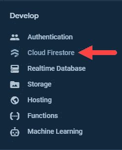
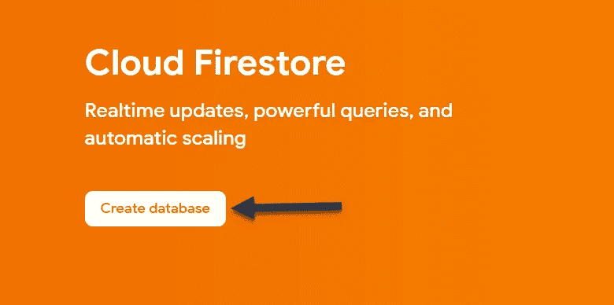
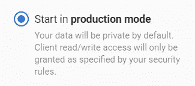
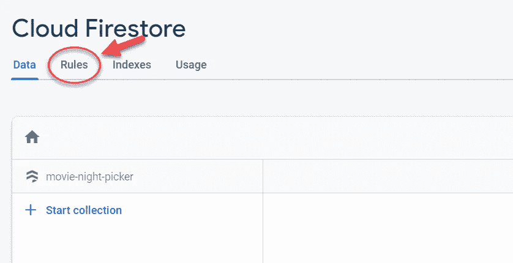
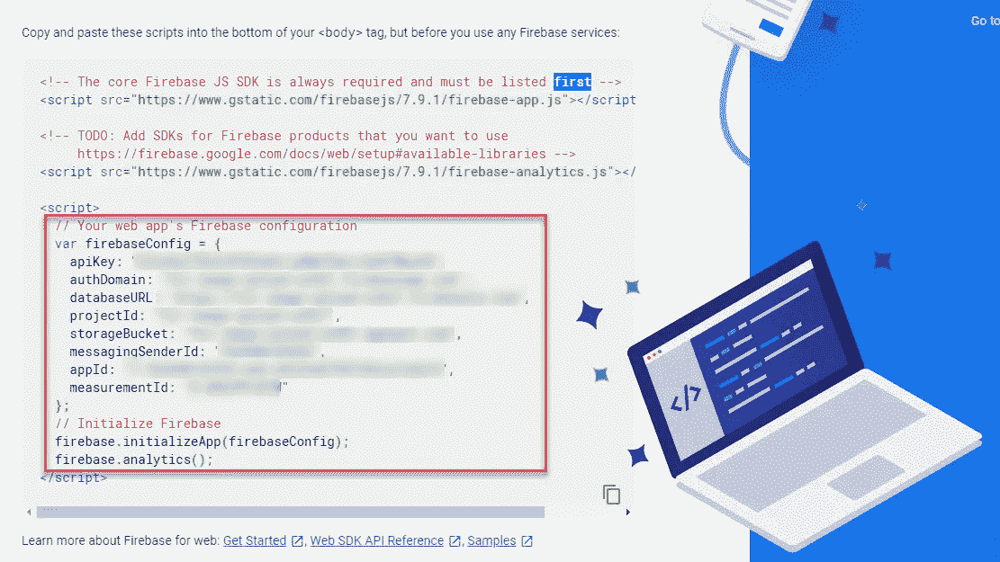

# 火绒风格的电影夜采摘与 VueJs，Vuetify，VuexFire，和 Firebase

> 原文：<https://javascript.plainenglish.io/tinder-style-movie-night-picker-with-vuejs-vuetify-vuexfire-and-firebase-part-1-app-setup-4f08840eef11?source=collection_archive---------11----------------------->

## 第 1 部分—应用程序设置


Image by [Free-Photos](https://pixabay.com/photos/?utm_source=link-attribution&utm_medium=referral&utm_campaign=image&utm_content=918655) from [Pixabay](https://pixabay.com/?utm_source=link-attribution&utm_medium=referral&utm_campaign=image&utm_content=918655)

前几天，我在 Twitter 上看到一条有趣的推文，说应该有一个像 Tinder 这样的应用程序，但不是为了电影。这不是一个连接应用程序，而是为那些在看什么电影上有困难的夫妇准备的。每个人都会根据他们看电影的感觉向左或向右滑动。然后他们可以浏览比赛，找到一部令人愉快的电影。

我认为这是一个很棒的想法，我完全可以理解。因此，在这个系列中，我们将使用 [VueJs](https://vuejs.org/) 、 [Vuetify](https://vuetifyjs.com/en/) 、 [VueFire](https://github.com/vuejs/vuefire) 和 [Firebase](https://firebase.google.com/) 来构建它。因为它将是一个网络应用程序，而不是滑动，我们将有拇指向上和向下按钮。那么，让我们开始吧。

# Vue 项目设置

## Vue CLI

为了创建我们的项目，我们将使用 [Vue CLI](https://cli.vuejs.org/) 。要安装它，请打开终端并运行以下命令:

```
npm install -g @vue/cli
```

## 创建 Vue 项目

现在我们已经安装了 CLI，让我们创建项目。打开终端，进入您选择的目录，并运行以下命令:

```
vue create movie-night-picker
```

然后选择“手动选择功能”并选择以下选项:

*   巴比伦式的城市
*   路由器
*   Vuex
*   棉绒格式器

接下来，选择以下问题:

*   对路由器使用历史模式？ **Y**
*   选择短绒/格式器配置:**ESLint+beauty**
*   挑选附加皮棉特性:**皮棉保存时**
*   你更喜欢把 Babel，PostCSS，ESLint 等的配置放在哪里？？**在专用配置文件中**
*   将此存储为未来项目的预置？**由你决定。我选择 N.**

## 添加虚拟化

项目创建后，cd 进入根目录(cd movie-night-picker)并运行以下命令，选择**默认**预置:

```
vue add vuetify
```

## 添加项目依赖关系

既然我们已经在正确的目录中，让我们安装项目依赖项。在当前终端中，运行以下命令:

```
npm install vuexfire firebase axios
```

# Firebase 设置

为了发布我们的功能，向我们的数据库添加用户，并使用身份验证，我们将不得不建立一个 Firebase 项目。因此，前往[https://firebase.google.com/](https://firebase.google.com/)创建一个帐户，然后点击“转到控制台”。接下来，点击“添加项目”按钮，给它起你喜欢的名字。单击其他选项，选择默认值。

## Firestore

接下来，单击左侧菜单中的“云 Firestore”。



Cloud Firestore

## 云 Firestore

然后，在屏幕顶部单击“创建数据库”。



Firestore Database Creation

因为我们将实现身份验证，所以选择在生产模式下启动，并选择默认的服务器位置。



Firestore Production Mode

## 云 Firestore 规则

供应 Firestore 后，让我们设置一些 Firestore 规则。为此，请单击 Firestore 下的规则选项卡。



Firestore Rules

我们要添加的唯一规则是用户已经过身份验证。为此，选择所有内容和规则，并用以下内容替换:

```
rules_version = '2';
service cloud.firestore {
  match /databases/{database}/documents {
    match /{document=**} {
      allow read, write: if request.auth != null;
    }
  }
}
```

这将确保用户在能够读取或写入任何内容之前登录。

***警告这将允许任何经过身份验证的用户读写任何文档。*** *在发布到生产之前，我建议你也做一个基于用户 id 的规则。请查看* [*他们的文档*](https://firebase.google.com/docs/firestore/security/get-started) *。*

# 向 Vue 添加 Firebase

现在，在 Firebase 项目的主页上，您会看到一个 web 图标。点击它，给你的应用起一个昵称，然后点击注册按钮。


Firebase Web Setup

接下来，您将看到一些配置代码。在



回到 Vue 项目，在 src/main.js 中添加以下代码:

```
import firebase from 'firebase/app'
import 'firebase/firestore'*import* { firestorePlugin } *from* 'vuefire'
*Vue.use*(firestorePlugin)//Paste in your firebase config we copied from the last step
var firebaseConfig = {  
  apiKey: '<your-api-key>',
  authDomain: '<your-auth-domain>',
  databaseURL: '<your-database-url>',
  projectId: '<your-cloud-firestore-project>',
  storageBucket: '<your-storage-bucket>',
  messagingSenderId: '<your-sender-id>',
  appId: '<your-app-id>',
  measurementId: '<your-measurement-id>'
};*firebase.initializeApp*(firebaseConfig);*export* const *db* = *firebase.firestore*();// Export types that exists in Firestore
// This is not always necessary, but it's used in other examples
const { Timestamp, GeoPoint } = firebase.firestore
export { Timestamp, GeoPoint }
```

# 项目清理

现在 Firebase 已经添加到 Vue 项目中，我们只需要在开始编码之前做一些项目清理工作。在 src/App.vue 中，我们将使用 Vuetify 添加的 *< v-app-bar >* ，将其移动到自己的组件中，并删除其中的所有内容，并添加一个带有我们的应用标题的 h2。

因此，在 components 文件夹中创建一个名为“ui”的新文件夹。然后，在名为 AppBar.vue 的文件夹中创建一个文件，将 AppBar 复制并粘贴到该文件中，并将 *< v-app-bar >* 中的所有内容替换为标题为“电影夜摘者”的 h2。您的文件应该如下所示:

AppBar.vue

然后在 App.vue 内部，导入 AppBar.vue 文件，将其注册为组件，并将其添加到模板中。然后，删除 HelloWorld 组件并删除它在 src/components/HelloWorld.vue 中的文件。

之后在 App.vue 模板中的 *< v-main >* 标签内添加一个 *< v-container >* 标签。然后在 *< v 容器>* 标签内添加 *<路由器-视图>* 标签。v-container 标签将在页面两侧增加一些空白，而 router-view 标签是显示路由器组件的地方。

您的 App.vue 文件应该如下所示:

App.vue

我们可以做的最后一件事是删除位于 src/views/About.vue 中的 About.vue 文件。这应该结束了我们项目的清理工作，我们可以开始编写我们应用程序的功能了。

# 视频教程

# 结论

概括地说，我们创建了我们的 Vue 项目，添加了 Vuetify，添加了 Firebase，并做了一些清理工作。现在我们可以开始编写电影《夜盗》的功能了。在[第 2 部分](https://medium.com/javascript-in-plain-english/tinder-style-movie-night-picker-with-vuejs-vuetify-vuefire-and-firebase-part-2-authentication-6969c27cdad0)中，我们将关注使用 Firebase Auth 设置认证。