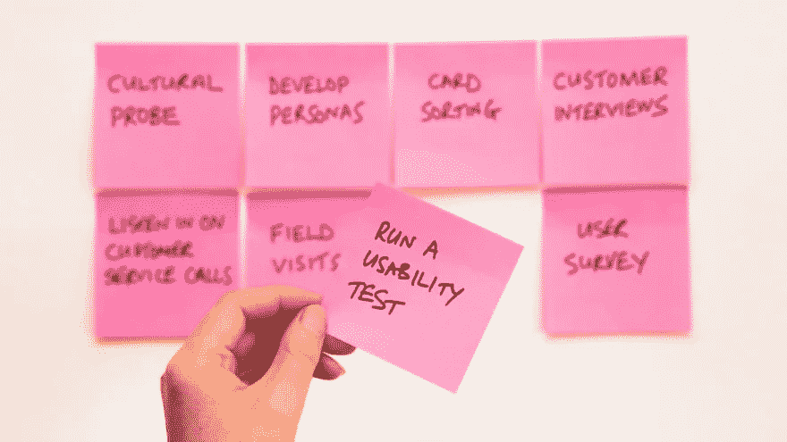
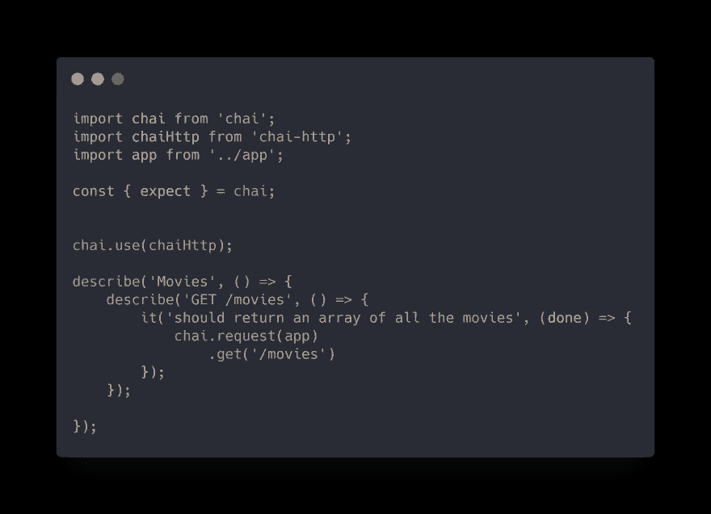
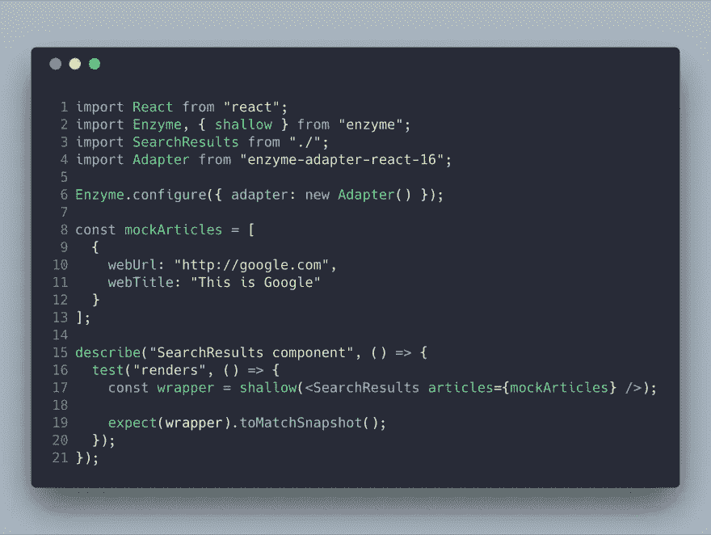

# 提高前端测试质量的技巧

> 原文：<https://javascript.plainenglish.io/tips-for-better-front-end-testing-quality-1d1214865fd1?source=collection_archive---------3----------------------->

前端测试是软件开发生命周期的重要组成部分。根据研究，web 应用程序整体性能的 80%依赖于客户端代码。如果我们能够解决前端的大部分问题，那么我们就可以解决 web 应用程序中的大部分问题。

这并不意味着我们完全不需要测试后端。我们大部分的测试工作需要集中在前端，同时也不能忽视测试 web 应用程序逻辑部分的重要性。

这是因为应用程序的前端是软件的外观。当用户与你的 app 交互时，他们与前端有直接的交互。这就是为什么您的前端的性能和良好的工作秩序对整体用户体验的贡献更大。

在前端测试期间，我们通常需要关注三件事:

*   行为测试
*   功能测试
*   性能试验

[***行为测试***](https://www.tutorialspoint.com/software_testing_dictionary/behaviour_testing.htm) 处理我们代码或逻辑的工作。这些测试确保一切正常。

行为测试有两种工具:

## **JS 测试工具**

这些工具更侧重于测试业务逻辑，而不是技术复杂性。这些是测试 JS 代码的行为驱动框架。因为它们不依赖于任何外部库或框架，所以很容易用于编写测试。

## 不同的工具

摩卡、杰斯特、茉莉、因果等。

## **CSS 测试工具**

这些工具用于测试应用程序前端的可视部分。这些工具通过保存软件的截图来检查不同的元素。然后，该工具将截图与之前的截图或您提供的截图进行比较，以检查功能。

通常，这些工具检查字体/CSS/图像的渲染。它们还使测试人员能够计算 HTML 元素和 CSS 值的位置。

**工具:** BackstopJS，like . js，jsdifflib，Visual Center，Review，Wraith，Spectre，CSS Critic，Gemini，Reg-cli，Differencify，Kobold，Happo 等。

[***功能测试***](https://www.guru99.com/functional-testing.html) 处理软件的功能部分。这些工具根据您的设置测试您的应用程序在实际或无头浏览器中的执行情况。

它们消除了手动测试的麻烦，因此您可以自动化应用程序功能的不同流程。

**工具:** Selenium，Appium，量角器，WebDriverIO，Nightwatch，Cypress，木偶师，剧作家，幻想曲，噩梦，代码概念

[***性能测试***](https://searchsoftwarequality.techtarget.com/definition/performance-testing) ，顾名思义，处理软件性能的测试。它考察软件程序在工作负载条件下的速度或响应能力。

性能测试工具测试应用程序的负载或稳定性，就像它在用户使用的实际场景中的反应一样。

**工具:** PageSpeed、YSlow、Lighthouse、GTmetrics、浏览器 DevTools (Safari、Chrome、Opera、Firefox)、LogRocket、DareBoost

# **更好的前端测试技巧**

## **1。测试应该是稳定的**

功能测试的问题是它们很脆弱。这主要是由于 UI 元素的变化，特定浏览器或设备的一些问题，一些功能或模块的拙劣模仿等等。请务必在每次构建或代码库的重大更改后运行您的测试，以便尽早发现并修复问题。

您还可以用不同的工具自动化您的 Selenium 测试用例。

使用这样的自动化工具的一个很大的优势是，即使非工程师也可以编写测试用例。该过程简单且用户友好，可以加快测试速度。

此外，该工具还处理与不同浏览器相关的所有问题。

## **2。隔离测试用例**

对于不同的软件元素，比如类、函数或对象，总是要分开测试用例。您可以在不同的文件中编写这些测试用例，以便将来任何人阅读您的代码时都很容易。这也符合[单一责任原则](https://blog.cleancoder.com/uncle-bob/2014/05/08/SingleReponsibilityPrinciple.html)，即每个软件元素都应该对功能的单一部分负责。

测试库中有许多选项可以将您的测试分成不同的套件。通过这样，你可以将你的测试用例分成不同的部分。

以将软件元素之间的相互依赖性保持在最低限度的方式编写代码总是一个好的实践。尽管如此，代码的某些部分总是依赖于另一部分。

在这种情况下，一定要确保相关代码的测试用例以不中断的方式编写。否则，由于它们的相互依赖循环，你将不能调试测试中的问题，假设一切都是独立工作的。

## **3。避免慢速测试**

有许多因素可能会导致您的测试变慢。如果您正在编写功能测试，那么确保使用一个无头浏览器来运行它们。对你来说，运行一个真正的浏览器会更加耗时和乏味。

此外，尽量减少与 [DOM](https://developer.mozilla.org/en-US/docs/Web/API/Document_Object_Model/Introduction) 的交互，因为访问 DOM 然后对其执行不同的操作是很昂贵的。在测试库中有一些选项可以加载一个比实际 DOM 性能更好的浅层 DOM 树。

## **结论**

测试驱动开发对于软件的长期稳定运行是必要的。始终确保开发实际代码库的开发人员实践这一点。此外，尝试通过使用 TypeScript 在代码中强制执行严格的类型检查。

或者，您可以使用不同的库，如 [Immutable.js](https://immutable-js.github.io/immutable-js/) 、 [lodash](https://lodash.com/) 和其他库，以确保不同的软件元素具有正确的格式和类型。

[Subscribe to Decoded, the official In Plain English YouTube channel](https://www.youtube.com/channel/UCtipWUghju290NWcn8jhyAw)