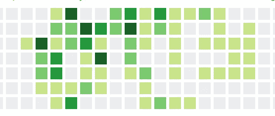

# 获得第一份软件工程工作的技巧

> 原文：<https://javascript.plainenglish.io/tips-for-landing-your-first-engineering-job-8b3c7ed9e89a?source=collection_archive---------4----------------------->

## 一些技术挑战的突破

人们一直在向我寻求获得第一份工程工作的建议。他们在读《破解编码面试》，但是除了技术面试还有什么呢？

通常情况下，第一个电话屏幕是文化面试。在一天结束的时候，公司/团队希望知道他们可以和你一起度过很长时间，并且你融入了公司文化。

这里有一些建议，可以帮助你获得第一份软件工程工作:

## 不要让拒绝让你沮丧

当你刚接触编程领域的工作时，你会面临许多拒绝。你会向许多公司申请，结果却遭到拒绝，甚至没有回音。它*令人*心灰意冷。但是要知道，每个人都会经历这个过程，尤其是当编码不是你的谋生之道的时候(*读作:你没有计算机编程的硕士或博士学位*)。获得你的第一个工程职位是一个数字游戏。广撒网，申请尽可能多的职位。花点时间为你申请的公司写一封定制的求职信。一封定制的求职信会显示出你的兴趣，并能增加公司的回电率。* LinkedIn 上没有写任何评论的“简单申请”是无效的。*

## 温暖的应用

我说的温馨应用是什么意思？网络，网络，网络！我怎么强调都不为过！讨厌去见 ups 并和其他开发者谈论他们/你正在做的事情？这是你必须非常适应的事情。大多数面试都是通过公司某个人的推荐获得的。现在有一些网站会对此有所帮助，比如 [repher me](https://repher.me/) 。然而，你最好的选择是参加你感兴趣的聚会和活动。如果你对区块链感兴趣，在 Google Events 和 Meetup 上查找你所在城市的活动。网络就是增加价值，想一想你可以和工程师交谈并为他们的团队增加价值的方法。如果你只是走过去告诉他们你在找工作，他们可能会置若罔闻。

## 你的故事

当你开始会见各种各样的工程师和内部招聘人员时，你必须把你的故事讲清楚。我的意思是，你的 30 秒电梯营销是什么？如果有人在社交活动中问你，“谈谈你自己吧？”你会结结巴巴还是准备了一个简洁的答案？人们想知道为什么你对做开发人员感到兴奋，尤其是在他们的公司。是什么吸引你去编码？你为什么对我们公司感兴趣？

## 你的投资组合

当你是一名程序员时，你就是一名终生的学生。你在不断学习和提升你的技能。那么，你在做什么会让公司感兴趣呢？尤其是如果你没有编码经验，你的项目是你大放异彩的地方。这是你向潜在雇主展示你有能力在第一份开发工作中脱颖而出的地方。bootcamp 毕业生开发人员的简历上会有一些项目，但毕业后你会从事什么工作呢？你的 git 提交图在 Github 上是什么样子的？

Are you committing often to projects?

Are you taking a break between your bootcamp and programming?

## 算法/数据结构

正如你从我以前的媒体文章中看到的，算法和数据结构在技术面试中非常重要。有空的时候就练习这些。有那么多资源帮你，没有任何借口懈怠。再看 [leetcode](https://leetcode.com/) 、 [HackerRank](https://www.hackerrank.com/) 、 [codewars](https://www.codewars.com/\) 、 [Project Euler](https://projecteuler.net/archives) 。这应该让你非常熟悉这些概念，你可以开始掌握它们，这样你就可以粉碎技术面试。另外，准备好在白板上做算法题。不要依赖代码编辑器上的自动完成功能( [VS 代码](https://code.visualstudio.com/)、 [ATOM](https://atom.io/) 、 [Sublime Text](https://www.sublimetext.com/) )。

## 你会不舒服的

当你在面试环境中时，你会感到不舒服。你必须学会适应不舒服。你能做到的！你可以在一无所知的情况下学习一门编程语言。这是一个巨大的壮举！面试将是一次学习的经历。你会搞砸你的前几次技术面试(如果你练习你的故事，你应该在文化部分做得很好)。这是过程的一部分…完全正常。准备好被问题难倒。但是谈谈你的思考过程和你将如何处理这个问题。公司希望看到你能够学习，不会因为不熟悉的东西而感到不舒服。

## 集中

当你开始准备面试时，我建议你把重点放在一门语言上。例如，如果你想成为一名前端 web 开发人员，那么就专注于 JavaScript，并且对这门语言了如指掌。如果你能表现出“精通”，这将大有帮助。这比了解许多语言或库的一点点更有价值。许多公司希望你在工作中学习一门语言——这是他们的一部分——如果你能表现出对一门语言的精通，这会让他们对你的学习能力更加满意。所以，选择一门语言，坚持下去。

## 最后，玩得开心！

面试有时会很糟糕。尤其是如果你喜欢这家公司，而你在面试中表现不佳。没关系！下次你会得到它们的。记住你为什么要编码，以及你为什么要这样做。不要让拒绝拖了你的后腿。不断申请，不断面试，你只会变得更强。不知不觉中，你会找到你的第一份工作！

你可以以后再感谢我😉*！*

看看我其他一些关于顶级科技公司技术面试的帖子:[谷歌问的一个常见的 JavaScript 面试问题&亚马逊问的一个常见的 JavaScript 面试问题](https://medium.com/javascript-in-plain-english/a-common-javascript-interview-question-asked-by-google-amazon-f18a260dabde?source=your_stories_page---------------------------)和[脸书问的一个常见的 JavaScript 电话屏幕问题](https://medium.com/javascript-in-plain-english/a-common-javascript-phone-screen-question-asked-by-facebook-357a0139c458?source=your_stories_page---------------------------)和 [JavaScript —基本面试准备](https://medium.com/swlh/javascript-basic-interview-prep-7958fb0dd348?source=your_stories_page---------------------------)。