# 初级前端开发人员的建议

> 原文：<https://javascript.plainenglish.io/tips-from-a-junior-front-end-developer-aa0080781367?source=collection_archive---------2----------------------->

Shiva Nallaperumal

> 当我还是个孩子的时候，我喜欢画画，用颜料创作和制作东西。当我 15 岁的时候，我成为了“unity3D”上的一名游戏开发人员，创作我自己的设计和视频游戏，这对我来说还不够，所以我决定改变我的职业生涯，然后几年后，我学会了 JavaScript 和 CSS，这是热情和爱好之间的区别。
> 
> 我会尽我所能教你一些 CSS 和 JavaScript 的技巧，这些技巧是我在阅读、练习和项目实施中学会的。首先，我已经做了两年的前端开发人员，我非常希望这可以帮助我们提高开发人员。如果你像我开始时一样，你可以做到，继续学习！。

# —词汇表

## 超文本标记语言

*   什么是 HTML？
*   关于 HTML 我真正需要知道的是什么？

## 半铸钢ˌ钢性铸铁(Cast Semi-Steel)

*   什么是 CSS？
*   关于 CSS 我真正需要知道的是什么？
*   箱式模型

## Java Script 语言

*   JavaScript 是什么？
*   关于 JavaScript，我真正需要了解的是什么？

# — HTML ( *超文本标记语言*

于 **1993 年推出的**[HTML](https://es.wikipedia.org/wiki/HTML) 已经成为网站创建最重要的语言，因为这是网络开发一切的基础。
这段代码非常奇特和有趣，因为如果你看一个简单的 HTML 文档，你会看到像头、正文和页脚这样的东西(最后一个不是每次都用，但它也是 HTML 中的一个标签)，这种表达性代码被认为是每个人都可以快速学习的简单代码。

另一个应该出现的方面可能是它的家族:我们可以认为 SGML 是 HTML 的祖父，因为 Berners-Lee 说过同样的话，但是直到 1993 年才被 IETF 承认。然而，今天我们知道 SGML 被扩展到 XHTML，直到实际的版本叫做 HTML5。

## HTML 书签

HTML 使用由尖括号(，/)定义的标签。用 HTML 你可以描述一个网站的外观，直到某一点，这个可以引用一个叫做脚本的类型。例如，我们使用 JavaScript，为了将我们的 HTML 与一个 JavaScript 文件连接起来，我们需要创建一个脚本标签，然后写入文件的引用。

# —关于 HTML，我真正需要知道的是什么？

当我学习 HTML 时，我犯了很多错误，其中一个错误是不重视 HTML……这在初学者中很常见，你需要的最重要的东西之一可能是“盒子思维”,考虑如何创建一些东西，知道 HTML 中的所有东西都是一个矩形框，这很有用，因为知道这一点，你就可以以一种好的方式实现 Flex-Box。

所以，我做了大量的研究，因为很难知道你真正需要了解 HTML 的什么，你可以想学所有的东西，这不是一个好的建议，如果你只知道必要的东西会更好。

## **始终关闭标签**

你打开的每个标签都需要被关闭，你不能偷懒而不关闭标签。有时候你有一个 **div** 只做一件事(比如有悬停效果)，如果你不关闭那个 **div** 它会把那个效果赋予它所有的东西，直到找到一个**关闭 ta** g ( < /div >)。

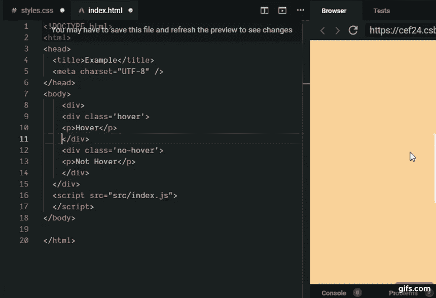

有时你会和不同的人一起工作，如果你有一个大项目，你不应该浪费时间和你的同事一起搜索标签。

## [空洞型元素](https://html.spec.whatwg.org/multipage/syntax.html#void-elements)

Void 元素只有一个开始标记；不得为 void 元素指定结束标记。外来元素必须有一个开始标记和一个结束标记，或者有一个标记为自结束的开始标记，在这种情况下，它们不能有结束标记。

*   **void 标签** : are，base，br，col，embed，hr，img，input，link，meta，param，source，track，wbr。

## div 标签的真正含义是什么？

Div 就像 HTML 结构的心脏，如果你不知道 div 是什么，那你就有问题了。当我开始学习 HTML 的时候，我也不能理解 div 标签的真正含义。

使用 Div，您可以制作不同的部分，一个很好的例子可以是一张卡片，因为它更容易理解划分。这里举个例子:

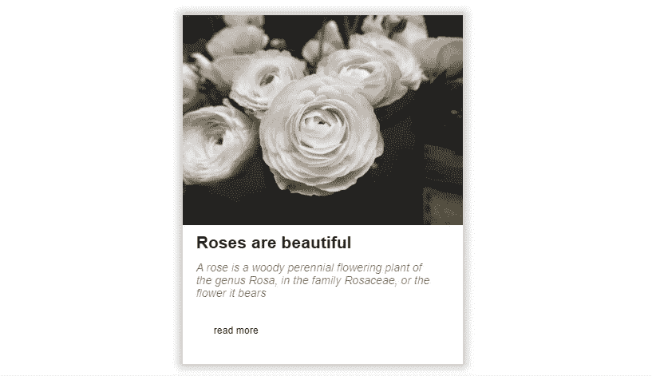

卡片有四个不同的元素:图像、标题、副标题和按钮。因此，作为优秀的前端开发人员，我们希望将所有东西分开，以获得可维护和可读的代码:

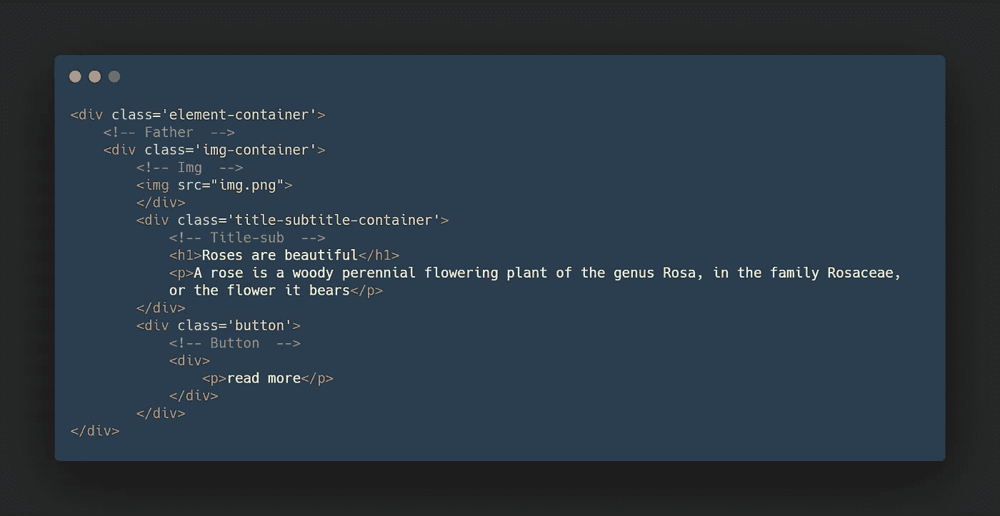

## 什么是内联样式，为什么应该避免使用？

在过去，这是唯一的选择，几年前，然后被创建的 CSS 让我们可以选择有单独的风格。今天使用内联样式不是一个好习惯，因为它会把我们的 HTML 文档弄得乱七八糟。

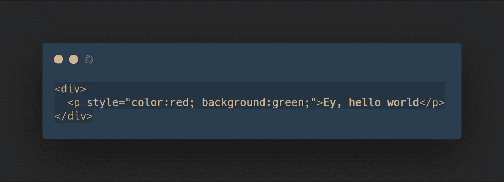

这是内联风格含义的一个例子。我只有两种不同的风格，但想象一下，你想做四五种风格，这不是一个好的选择。

## 将脚本标签放置到末尾

作为前端开发人员，您需要尽可能快地加载。当我们有一个数百行的 JavaScript 文件时，这可能会使我们的网站变慢，因为浏览器不会加载所有的页面，直到文件被完全加载。

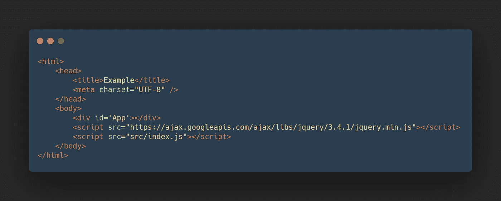

## 只有小写标签

我们不在**大写字母**中使用标签，因为这不是一个好的做法，HTML 会毫无问题地读取你的代码，但是作为程序员，我们需要小心我们的代码，并努力使它清晰美观。这是可选的，但这是一个很好的实践。

# —CSS(**C**as cading**S**style**S**sheets)

1996 年推出的**CSS 是一种[样式表语言](https://en.wikipedia.org/wiki/Style_sheet_language)。它最常用于设置 web 文档的样式属性，如 XHTML、HTML、HTML5、XML、SVG 和 RSS。虽然你可以用它来听音乐。**

## 选择器

选择器帮助识别什么对象将具有样式属性，CSS 中的选择器有不同的变体，例如可以是类型选择器、类选择器、id 选择器、通用选择器和属性选择器:

*   [**类型选择器**](https://developer.mozilla.org/en-US/docs/Web/CSS/Type_selectors) :它将获取所有与给定标签名称匹配的选择器。换句话说，如果你想搜索一个标签，只要写下它的名字，CSS 就会在 HTML 文档中搜索它。

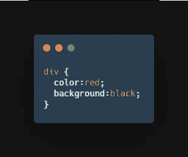

*   [**类选择器**](https://developer.mozilla.org/en-US/docs/Web/CSS/Class_selectors) :后面跟一个点和元素`.class_name`的类名……这是最有用的，因为我们可以重用它，因为我们可以在不同的元素中拥有相同的类名。

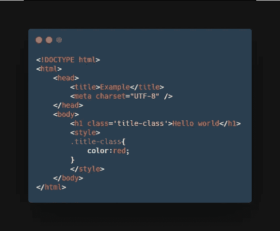

*   [**Id 选择器**](https://developer.mozilla.org/en-US/docs/Web/CSS/ID_selectors) :与类选择器不同，只有一个元素可以有一个标识类型的选择器(也就是说，不能有两个元素有相同的 Id)。Id 选择器对于 JavaScript 来说是最常见的，因为不能存在两个具有相同标识的元素，以避免将来的错误。

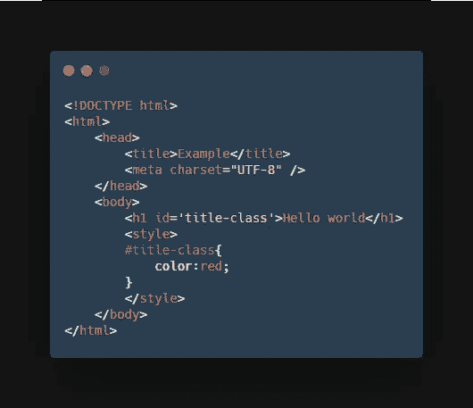

*   **:通用选择器将匹配你的 HTML 文档中的每一个标签。我用这个著名的 ***** 来写我项目中的默认规则。**

**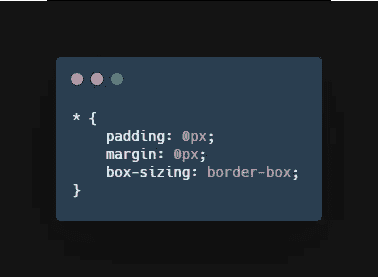**

*   **[**属性选择器**](https://developer.mozilla.org/en-US/docs/Web/CSS/Attribute_selectors) :这是最特殊的选择器类型，因为它会根据确定的属性进行匹配。**

**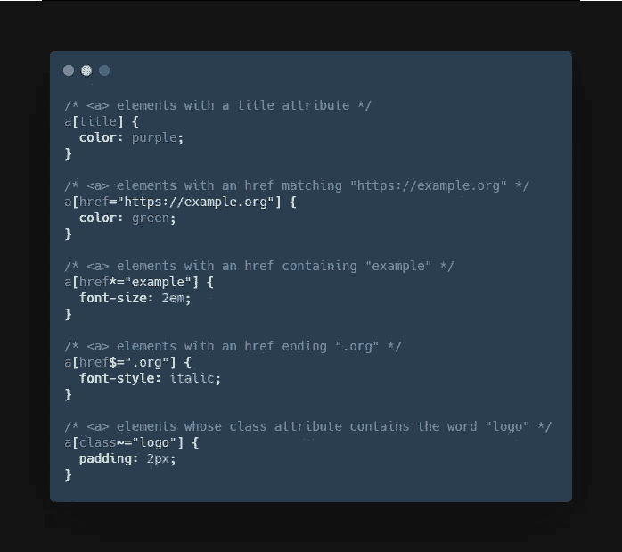**

# **—关于 CSS，我真正需要了解的是什么？**

**我们有很多方法来写一个类名，因为当你在 CSS 中写东西的时候，它可能需要很多行，所以，如果你不知道如何使它可读，它可能会成为一个令人头痛的事情。**

## ****描述性类名****

**作为前端开发人员，我们遵循一些结构来命名变量、**类名**、函数和 CSS 选择器。我认为有两种方法可以很好地编写**类名**:**

*   **[**OOCSS:面向对象-CSS**](http://oocss.org/) :面向对象-CSS 是妮可·沙利文在 2008 年做的。她的目标是通过应用面向对象设计的原则，使动态 CSS 更易于管理，这些面向对象设计的原则是由诸如 [Java](https://www.keycdn.com/support/difference-between-java-and-javascript) 和 [Ruby](https://www.ruby-lang.org/en/) 等编程语言普及的。OOCSS 使你的 CSS 更加易读，可重用，可伸缩和易于管理。**

****

*   **[**【块元素修饰符(BEM)**](http://getbem.com/) :一个 BEM 类名最多包括三个部分。块中，组件的最外层父元素被定义为块。组件内部的元素可以是一个或多个称为元素的子元素。修饰符:一个块或者一个元素都可以有一个修饰符表示的变体，如果三者都用在一个名字中，看起来会像这样。**

**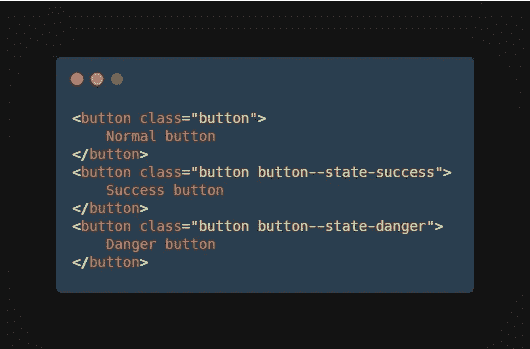**

*   ****不要超过组合**:HTML 中最正确的做法之一是保持正确的深度，以便在 CSS 中有正确的组合。深度超过四层是不正确的。**

**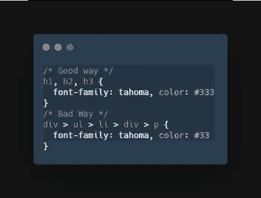**

*   **[**创建一个导入 CSS 文件** :](https://developer.mozilla.org/es/docs/Web/CSS/@import) 假设你有很多 CSS 文件，你不能把每个文件都和 HTML 文档连接起来，你可能应该创建一个导入 CSS 来导入你想要的每个 CSS 文件，然后把它和 HTML 文档连接起来。**
*   ****先创建你的 HTML**:作为建筑师，我们不会开始考虑颜色或者装饰。我们需要一个好的结构，因为拥有一个不支持自己的东西是没有用的，所以，保持结构和设计之间的平衡会让你成为一个超级程序员。**
*   **[**使用 Flex-Box** :](https://css-tricks.com/snippets/css/a-guide-to-flexbox/) 在过去，像 **Flex** 这样做是非常棘手的，而且可能会令人头疼。所以，不要拼命使用 **float** 或类似的东西来做类似的事情，使用 **Flex** 来保持代码的美观和可读性。**

**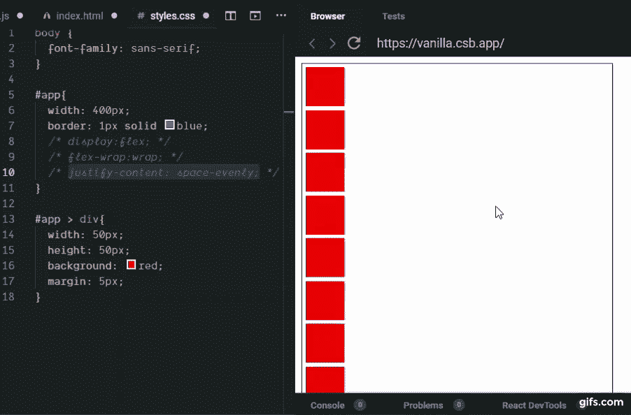**

## **[**箱型**](https://www.geeksforgeeks.org/css-box-model/)**

**盒子模型是一组规则，定义了网页中的元素将如何呈现。根据盒子模型，页面中的每个元素都是一个至少有内容、宽度和高度的矩形盒子。**

**好的，这意味着每个元素都是一个矩形，周围有可选的元素，如填充、边距和边框。Box-Mode 的一些属性定义了框的大小，如宽度、高度、边框、边距和填充。这些属性是可选的，这意味着您可以对它们进行赋值。**

**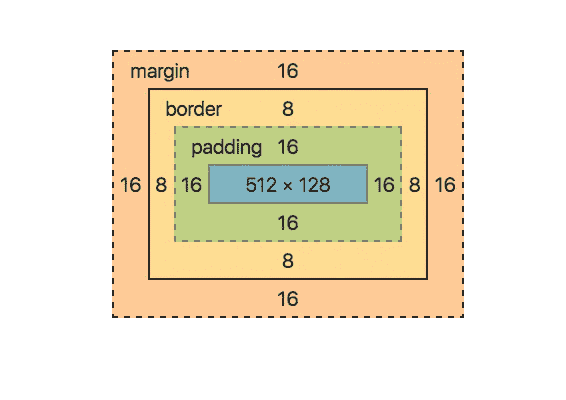**

**此图像表示一个带有边距、边框、填充和内容的框，并且给出了宽度和高度。使用我创建的卡片示例，我们可以更好地理解 **box-model** 的含义:**

**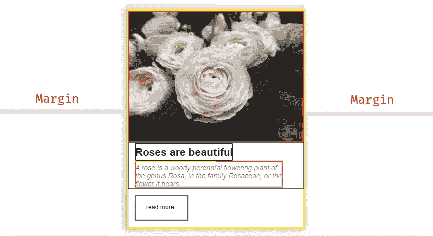**

# **[— JavaScript](https://es.wikipedia.org/wiki/JavaScript)**

**JavaScript 是一种基于 ECMAScript 方言编程语言，我们可以将其定义为面向对象、基于原型、命令式和动态的。JavaScript 诞生于 **1995 年**，通常用于客户端，但是今天 JavaScript 有了“节点”,允许程序员创建和管理服务器**

**函数式编程是 JavaScript 中使用最多的范例。其中最重要的一点可能是函数式编程赋予[一级函数](https://developer.mozilla.org/en-US/docs/Glossary/First-class_Function)和其他实践如[递归](https://www.sitepoint.com/recursion-functional-javascript/)、[纯函数](https://medium.com/javascript-scene/master-the-javascript-interview-what-is-a-pure-function-d1c076bec976)和[高级旧函数](https://medium.com/javascript-scene/higher-order-functions-composing-software-5365cf2cbe99)的重要性。**

**[最让你困惑的事情之一可能是，“*少即是多”*但不要把“*少即是多”*与一个好的代码混淆，因为有时它并不正确。](https://medium.com/siliconwat/algorithms-in-javascript-b0bed68f4038)**

# **—关于 JavaScript，我真正需要知道的是什么？**

**这是非常广泛和复杂的，因为最重要的是学习基础，并继续一步一步地学习 JavaScript。尽管有一些要点可以帮助你理解编码时发生了什么。**

## **[控制流程](https://dev.to/mugas/control-flow-in-javascript-246l)**

**控制流是计算机在脚本中执行语句的顺序。代码是从文件的第一行到最后一行按顺序运行的，除非计算机运行过改变控制流的(极其频繁的)结构，比如条件和循环。**

*   **`if else` —所以，`if`用更少的词允许我们创建一个布尔评估。在引擎盖下，只有当某事为真时，它才成为代码的一部分，这意味着在求值返回真之前，`if`内部的所有东西都不会在代码中实现。**

**控制台上的结果将是:我的年龄是 12 岁。如果我更改年龄值，其结果将是*“对不起，它不等于 12”*。**

*   **`switch` —类似于`if else`，但区别很大。开关有 case、break 和 default，我们可以看到 **case** 为 **if，** break 为结束，default 为 **else** 。**

*   **`[for](https://developer.mozilla.org/en-US/docs/Web/JavaScript/Reference/Statements/for) loop` — `[fo](https://developer.mozilla.org/en-US/docs/Web/JavaScript/Reference/Statements/for)r`为您创建一个循环，该循环带有一个布尔求值，当该求值为假时，该循环将重复自身。`[fo](https://developer.mozilla.org/en-US/docs/Web/JavaScript/Reference/Statements/for)r`有一些变体，如`[for in](https://developer.mozilla.org/en-US/docs/Web/JavaScript/Reference/Statements/for...in)`、`[for of](https://developer.mozilla.org/en-US/docs/Web/JavaScript/Reference/Statements/for...of)`、`[for await...of](https://developer.mozilla.org/en-US/docs/Web/JavaScript/Reference/Statements/for-await...of)`(我不会谈论这个或创建一个例子，因为我更喜欢给你一个包含更多信息的链接)和`[for each in](https://developer.mozilla.org/en-US/docs/Web/JavaScript/Reference/Statements/for_each...in)`。**

*   **[**DOM 操纵** :](https://es.wikipedia.org/wiki/Document_Object_Model) JavaScript 允许你给你的网站提供交互性，我们有很多像 Jquery(一种更简单的操纵 DOM 的方法)这样的框架，但是了解 vanilla 对于理解 Jquery 这样的库如何工作是必要的。例如:**

**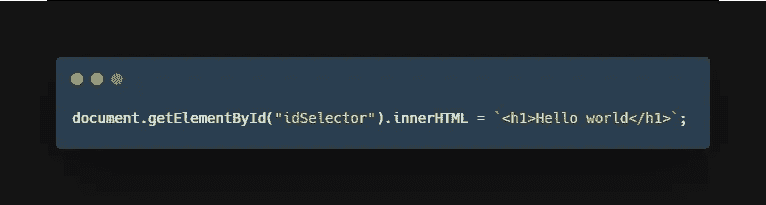**

**这是一个如何用 vanilla 获取元素并改变其结构的小例子，但是 vanilla 比简单的 innerHTML 更复杂。使用图像上的代码，您将创建一个标题标签(h1 ),标签内有一个 *Hello 单词*。**

*   **[**异步** :](https://alligator.io/js/async-functions/) 计算机编程中的异步是指独立于主程序流程的事件的发生以及处理这些事件的方式。有时你会想得到一些值，但你仍然没有他们唯一的方法就是使用承诺或异步。**

*   **[**测试驱动开发** :](https://medium.com/javascript-scene/tdd-changed-my-life-5af0ce099f80) **测试** - **驱动开发** (TDD)是一个软件**开发**过程，它依赖于一个非常短的**开发**周期的重复:需求被转化为非常具体的**测试**案例，然后软件被改进以便**测试**通过。**
*   **[**函数式编程** :](https://www.geeksforgeeks.org/functional-programming-paradigm/) 使用函数式编程，我们可以通过组合纯函数、避免共享状态、可变数据和副作用来构建软件。**

# **结论**

**作为前端开发人员，我们需要不断学习，找到一种方法来改进我们的代码，并理解设计的基础。不管你的范式是函数编程还是面向对象编程，等等，JavaScript 是一个让你创造惊人事物的工具，你唯一需要记住的就是不断学习。**

> **如果这对你有用，请支持我，并留下一些掌声和分享！**

*****Twitter:@ ToyoJhornan
Github:***[***@ karttofel***](https://github.com/karttofer) ***封面制作人:***[***Shiva Nallaperumal***](https://www.behance.net/shivanallaperumal)**