# 在任何 IDE 中提高编码速度的 5 大技巧

> 原文：<https://javascript.plainenglish.io/tips-to-increase-coding-speed-in-any-ide-21a5798d5647?source=collection_archive---------4----------------------->

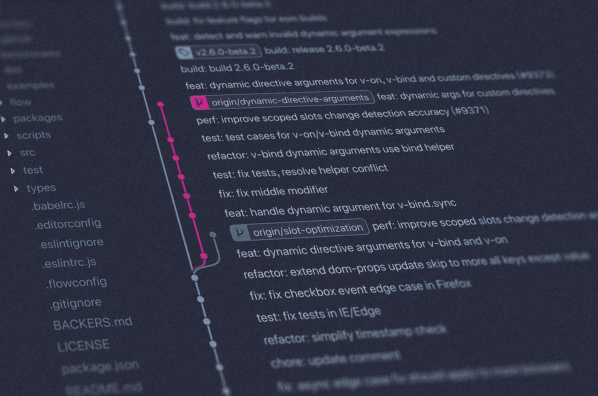

每个软件开发人员都有自己最喜欢的 IDE。ide 为我们提供了更快、更少错误地编写干净、可读代码所需的所有工具。由于各种提示和代码完成，人们不再需要记住编程语言的命令和指令。

然而，大多数软件开发人员倾向于只使用 ide 的少数功能，并依赖可视化用户界面来完成大部分工作，这并不快。在本文中，我将向您展示一些在使用 IDE 时用来提高工作效率的技巧和诀窍。

我将使用 [Visual Studio 代码](https://code.visualstudio.com/)作为例子，但是这里描述的所有技术几乎可以应用于任何 IDE。

# 1.减少分心的事物

全新安装 IDE 后，默认工作区如下所示:

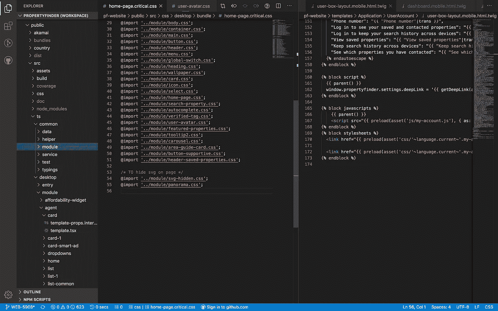

The project opened in VS Code with the default configuration

您有不同的面板，如文件资源管理器、文本编辑器、选项卡导航、面包屑、状态栏等等。其中一些部分很有用，你可能每天都在使用，其他部分只是占用空间，分散你的工作注意力(就像那个带有随机数字徽章的齿轮图标对我来说一样😬).

考虑隐藏或切换不使用的面板，这样你会有一个更整洁、更大的工作空间。

设置一个好看的颜色主题和字体大小会让你的编码体验更舒服，不那么累。选择主题的小技巧；考虑一下背景颜色和你正在使用的其他工具/程序的颜色差不多，这样可以减少你在工具之间切换时眼睛的压力。

**以下是我清理工作空间的 5 个步骤:**

*   禁用文件映射，因为我不能用它来导航，它占用了我的文本编辑器的大量空间。

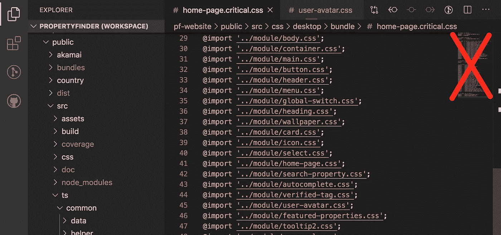

*   禁用标签，因为很难记住你是否在标签中打开了文件，并且在标签之间切换需要时间。

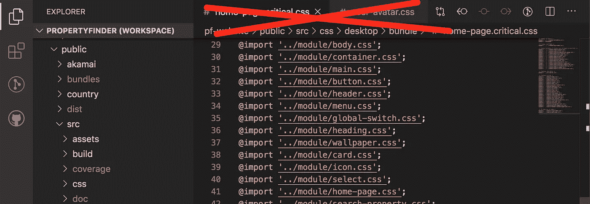

*   隐藏底部的状态栏(因为我很少使用它，它分散了我对大量通知的注意力，而不是专注于编码)。

*   使用[黄金分割比例](https://medium.com/@zkareemz/golden-ratio-62b3b6d4282a)设置自定义主题、字体大小和行高。
*   隐藏文件浏览器。稍后将详细介绍这一点！

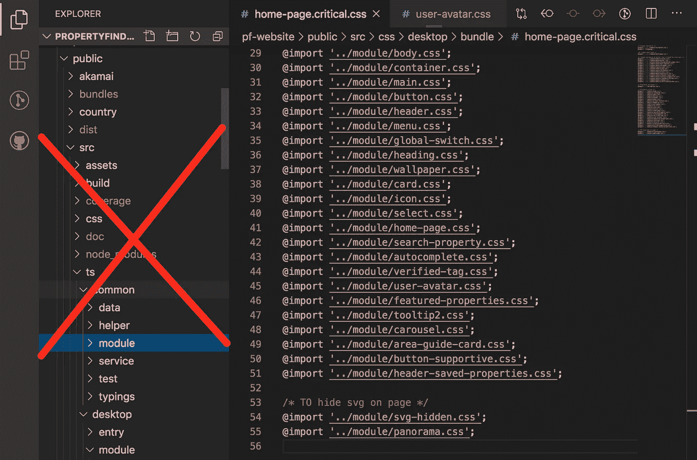

修改之后，我的 IDE 看起来是这样的:

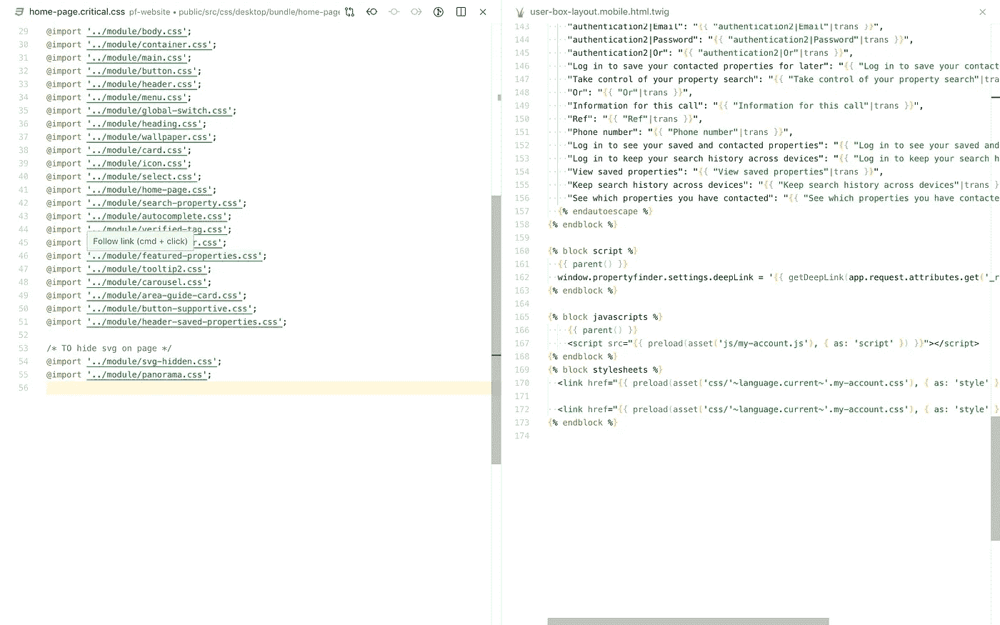

Clean and simple, you focus on your main objective which is coding

# 2.减少与鼠标/触控板的互动

每当你把手从键盘上拿开时，你就会损失 1-3 秒。如果你开始数你做了多少次，你会发现你每天会因为做这些机械的工作而损失 20-30 分钟的时间！

检查您的 IDE 为仅使用键盘的文件和文本导航提供了什么。Visual Studio 代码提供了大量的 [**键盘快捷键**](https://code.visualstudio.com/shortcuts/keyboard-shortcuts-windows.pdf) 来处理你的代码。

如果您的 IDE 没有为您提供默认的快捷键，您总是可以自己配置它们。我认为这甚至比使用默认值更好，因为你可以创建一个专门为你定制的快捷方式。**试着** **记住尽可能多的快捷键！**

**考虑对这些操作使用快捷键:**

*   重命名符号(单词、变量、文件等)
*   在编辑器/选项卡之间切换
*   转到符号(变量方法定义、类名等)
*   转到线
*   模糊搜索
*   开放终端
*   打开/关闭文件浏览器

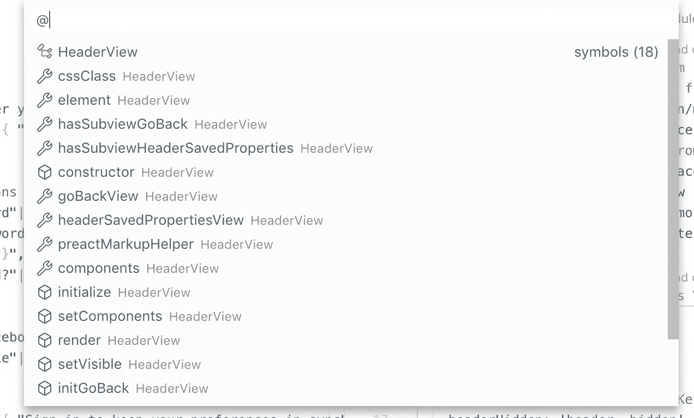

By typing @ in VS Code quick open you can fuzzy search for variables/methods within opened file

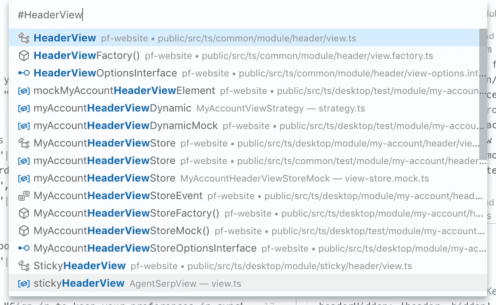

By typing # in a quick open window you can search for things like classes, objects, and variables within project codebase

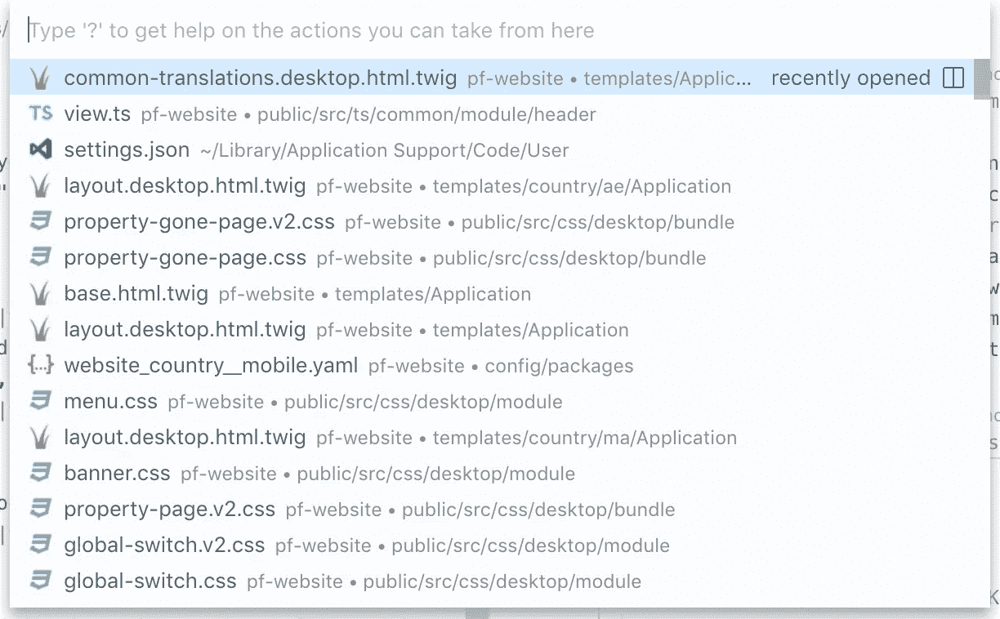

VS Code fuzzy search can open files/search for symbols or execute commands by typing >

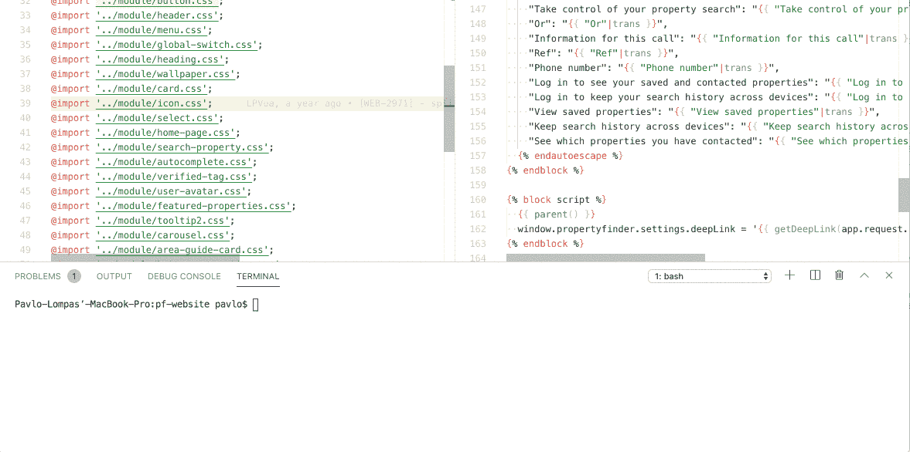

Toggle integrated terminal in VS Code using shortcut

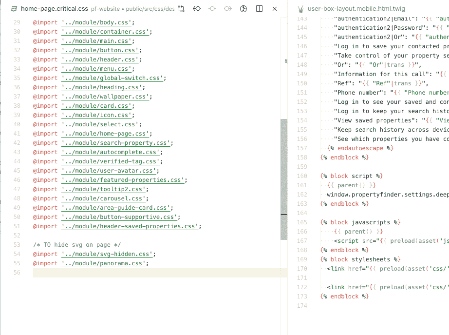

Toggle file explorer view using a shortcut in VS Code

**亲提示:**

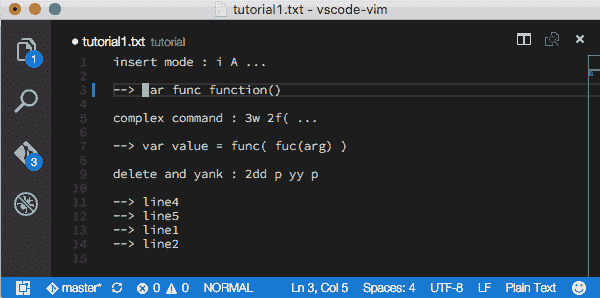

Example of using vim plugin in VS code

学习仅使用键盘进行文件导航/编辑的 [vim 快捷键](https://vim.rtorr.com/)。从长远来看，这将为你节省大量的时间，你将成为同事眼中的 IDE 之神😎。目前，大多数 ide 都支持 vim 编辑模式，或者有专门的插件。

# 3.不要使用文件树进行文件导航

查看此视频:

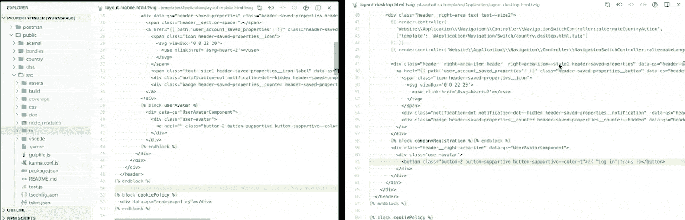

在上面的例子中，你可以看到通过使用模糊文件搜索而不是文件树，你可以**以两倍的速度**打开相同的文件。您还应该考虑项目文件结构的复杂性和深度。

在某些情况下，使用树编辑器在文件之间切换可能**甚至更慢**(例如，如果您的单元/功能测试在项目源文件之外)。使用模糊搜索还可以帮助您了解项目，减少代码库中的重复。

# 4.如果可能，使用集成终端

Use a shortcut to hide your terminal when not in use

大多数 IDE 都提供在 IDE 中打开终端或命令行外壳。这是一个非常有用的功能，因为您可以随时快速访问终端。另一个好处是终端实例总是从项目的根文件夹中打开。不再有持续的 cd 进入需要的路径。

# 5.学习盲打

这可能是显而易见的一点，但我看到许多开发人员打字速度很快，但仍然努力不出错，因为他们把视线从屏幕上转移到了键盘上。你也可以尝试其他键盘布局来代替 QUERTY，比如 [**程序员 Dvorak**](https://www.kaufmann.no/roland/dvorak/) 或 [**Colemak**](https://colemak.com/) 来进一步提高代码键入速度。

对于软件开发人员来说，IDE 技能与出租车司机了解道路或飞行员的飞行技能一样重要。你对自己的 IDE 感觉越舒服，作为一名专业人员，你就会成长得越快。

希望这篇文章能对你的日常工作有所帮助！请随意评论、提问或联系。

# 就是这样！感谢阅读！

*如果你喜欢这篇文章，并想成为我们出色的工程师团队的一员，那么看看我们最新的职位空缺* [*这里*](https://careers.propertyfinder.com/) *。*