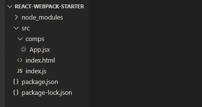

# 不使用 create-react-app 创建 React 应用程序

> 原文：<https://javascript.plainenglish.io/to-beginners-moving-away-from-create-react-app-f597413181e?source=collection_archive---------2----------------------->

## 将 Webpack 和 React 放在一起


Image by [Antonio Batinić](https://www.pexels.com/@antonio-batinic-2573434?utm_content=attributionCopyText&utm_medium=referral&utm_source=pexels)

在本文中，我们将在没有 **create-react-app** 库的情况下从头创建一个 React 应用程序，以便理解它在本质上是如何工作的。我们将使用 **Webpack** 作为这个项目的模块捆绑器。当我需要在项目中实现它时，我会解释一切。

在我们开始之前，克隆我创建的 [***资源库***](https://github.com/sapinder-pal/React-Webpack-Starter/tree/starter-files)*，其中包含了最少 starter 文件的 ***src*** 文件夹。完成后，在代码编辑器中打开文件夹；还有**确定你在** `starter-files` **分支。***

# *1.初始化 NPM*

*运行项目根目录下的`npm init -y`。它应该创建一个 ***package.json*** 文件，如下所示-*

```
*C:\Users\sapin\Desktop\react-webpack-starter>npm init -y
Wrote to C:\Users\sapin\Desktop\react-webpack-starter\package.json:{
 “name”: “react-webpack-starter”,
 “version”: “1.0.0”,
 “description”: “”,
 “main”: “index.js”,
 “scripts”: {
 “test”: “echo \”Error: no test specified\” && exit 1"
 },
 “keywords”: [],
 “author”: “”,
 “license”: “ISC”
}* 
```

# *对 Webpack 的需求*

*我们首先需要的是**而不是****react**库，而是一个**模块捆绑器**，它将扫描我们的项目文件并将它们捆绑在一起。但是在将代码捆绑在一起之前， [**Webpack**](https://webpack.js.org/) 使用我们提供的工具来理解文件中的内容。放心吧！稍后我们将详细讨论它。*

*Webpack 将通过获取 ***src/index.js*** 文件来开始它的工作，因为这是我们在配置它时指定的 ***入口点*** 。所以让我们直接进入主题-*

*我们需要 Webpack 中的以下库来处理它-*

*答:webpack: 它是 Webpack bundler 的核心库。*

***b. webpack-cli:** 如果你在使用 **create-react-app** 的时候看一下 ***package.json*** 里面，你会发现下面的脚本-*

```
*"scripts": {    
    "start": "react-scripts start",    
    "build": "react-scripts build"
}*
```

***react-scripts** 是一个定制库，它使用 webpack 的命令行接口来运行任何命令，比如- `npm start` **。**在这个设置中，我们将从*raw*web pack-CLI 运行命令。*

```
*"scripts": {    
    "start": "webpack-dev-server --mode development",    
    "build": "webpack --mode production",  
}*
```

***c. webpack-dev-server:** 您已经在上面的`**start**`脚本中看到了这个库的用法。在 ***开发模式*** 中使用，在浏览器中提供捆绑文件。[ *例如****localhost:3000***]*

# *2.设置 Webpack*

*首先，在控制台中运行以下命令。`--save-dev` 或`-D` 标志用于将它们安装为 ***开发依赖*** *。**

```
*npm install --save-dev webpack webpack-cli webpack-dev-server*
```

*现在在 ***package.json*** 文件内添加上述脚本。*

```
*"scripts": {    
    "start": "webpack-dev-server --mode development **--open --hot**",    
    "build": "webpack --mode production",  
}*
```

*新高亮显示的 ***标志****`--open`*和`--hot`分别做如下操作:***

*   ***服务器启动后，自动在浏览器中打开应用程序***
*   ***每当服务器代码发生变化时，自动在浏览器中重新加载应用程序***

***到目前为止，我们的项目文件夹中有以下内容-***

******

***现在让我们通过在文件夹的根目录下创建一个文件***webpack . config . js***来配置 web pack。把下面的东西加进去-***

```
**module.exports = {
  entry: {
    index: './src/index.js'
  },
  output: {
    path: __dirname + '/build',
    filename: 'index.bundle.js'
  }
}**
```

**`module.exports`内的所有内容都作为 webpack 的配置导出。**

****a.** `**entry**` **:** 我们在这里指定 webpack 应该查找的文件，以启动捆绑过程。**

****b.** `**output**` **:** 将放置捆绑文件的目录。在我们的例子中，我们只有一个名为`index`的 ***单入口点*** ，因此输出应该只生成一个 ***单捆绑文件***(***index . bundle . js***)。让我们看看它的特性-**

*   **`**path**` **:** 输出目录路径。
    ( `__dirname` **[** 当前工作路径*，即*****根目录*******+**`/build`*)。******
*   *****`**filename**` **:** 捆绑文件的名称。( ***index.bundle.js********

****现在安装 **html-webpack-plugin** ，它将拾取***src/index . html***，并在 ***/build*** 文件夹中创建一个 html 文件，放置与***src/index . html***相同的内容。****

```
****npm install --save-dev html-webpack-plugin****
```

****将***web pack . config . js***更新为以下内容-****

```
******const HTMLWebpackPlugin = require('html-webpack-plugin');**module.exports = {
  entry: {
    index: './src/index.js'
  },
  output: {
    path: __dirname + '/build',
    filename: 'index.bundle.js'
  },
  **plugins: [
    new HTMLWebpackPlugin({
      template: './src/index.html'
    })
  ]**
}****
```

******它所做的只是-******

1.  ******要求**把`html-webpack-plugin`****
2.  ******将**添加到`plugins`数组中，一个名为`HTMLWebpackPlugin`的新插件，并向其传递将用作****模板的源文件，以在构建目录中创建新的 html 文件。********

****现在我们准备好对付**巴贝尔**和**反应/JSX** 。****

# ****什么是装载机？****

****事实是，除了 **html** & **js** 文件类型之外，Webpack 实际上对 ***/src*** 文件夹中有哪些文件以及这些文件的用途一无所知。****

****又来了一个 [**装载机**](https://webpack.js.org/loaders/) 的角色。加载程序充当特定文件类型的**预处理器。当 Webpack 遇到任何新的文件类型时，它会在其配置中查找加载程序，并将文件处理给该加载程序。
为该文件类型配置的加载程序将执行其魔法，并将该代码的传输版本返回给 Webpack，web pack 随后继续捆绑过程。******

# *****巴别塔的需要*****

*****Webpack 不理解我们用来编写的现代 JavaScript 代码。它只理解 ES2015 之前的代码。但是我们可以用巴别塔来做这项工作。 [**Babel**](https://babeljs.io/) 是一个 JavaScript 编译器，将现代 JavaScript 代码转换成它的向后兼容版本。它也能改变 JSX 并做出反应。 ***而这正是我们这里实际需要的*** ！😄*****

****这里是我们实现巴别塔所需的*依赖* / *库*****

*   ******@babel/core:** 是巴别塔的核心库。****
*   ******@babel/preset-env:** 这个预置是一个 babel 插件的集合，根据我们在配置中指定的环境/目标浏览器来转换现代 JavaScript 代码。****
*   ******@babel/preset-react:** 这个预置是将 **JSX** 语法转换成我们需要的实际 JavaScript 代码的那个。****
*   ******babel-loader:** 这个应该在上面的依赖项之前提到。如果我们想使用上面的三个东西，我们必须有 babel-loader，这样它才能在 Webpack 进一步工作之前*预处理*特定的文件类型(在本例中是 **js/jsx** )。****

# ******3。建立巴别塔******

****像前面一样运行带有`--save-dev`标志的以下命令-****

```
**npm install --save-dev babel-loader @babel/core @babel/preset-env @babel/preset-react**
```

****在***web pack . config . js***中的“module.exports”对象中添加“module”属性-****

```
**module: {
  rules: [
    {
      test: /\.js|\.jsx$/,
      exclude: /node_modules/,
      use: 'babel-loader'
    }
  ]
}**
```

****“规则”数组中的每个对象为不同类型的文件指定规则。让我们检查规则属性-****

*   ****`**test**` **:** 需要一个 [**正则表达式**](https://developer.mozilla.org/en-US/docs/Web/JavaScript/Guide/Regular_Expressions) 来查找文件类型。****
*   ****`**exclude**` **:** 正如你所猜测的，它限制*加载器*对于相应的文件类型不能进入指定的目录*。*****
*   ****`**use**` **:** 该属性告诉 Webpack 对上述文件类型*使用***。********

# ******到目前为止你应该明白的是-******

*   ******Webpack 在我们点击`npm run start`(简称`npm start`)时寻找入口点(***/src/index . js***)。******
*   ******当遇到扩展名为 **js/jsx** 的文件时，它会在其配置中查找任何相应的加载程序。如果找到一个，它就把文件处理给那个加载器**；** else 抛出错误。******

******在 Webpack 将 ***index.js*** 交给 *babel-loader* 之后，加载器会寻找自己的配置。所以我们来一个吧！******

******创建一个新的 ***。根目录下的 babelrc*** 文件，并添加我们用于 babel 的`presets`******

```
****{
  "presets": ["@babel/preset-env", "@babel/preset-react"]
}****
```

> *********注意:*** 任何`loaders`数组以及 Webpack 中的`presets`数组总是以相反的顺序工作，即在上面的例子中， **@babel/preset-react** 将首先用于**解释****JSX**代码，然后 **@babel/preset-env** 将开始将代码转换成向后兼容的版本。******

******既然我们的 Webpack 设置能够解释和转换 **JSX** 代码，让我们实际安装 **react** 和***react-DOM***库吧！********

```
*****npm install react react-dom*****
```

*******注意，我没有使用`--save-dev`，因为这些依赖项在 ***开发*** 和 ***生产*** 模式中都有使用。*******

******现在你可以在你的项目文件中`import` **react** 和 **react-dom** ，并开始使用 **JSX** ！
而如果你运行`npm start`，它应该会启动***webpack-dev-server***，在 web pack 完成捆绑过程后自动在你的浏览器中打开 app。******

# ********宾果！！！但是等等…********

******尽管我们做了以上所有的事情，我们仍然被限制在我们的项目中不使用 js/jsx 之外的任何文件类型，因为 ***我们必须指定 loader****【s】****用于*** ***每个*********

********一些常用的加载器有: **css-loader、sass-loader、url-loader、file-loader 等。**你应该知道如何使用这里 列出的 [***的一些装载机。***](https://webpack.js.org/loaders/)********

******在我的库的`complete` 分支中，我添加了对更多东西的支持，比如 **sass、eslint** 、 **image-files** 、**postcss-loader**with**autoprefixer**、 **file-loader** 、 **url-loader** 等等。******

******到目前为止，您应该对 React 和 Webpack 如何协同工作有了很好的理解。******

******如果你喜欢我的写作风格，你可以关注我，永远不要错过我未来的任何帖子。你也可以在 [Twitter](https://twitter.com/sapinder_dev) 、 [Github](https://github.com/sapinder-pal) 和 [LinkedIn](https://www.linkedin.com/in/sapinder-singh/) 上查看我。******