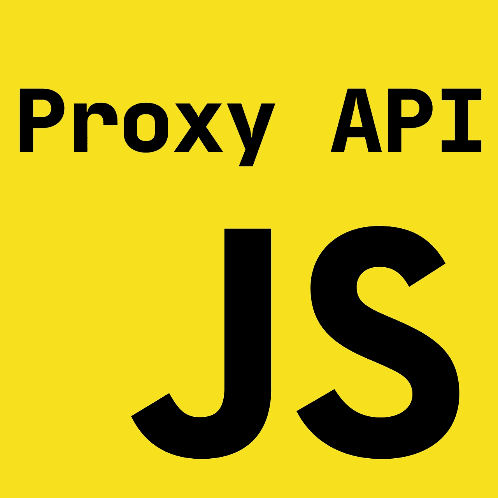

# 使用 JavaScript 代理 API 无限超越

> 原文：<https://javascript.plainenglish.io/to-infinity-and-beyond-with-javascript-proxy-api-8d4f7a26c8dc?source=collection_archive---------5----------------------->

代理 API 旨在彻底改变 JavaScript 开发体验，使以前不可能的壮举成为可能，于 2015 年在 ES6 中推出。这是一个先进的概念，但是如果你想掌握 JavaScript，代理 API 是你必须要学习的东西。

代理 API 的目标是扩展 JS **元编程**能力。元编程是一种编程技术，可以让你改变程序的行为，分析程序的内部结构，甚至动态地改变源代码。代理 API 允许您覆盖 JS 内部操作，例如对象属性查找、枚举、赋值、迭代、函数调用、生成器行为等等。

代理 API 的基本术语包括以下术语:

# 随身行李

陷阱是您正在重写的方法。下面是可能的陷阱的完整列表，即可以使用代理 API 覆盖的函数列表:

*   **对象方法:**
*   `getPrototypeOf()`
*   `setPrototypeOf()`
*   `isExtensible()`
*   `preventExtensions()`
*   `getOwnPropertyDescriptor()`
*   `ownKeys()`
*   **属性获取器/设置器:**
*   `has()`
*   `get()`
*   `set()`
*   `deleteProperty()`
*   **功能方法:**
*   `apply()`
*   `construct()`

# 处理者

Handler 是一个对象，其属性是**陷阱**。这意味着您可以在一个处理程序上定义多个陷阱！

# 目标

目标是其方法被重写的对象。它可以是任何对象，这意味着您可以将代理应用于第三方模块、内置对象甚至代理对象本身！

# 使用 GET 陷阱

现在，让我们看一些例子。我能想到的最简单的方法是使用`get`陷阱为未定义的属性提供默认值:

您可以看到，在第 1–4 行，我们为代理创建了一个处理程序。它定义了一个`get`函数，该函数覆盖了属性查找行为。如果对象上没有定义属性，我们返回`'general kenobi`，而不是 undefined。然后，在第 6 行，我们使用代理 API 来实现这一点。注意`new`关键字，它是必需的，因为`Proxy`是一个构造函数。最后，在第 10-11 行您可以看到我们的代理在工作:对于不存在的`'hello there'`属性，返回默认值`'general kenobi'`。

# 使用设置的陷阱

现在我们来看一个更高级的例子。我们将使用`set`陷阱来(1)验证属性值以确保它是一个字符串，以及(2)将字符串转换成大写。代码如下:

现在我们使用处理程序中的`set`陷阱来覆盖属性赋值行为。它首先检查值是否是字符串，如果是，用指定的键保存对象的大写版本。您可以在第 13-15 行看到它的行为:如果您试图传递`5`并将`'abacaba'`转换为`'ABACABA'`时抛出。

我希望现在您已经理解了 JavaScript 中的代理 API 以及如何使用它。让我知道你使用这种技术的经验，以及你用它解决了什么问题！此外，如果您想了解关于这种令人敬畏的语言的更多信息，请查看我关于 JavaScript 高级主题的其他文章:

 [## 深入探究 ES6 符号

### 在这篇文章中，我将解释什么是 ES6 符号，为什么你可能想要使用它们，以及它们是如何工作的。

medium.com](https://medium.com/javascript-in-plain-english/deep-dive-into-es6-symbols-3b44f4ba7eb3)  [## 在没有类的情况下用 JavaScript 实现构建器模式

### 在 JavaScript 中使用高级设计模式的力量，而没有类的开销

medium.com](https://medium.com/javascript-in-plain-english/implementing-the-builder-pattern-in-javascript-without-classes-eaf41f93b9c0)  [## 请停止使用 JavaScript 中的类，成为一个更好的开发者

### 在这篇文章中，我将谈论为什么在 JavaScript 中使用类是一个坏主意，以及有哪些…

medium.com](https://medium.com/javascript-in-plain-english/please-stop-using-classes-in-javascript-and-become-a-better-developer-a185c9fbede1) 