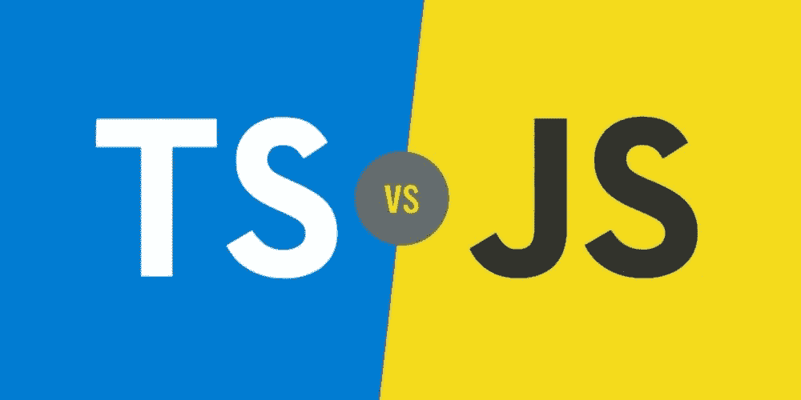
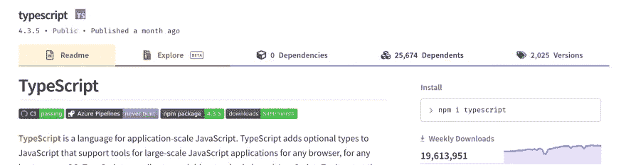
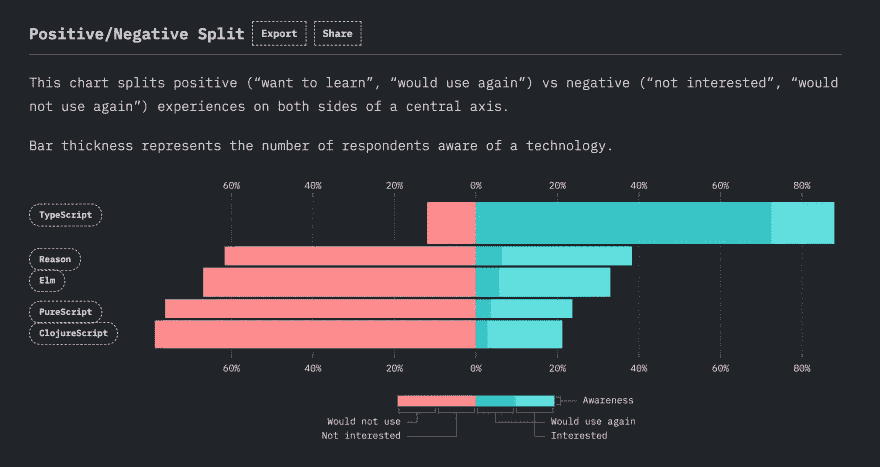
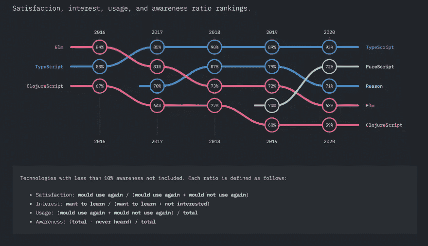

# 打字还是不打字？

> 原文：<https://javascript.plainenglish.io/to-typescript-or-not-to-typescript-8e9cea4b22bc?source=collection_archive---------23----------------------->

## TypeScript 与 JavaScript 的比较

几乎我们所有人都听说过 TypeScript，我们大多数人都屈服于这种宣传，开始学习它。越来越多的公司/代码库正在迁移到 typescript，这使得它成为任何开发人员的必备技能。我必须说我喜欢打字稿，不能没有它，但我会尽可能客观地提出我的观点。

# 打字稿的优点

## 严格打字

一旦声明，变量只能采用一种类型，并且只能采用某些值。编译器会提醒开发人员与类型相关的错误，这样他们就没有机会进入生产阶段。这使得代码不容易出错，并提高了开发人员的生产率。

例如，我们对一个参数调用一个特定于字符串的方法，我们可以这样做而不需要添加一个`if`检查。这是因为如果传递不同类型的值，TypeScript 将引发错误。

但是静态类型不仅仅是捕捉 bug。它还赋予了代码更多的结构，使其自文档化，可读性更强，加快了调试和重构的速度。

需要注意的是，TS 并不强制在任何地方声明类型。开发人员可以自由地改变项目不同部分的类型严格程度。这种方法将 TS 与其他静态类型语言区分开来，并允许您在灵活性和正确性之间找到正确的平衡。这也使得将 javascript 代码迁移到 typescript 变得容易，因为我们不需要转换整个代码库来编译代码。

有了 TypeScript，一切都保持原来的定义。如果一个变量被声明为一个字符串，它将永远是一个字符串，不会变成一个布尔值。这增加了功能按最初设想的方式工作的可能性。

## 更早发现 bug

研究人员发现，TypeScript 在编译阶段检测到 15%的常见错误。虽然远不是 100%的结果，但这个数量仍然足以节省开发人员的时间，让他们专注于纠正逻辑中的错误，而不是捕捉常见的错误。让代码通过编译器也减少了质量保证和测试活动的数量。

## Sweet VS 代码自动完成

Vs 代码已经有很好的 javascript 自动完成功能，但是 typescript 给了它巨大的提升。此外，如果我们使用外部第三方库，我们可以检查类型定义，这将比检查文档更快(一些库没有很好的文档)

## 额外功能

除了普通的 javascript 特性之外，typescript 还有几个 javascript 中没有的特性。例如，`public`、`private`和`protected`字段、无效合并(`??`等)、`abstract`类等

## 流行

Typescript 在 NPM 的每周下载量超过 1900 万次:

接下来，让我们从 JavaScript 的[状态来看 2020 年的调查，这是最受欢迎的 JavaScript 调查之一。](https://2020.stateofjs.com/en-US/)

多年来各种 JS 口味的流行程度:

喜欢/不喜欢 typescript 的人的百分比:

长期经验:

根据 2020 SO 调查，TypeScript 是第二受欢迎的语言，也超过了 Python！

当然，这些只是数字。受欢迎并不一定意味着某样东西质量很高，应该被信任。幸运的是，TypeScript 也得到了科技界一些真正强大的玩家的支持。

该语言广泛用于软件产品，如 Slack、Medium、Asana 或 Visual Studio 代码。此外，许多优秀的 JavaScript 工具都是用 TypeScript 编写的，包括框架(Angular、Ionic 等)和库(ZoomCharts、yWorks 或 GoJS)。

好像这还不够，像微软这样的科技巨头(咄！)、JetBrains、易贝、爱立信、Airbnb 和育碧都对使用 TypeScript 持开放态度——谁知道有多少其他企业级公司已经将它纳入了他们的技术堆栈。

# 打字稿的缺点

没有什么是完美的，typescript 也不例外！

## 额外阶段—运输

反对 TypeScript 的一个主要理由是它需要编译，而 JavaScript 不需要。但是，老实说，现在大多数 JavaScript 应用程序都需要一个构建步骤。无论是 Gulp、Grunt、Webpack、Rollup、Babel 还是 Closure——构建步骤都是必要的，没有什么能真正阻止你扩展它。

## 附加码

这是 typescript 的主要缺点之一。为了恰当地利用 typescript 的特性，我们需要创建`types`、`interfaces`、`generics`等，在时间有限或截止日期紧迫的情况下，这可能会导致不必要的延迟。

然而，从长远来看，这将节省我们很多时间，因为一个新的开发者将需要更少的时间来理解代码库。此外，typescript 并不严格，您只需将一个`.js`文件的扩展名改为`.ts`，typescript 不会报错(除非启用了严格模式)。

有人说为什么不能直接用 [JSDOC](https://jsdoc.app/) ？为什么不告诉我，哪个更好看？

Vanilla Javascript function using JS doc

或者:

Same function, in typescript

## 学习曲线

即使 TypeScript 类似于 JavaScript，仍然需要学习一些知识来正确理解代码。

# 结论

我认为这是主观的，作为一个喜欢自动完成、代码可读性和语法的人(也是一个引入了很多错误的人)😅)TypeScript 对我来说是显而易见的选择。然而，在时间紧迫的情况下，普通的 JavaScript 会更好。请在评论中告诉我你的看法！

如果你喜欢这篇文章，别忘了留下你的赞，在 Twitter 上关注我，我会(试着)定期发布 JavaScript/TypeScript 技巧和窍门。再见！🤟

*更多内容尽在*[***plain English . io***](http://plainenglish.io/)