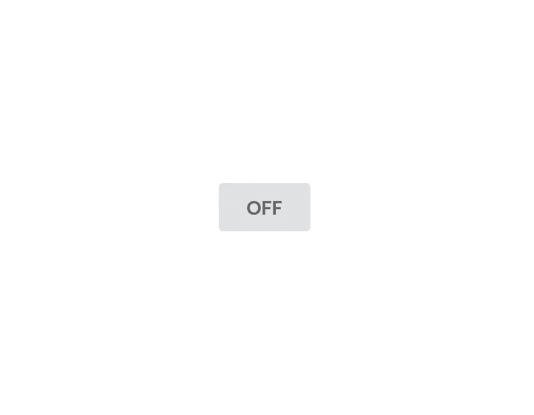
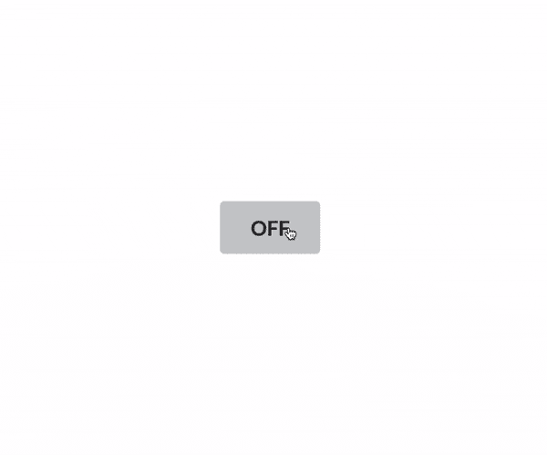
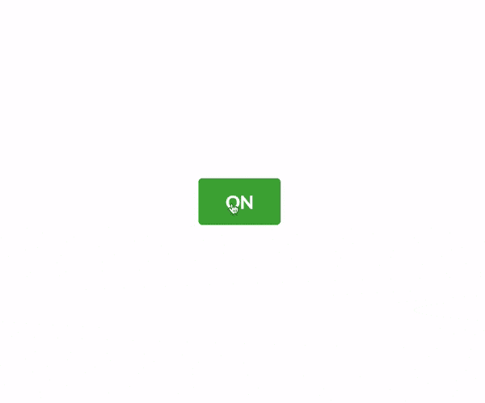
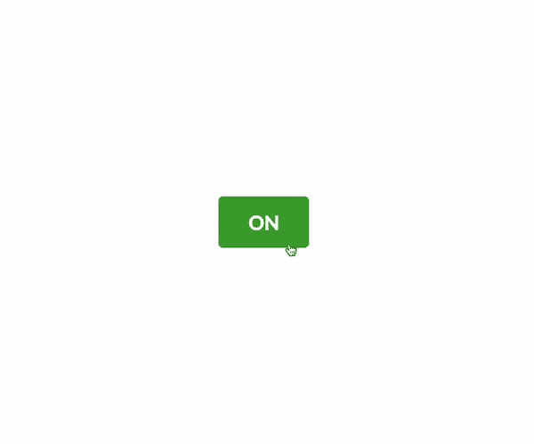
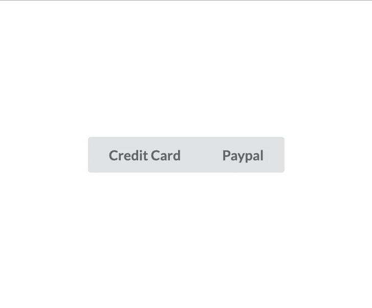
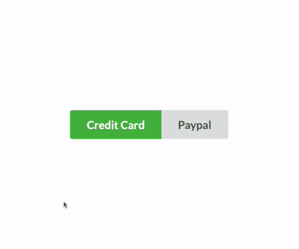

# 如何在 Vue.js 中创建切换按钮

> 原文：<https://javascript.plainenglish.io/toggle-button-in-vue-js-89c612ad6b1a?source=collection_archive---------3----------------------->

在这个快速教程中，您将学习如何创建不同类型的切换按钮，例如:

*   在单个按钮中切换单个类
*   在一个按钮中切换两个类
*   在两个不同的按钮之间切换单个类别

# 在单个按钮中切换单个类

在 Vue 模板中，我有一个简单的按钮，带有一些[语义 UI CSS 框架](https://cdn.jsdelivr.net/npm/semantic-ui@2.4.2/dist/semantic.min.css)类:ui button toggle，这只是为了视觉目的。

```
<button class="ui button toggle">OFF</button>
```

在这个阶段，按钮的背景颜色是灰色的，如下图所示。



在这个阶段，将**激活**类切换到按钮会将背景颜色从*灰色*变为*绿色*，反之亦然。

相当直接。

要做到这一点，我们需要一个具有布尔值的属性，并且在每次按钮点击时，我们需要改变该属性的状态。

基于此，我们可以确定什么时候应该将活动类添加到按钮中。

让我们在 **data()** 模型中定义一个名为 **isActive** 的属性。

```
export default {
  data() {
    return {
      isActive: false,
    };
  },
};
```

然后，将一个 click 事件附加到按钮上，这样我们就可以在每次单击时更改 **isActive** 属性的状态。

```
<button class="ui button toggle" @click="toggle">OFF</button>
```

调用方法对象中的 **toggle()** 回调函数。

如果**为假**，则将 **isActive** 属性设置为**真**，反之亦然。

做这件事的方法不止一种。

天真的方法应该是这样的:

```
toggle() {
  if (!this.isActive) {
    this.isActive = true;
  } else {
    this.isActive = false;
  }
},
```

> 我首先检查 this.isActive 是否为 false 的原因是因为这是它的初始值。

但是三元运算符会使它不那么混乱。

```
toggle() {
  this.isActive = this.isActive ? false : true;
},
```

这很好，但我们还可以做得更好。

```
toggle() {
   this.isActive = !this.enable;
},
```

看起来不错。

实际上，您可以将这段代码内联到按钮上，如下面的代码所示。

```
<button class="ui button toggle" @click="isActive = !isActive">OFF</button>
```

# 切换活动的 CSS 类

基于 isActive 属性，让我们通过向:**类**添加一个对象来切换按钮元素中的**活动**类。

```
<button class="ui button toggle" :class="{active:isActive}" @click="isActive = !isActive">OFF</button>
```

当 **isActive** 设置为 true(对象的值)时， **active** 类(对象的键)将被添加到按钮中。



很好。

# 切换按钮文本

让我们根据 **isActive** 属性的值在关闭和打开之间交换文本。

```
<button
class="ui button big toggle"
:class="{active:isActive}"
@click="toggle"
>{{isActive ? 'ON' : 'OFF'}}</button>
```



# 在一个按钮中切换两个类

假设您希望按钮在关闭时背景颜色为红色，在打开时背景颜色为绿色。

在这种情况下，我们所要做的就是将一个数组而不是一个对象添加到:**类**中。

```
<button
  class="ui button big"
  :class="[isActive ? 'green' : 'red']"
  @click="toggle"
>{{isActive ? 'ON' : 'OFF'}}</button>
```

在该数组中，我们可以使用一个三元运算符根据 **isActive** 属性的值交换两个类。



# 在两个按钮之间切换单个类别

假设你有一个支付页面，有两个选项；要么用信用卡，要么用贝宝。



我有两个带有一些语义 UI CSS 类的按钮，并用一个名为 **toggle()** 的回调函数将一个点击事件附加到这两个按钮上。

```
<div class="ui buttons big">
  <button
    class="ui button toggle"
    @click="toggle"
  >Credit Card</button>
  <button
    class="ui button toggle"
    @click="toggle"
  >Paypal</button>
</div>
```

现在，在 data()模型中声明一个名为 **showCreditCard** 的属性。

然后，每次按下任何按钮时，改变 **showCreditCard** 属性的状态。

```
export default {
  data() {
    return {
      showCreditCard: true,
    };
  },
  methods: {
    toggle() {
      this.showCreditCard = !this.showCreditCard;
    },
  },
};
```

当 **showCreditCard** 属性设置为 true 时，**活动的**类将被添加到信用卡按钮，否则，将被添加到 Paypal 按钮。

```
<div class="ui buttons big">
  <button
    class="ui button toggle"
    @click="toggle"
    :class="[showCreditCard ? 'active' : '']"
  >Credit Card</button>
  <button
    class="ui button toggle"
    @click="toggle"
    :class="[!showCreditCard ? 'active' : '']"
  >Paypal</button>
</div>
```



你有它！

如果你想添加这篇文章中缺少的东西，请在下面评论，让我知道。

编码快乐！