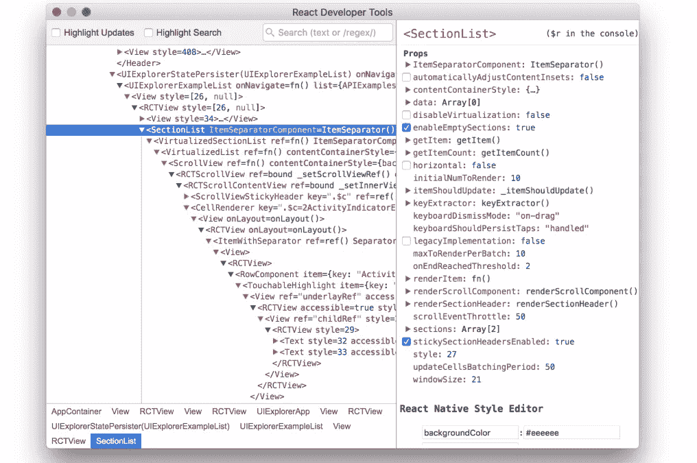
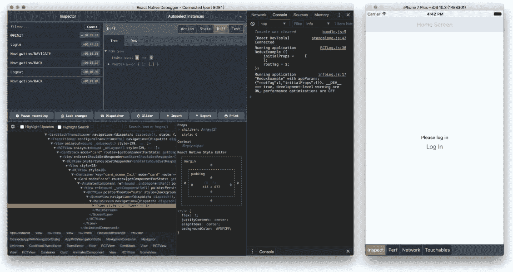

# 调试 React 本机应用程序的工具和提示

> 原文：<https://javascript.plainenglish.io/tools-and-tips-for-debugging-your-react-native-app-3643b0991aeb?source=collection_archive---------6----------------------->

## 让调试 React 原生应用变得简单

Photo by [Kevin Ku](https://unsplash.com/@ikukevk?utm_source=medium&utm_medium=referral) on [Unsplash](https://unsplash.com?utm_source=medium&utm_medium=referral)

调试是我们知道代码中什么可行，什么不可行的方法。如果在开发模式下运行应用程序时出现了 bug，除了调试，您还能做什么呢！当然，你可以在谷歌搜索栏中复制粘贴错误，然后找到解决方法。但是如果这是你独有的代码，而你甚至不知道这个 bug 是从哪里来的呢？通过调试，我们可以正确地评估我们的代码，并在为时已晚之前修复错误。请记住，在生产中修复这个错误会花费更多的钱。

感谢大量的 React 原生贡献者，许多调试工具可用于调试我们的 React 原生应用。在这篇文章中，我们将探索最常用的。您将了解哪个工具最适合调试您的应用程序，以及如何使用它。

# Chrome 开发工具

在不安装任何其他应用程序的情况下，调试代码的最简单方法是使用 Chrome。默认情况下，React Native 通过其远程调试功能支持 ChromeDev 工具。当您的应用在 Android Emulator 上运行时，在 Windows 上按 Ctrl+M 或在 Mac 上按 Cmd+M 访问应用内开发人员菜单。如果它运行在真实的设备上，那么你只需要摇动你的设备。

Screenshot from [React Native Docs](https://reactnative.dev/docs/debugging) by [Manusha](https://medium.com/@manushacheti)

你会看到一个类似这样的菜单，从那里选择“远程调试 JS”。然后它会打开谷歌浏览器调试器。然后在 Windows 上按 Ctrl+Shift+I 或者在 Mac 上按 Command+Option+I 就可以打开开发者工具。现在，您可以使用控制台语句调试您的应用程序。您还可以转到“开发工具”“源代码”选项卡，打开源文件来查看您的代码，并且您可以从这里添加断点。你现在可以用 Chrome DevTools 调试你的应用了。错误信息对于调试非常重要。Chrome DevTools 让我们可以查看 JavaScript 警告和堆栈跟踪错误，并轻松复制它们。React 本机调试器为这种默认支持增加了一些新功能。React Native Debugger 是一款将 Chrome DevTools、Redux DevTool、React DevTools 整合到一个地方的 app。在了解 React 本机调试器之前，我们先简单了解一下 React DevTools。

# React 开发工具

React DevTools 是前端领域最好的工具之一。您可以使用它来调试 React 组件层次结构。React DevTools 让你看到组件树的内部。您可以选择和编辑组件的当前属性和状态。React DevTools 是 Chrome 和 Firefox 浏览器的扩展。但不能用来调试 React 原生 app。你必须使用 React DevTools 的独立版本来调试 React 原生应用。要进行全局安装，请在您的终端上运行`npm install -g react-devtools`。然后运行`react-devtools`启动 DevTools 应用程序。

Screenshot from [React Native Docs](https://reactnative.dev/docs/debugging) by [Manusha](https://medium.com/@manushacheti)

然后打开应用内开发者菜单，选择“显示检查器”。这将允许您使用 React DevTools 来检查应用程序的用户界面元素。如果您使用 Redux，React DevTools 可以与 Redux DevTools 一起使用，以获得组件状态的完整图片。但是您必须单独安装 ReduxDev 工具，但是这是 React 本机调试器来拯救我们的时候了。

# 反应本机调试器

React Native Debugger 是一款独立的桌面应用，可以在 Mac、Windows 和 Linux 上运行。这是我最喜欢的调试 React 本机应用程序的调试器。它将 Redux DevTools 和 React DevTools 集成到一个应用程序中，因此您不必使用两个单独的调试应用程序。

> 如果你在 React 本地应用中使用 Redux，这是最好的调试器。

你可以从[这里](https://github.com/jhen0409/react-native-debugger)安装 React Native Debugger for Mac and Windows。安装后，你可以像打开 Chrome 检查器一样连接到它。使用 React 本机调试器，您可以记录或删除异步存储内容，检查网络请求，以及检测和诊断性能问题。这些是 React 本机调试器的附加优势。

Screenshot from [react-native-debugger](https://github.com/jhen0409/react-native-debugger) by [Manusha](https://medium.com/@manushacheti)

除了我们在这里看到的工具，还有很多调试 React Native 的工具。这取决于你的项目的具体需求。我希望你明白如何选择最合适的工具来调试你的 React 原生应用，以及如何使用它来调试你的牛逼应用。本文到此为止。

感谢您的阅读，祝您编码愉快！

# **简明英语团队的笔记**

你知道我们有四份出版物和一个 YouTube 频道吗？你可以在我们的主页 [**plainenglish.io**](https://plainenglish.io/) 上找到所有这些——关注我们的出版物并 [**订阅我们的 YouTube 频道**](https://www.youtube.com/channel/UCtipWUghju290NWcn8jhyAw) **来表达你的爱吧！**