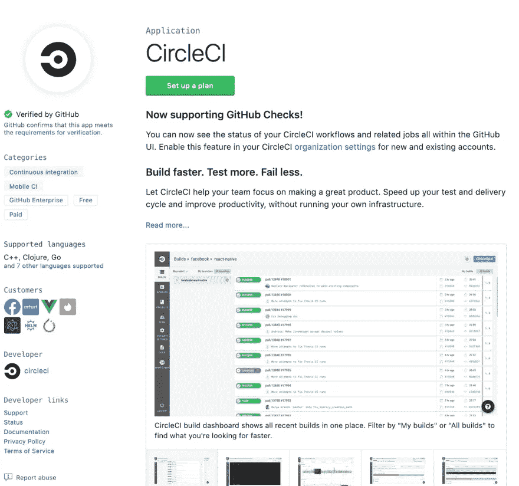
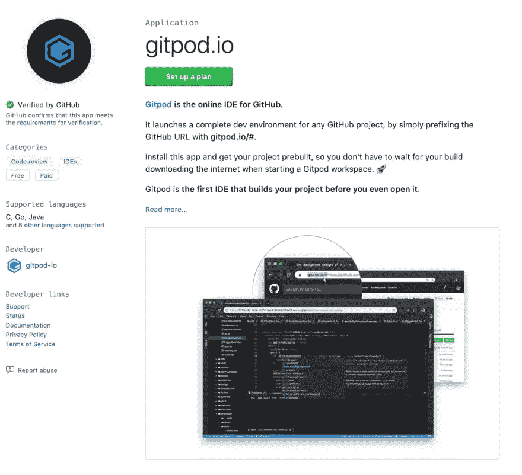
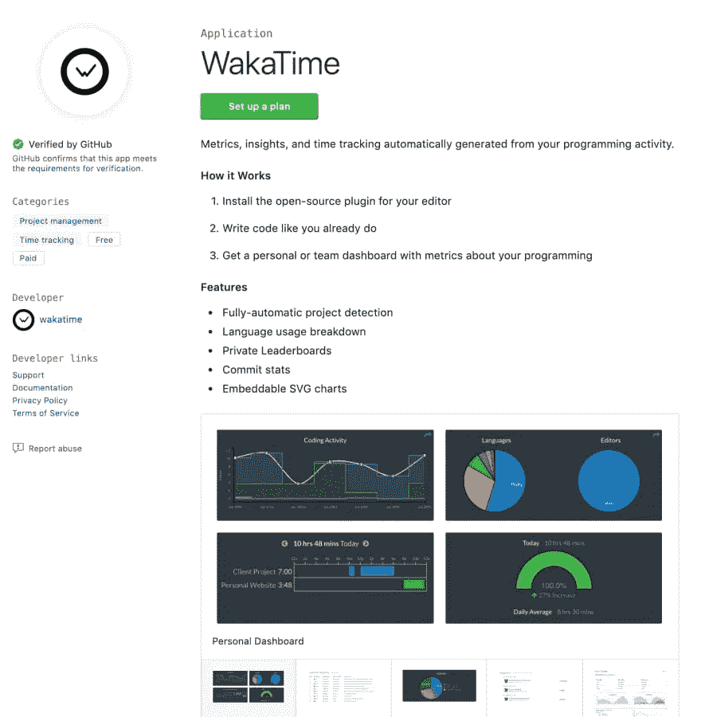
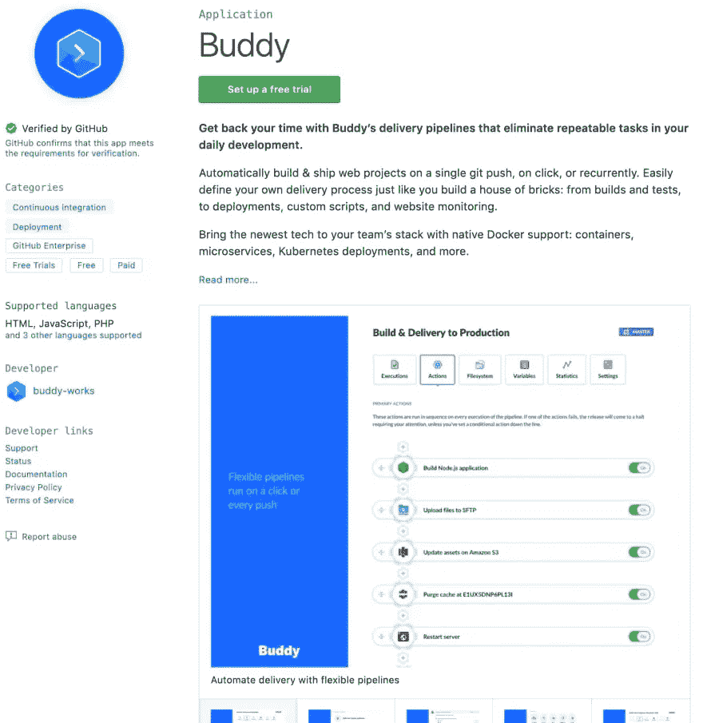
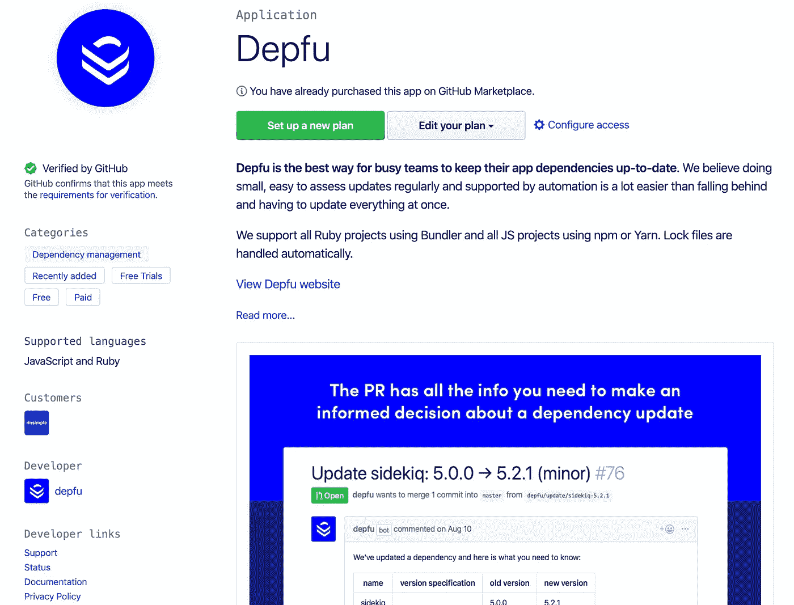
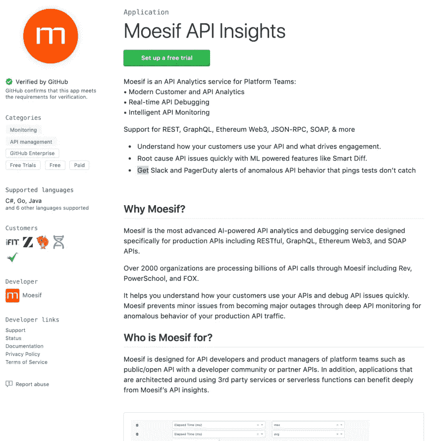
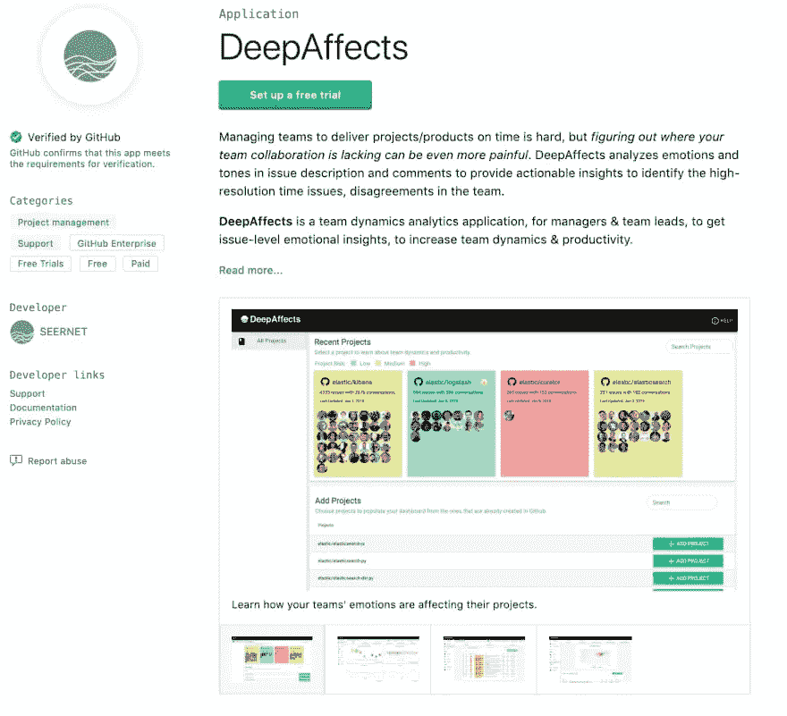

# 市场上供初级 JavaScript 开发人员使用的十大 Github 应用

> 原文：<https://javascript.plainenglish.io/top-10-github-apps-on-marketplace-to-use-as-junior-javascript-developers-in-2020-9a699efeb51f?source=collection_archive---------1----------------------->

开源项目努力修复所有的漏洞。为什么你的项目不应该由这些应用程序在何时何地根除它们的知识来驱动呢？下面所有这些都可以屏蔽你的项目，监控你的项目公开披露的安全漏洞，而且是免费的。

# 1.测试质量

TestQuality 的 Github 测试管理扩展了 GitHub，以提供强大的现代测试计划管理，帮助开发人员和测试人员创建、运行、协调和监控软件测试任务。最好的质量是免费的 GitHub 公共回购和负担得起的私人回购。
[https://github.com/marketplace/testquality](https://github.com/marketplace/testquality)

# 2.ImgBot

自己优化图像很费时间，让 ImgBot 来帮你完成所有繁重的工作。你只要坐下来复习 PRs。https://github.com/marketplace/imgbot

# 3.圆词

让 CircleCI 帮助您的团队专注于制作一个伟大的产品。加快您的测试和交付周期并提高生产率，而无需运行您自己的基础设施。
[https://github.com/marketplace/circleci](https://github.com/marketplace/circleci)

# 4.代码树

Codetree 是一个轻量级的项目管理应用程序，对多回购项目有很好的支持。不需要安装任何东西，它可以在任何浏览器上运行。
https://github.com/marketplace/codetree

# 5.Gitpod.io

Gitpod 是 GitHub 的在线 IDE。它可以为任何 GitHub 项目启动一个完整的开发环境，只需在 GitHub URL 前面加上 git pod . io .
[https://github.com/marketplace/gitpod-io](https://github.com/marketplace/gitpod-io)

# 6.瓦卡提时间

跟踪你花在编码上的时间，你甚至可以每天设定一个目标。
[https://github.com/marketplace/wakatime](https://github.com/marketplace/wakatime)

# 7.好朋友

通过一次 git 推送、点击或循环，自动构建和发布 web 项目。轻松定义您自己的交付流程，就像您建造砖块房子一样:从构建和测试到部署、定制脚本和网站监控。
[https://github.com/marketplace/buddy](https://github.com/marketplace/buddy)

# 8.德普夫

对于忙碌的团队来说，Depfu 是保持他们的应用程序依赖关系最新的最佳方式。我们相信，做一些小的、容易评估的定期更新，并得到自动化的支持，比落后和必须一次更新所有东西要容易得多。
[https://github.com/marketplace/depfu](https://github.com/marketplace/depfu)

# 9.Moesif API 洞察

Moesif 是最先进的 AI 驱动的 API 分析和调试服务，专门为生产 API 设计，包括 RESTful、GraphQL、Ethereum Web3 和 SOAP APIs。https://github.com/marketplace/moesif-api-insights

# 10.深刻影响

DeepAffects 是一个团队动态分析应用程序，供经理和团队领导使用，以获得问题级别的情感洞察，提高团队动态和生产力。
[https://github.com/marketplace/deepaffects](https://github.com/marketplace/deepaffects)

