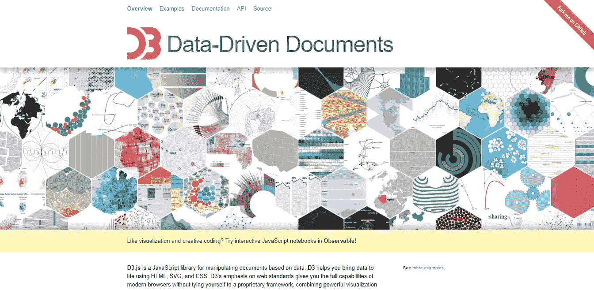
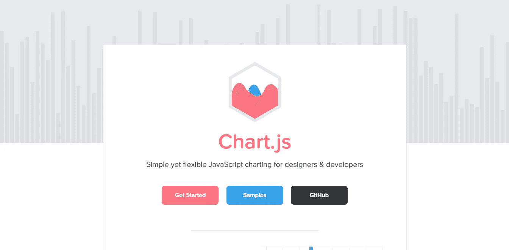
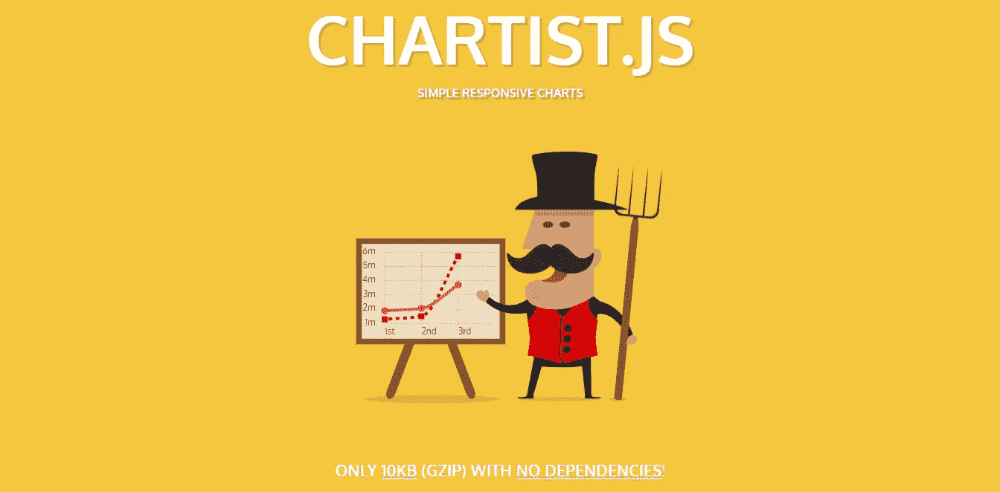
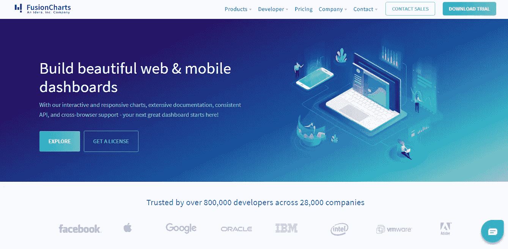
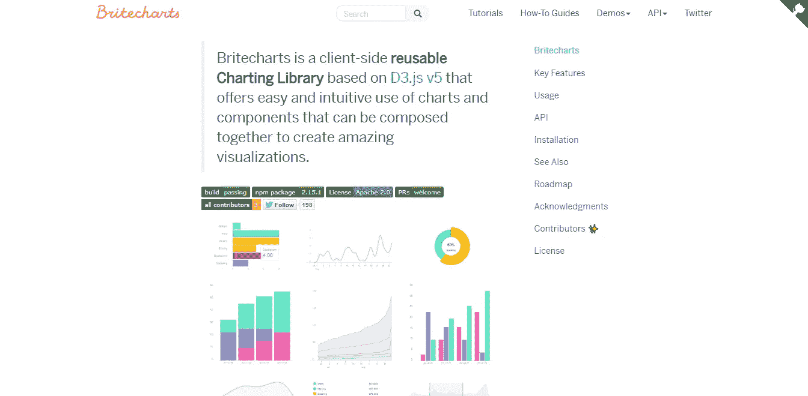
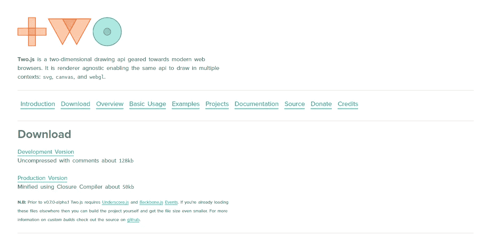
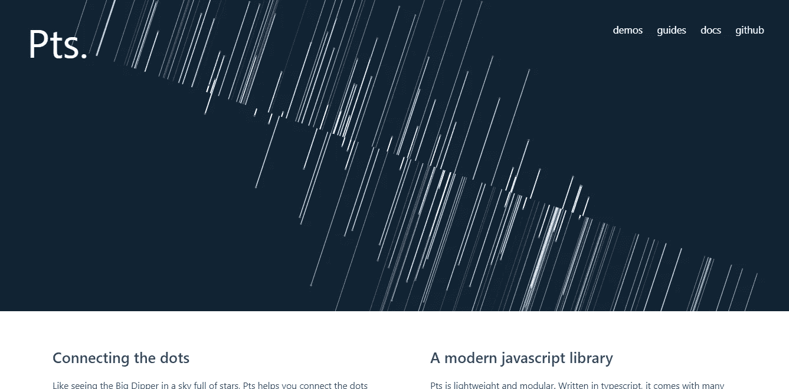
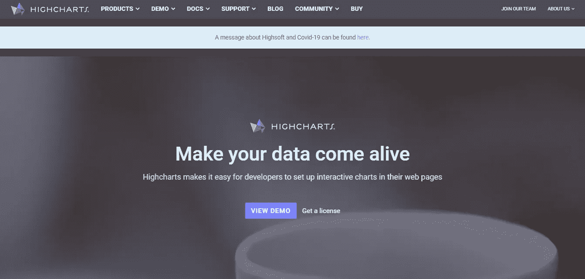
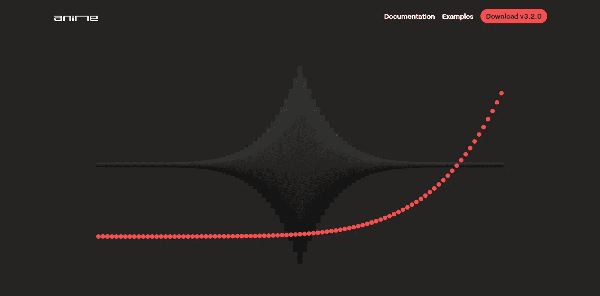
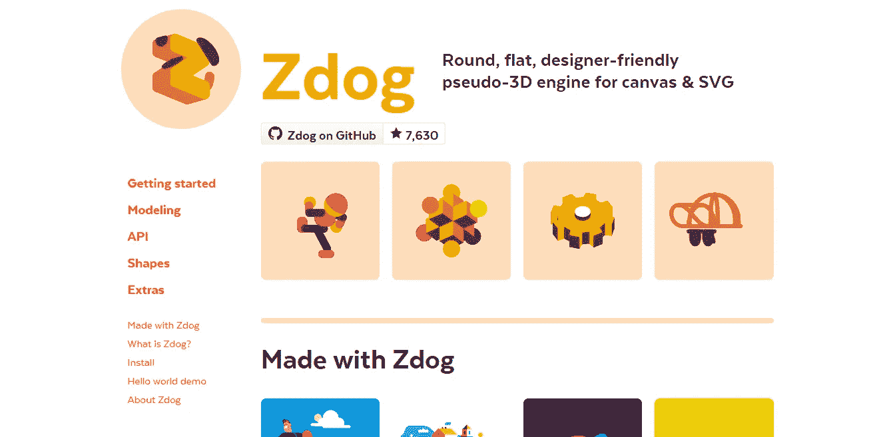

# 与 JavaScript 框架一起使用的 10 大图形库

> 原文：<https://javascript.plainenglish.io/top-10-graphical-libraries-to-use-with-javascript-frameworks-40dfc2b77202?source=collection_archive---------4----------------------->

## 使用这些 JavaScript 库制作图形插图、动画和数据可视化

Photo by [Luke Chesser](https://unsplash.com/@lukechesser?utm_source=unsplash&utm_medium=referral&utm_content=creditCopyText) on [Unsplash](https://unsplash.com/s/photos/graph?utm_source=unsplash&utm_medium=referral&utm_content=creditCopyText)

在 web 浏览器中显示图片或动画需要很多行代码。大多数开发人员不喜欢编写冗长乏味的代码，即使使用最好的 ide，他们也很高兴有几个库可以帮助您满足所有的浏览器绘图需求。

大多数浏览器很少提供高性能的绘图 API 和界面。例如画布元素和可缩放矢量图形(SVG)。要在浏览器中运行这些特性，使用它们所需的 API 是相当低级的。

在本文中，我将向您介绍一些可用的选项。

## [1。D3.js](https://d3js.org/)

D3.js(也称为 D3，是数据驱动文档的缩写)是最大的 JavaScript 图形库，在 [npm](https://www.npmjs.com/package/d3) 上每周下载超过 100 万次。D3 帮助您使用 HTML、SVG 和 CSS 将数据变得生动。D3 对 web 标准的重视使您可以获得现代浏览器的全部功能，而无需将自己束缚于专有框架，将强大的可视化组件和数据驱动的 DOM 操作方法结合起来。

## [2。Chart.js](https://www.chartjs.org/)

Chart.js 是一个用于较小项目的开源 JavaScript 库。因为 Charts.js 自带了内置的图表类型，折线图、条形图、雷达图、圆环图和饼图、极区图、气泡图和散点图。即使它看起来是有限的，这也是 Chart.js 简单易用的原因。所有语法都是围绕图表类型构建的。它只渲染到画布上，这不是问题，因为现在所有的浏览器都支持 HTML 画布元素。

## [3。Chartist.js](https://gionkunz.github.io/chartist-js/)

Chartist.js 是另一个开源 JavaScript 库，它提供了对处理配置的简单、直观的使用，在使用清晰的关注点分离(使用 CSS 的样式和使用 js 的控制)时具有很大的灵活性，呈现为 SVG 而不是 canvas，完全响应且独立于 DPI，完全通过 Sass 构建和定制。

## [4。融合图表](https://www.fusioncharts.com/)

FusionCharts 不是开源的(非商业免费，商业使用付费)。它被 75 万开发者下载了超过 140 万次。FusionCharts 有超过 100 个图表和 2000 多个数据驱动的地图，都可以开箱即用。他们拥有业内最好看的图表，并通过仪表盘提供强大的报告体验。总的来说，FusionCharts 拥有创建漂亮图表所需的所有功能和格式。

## [5。britechart . js](https://britecharts.github.io/britecharts/)

Britecharts 是一个围绕 D3.js 的库，是一个开源项目。Britecharts 组件已在 2016 年用测试驱动方法编写。它提供了一套有限但令人满意的图表。

## [6 .二. js](https://two.js.org/)

Two.js 是一个用于 2D 绘图的开源 JavaScript 库。它可以渲染所有三个图形选项(SVG、Canvas、WebGL)。js 严格专注于绘图，而不是图表。绘制一个形状是相当简单的，但创建详细的定向动画是一个复杂得多的过程。

## [7 .Pts.js](https://ptsjs.org/)

Pts.js 是轻量级和模块化的。用 typescript 编写，它附带了许多用于可视化和创造性编码的有用算法。它友好的 API 支持快速原型和更大的项目。它使用一种预先确定的方法来设计图纸和动画:空间、形式和点。这是一个类比，空间是纸，形式是铅笔，点是你的想法。

## [8。高图表](https://www.highcharts.com/)

Highcharts 不是开源的(非商业用途免费，商业用途付费)。Highcharts 是另一个流行的交互式图表库，它基于 HTML/SVG/VML，这意味着它不需要额外的插件。它有各种各样的图表。它提供了一个叫做[高级图表云](https://cloud.highcharts.com/)的界面，用于在线创建交互式图表。

## [9。Anime.js](https://animejs.com/)

Anime.js 是一个开源的轻量级 JavaScript 动画库，有一个简单而强大的 API。它使用 CSS 属性、SVG、DOM 属性和 JavaScript 对象。Anime.js 是一个制作现有图形动画的好选项，可能会与另一个库结合使用。

## [10。Zdog](https://zzz.dog/)

Zdog 是一个用于画布和 SVG 的 3D JavaScript 引擎。有了 Zdog，您可以在网上设计和渲染简单的三维模型。Zdog 是一款*伪* -3D 引擎。它的几何存在于三维空间中，但被渲染为平面形状。

## 结论

本文到此为止。我试着加入一些帮助你学习并对数据可视化有用的库。谢谢，请注意安全。

## **简明英语团队备注**

你知道我们有四种出版物吗？给他们一个 follow 来表达爱意:[**JavaScript in Plain English**](https://medium.com/javascript-in-plain-english)[**AI in Plain English**](https://medium.com/ai-in-plain-english)[**UX in Plain English**](https://medium.com/ux-in-plain-english)[**Python in Plain English**](https://medium.com/python-in-plain-english)**—谢谢，继续学习！**

**此外，我们总是有兴趣帮助推广好的内容。如果您有一篇文章想要提交给我们的任何出版物，请发送电子邮件至[**submissions @ plain English . io**](mailto:submissions@plainenglish.io)**，附上您的媒体用户名和您感兴趣的内容，我们将会回复您！****