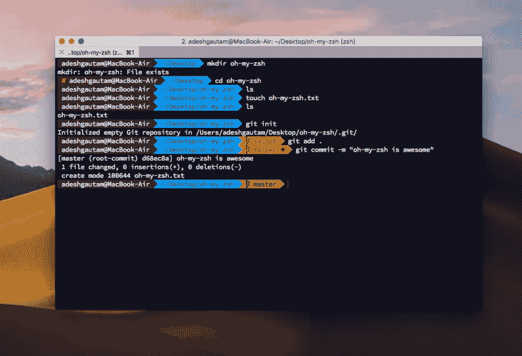
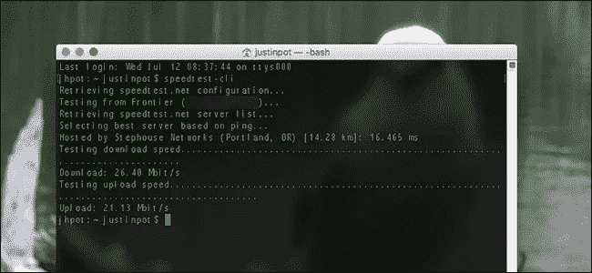
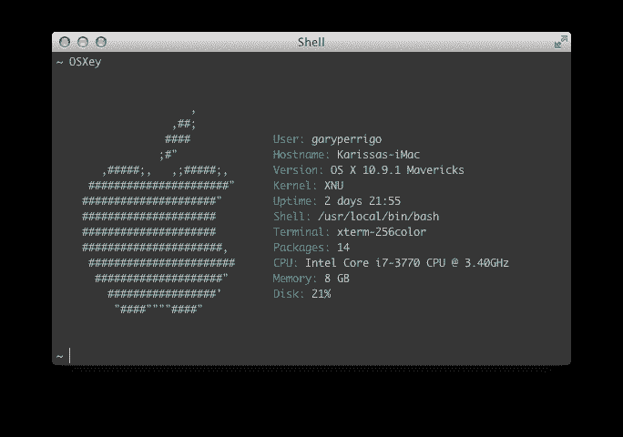
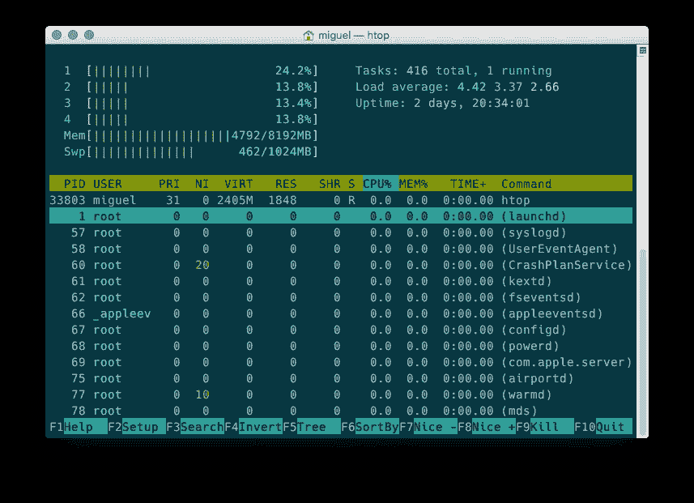
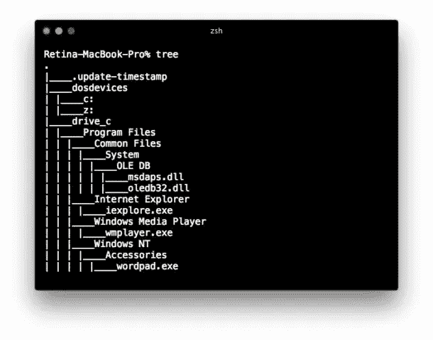
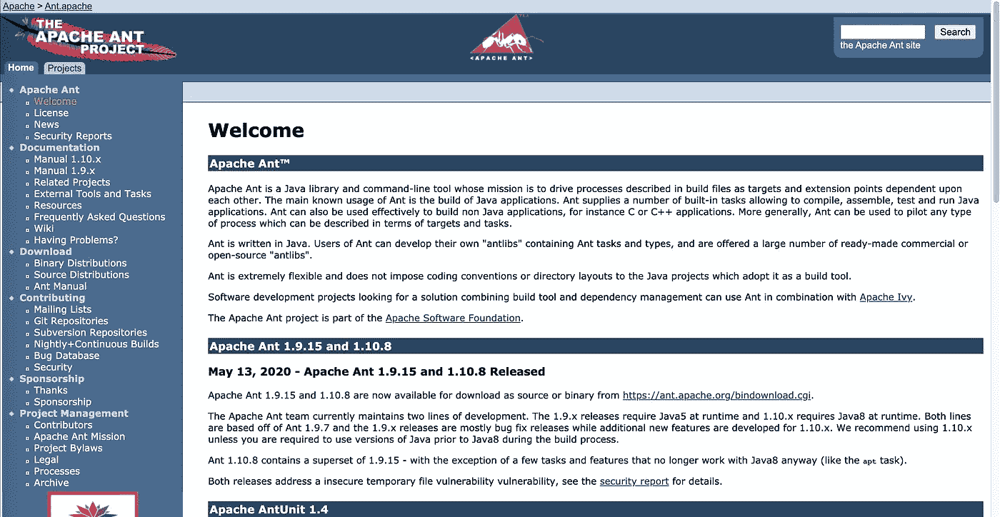
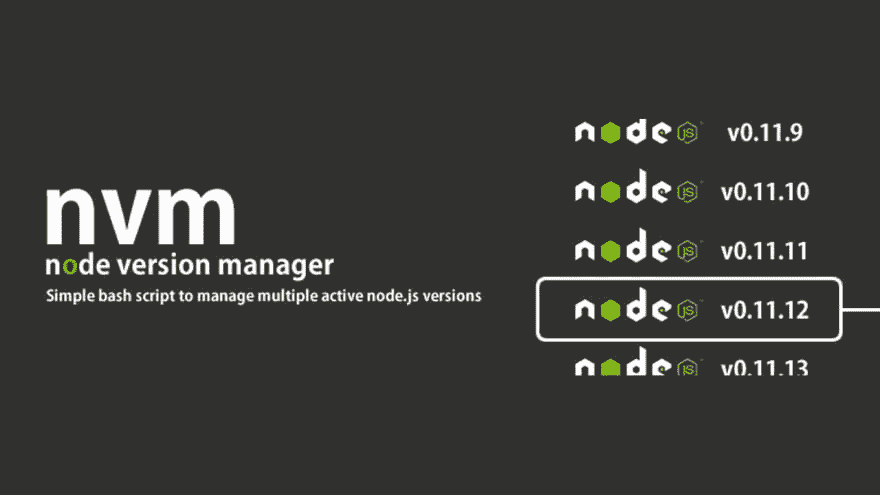
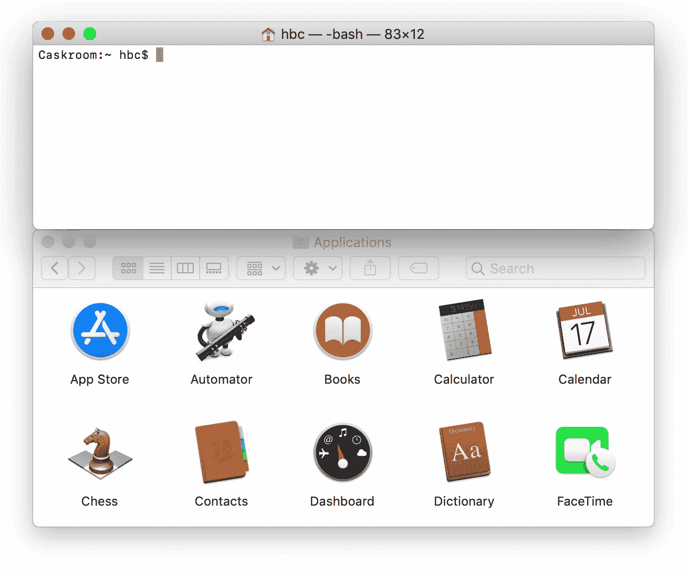

# 你不知道自己需要的 10 大自制工具

> 原文：<https://javascript.plainenglish.io/top-10-homebrew-tools-you-didnt-know-you-needed-in-2020-5007fb2cf561?source=collection_archive---------1----------------------->


# 1.Wget

如果您使用 Linux 或 Mac os，wget 是帮助您从 GitHub 下载任何 repo 的最佳命令行工具。

[https://www.gnu.org/software/wget/](https://www.gnu.org/software/wget/)

```
brew install wget
```


# 2.图像魔术

Imagemagick 具有许多功能，可以轻松地将图像从一种格式转换为另一种格式。对于大图像，它可以非常快速地转换多个线程。

https://imagemagick.org/index.php

```
brew install imagemagick
```


# 3.Zsh

Z shell 可以是一个非常漂亮的 shell，您可以运行任何您想要的命令。它会注意到你是否提交了 git repo。它有一个非常吸引人的颜色亮点，所以它可以帮助你开发你的项目，而不用把你的东西推到 git。

【https://ohmyz.sh/ 

```
brew install zsh
```



# 4.Speedtest-cli

当你读到这个回购的名字时，它会检查你的互联网连接速度，还有更多信息显示互联网速度。

[https://formulae.brew.sh/formula/speedtest-cli](https://formulae.brew.sh/formula/speedtest-cli)

```
brew install speedtest-cli
```



# 5.阿奇

如果你的团队在同一个办公室和同一个网络中一起工作，那么如果你想把 localhost:3000 共享给你的团队，而没有他来运行应用程序，该怎么办？当然，archey 提供了你电脑的 IP 地址和信息，它可以帮助你们在同一个办公室里分享应用程序。

[https://obihann.github.io/archey-osx/](https://obihann.github.io/archey-osx/)

```
brew install archey
```



# 6.Htop

这是一个命令行版本的活动监视器，top 提供了非常丰富的关于你想要的信息和大量关于你的计算机上运行的进程的有用信息。导航和简单选择流程要容易得多。

[https://hisham.hm/htop/](https://hisham.hm/htop/)

```
brew install htop
```



# 7.树

在 mac os 的默认情况下，它不显示文件夹中的树结构文件。因此，如果你想检查文件夹结构，一个树命令将非常迅速地挽救你的生命。

[http://mama.indstate.edu/users/ice/tree/](http://mama.indstate.edu/users/ice/tree/)

```
brew install tree
```



# 8.蚂蚁

Apache Ant 是一个 Java 库和命令行工具，其任务是将构建文件中描述的过程驱动为相互依赖的目标和扩展点。Ant 的主要已知用途是构建 Java 应用程序。Ant 提供了许多内置任务，允许编译、汇编、测试和运行 Java 应用程序。—阿帕奇蚂蚁

[https://ant.apache.org/](https://ant.apache.org/)

```
brew install ant
```



# 9.NVM

NVM —节点版本管理器，对于那些喜欢在环境中切换不同节点的开发人员来说，NVM 命令非常容易帮助您在不同节点版本之间切换工具。更多关于: [nvm](https://github.com/nvm-sh/nvm)

https://formulae.brew.sh/formula/nvm

```
brew install nvm
```



# 10.桶

这个木桶将它的优雅、简单和快速带到 GUI macOS 应用程序的安装和管理中。

【https://formulae.brew.sh/cask/ 

```
brew install cask
```



# 了解更多信息

[](https://medium.com/datadriveninvestor/top-10-trending-plugins-you-didnt-know-it-comes-with-macports-3a25558a4a9a) [## 你不知道自己在 2020 年需要的十大 MacPorts 工具

### 对于大多数在用麦金塔操作系统的用户来说，他们了解自制程序。但是，有一个非常方便的工具调用…

medium.com](https://medium.com/datadriveninvestor/top-10-trending-plugins-you-didnt-know-it-comes-with-macports-3a25558a4a9a) [](https://medium.com/javascript-in-plain-english/top-10-tips-to-be-a-professional-javascript-developer-in-3-minutes-117192b8bb9b) [## JavaScript 开发人员的 10 大快速技巧

### 我们在编程中更经常听到“数据绑定”这个词。“数据绑定”的关键是监控…

medium.com](https://medium.com/javascript-in-plain-english/top-10-tips-to-be-a-professional-javascript-developer-in-3-minutes-117192b8bb9b) [](https://medium.com/@.jay/top-10-chrome-extensions-every-developer-likes-a1a3633b85e9) [## 每个开发者都喜欢的十大 Chrome 扩展

### 每个开发者都喜欢的十大 Chrome 扩展

Likesmedium.com 十大 Chrome 扩展](https://medium.com/@.jay/top-10-chrome-extensions-every-developer-likes-a1a3633b85e9)