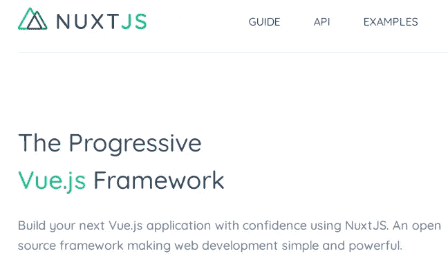
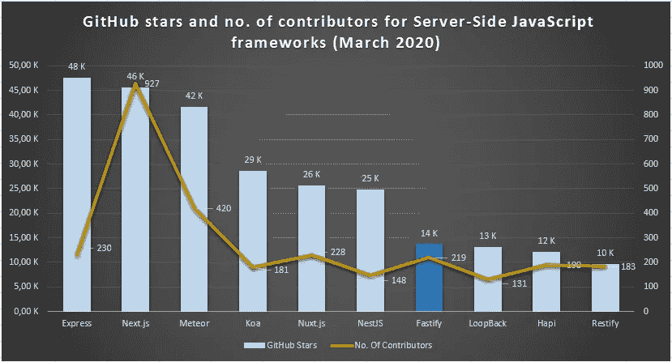

# 2020 年服务器端开发的十大 JavaScript 框架

> 原文：<https://javascript.plainenglish.io/top-10-javascript-frameworks-for-server-side-development-in-2020-6d265016c02?source=collection_archive---------1----------------------->

## 最基本的后端 JavaScript 框架的精选列表


Photo by [Fotis Fotopoulos](https://unsplash.com/@ffstop?utm_source=unsplash&utm_medium=referral&utm_content=creditCopyText) on [Unsplash](https://unsplash.com/s/photos/coding?utm_source=unsplash&utm_medium=referral&utm_content=creditCopyText)

在第一次浏览器大战期间，**布伦丹·艾希**创造了 JavaScript 作为脚本语言来操纵**网景**浏览器的 DOM。当时，JavaScript 主要用于 Web 前端开发。

> JavaScript 作为服务器端编程语言的真正突破出现在 **2009 年**。一位非常年轻的软件工程师 **Ryan Dahl** ，使用 **Chrome 的 JavaScript runtime V8** 和 C++库创建了服务器端 JavaScript runtime**node . js**。由于其**事件循环和异步特性**，Node.js 特别适合事件驱动、I/O 繁重的应用程序(如 Web 应用程序、IoT)。

在过去的十年中，Node.js 获得了飞速的发展。Node.js 的成功和流行使 Javascript 成为客户端和服务器端 Web 的“通用语言”。今天，JavaScript 是最流行的服务器端编程语言之一。

缺点是有太多的 JavaScript 框架，下图完美地总结了这一点:


Source: [Devrant](https://img.devrant.com/devrant/rant/r_1998678_CNhKB.jpg)

如果要开发一个基于 JavaScript 的后端应用，那么应该选择哪个框架呢？在这里，我根据以下标准列出了 10 个最好的服务器端 JavaScript 框架:

*   基于可靠的网站非常受欢迎( [GitHub](http://github.com/) ，JavaScript 的状态， [NPM 趋势](https://www.npmtrends.com/))。
*   主流和既定的。
*   它们在行业中被广泛采用。
*   成熟。

同样，对于每个框架，我都给出了**安装指南**和示例“Hello World”应用程序。

# 表达


Source: [expressjs](https://expressjs.com/)

Express 是基于 Node.js 的最知名的 Web 应用程序框架，也是总体上使用最多的 Web 应用程序框架之一。主要用于开发 Web 应用和 REST API。原作者 **TJ Holowaychuk** 受极简主义框架[**Sinatra**](http://sinatrarb.com/)**的启发，创作了 Express 作为极简主义框架。**

**它速度很快，不那么固执己见。Express 也是一个“其他框架的框架”。许多其他框架都是基于 Express 构建的。**

## **5 个关键特征**

*   **Express 是事实上的标准 JavaScript 服务器端框架。**
*   **Express 是一个完整的应用框架，包括中间件、路由、模板等。**
*   **Express 支持 MVC 模式，View 系统支持 14 个以上的模板引擎。**
*   **Express 还提供强大的路由功能。**
*   **Express 还支持内容协商。**

## **装置**

**安装 Express 很简单。一旦安装了 Node.js，就可以用下面的命令安装 express:**

```
npm install express --save
```

## **Hello World 应用示例**

**下面是一个使用 Express 的 Hello world 应用程序示例:**

```
const express = require('express')
const app = express()
const port = 3000app.get('/', (req, res) => res.send('Hello World!'))app.listen(port, () => console.log(`Example app listening on port ${port}!`))
```

**这个应用程序启动一个服务器并在端口 3000 上监听连接。该应用程序会回复“你好，世界！”对于根 URL ( `/`)或*路由*的请求。对于每个其他路径，它将返回一个未找到的**404**。**

## **流行**

**Express 是最流行和最广泛采用的 JavaScript 服务器端框架。根据 GitHub stars 的说法，它是最流行的 JavaScript 后端框架:**

****

**Source: [GitHub](https://github.com/)**

**根据“JavaScript 现状”调查，它是连续三年(2017、2018、2019)排名第一的 JavaScript 服务器端框架:**

****

**Source: [The State of JavaScript, 2019](https://2019.stateofjs.com/back-end/)**

**StackOverflow 开发者调查将 Express 列为 2019 年第五大最受欢迎的 Web 框架和最受欢迎的 JavaScript 后端框架:**

****

**Source: [StackOverflow Developer Survey, 2019](https://insights.stackoverflow.com/survey/2019#most-popular-technologies)**

**从 NPM 趋势可以明显看出 Express 的流行和使用，因为它使所有其他 JavaScript 服务器端框架相形见绌:**

****

**Source: [NPM trends](https://www.npmtrends.com/)**

# **Next.js**

****

**Source: [nextjs](https://nextjs.org/)**

**来自脸书的前端库 **React** 是最流行的 Web 前端库。React 是非个人化的，不提供端到端的框架。来自荷兰软件公司 **Zeit** (由**Tim neut kens**领导)的一组工程师在 React 和 Node.js 的基础上创建了 Next.js 作为一个**端到端的高级 Web 框架。Next.js 为 Web、桌面和移动设备提供了服务器呈现的和静态的网站。****

## **5 个主要特点:**

*   **Next.js 建立在最流行的、久经沙场的 Web 前端库 React 之上。**
*   **Next.js 通过出色的 SEO 支持和快速启动提供了同类最佳的服务器端渲染。**
*   **像 React 一样，它也提供“一次构建，随处运行”，即 Next.js 可以在 Web、移动和桌面上运行。**
*   **Next.js 还提供自动代码分割和基于文件系统的路由。**
*   **它还支持易于使用的数据获取和内置的 CSS 支持。**

## **装置**

**Next.js 需要 Node.js 版本 10 或更高版本。安装 Node.js 10 或更高版本后，可以使用以下命令安装 Next.js**

```
npm install next react react-dom --save
```

**现在，打开 **package.json** 并添加以下脚本:**

```
"scripts": {
  "dev": "next",
  "build": "next build",
  "start": "next start"
}
```

## **Hello World 应用示例**

**Next.js 安装完成后，在项目中创建“pages”目录，并创建包含以下内容的“*pages/index . js”*文件:**

```
function HomePage() {
  return <div>Hello World!</div>
}export default HomePage
```

**要开发您的应用程序，请运行`npm run dev`。它将在`[http://localhost:3000](http://localhost:3000.)`T20 上启动开发服务器。**

**访问`http://localhost:3000`查看您的申请。**

## **流行**

**按照 GitHub stars 的说法，Next.js 是第二流行的框架。它也拥有最多的贡献者，如下所示:**

****

**Source: [GitHub](https://github.com/)**

**JavaScript State 调查连续两年(2018、2019)将 Next.js 评为第二满意的 JavaScript 后端框架:**

****

**Source: [The State of JavaScript, 2019](https://2019.stateofjs.com/back-end/)**

**根据 NPM 趋势，它是下载量第三多的 JavaScript 后端框架，并且有上升趋势:**

****

**Source: [NPM trends](https://www.npmtrends.com/)**

# **流星**

****

**Source: Meteor**

****Meteor** 是一个全栈 JavaScript 框架，用于为 web/移动/桌面平台构建**端到端(前端到后端)应用。它是一个“包含电池”的框架，为生产级应用程序开发提供开箱即用的支持。****

## **5 个关键特征**

*   **Meteor 是一个开发完整堆栈的框架:前端到后端。**
*   **对于前端开发，它有自己的模板引擎。但 Meteor 也可以用于其他流行的前端框架，如 Angular/React。**
*   **它是一个跨平台的框架，可以为 Web、移动和桌面开发应用程序。**
*   **Meteor 集成了 JavaScript 栈，这使得集成不同的技术(例如，MongoDB 数据库、React 前端)变得非常容易。**
*   **它是一个同构平台，在客户端和服务器端共享相同的 API。**

## **装置**

**在 Linux/OSX 机器上，在您的终端中运行以下命令来安装最新的官方 Meteor 版本:**

```
curl [https://install.meteor.com/](https://install.meteor.com/) | sh
```

**在 Windows 机器上，首先安装 [Chocolatey](https://chocolatey.org/install) 。然后使用管理员命令提示符运行此命令:**

```
choco install meteor
```

## **Todo 应用程序示例**

**一旦安装了 Meteor，打开您的终端并运行以下命令:**

```
meteor create simple-todos
```

**该命令将创建一个名为`simple-todos`的新文件夹，其中包含一个 Meteor 应用程序需要的所有文件:**

```
client/main.js        # a JavaScript entry point loaded on the client
client/main.html      # an HTML file that defines view templates
client/main.css       # a CSS file to define your app's styles
server/main.js        # a JavaScript entry point loaded on the server
test/main.js          # a JavaScript entry point when running tests
package.json          # a control file for installing npm packages
package-lock.json     # describes the npm dependency tree
node_modules/         # packages installed by npm
.meteor/              # internal Meteor files
.gitignore            # a control file for git
```

**要运行新创建的应用程序:**

```
cd simple-todos
meteor
```

**打开网络浏览器，进入`http://localhost:3000`查看应用程序的运行情况。**

## **流行**

**据 GitHub 称，它是第三大流行的服务器端 JavaScript 框架:**

****

**Source: [GitHub](https://github.com/)**

**根据“JavaScript 的现状”, Meteor 排名第七，在过去几年里它的受欢迎程度逐渐下降:**

****

**Source: [The State of JavaScript, 2019](https://2019.stateofjs.com/back-end/)**

# **寇阿相思树**

****

**Source: [koajs](https://koajs.com/)**

**Express.js 的核心团队成员( **TJ Holowaychuk，Jonathan Richard Ong** )创建了 **Koa** 作为 Web 应用程序和 API 的轻量级、现代化、富于表现力和健壮的中间件框架。Koa 是非常模块化的，只有很小的核心，没有中间件。然而，中间件可以作为独立的模块使用。**

## **5 个主要特点:**

*   **Koa 有一个轻量级的、更小的核心，它不包括任何中间件包。**
*   **Koa 是模块化的，提供可插拔的中间件模块。**
*   **Koa 以类似堆栈的方式支持级联中间件，这允许在下游执行操作，在上游操纵响应。**
*   **Koa 使用 async/await 代替回调，ES 2015、ES 2017 特性产生更干净、更有表现力的代码，具有更好的错误处理能力。**
*   **与 Express.js 相比，Koa 的性能稍好一些。**

## **装置**

**Koa 要求**节点 v7.6.0** 或更高版本支持 ES2015 和异步功能。您可以使用自己喜欢的版本管理器快速安装受支持的 Node.js 版本:**

```
nvm install 7
npm install koa
node my-koa-app.js
```

## **Hello World 应用示例**

**下面是一个使用 Koa 的 Hello world 应用程序示例:**

```
const Koa = require('koa');
const app = new Koa();app.use(async ctx => {
  ctx.body = 'Hello World';
});app.listen(3000);
```

**这个应用程序启动一个服务器并在端口 3000 上监听连接。该应用程序会回复“你好，世界！”对于根 URL ( `/`)或*路由*的请求。对于每条其他路径，它将返回一个未找到的**404**。**

## **流行**

**虽然相对较新，但 Koa 已经变得非常受欢迎。GitHub 将 Koa 列为第四大流行框架。此外，它还是 GitHub 中排名最高的 Node.js 中间件框架:**

****

**Source: [GitHub](https://github.com/)**

**著名的“JavaScript 现状”调查将 Koa 列为最令人满意的 JavaScript 后端框架的第五名:**

****

**Source: [The State of JavaScript, 2019](https://2019.stateofjs.com/back-end/)**

**根据 NPM 趋势，它是继 Express.js 之后下载量第二大的服务器端框架:**

****

**Source: [NPM trends](https://www.npmtrends.com/)**

# **Nuxt.js**

****

**Source: [nuxtjs](https://nuxtjs.org/)**

**当时的谷歌工程师尤雨溪创造了一个对初学者友好、简单而强大的 JavaScript 前端框架 **Vue.js** 。随着时间的推移，Vue.js 已经发展成为两个最流行的 Web 框架之一。虽然 Vue.js 比 React 更固执己见，但它仍然不支持 Angular 或 Ember 这样的开箱即用功能。**

**由 **Alexandre Chopin** 和 **Sebastien Chopin** 领导的一组软件工程师在 Vue.js 和 Node.js 之上创建了 **Nuxt.js** 作为一个**更高层次的端到端 Web 应用程序框架**，使用 Nuxt.js 可以开发通用的应用程序，即服务器端呈现的应用程序和静态网页。因此，Nuxt.js 结合了服务器端渲染应用程序的所有优势(例如，SEO 友好，启动更快)和 Vue.js 反应组件模型的所有优势。**

## **5 个关键特征**

*   **Nuxt.js 建立在非常流行和强大的开源 Web 前端框架 Vue.js 之上。**
*   **js 提供了服务器端渲染，具有出色的 SEO 支持和快速启动。**
*   **它还提供了一个“开箱即用”的解决方案，如 Angular/Ember，具有标准的目录结构、配置和库。**
*   **js 是高度模块化的，有 50 个标准模块，几乎支持 Web 应用程序开发所需的一切。**
*   **它还支持自动代码分割(预先呈现的页面)。**

## **装置**

**一旦安装了 Node.js，就可以用一个命令安装 Nuxt:**

```
npm install --save nuxt
```

## **Hello World 应用示例**

**Nuxt 提供了搭建工具' *create-nuxt-app'* 来快速设置和生成 Nuxt App 的代码:**

```
npx create-nuxt-app hello-world-app
```

**然后，它会询问选项(例如 Express 或 Koa)并生成代码，包括所有必要的依赖项。**

**手动创建项目也很容易。安装 nuxt 后，在 packag.json 文件中添加以下脚本:**

```
{
  "name": "hello-world-app",
  "scripts": {
    "dev": "nuxt"
  }
}
```

**创建一个“pages”目录，并创建一个 vue 文件' *pages/index.vue'* ，内容如下:**

```
<template>
  <h1>Hello world!</h1>
</template>
```

**使用以下命令启动项目:**

```
npm run dev
```

**该命令启动`[http://localhost:3000](http://localhost:3000.)` [上的开发服务器。](http://localhost:3000.)**

**现在，如果你访问`[http://localhost:3000,](http://localhost:3000,) then you can see your application showing "Hello World!".`**

## **流行**

**根据 GitHub stars，Nuxt.js 排名第五，如下图所示:**

****

**Source: [GitHub](https://github.com/)**

**近年来，Nuxt.js 获得了很多关注。JavaScript State 调查将 Nuxt.js 列为 2019 年第三大最受欢迎的后端 JavaScript 框架:**

****

**Source: [The State of JavaScript, 2019](https://2019.stateofjs.com/back-end/)**

**根据 NPM 下载量，Nuxt.js 排名第 6，如下图:**

****

**Source: [NPM trends](https://www.npmtrends.com/)**

# **NestJS**

****

**Source: [nestjs](https://nestjs.com/)**

**Angular 是另一个流行的前端 web 框架，它提供了一个自以为是的、开箱即用的端到端框架。波兰软件工程师 Kamil Mysliwiec 受到 Angular 的启发，创建了一个渐进的端到端服务器端框架。像 Angular 一样，Nest 也非常注重常规而非配置，并作为一个端到端框架工作。**

## **5 个关键特征**

*   **Nest 遵循与 Angular 类似的架构。它为几乎不需要配置的企业级应用程序提供了“开箱即用”的解决方案。**
*   **它同样支持 TypeScript 和普通 JavaScript。**
*   **它提供了一个 CLI 工具，这是用于搭建和代码生成的服务器端框架中最好的。**
*   **它建立在 TypeScript 和现代 JavaScript (ES6+)之上。它结合了 OOP(面向对象编程)、FP(函数式编程)和 FRP(函数式反应编程)的元素。**
*   **由于其模块化架构，它是可扩展的，可用于不同的场景，特别适合微服务架构。**

## **装置**

**Nest 自带命令行界面(CLI)工具，是同类产品中最好的 CLI。Nest CLI 提供了代码搭建，只需一个命令就可以创建具有正确结构和依赖关系的新项目。安装 Node.js 后，可以使用以下命令安装 Nest CLI:**

```
npm install -g @nestjs/cli
```

## **Hello World 应用示例**

**使用 Nest CLI，您可以使用以下命令创建新的应用程序:**

```
nest new hello-world-app
```

**它将用所有必要的源代码和结构搭建一个 hello world 应用程序。您可以使用以下命令启动项目:**

```
npm run start:dev
```

**在你的浏览器中，打开 [http://localhost:3000](http://localhost:3000) 看到一个新的应用程序正在运行并显示“Hello World！”。当您更改任何源文件时，该应用程序将自动重新编译和重新加载。**

## **流行**

**Nest 只有三年历史，但已经在 GitHub stars 上排名第六:**

****

**Source: [GitHub](https://github.com/)**

**此外，根据 NPM 下载，它排名第四，如下所示:**

****

**Source: [NPM trends](https://www.npmtrends.com/)**

# **Fastify**

****

**Source: [fastify](https://www.fastify.io/)**

**Fastify 是一个极简的服务器端 Web 框架，非常注重开发者体验和应用性能。它的灵感来自 Express.js 和哈比神。**

## **5 个关键特征**

*   **它是**最快的**服务器端框架之一。根据基准测试，与 Express、哈比神、Koa、Restify 相比，它每秒可以处理更多的请求。**
*   **由于其健壮的插件架构，fastify 很容易扩展。**
*   **它也是少数几个支持 JavaScript 和 TypeScript 的框架之一。**
*   **Fastify 有一个 CLI 工具，可以通过代码生成和搭建来轻松启动。**
*   **Fastify 以其极简和富于表现力的开发方式提供了优秀的开发者体验。**

## **装置**

**和 NestJS 一样，fastify 也提供了代码生成和搭建的 CLI。首先，使用以下命令安装 fastify-cli:**

```
npm i -g fastify-cli
```

## **Hello World 应用示例**

**一旦安装了 fastify-cli，就可以使用以下命令搭建一个新项目:**

```
fastify generate hello-world-app
```

**然后将以下几行添加到`package.json`:**

```
{
  "scripts": {
    "start": "fastify start server.js"
  }
}
```

**并创建服务器文件:**

```
// server.js
'use strict'module.exports = async function (fastify, opts) {
  fastify.get('/', async (request, reply) => {
    return { hello: 'world' }
  })
}
```

**然后使用以下命令运行服务器:**

```
npm start
```

## **流行**

**根据 GitHub stars，它是第七大最受欢迎的后端框架:**

****

**Source: [GitHub](https://github.com/)**

**如果我们考虑 NPM 下载量，那么 fastify 排名第 9:**

****

**Source: [NPM trends](https://www.npmtrends.com/)**

# **回路**

****

**Source: [loopback](https://loopback.io/)**

**StrongLoop 公司已经创建了 **LoopBack** 作为开源的、高度可扩展的服务器端 Node.js 框架。LoopBack 特别适合构建 API 和微服务。**

## **5 个关键特征**

*   **特别适合微服务架构的重量级框架。**
*   **LoopBack 提供 OpenAPI 规范驱动的 REST API 请求/响应创建。**
*   **它建立在 TypeScript 之上，提供了依赖注入、组件、混合等高级特性。**
*   **它对 GraphQL 有极好的支持，可以为任何 REST API 创建 GraphQL。**
*   **LoopBack 通过富有表现力、模块化、干净的代码提供了出色的开发人员体验。**

## **装置**

**安装 Node.js 是安装 LoopBack 的先决条件。LoopBack 还提供了一个 CLI 来实现更快更简单的启动。首先，使用以下命令安装 LoopBack:**

```
npm install -g loopback-cli
```

## **Hello World 应用示例**

**使用 LoopBack CLI，创建示例应用程序只需一个命令:**

```
lb
? What's the name of your application? hello-world
? Enter name of the directory to contain the project: hello-world? Which version of LoopBack would you like to use? 3.x (Active Long Term Support)
? What kind of application do you have in mind? hello-world (A project containing a controller,
including a single vanilla Message and a single remote method)
...
I'm all done. Running npm install for you to install the required dependencies.
If this fails, try running the command yourself.
...
```

**您可以使用以下命令启动该应用程序:**

```
npm start
```

**在您的浏览器中，打开 [http://localhost:3000](http://localhost:3000) 查看一个正在运行的新应用程序，并显示一些运行时信息(例如，开始时间)**

## **流行**

**根据 GitHub 的说法，它是排名第八的后端 JavaScript 框架:**

****

**Source: [GitHub](https://github.com/)**

**NPM 趋势也显示了回送的稳定下载量:**

****

**Source: [NPM trends](https://www.npmtrends.com/)**

# **哈比神**

****

**Source: [hapi](https://hapi.dev/)**

****哈比神**是最早的 Node.js 框架之一。沃尔玛软件工程师 Eran Hammer 创建了 hapi 来处理沃尔玛黑色星期五的伸缩问题。哈比神还提供开箱即用的企业级框架，特别适合功能强大和可扩展的应用程序。**

## **5 个关键特征**

*   **端到端的企业级框架，以最小的开销提供开箱即用的功能。**
*   **哈比神提供集成的身份验证和授权，这是 Node.js 框架中最好的。**
*   **它有模块化的架构和庞大的官方插件生态系统。因此，它很容易以安全的方式进行扩展。**
*   **哈比神提供顶级的开发者体验，特别关注代码的可读性和表现力。**
*   **它不支持任何中间件。相反，哈比神通过插件提供可扩展性模型，将安全性和可预测性放在首位。**

## **装置**

**一旦安装了 Node.js，就可以用下面的命令安装 hapi:**

```
npm install @hapi/hapi --save
```

## **Hello World 应用示例**

**使用“npm init”命令初始化项目。在 index.js 文件中，添加以下几行:**

```
'use strict';const Hapi = require('[@hapi/hapi](http://twitter.com/hapi/hapi)');const init = async () => {const server = Hapi.server({
        port: 3000,
        host: 'localhost'
    });server.route({
        method: 'GET',
        path: '/',
        handler: (request, h) => {return 'Hello World!';
        }
    });await server.start();
    console.log('Server running on %s', server.info.uri);
};process.on('unhandledRejection', (err) => {console.log(err);
    process.exit(1);
});init();
```

**用命令`node index.js`启动服务器。现在，如果你在浏览器中访问，你会看到文本“你好，世界！”。**

## **流行**

**根据 GitHub 星级评定，哈比神是第九大星级服务器端 Web 框架:**

****

**Source: [GitHub](https://github.com/)**

**如果我们考虑 NPM 的下载量，那么哈比神排名第五:**

****

**Source: [NPM trends](https://www.npmtrends.com/)**

# **重新定义**

****

**Source: [restify](http://restify.com/)**

****Restify** 是最古老的 Node.js 框架之一。它是一个服务器端框架，特别关注高度可伸缩的 REST API 服务。它被一些最大的网络公司使用，如网飞，Pinterest，NPM。**

## **5 个关键特征**

*   **Restify 是一个关注 API 和微服务开发的极简框架。**
*   **它对 Dtrace 有一流的支持，因为它自动为每个路由/处理程序创建 Dtrace 探测。**
*   **它对 Json 客户机、HTTP 客户机和 String 客户机都有现成的客户机支持。**
*   **Restify 还支持 Sinatra 风格的句柄链接。**
*   **它支持基于 [semver](https://semver.org/) 的语义 API 版本控制。**

## **装置**

**您可以使用以下命令安装 restify:**

```
npm install restify --save
```

## **Hello World 应用示例**

**现在用“npm init”命令初始化一个项目。在 index.js 文件中，添加以下几行:**

```
var restify = require('restify');const server = restify.createServer({name: 'myapp',version: '1.0.0'});server.use(restify.plugins.acceptParser(server.acceptable));server.use(restify.plugins.queryParser());server.use(restify.plugins.bodyParser());server.get('/echo/:name', function (req, res, next) {res.send(req.params);return next();});server.listen(8080, function () {console.log('%s listening at %s', server.name, server.url);});
```

**现在，点击下面将打印“hello world”:**

```
curl -is http://localhost:8080/hello/world -H 'accept: text/plain'
```

## **流行**

**由于它只提供 API，Restify 不像其他框架那样受欢迎，在 GitHub stars 中排名第十:**

****

**Source: [GitHub](https://github.com/)**

**然而，根据 NPM 的下载量，它排在第 8 位:**

****

**Source: [NPM trends](https://www.npmtrends.com/)**

# **类似文章:**

**[](https://medium.com/javascript-in-plain-english/top-10-most-popular-javascript-libraries-to-use-in-2021-5da60f187992) [## 2021 年十大最受欢迎的 JavaScript 库

### 最受欢迎的 JavaScript 库的精选列表，可以提高您的工作效率

medium.com](https://medium.com/javascript-in-plain-english/top-10-most-popular-javascript-libraries-to-use-in-2021-5da60f187992) [](https://medium.com/javascript-in-plain-english/top-5-in-demand-javascript-frameworks-for-front-end-development-in-2020-a59c4340d082) [## 2020 年前端开发的五大热门 JavaScript 框架

### 对现代 JavaScript 前端开发的顶级 JavaScript 框架进行深入分析和排名

medium.com](https://medium.com/javascript-in-plain-english/top-5-in-demand-javascript-frameworks-for-front-end-development-in-2020-a59c4340d082) [](https://towardsdatascience.com/20-best-vs-code-extensions-for-productive-web-development-in-2020-95bf904ceb69) [## 2020 年高效 Web 开发的 20 个最佳代码扩展

### Visual Studio 代码扩展可以提高您的工作效率，并使编码变得更加有趣

towardsdatascience.com](https://towardsdatascience.com/20-best-vs-code-extensions-for-productive-web-development-in-2020-95bf904ceb69)**