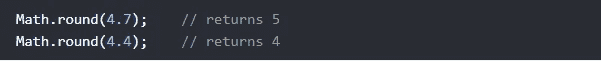
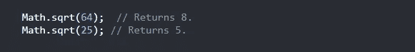
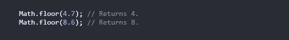
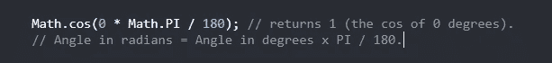

# Math 对象的前 10 个 JavaScript 方法

> 原文：<https://javascript.plainenglish.io/top-10-javascript-methods-of-the-math-object-ac69951386a5?source=collection_archive---------7----------------------->

## 了解 JavaScript 中的数学对象方法

Photo by [Alvaro Reyes](https://unsplash.com/@alvarordesign?utm_source=medium&utm_medium=referral) on [Unsplash](https://unsplash.com?utm_source=medium&utm_medium=referral)

# 介绍

**JavaScript 中的数学对象**允许我们对数字执行数学任务。它有数学常数和函数的属性和方法。它不是一个函数对象。所以在今天的文章中，我决定向您展示 JavaScript 中数学对象的一些有用方法。

Photo by [Charles Deluvio](https://unsplash.com/@charlesdeluvio?utm_source=medium&utm_medium=referral) on [Unsplash](https://unsplash.com?utm_source=medium&utm_medium=referral)

# 1.Math.min()

**Math.min( )** 方法用于查找参数列表中的最小值。看看下面的例子:

The **Math.min( ).**

# 2.Math.max()

**Math.max( )** 方法用于查找参数列表中的最大值。看看下面的例子:

The **Math.max( ).**

# 3.Math.round()

**Math.round(x)** 方法返回一个数字 **x** 舍入到最接近的整数的值:

The **Math.round( ).**

# 4.Math.sqrt()

**Math.sqrt(x)** 用于返回一个数 x 的平方根。请看下面的例子:

The **Math.sqrt( )**.

# 5.Math.pow()

`**Math.pow(x, y)**`返回 x 的 y 次方值。让我们看看下面的例子:

The **Math.pow( )**.

# 6.Math.floor()

`**Math.floor(x)**` 返回将**向下**舍入到最接近整数的 x 值:

The **Math.floor( )**.

# 7.Math.random()

`**Math.random()**` 返回一个介于 **0** 和 **1** 之间的随机数。它通常用于从数组中提取随机元素。

The **Math.random( )**.

# 8.Math.cos()

**Math.cos(x)** 方法返回以弧度表示的角度 x 的余弦值(介于-1 和 1 之间的值)。如果您想使用度数而不是弧度，您需要将度数转换为弧度。看看下面的例子:

The Math.cos( ).

# 9.Math.sin()

**Math.sin(x)** 方法返回以弧度表示的角度 x 的正弦值(介于-1 和 1 之间的值)。如果您想使用度数而不是弧度，您需要将度数转换为弧度。考虑下面的例子:

The **Math.sin( )**.

# 10.Math.ceil()

`**Math.ceil(x)**`返回将**向上**舍入到最接近整数的 x 值:

The **Math.ceil( ).**

# 结论

JavaScript 中的 math 对象在执行数学任务时有很多有用的方法。这就是为什么当你用 JavaScript 编码时，你需要使用它们。这就是这篇文章，我希望你今天学到了一些新的东西。

喜欢这篇文章吗？如果有，通过 [**订阅解码获得更多类似内容，我们的 YouTube 频道**](https://www.youtube.com/channel/UCtipWUghju290NWcn8jhyAw) **！**