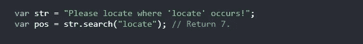
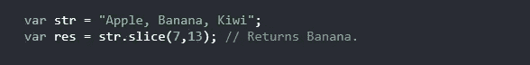
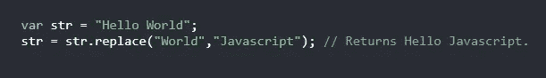
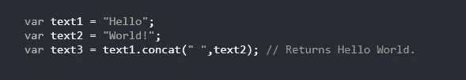
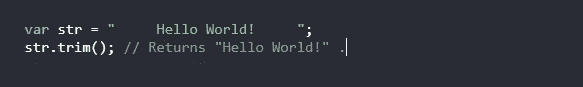
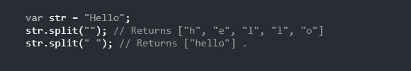
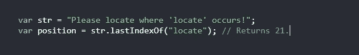
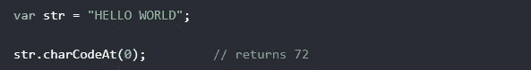

# 您应该知道的 10 大 JavaScript 字符串方法

> 原文：<https://javascript.plainenglish.io/top-10-javascript-string-methods-you-should-know-975a05bca0d6?source=collection_archive---------8----------------------->

## 10 种 JavaScript 字符串方法及实例

Photo by [Arnold Francisca](https://unsplash.com/@clark_fransa?utm_source=medium&utm_medium=referral) on [Unsplash](https://unsplash.com?utm_source=medium&utm_medium=referral)

# 介绍

JavaScript 中的字符串方法可以帮助你处理字符串，掌握这些方法是一个好主意，因为很多时候你会发现自己在 JavaScript 程序或应用程序中处理字符串，所以你需要了解这些方法。这就是为什么在这篇文章中我决定向你展示 10 个有用的字符串方法，也许你不知道其中的一些。

Photo by [Irvan Smith](https://unsplash.com/@mr_vero?utm_source=medium&utm_medium=referral) on [Unsplash](https://unsplash.com?utm_source=medium&utm_medium=referral)

# 1.字符串长度

属性返回一个字符串的长度。看看下面的例子:

The Length method.

# 2.搜索字符串

您可以使用 search 方法在另一个字符串中搜索一个字符串，它将返回该字符串的位置。看看下面的例子:

The Search method.

# 3.slice()方法

**slice** 方法提取一个字符串的一部分，并在一个新的字符串中返回提取的部分。它接受两个参数:字符串的起始位置和结束位置。看看下面这个例子:

The Slice method.

# 4.替换字符串内容

**replace** 方法将字符串中的特定值替换为另一个值。看看下面的例子:

The Replace method.

# 5.Concat()方法

`**concat()**`方法连接两个或更多的字符串:

The Concat method.

# 6.修剪方法

JavaScript 中的`**trim()**` 去除字符串两边的空格。看看下面的例子:

The trim() method.

# 7.将字符串转换为数组

为了在 JavaScript 中将字符串转换成数组，我们使用了 **split()** 方法。看看下面的例子。

The Split method.

# 8.lastIndexOf()方法

方法`**lastIndexOf()**`返回指定文本在字符串中最后一个**出现的索引:**

The lastIndexOf method.

# 9.charAt()方法

方法`**charAt()**` 返回字符串中指定索引或位置的字符:

The CharAt() method.

# 10.charCodeAt()方法

方法`**charCodeAt()**` 返回字符串中指定索引处字符的 Unicode。让我们看看下面的例子:

The charCodeAt() method.

# 结论

如您所见，JavaScript 中的字符串方法非常有用，了解它们非常重要，因为作为开发人员，您会发现自己经常使用它们。这就是这篇文章，我希望你今天学到了一些新的东西。