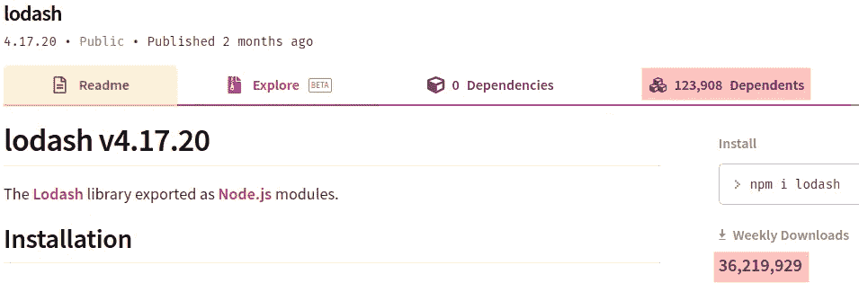
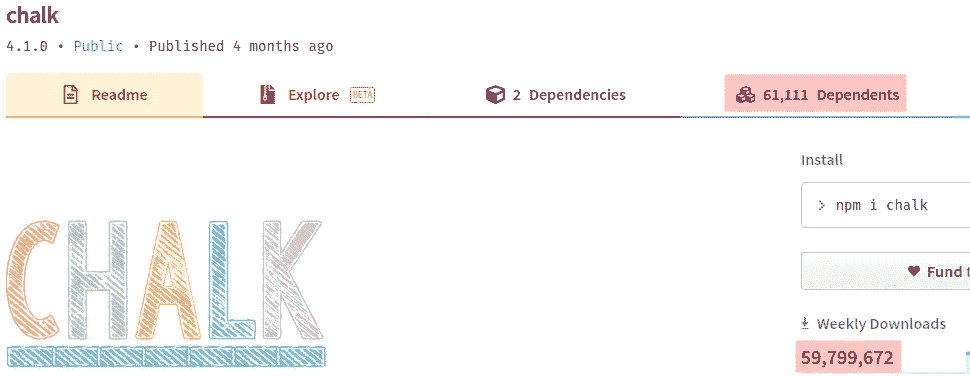
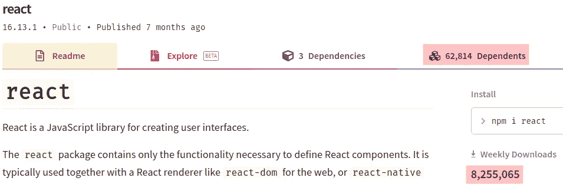
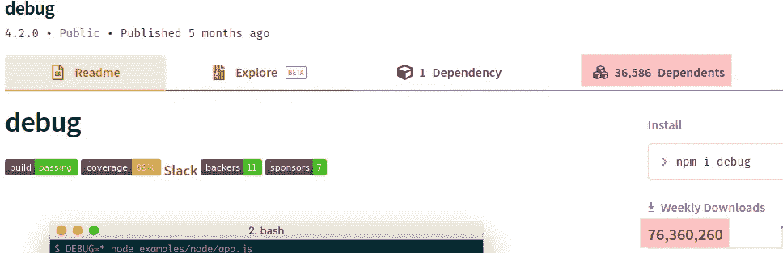
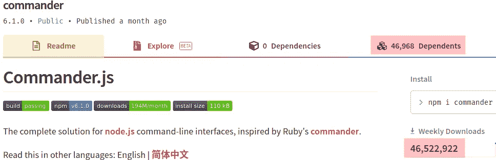
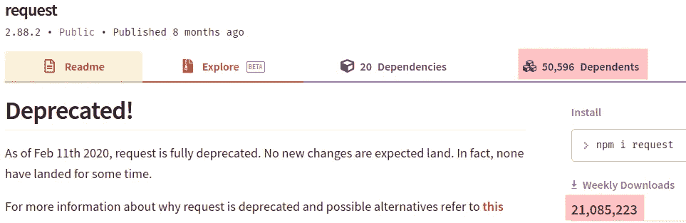
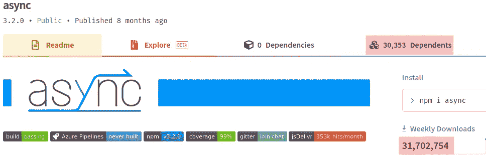
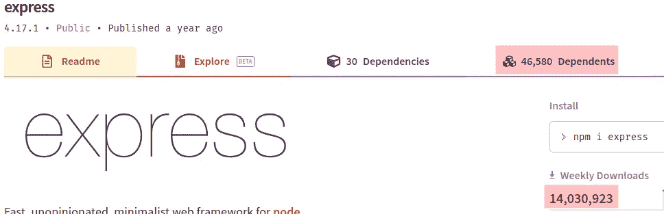
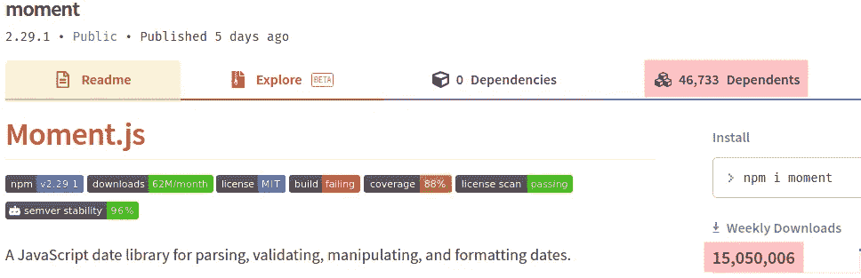
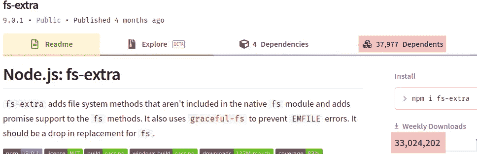

# 2021 年十大最受欢迎的 JavaScript 库

> 原文：<https://javascript.plainenglish.io/top-10-most-popular-javascript-libraries-to-use-in-2021-5da60f187992?source=collection_archive---------0----------------------->

最受欢迎的 JavaScript 库的精选列表，可以提高您的工作效率


Photo by [Nikolay Tarashchenko](https://unsplash.com/@beautyoftechnology?utm_source=unsplash&utm_medium=referral&utm_content=creditCopyText) on [Unsplash](https://unsplash.com/?utm_source=unsplash&utm_medium=referral&utm_content=creditCopyText)

JavaScript 是网络的“通用语言”。它也是世界上第二流行的编程语言，仅次于 Python。

如果目前的趋势继续下去，JavaScript 将很快取代 Python 成为最受欢迎的编程语言。JavaScript 的一个关键特性是它有一个很小的标准库。作为补充，JavaScript 有数百万个库(包)。JavaScript 包管理器 NPM 生态系统是软件开发行业中最受欢迎和最活跃的包管理器生态系统之一。

作为一名 JavaScript 开发人员，您应该很好地了解最重要和最有用的 JavaScript 库，并使用它们，而不是重新发明轮子。最流行的 JavaScript 库有哪些？

这里我列出了基于以下特性的 10 个最流行的 JavaScript 库:

*   下载次数。
*   依赖项目的数量。
*   GitHub 星的数量

请注意，这个列表是关于库的，不是关于框架的。此外，我列出了整个堆栈中的库:前端和后端。

# 1.洛达什

无论您是用 JavaScript 开发前端还是后端应用程序，您都会觉得需要一个通用的实用程序库。Lodash 是目前使用最广泛的普通 JavaScript 实用程序库。它使用函数式编程范例为常见的编程任务提供了实用函数。它建立在流行的 JavaScript 库**下划线. js** 之上。它使 JavaScript 编码更容易、更简洁。

## 主要特征

*   迭代数组、对象和字符串的常用函数。
*   处理和测试数字和值。
*   创建复合函数。
*   高级函数式编程功能。

## 流行

Lodash 拥有 3600 万的周下载量和大约 123.9k 的依赖包，是目前最有影响力和最普及的 JavaScript 库:



Source: [npmjs](https://www.npmjs.com/)

它拥有 46.8k 颗星，也是 GitHub 中最受欢迎的 JavaScript 库之一，在该列表中排名第三:


Source: [GitHub](https://github.com/)

## 装置

```
npm i --save lodash
```

## 环

[](https://github.com/lodash/lodash) [## 洛达什/洛达什

### 一个现代化的 JavaScript 实用程序库，提供模块化、高性能和额外功能。-洛达什/洛达什

github.com](https://github.com/lodash/lodash) 

# 2.白垩

控制台输出是前端和后端开发中最常用的 JavaScript 调试技术之一。如果你想让你的主机变得时髦多彩，JavaScript library Chalk 会非常方便。随着口号“**终端字符串造型做得好**”它有助于造型控制台输出简单而快速。它有一个富有表现力和高性能的 API。

## 主要特征

*   支持 256 色和真彩色。
*   自动检测颜色支持。
*   它干净而专注。
*   它可以嵌套样式。

## 流行

拥有大约 6000 万的周下载量和 61k 的依赖包，chalk 是下载量最大的 JavaScript 库之一:



Source: [npmjs](https://www.npmjs.com/)

拥有 15.2k stars，也是 GitHub 中最受欢迎的 JavaScript 库之一:


Source: [GitHub](https://github.com/)

## 装置

```
npm i --save chalk
```

## 环

[](https://github.com/chalk/chalk) [## 粉笔

### 终端字符串样式完成正确粉笔附带了一个易于使用的可组合的应用编程接口，您只需要链接和嵌套…

github.com](https://github.com/chalk/chalk) 

# 3.反应堆芯

JavaScript 是网络的编程语言。在现代，JavaScript 库和框架在开发前端 Web 应用程序方面处于领先地位。在所有的 JavaScript 库和框架中，有一个库遥遥领先:React Core。这是一个革命性的 JavaScript 库，用于使用单向数据流和基于组件的 UI 开发来构建用户界面。如果你计划用一个现代的 JavaScript 库来实现你的用户界面，你可以用 React。

## 主要特点

*   它是视图层的基于组件的库。
*   它支持单向数据绑定。
*   它提供了前端开发中的功能性编程范例。
*   它可以用来开发网络、桌面、移动用户界面。

## 流行

每周有 800 万次下载，大约有 63.8k 个相关包，是迄今为止最受欢迎和最有影响力的客户端 JavaScript 库:



Source: [npmjs](https://www.npmjs.com/)

拥有 157k 颗星，是整个软件开发行业中最具明星效应的 GitHub 项目之一:


Source: [GitHub](https://github.com/)

## 装置

```
npm i --save react
```

## 环

[](https://reactjs.org/) [## 反应——一个用于构建用户界面的 JavaScript 库

### 反应使创建交互式用户界面变得毫无痛苦。为应用程序中的每个状态设计简单的视图，并做出反应…

reactjs.org](https://reactjs.org/) 

# 4.调试

许多 JavaScript 开发人员使用 **console.log** 来调试 JavaScript 应用程序，尤其是在浏览器中。调试是调试 JavaScript 应用程序的更好选择。这是一个在 Browser 和 Node.js 中调试 JavaScript 应用程序的小型实用程序库。它还允许切换应用程序模块以及整个模块的调试输出

## 主要特点

*   提供控制台的修饰版本。错误。
*   为不同的命名空间分配不同的颜色。
*   支持许多标准格式化程序。
*   调试器是可扩展的。

## 流行

debug 每周下载 7600 万次，有 36.5 千个相关软件包，是此列表中下载最多的库:



Source: [npmjs](https://www.npmjs.com/)

它有 9.1k 颗星，也是 GitHub 中一个流行的 JavaScript 库:


Source: [GitHub](https://github.com/)

## 装置

```
npm i --save debug
```

## 环

[](https://github.com/visionmedia/debug) [## vision media/调试

### 一个模仿 Node.js 核心调试技术的小型 JavaScript 调试实用程序。在 Node.js 和 web 中工作…

github.com](https://github.com/visionmedia/debug) 

# 5.指挥官

命令行界面是后端软件开发中的一个重要功能。受 Ruby 指挥官的启发，Commander.js 是一个为服务器端 JavaScript 提供完整命令行界面解决方案的库。

## 主要特点

*   高级命令行选项。
*   流畅的 API。
*   自动和自定义帮助。
*   自定义事件侦听器。
*   异步支持。

## 流行

每周下载 4600 万次，依赖于 47k 的软件包，指挥官是最流行的 Node.js 库之一:



Source: [npmjs](https://www.npmjs.com/)

它有 18.9k 颗星，也是 GitHub 中最受欢迎的 Node.js 库之一:


Source: [GitHub](https://github.com/)

## 装置

```
npm i --save commander
```

## 环

[](https://github.com/tj/commander.js/) [## TJ/指挥官. js

### node.js 命令行界面的完整解决方案，灵感来自 Ruby 的 commander。用其他语言阅读这篇文章…

github.com](https://github.com/tj/commander.js/) 

# 6.请求

HTTP 是迄今为止商业应用程序开发和现代 Web 开发中使用最多的应用程序协议。如果您正在开发一个前端应用程序，您将需要一个 HTTP 客户端。Request 是 JavaScript 领域中使用最广泛的 HTTP 客户端。它将为您提供最简单的方式来进行 HTTP 调用，并具有许多高级和强大的功能。

## 主要特征

*   它支持流和异步/等待。
*   HTTP 认证。
*   自定义 HTTP 头。
*   OAuth 签名。
*   TLS/SSL 协议支持。

## 流行

request 拥有 2100 万的周下载量和 50.6k 的依赖包，是最依赖 JavaScript 库之一:



Source: [npmjs](https://www.npmjs.com/)

它拥有 24.8k GitHub stars，是 GitHub 中最受欢迎的 JavaScript 项目之一:


Source: [GitHub](https://github.com/)

## 装置

```
npm i --save request
```

## 环

[](https://github.com/request/request) [## 请求/请求

### 截至 2020 年 2 月 11 日，该请求已被完全否决。预计不会出现新的变化。事实上，没有一个人登陆…

github.com](https://github.com/request/request) 

# 7.异步ˌ非同步(asynchronous)

JavaScript 是建立在异步编程范式上的编程语言。作为一名 JavaScript 开发人员，您会觉得需要一个通用的实用程序库来实现异步功能。尽管有许多支持异步功能的库，但我发现异步是其中最好的。这是一个通用的实用程序库，提供了强大的功能来处理异步 JavaScript。

## 主要特征

*   异步集合函数。
*   异步控制流。
*   异步实用程序。
*   同时支持 Node.js 和 Browser。

## 流行

async 是 JavaScript 中最受欢迎的异步实用程序库，拥有 3100 万的周下载量和 30.3k 的依赖包:



Source: [npmjs](https://www.npmjs.com/)

它还拥有 26.8k GitHub stars 和 GitHub 中最受欢迎的 JavaScript 实用程序库之一:


Source: [GitHub](https://github.com/)

## 装置

```
npm i --save async
```

## 环

 [## 主页-文档

### 对于 Async 1.5 . x 文档，转到这里 Async 是一个实用程序模块，它提供了直接、强大的功能…

caolan.github.io](https://caolan.github.io/async/v3/) 

# 8.表达

如果您使用 JavaScript 进行服务器端开发，您可能需要实现一个 HTTP 服务器。Express 是 JavaScript 中最广为人知和使用最多的 HTTP 服务器实现。主要用于开发 Web 应用和 REST API。这是一个极简、快速、不那么固执己见的库。有许多基于 Express 构建的 JavaScript Web 框架。

## 主要特征

*   它提供中间件、路由、模板。
*   它支持内容协商。
*   非常快速和高性能。
*   它有用于重定向、缓存的 HTTP 助手。

## 流行

request 拥有 1400 万的周下载量和 46.6k 的依赖包，是最受欢迎的服务器端 JavaScript 库之一:



Source: [npmjs](https://www.npmjs.com/)

它拥有 50.5k 颗星，是该列表中第二受欢迎的 GitHub 库:


Source: [GitHub](https://github.com/)

## 装置

```
npm i --save express
```

## 环

[](https://github.com/expressjs/express) [## expressjs/express

### 快速、非个人化、极简的节点 web 框架。这是一个 Node.js 模块，可通过 npm 注册表获得…

github.com](https://github.com/expressjs/express) 

# 9.瞬间

作为软件开发人员，我们需要处理日期和时间。一般来说，在 JavaScript 中，尤其是在早期版本中，对日期和时间的支持太少了。JavaScript 中有许多日期/时间库来支持 JavaScript 中的日期和时间。矩是 JavaScript 中最流行的日期和时间库。这个库为在 JavaScript 中处理日期和时间提供了很好的支持。

## 主要特点

*   解析日期和时间。
*   验证日期和时间。
*   格式化日期和时间
*   操纵日期和时间。

## 流行

凭借每周 1500 万次的下载和 46.7k 相关软件包，矩是最受欢迎的 JavaScript 库之一:



Source: [npmjs](https://www.npmjs.com/)

它有 45k 颗星，是这个列表中第四大最受欢迎的 GitHub 库:


Source: [GitHub](https://github.com/)

## 装置

```
npm i --save moment
```

## 环

[](https://github.com/moment/moment) [## 时刻/时刻

### 用 javascript 解析、验证、操作和显示日期。解雇 GitHub 是超过 5000 万开发者的家园…

github.com](https://github.com/moment/moment) 

# 10.fs-额外

如果你使用后端 JavaScript，你必须处理文件系统。不幸的是，Node.js 中提供的文件系统功能很少。Fs-extra 是一个库，它提供了额外的高级方法来处理文件系统。它应该是 Node.js 本机文件系统库 **fs** 的一个替代插件。

## 主要特点

*   高级和附加的文件系统方法。
*   防止出现 EMFILE 错误。
*   fs 的嵌入式替代品。
*   使包括 mkdirp、rimraf、ncp 在内的包变得多余。
*   支持同步、异步和异步/等待。

## 流行

fs-extra 每周下载 3300 万次，依赖于 37.9k 的软件包，是最受欢迎的服务器端 JavaScript 库之一:



Source: [npmjs](https://www.npmjs.com/)

它也是 GitHub 中一个流行的 JavaScript 库:


Source: [GitHub](https://github.com/)

## 装置

```
npm i --save fs-extra
```

## 环

[](https://github.com/jprichardson/node-fs-extra) [## jprichardson/node-fs-extra

### node . js:fs 对象的额外方法，如 copy()、remove()、mkdirs()-jprichardson/node-fs-extra

github.com](https://github.com/jprichardson/node-fs-extra) 

## 进一步阅读

[](https://towardsdatascience.com/top-10-in-demand-web-development-frameworks-in-2021-8a5b668be0d6) [## 2021 年十大按需网络开发框架

### 针对企业和开发人员的顶级 web 开发框架的深入分析和排名

towardsdatascience.com](https://towardsdatascience.com/top-10-in-demand-web-development-frameworks-in-2021-8a5b668be0d6) [](https://medium.com/javascript-in-plain-english/top-10-javascript-frameworks-for-server-side-development-in-2020-6d265016c02) [## 2020 年服务器端开发的十大 JavaScript 框架

### 最重要的后端 JavaScript 框架的精选列表

medium.com](https://medium.com/javascript-in-plain-english/top-10-javascript-frameworks-for-server-side-development-in-2020-6d265016c02) [](https://medium.com/javascript-in-plain-english/top-5-in-demand-javascript-frameworks-for-front-end-development-in-2020-a59c4340d082) [## 2020 年前端开发的五大按需 JavaScript 框架

### 针对现代 JavaScript 前端开发的顶级 JavaScript 框架的深入分析和排名

medium.com](https://medium.com/javascript-in-plain-english/top-5-in-demand-javascript-frameworks-for-front-end-development-in-2020-a59c4340d082)