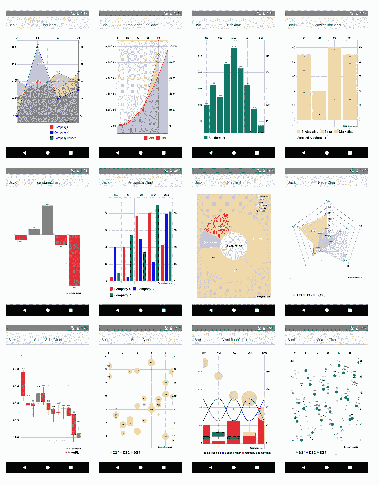
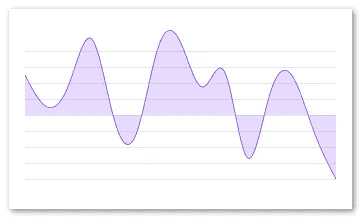
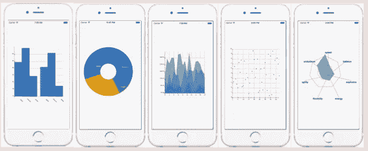
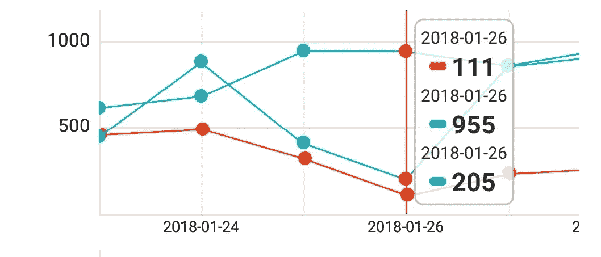
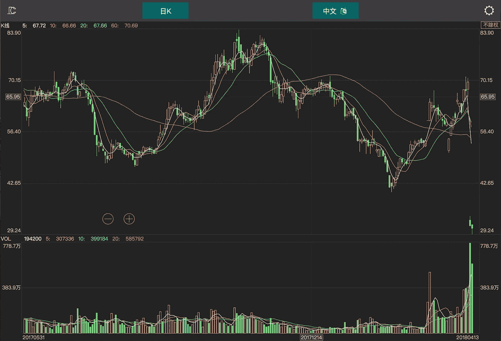
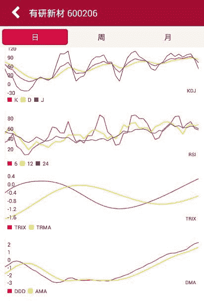
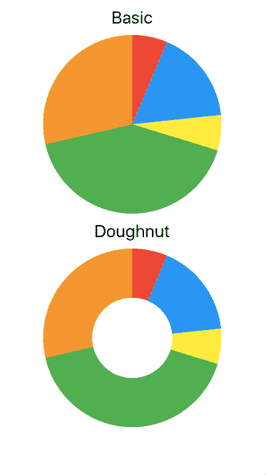
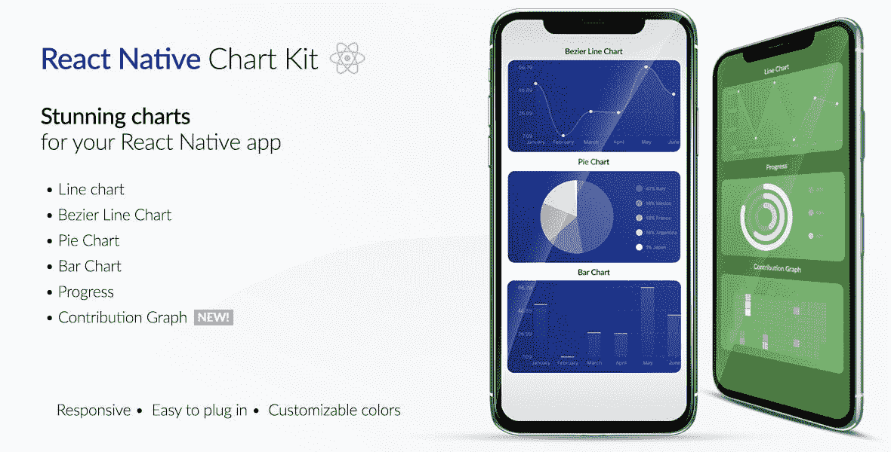

# 2020 年十大 React 原生图表库

> 原文：<https://javascript.plainenglish.io/top-10-react-native-chart-libraries-in-2020-22cfd34dbd76?source=collection_archive---------5----------------------->

## React Native 的 10 个最佳图表库，提供了您想要集成到 React Native 应用程序的图表视图中的所有内容

在我看来，用纯文本或段落来表示统计数据是非常无聊的。你呢？它们变得很难理解和对比。但是，使它们有趣和漂亮的是视觉表现，如图表和图解。

如今，在可视化图表中表示数据的知识已经成为许多设计和开发项目和工作的要求。

移动应用程序和网站按照最佳设计标准，使用各种图形和多媒体图表来补充其统计数据读取和数据表示。因此，为了熟练地解释枯燥的统计数据，人们必须采用正确的视觉图表形式，这样数据才能显得有趣和有对比性。

为此，我们向您展示了 React Native 的 10 个最佳图表库，它们提供了您想要集成到 React Native 应用程序的图表视图中的所有内容:

# [1。react-native-charts-wrapper](https://github.com/wuxudong/react-native-charts-wrapper)

好吧，如果你正在为 React Native 寻找一个很棒的、文档齐全的图表包，那么这就是了。React Native charts 包装库是它在 React Native 中的图表集成方面所调用的。它提供不同类型的最先进的本地图表。就设计而言，图表本身的外观和感觉令人惊叹，但数据和道具的集成也因适当的文档而变得更加容易。它们提供了 8 种图表支持，并有许多配置选项。该库基于 MPAdnroidCharts 和 iOS 图表。基本 MPAndroidChart 库中的大多数可用配置也是通过这个包装器库提供的。

# [2。胜利-原生](https://openbase.io/js/victory-native)

React Native 的另一个高下载量和星级图表库。设置简单易行。这个库包提供了强大的图表组件以及其他主题组件。这个包依赖于 React 本地 SVG 包，它需要单独安装。像 VictoryChart、VictoryTheme、VictoryBar 这样的组件是本页面提供的最先进、最强大、最健壮的组件。数据集成很容易，组件道具也高度可定制。如果你正在寻找强大的图表和其他强大的主题功能，这是一个非常好的软件包。

# [3。react-native-svg-charts](https://openbase.io/js/react-native-svg-charts)

这是 React Native charts 包，它包含了所有的图表组件。这个库提供了 SVG 图表支持，可以在 iOS 和 Android 上本地反应，并为 web 提供了一个兼容层。这个库还利用 react-native-svg 包作为依赖项来呈现它的图形。该库提供了 9 种类型的图表组件，这些组件看起来简单且美观。图表类型本身具有不同的配置，以使它们看起来不同。它们还提供了一个可选的网格组件，可以在图表视图中使用。总的来说，这个库很容易集成和实现，但是在使用不同组件本身的配置时可能会变得非常棘手。

# [4。react-native-pathjs-charts](https://github.com/capitalone/react-native-pathjs-charts)

React Native 的这个图表库使用 react native SVG 和 path-js 包为 Android 和 iOS 平台提供图表组件。这里的工作基于 Roman Samec 的 react-pathjs-chart 库。该库旨在提供跨多个平台的统一图表视图。它们总共提供了 7 个图表组件，包括饼图、条形图、平滑线图、股价线图、散点图、树形图和雷达图。每个图表组件都包含格式、标签、颜色、轴、刻度和线条的配置。这个包处于开发的早期阶段，所有者欢迎对这些包的贡献者，这些包无疑将成为 React 本地生态系统的强大图表包之一。

# [5。react-native-highcharts](https://github.com/highcharts/highcharts-react-native)

该软件包为 React Native 提供了最先进的强大图表，这些图表基于一个交互式 JavaScript 图表库 Highcharts。就设计和功能而言，这是最简单和最基本的图表包之一。图表组件的配置很简单，只需发送道具即可。部件的正确配置可能有点复杂，但是你可以通过查看官方文档轻松完成。但是，如果图表没有在真实设备上实际呈现，我们必须记住启用 JavaScript 和 DOM 存储。否则，该库展示具有最少量配置道具的图表。

# [6。react-native-pure-图表](https://openbase.io/js/react-native-pure-chart)

现在，如果您正在寻找仅通过使用 React 本机组件构建的最纯粹形式的图表组件，并且不依赖于任何渲染库，如 react-native SVG，那么这是您的最佳选择。不需要为 SVG 和其他艺术形式导入渲染模块。所提供的图表组件很简单，配置选项较少，但问题是它们完全是使用 React 本地组件构建的。他们提供五种类型的图表，包括折线图、多系列折线图、条形图、多系列条形图和饼图。数据格式和适当集成非常简单，没有任何麻烦。就集成而言，这可能是最简单的库之一。

# [7。clchart](https://github.com/seerline/clchart)

我们都知道，股票交易和分析领域是艰难和快速的复杂数据积累。为这些股票交易平台构建应用程序或网站需要一些强大的动态图表，这些图表具有成熟的功能来处理从股票市场积累的数据。因此，如果您想使用 React Native 构建任何股票交易应用程序，那么您无疑可以使用这个包在您的 UI 中显示图表组件。这个库提供了快速、简单、基于跨平台的股票图表组件，这些组件是使用 canvas 构建的。图表组件本身包含各种各样的折线图和条形图，还展示了经过分析的数据。总之，这是一个非常强大的库，可以将股票图表集成到 React 原生项目中。

# [8。react-native-chart-android](https://github.com/hongyin163/react-native-chart-android)

这里是另一个简单的轻量级图表库，它提供了基于 MPAdnroidCharts 的图表组件，仅适用于 Android 平台。请注意，这个库提供的图表组件不支持 iOS 平台。交付的图表模块具有完全本机的外观，易于添加配置。交付的图表类型有条形图、折线图、组合图等。它包含多种适当的配置和数据格式，使图表看起来健壮且功能齐全。因此，如果你打算只为 Android 平台开发一个 React 原生应用，这可能是你能找到的提供图表包的最好的轻量级库。

# [9。反应本地饼图](https://openbase.io/js/react-native-pie-chart)

大多数应用程序和网站旨在以图形形式提供分析数据，通过使用饼状图或不同形式的饼状图来实现。应用程序倾向于使用饼状图而不是其他图表。原因是饼图通常在视图中占据较少的空间，它们看起来很现代，也容易阅读。它们为数据表示提供了一个全新的维度，同时使 UI 看起来更干净。所以，如果你想在你的 React 本地应用中绘制一个饼状图，那么这个库就是你想要的。这个包是轻量级的，只提供带有两种类型 basic 和甜甜圈的饼图组件。该库易于集成和配置。在绘制饼图时，数据格式和属性选项也很容易理解和使用。

# 10。反应-原生-图表-套件

嗯，这并不是一个真正的图表库，而是一个完整的 React 原生项目包，包含图表包及其不同的实现。该项目以世博会生态系统为基础，所有设置信息都在文档中提供。该工具包显示了六种图表形式的实现，即折线图，贝塞尔折线图，饼图，条形图，进度和贡献图。图表组件响应迅速，易于插入，并且可以定制。该工具包还演示了每种图表的数据格式和正确配置。总的来说，这是一个惊人的 React 原生套件，提供了无可挑剔的图表组件及其实现。

# 结论

当谈到可视化数据表示时，图表是必不可少的组成部分。没有什么比图表更好的了。不同的应用程序可能会有不同的图表要求，从上面提到的图表库来看，它们肯定会满足所有的要求。从基本的条形图到代表股票图表的复杂多图数据，它们应有尽有。从提供不同类型图表以及各种配置选项的重量级图表库到提供单一图表类型和最简单配置的轻量级图表库；这些图表包拥有一切。

现在，如果你想开发一个 React 本地应用程序，很有可能包含不同的图表，你知道去哪里找。您可以简单地浏览文章，浏览他们提供的功能，并使用最适合您的应用程序的功能。因为集成和设置对它们来说都相当简单，所以您可以简单地试用它们并选择合适的一个。