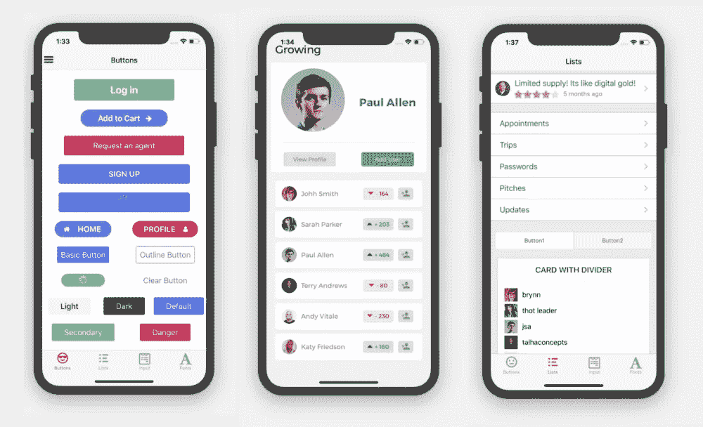
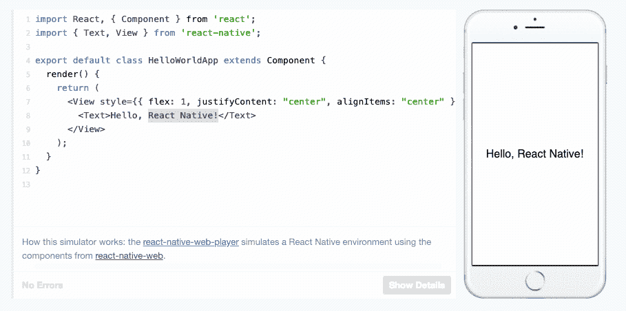
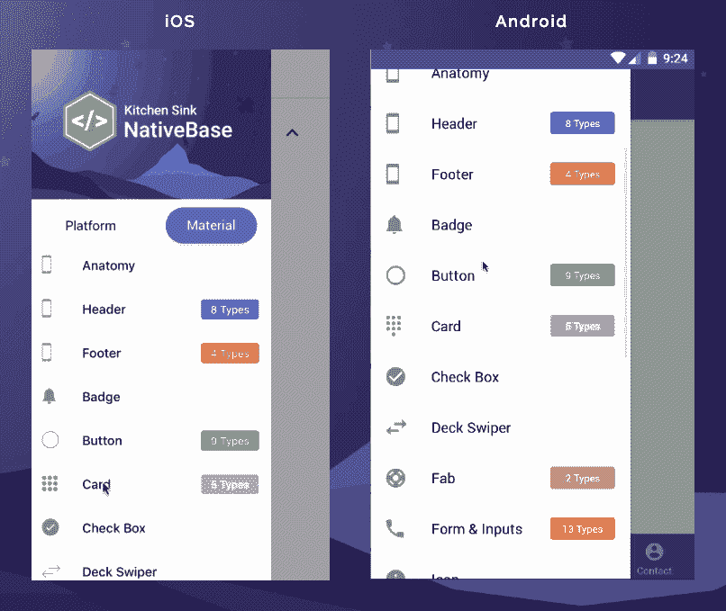
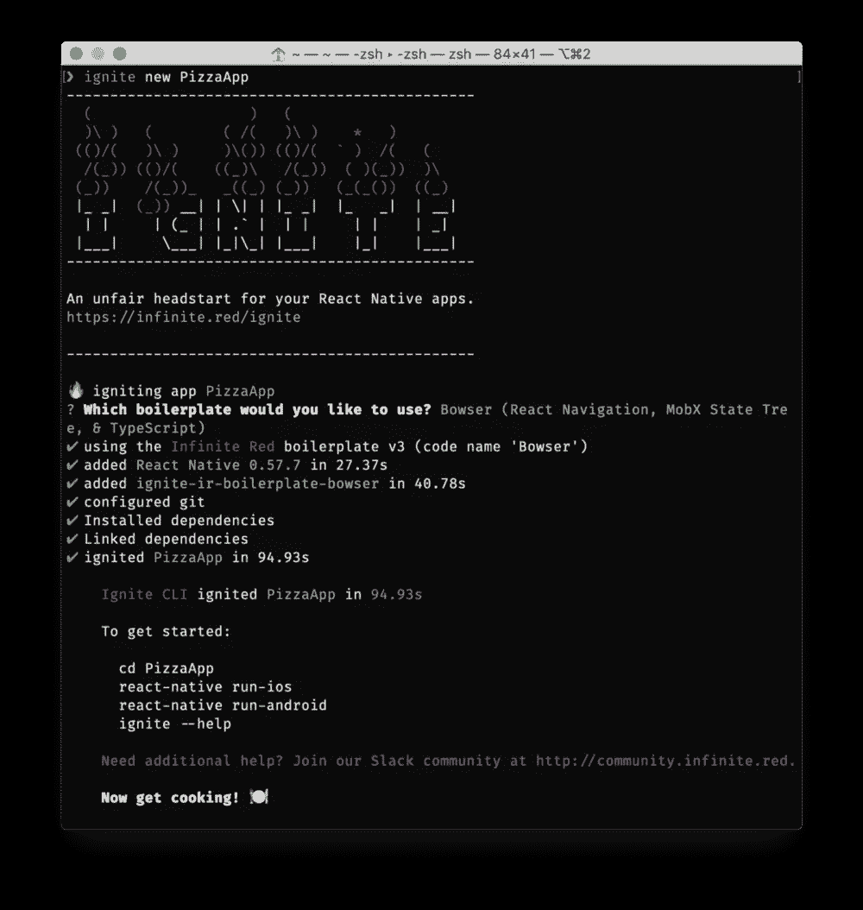
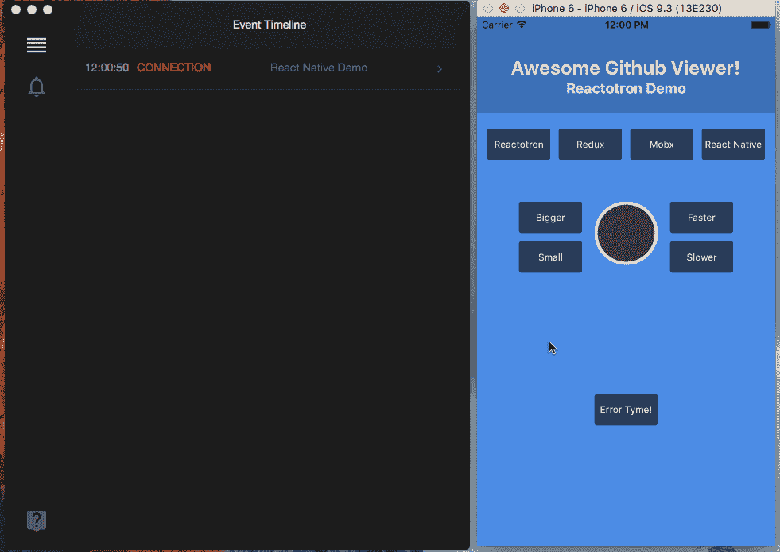

# 十大 React 原生开源应用

> 原文：<https://javascript.plainenglish.io/top-10-react-native-open-source-apps-e483539d72fe?source=collection_archive---------1----------------------->

## 今天，我们将讨论 React Native 生态系统中非常受欢迎的 10 大 React Native 开源应用，您应该考虑在您的下一个 React Native 项目中使用这些应用。

## [**自由反应原生模板**](https://www.creative-tim.com/product/material-kit-react-native?ref=kriss.io) **由创意 Tim 制作。**

在当今的编程世界中，你会看到每一种编程语言中都有许多可用的库和框架，使程序员的任务变得更容易。鉴于技术领域的激烈竞争，重用代码一如既往地至关重要。

## 1.React 本地初学者工具包

由 Instamobile 构建的这个 [React Native Starter Kit](https://www.instamobile.io/app-templates/react-native-starter-kit-firebase/) 是一个功能性开源 React Native 应用程序，它为您提供了大量有用和受欢迎的功能，如 Firebase 数据库集成、存储、推送通知、用户登录、持久登录凭据等等。

有了漂亮的入职界面设计和大量已经实现的功能，你可以直接使用你的应用程序，而不是重新发明轮子和编写所有无聊的样板代码。

## 2.F8 App 2017

F8 应用是 GitHub 上推荐的 13K 星开源项目之一。这个 React Native 项目非常受欢迎，因为它是从 React Native 构建的产品的真实展示示例，而不仅仅是源代码。脸书发布了一系列教程。从这里下载应用 [**fbsamples/f8app。**](https://github.com/fbsamples/f8app)

## 3.反应本地元素

[react-native-elements](https://github.com/react-native-training/react-native-elements) 是一个完全用 Javascript 构建的高度可定制的跨平台 UI 工具包。它拥有超过 12k 的星星，是 React Native 最大的可用 UI 库。

该库的作者[表示](https://medium.com/react-native-training/introducing-react-native-elements-e3d78389b7ea)、*“React Native Elements 的想法更多的是关于组件结构，而不是实际的设计，这意味着在设置某些元素时减少了样板文件，但可以完全控制它们的设计”。*

这应该对新开发人员和经验丰富的老手都有吸引力。这是一个展示所有组件的 Expo 应用程序的例子。请随意加入。

## 4.对 Web 作出本地反应

**GitHub 上又一个 12K-stars 的 React 原生库**。这个 React 原生项目也在 React 原生应用程序开发的脸书文档中使用。通过使用这个库，你可以在没有设备或模拟器的情况下看到你的应用程序的开发实况。看看官方 [React Native](https://facebook.github.io/react-native/docs/props) 文档中的这个开源项目。所有例子都可以在[故事书](https://necolas.github.io/react-native-web/storybook/?selectedKind=Components&selectedStory=ActivityIndicator&full=0&addons=0&stories=1&panelRight=0)上找到。在 [Github](http://necolas/react-native-web) 上下载项目。

## **5。原生基地**

这是 React Native 中我最喜欢的库之一。在 10k stars 和超过 1k forks，NativeBase 是一个广泛流行的 UI 组件库，为 React native 提供了几十个跨平台组件。

当使用 NativeBase 时，您可以使用任何现成的本地第三方库，项目本身带有丰富的生态系统，从有用的初学者工具包到可定制的主题模板。这里有一个不错的初学者工具包:

## 6.Ignite CLI

Ignite 另一个开源项目在 GitHub 上得到了 9k 颗星。这是一个开发人员友好的 cli。您可以用它来生成样板文件、插件、生成器等等。通过使用 ignite cli，您将节省大量时间。很少有其他功能，如推送通知、用户管理等。使用 [Ignite](https://github.com/infinitered/ignite) 很容易实现。

## 7.电抗器

Reactotron 在调试方面为您节省了大量的开发时间。对于像我们这样的开发人员，我们总是需要一些有用的工具来检查我们在编写代码时得到的错误。 [Reactotron](https://github.com/infinitered/ignite) 是一款 macOS、Windows 和 Linux 应用，用于检查您的 React JS 和 React Native 应用。这个 React 原生知识库在 GitHub 上也得到了 9k 星。开源项目旨在帮助 React 本地开发者轻松理解他们应用的方方面面。

您可以检查来自 API 的请求和响应，以及检查您的移动应用程序状态和数据流。

## 8.反应本地 Swiper

这个 7.5k 星库号称是 React Native 最好的 [Swiper](https://github.com/leecade/react-native-swiper) 组件。您可以自定义样式以满足您的具体需求。如果你需要关于如何实现它的完整指南，请在评论区告诉我们。

Swiper 让你的应用有点吸引力。你可能在安装一些应用的时候看到过 swipers。您可以在 swiper 上定义步骤，通过图像和渐变为 React 本机应用程序提供出色的外观和感觉。

## 9.天才聊天

[天赋聊](https://github.com/FaridSafi/react-native-gifted-chat)是一款 7k stars React 原生开源 app。天赋聊天号称 React Native 最全的聊天 UI。你可以获得类似的用户界面，你可能会在许多聊天应用程序中看到，如加载早期消息，附加照片，复制消息到剪贴板，多行文本输入，InputToolbar 避免键盘等等。然而，天才聊天库只有 UI，所以它没有集成的聊天后端。如果你正在寻找一个完全可用的[反应本地聊天](https://www.instamobile.io/app-templates/react-native-chat-app-template/)，看看我们的 Instamobile 模板。

## 10.反应本地日历

另一个广泛使用的 4k 星日历库是用 React Native 编写的。React native 的这个[日历](https://github.com/wix/react-native-calendars)库是完全可定制和灵活的。它有很多先进的功能，如时间段标记，时间范围间隔，多点标记，议程等。

## 结论

我们希望你能从这篇文章中得到一些有用的东西。请在评论区让我们知道你最喜欢哪个库。如果你使用过它们中的任何一个，请在评论中描述你使用 React 原生开源应用的体验。

编码快乐！

> 请记住，当您点击我们的链接并购买时，我们可能会收取佣金。然而，这并不影响我们的审查和比较。我们尽力保持事情的公平和平衡，以帮助您做出最适合您的选择。

*原载于 2020 年 9 月 25 日*[*https://www . insta mobile . io*](https://www.instamobile.io/mobile-design/react-native-open-source-apps/)*。*