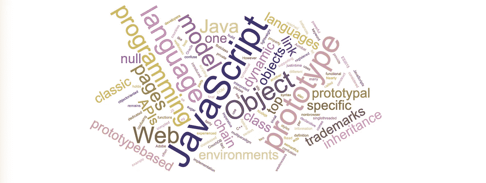

# JavaScript 开发人员的 10 大快速技巧

> 原文：<https://javascript.plainenglish.io/top-10-tips-to-be-a-professional-javascript-developer-in-3-minutes-117192b8bb9b?source=collection_archive---------11----------------------->



我们在编程中更经常听到“数据绑定”这个词。“数据绑定”的关键是监控数据的变化，但对于这样一个对象:`let obj = {value: 1}`，我们该如何知道 obj 发生了变化？

# 1.定义属性

ES5 提供了 Object.defineProperty 方法，可以在对象上定义新的属性，或者修改对象的现有属性，并返回对象。

```
obj: an object
prop: attributes of the object
descriptor: the description of the permission of the object 
```

```
let obj = {}
Object.defineProperty(obj, "money", {
    value : 100, // Updated value, the default value is undefine.
    writable : true, // The property can only be changed by the assignment operator if and only if the property's writable is true. The default is false.
    enumerable : true, // This attribute can appear in the enumerated attribute of an object if and only if the enumerable of this attribute is true. The default is false.
    configurable : true // The property descriptor can be changed and deleted if and only if the property's configurable is true. The default is false.
    get: () => value; // Get current value 
    set: (newVal) => newVal; // Set current value
});
```

# 2.原型继承

从父类继承的简单方法是，定义子类的原型并创建一个新的常量，以获得父类的值。

```
function Car() {
    this.brand = 'bmw';
}

Car.prototype.getBrand = () => console.log(this.brand)

function ElectricCar() {}

ElectricCar.prototype = new Car();

const eleCar = new ElectricCar();

console.log(eleCar.getBrand()); 

// bmw
```

然而，如果您需要在其他地方重用子节点，也有一个经典的方法来保持从父节点的纯继承。参见例如

```
function Car() {
    this.brand = ['bmw', 'audi'];
}

function ElectricCar() {
    Car.call(this);
}

const carA = new ElectricCar();

carA.brand.push('toyota');

console.log(carA.brand); // ["bmw","audi","toyota"]

const carB = new ElectricCar();

console.log(carB.brand); // ['bmw', 'audi']
```

# 3.致电/申请

`Call`方法使用给定的 this 值和单独提供的参数调用函数。请参见下面的示例。

```
const food = {
    value: 'apple'
}

function fruit() {
     console.log(this.value);
}

fruit.call(food); // apple
```

call、apply 的相同用法可以达到相同的效果。

```
Function.prototype.apply = (info, arr) => {
      let info = Object(info) || window; 
      info.fn = this; const result;
      if(!arr) { result = info.fn(); }
      else {
        var args = [];
        for (var i = 0, len = arr.length; i < len; i++) {
            args.push('arr[' + i + ']');
        }
        result = eval('info.fn(' + args + ')')
    } delete info.fn
    return result;
}
```

# 4.记忆功能

程序经常浪费时间反复调用重新计算相同结果的函数。递归和数学函数尤其如此。斐波那契数生成器就是一个很好的例子。斐波那契数列是一系列整数，从 0 和 1 开始，其中每个值都是数列中前两个数的和。

```
function memorize(func) {
  var memo = {};
  var slice = Array.prototype.slice;

  return function() {
    var args = slice.call(arguments);

    if (args in memo)
      return memo[args];
    else
      return (memo[args] = func.apply(this, args));

  }
}
```

```
var count = function(a, b, c) {
  return a + b + c
}

var memoizedCount = memorize(count)

console.time('use memorize function')
for(var i = 0; i < 100000; i++) {
    memoizedCount(1, 2, 3)
}
console.timeEnd('use memorize function')

console.time('without memorize function')
for(var i = 0; i < 100000; i++) {
    count(1, 2, 3)
}
console.timeEnd('without memorize function')
```

# 5.标志

符号值可以用于对象的标签或属性名，并且它承诺相同的属性名。

```
var mySymbol = Symbol();

// FIRST
var a = {};
a[mySymbol] = 'Hello!';

// SECOND
var a = {

};

// THIRD
var a = {};
Object.defineProperty(a, mySymbol, { value: 'Hello!' });

// All of them have the same result but they never equal to each other.
console.log(a[mySymbol]); // "Hello!"
```

```
var s1 = Symbol.for("foo");
console.log(Symbol.keyFor(s1)); // "foo"

var s2 = Symbol("foo");
console.log(Symbol.keyFor(s2) ); // undefined
```

# 6.数组. from()

从 ES6 开始，`[...arguments]`被迅速使用。它是如何从一个数组中产生的？看吧。例如

```
function mul(a, b) {
    let args = Array.from(arguments); // [4, 5]
    console.log(args.reduce((sum, cur) => sum * cur));
}
mul(4,5); //9
```

# 7.Array.prototype.slice.call()

参数本身不能调用数组方法，它是另一种类型的对象，但是属性从 0，0，1，2 …排序，最后是被调用者和长度属性。我们也把这样的对象称为类数组。

```
function mul(a, b) {
    let args = Array.prototype.slice.call(arguments); // [4, 5]
    console.log(args.reduce((sum, cur) => sum * cur));
}
mul(4,5); //20
```

# 8.分类

一次排序一个数组项，并以这种方式构造最终排序的数组。假设第一个项目已经排序，然后与第二个项目进行比较。第二项应该留在原处还是插在第一项之前？这样前两项排序正确，再和第三项比较(应该插在第一、第二还是第三个位置？)，等等。

```
Array.prototype.insertionSort = function() {
    let j
    let temp
    for (let i = 1; i < this.length; i++) {
        j = i
        temp = this[i]
        while (j > 0 && this[j - 1] > temp) {
            this[j] = this[j - 1]
            j--
        } 
        this[j] = temp
        console.log(this.join(', '))
    }
    return this
}
```

# 9.异步/等待

ES2018 引入了异步迭代器，类似于常规迭代器，只是 next()方法返回一个承诺。因此，await 可以与循环的 for …一起使用，以串行方式运行异步操作。

```
async function increase(array) {
    for await (let i of array) {
         // request to api
    }
}
```

# 10.Javascript 关键代码

了解 JavaScript 中的大部分关键代码可以帮助您改善 web 应用程序的用户体验。

```
let keyCodeMap = {
    8: 'Backspace',
    9: 'Tab',
    13: 'Enter',
    16: 'Shift',
    17: 'Ctrl',
    18: 'Alt',
    19: 'Pause',
    20: 'Caps Lock',
    27: 'Escape',
    32: 'Space',
    33: 'Page Up',
    34: 'Page Down',
    35: 'End',
    36: 'Home',
    37: 'Left',
    38: 'Up',
    39: 'Right',
    40: 'Down',
    42: 'Print Screen',
    45: 'Insert',
    46: 'Delete',

    48: '0',
    49: '1',
    50: '2',
    51: '3',
    52: '4',
    53: '5',
    54: '6',
    55: '7',
    56: '8',
    57: '9',

    65: 'A',
    66: 'B',
    67: 'C',
    68: 'D',
    69: 'E',
    70: 'F',
    71: 'G',
    72: 'H',
    73: 'I',
    74: 'J',
    75: 'K',
    76: 'L',
    77: 'M',
    78: 'N',
    79: 'O',
    80: 'P',
    81: 'Q',
    82: 'R',
    83: 'S',
    84: 'T',
    85: 'U',
    86: 'V',
    87: 'W',
    88: 'X',
    89: 'Y',
    90: 'Z',

    91: 'Windows',
    93: 'Right Click',

    96: 'Numpad 0',
    97: 'Numpad 1',
    98: 'Numpad 2',
    99: 'Numpad 3',
    100: 'Numpad 4',
    101: 'Numpad 5',
    102: 'Numpad 6',
    103: 'Numpad 7',
    104: 'Numpad 8',
    105: 'Numpad 9',
    106: 'Numpad *',
    107: 'Numpad +',
    109: 'Numpad -',
    110: 'Numpad .',
    111: 'Numpad /',

    112: 'F1',
    113: 'F2',
    114: 'F3',
    115: 'F4',
    116: 'F5',
    117: 'F6',
    118: 'F7',
    119: 'F8',
    120: 'F9',
    121: 'F10',
    122: 'F11',
    123: 'F12',

    144: 'Num Lock',
    145: 'Scroll Lock',
    182: 'My Computer',
    183: 'My Calculator',
    186: ';',
    187: '=',
    188: ',',
    189: '-',
    190: '.',
    191: '/',
    192: '`',
    219: '[',
    220: '\\',
    221: ']',
    222: '\''
};

function renderKeyName(keycode) {
    if (keyCodeMap[keycode]) {
        return keyCodeMap[keycode];
    } else {
        console.log('Unknow Key(Key Code:' + keycode + ')');
        return '';
    }
};
```

参考:

[*记忆功能*](https://codeburst.io/understanding-memoization-in-3-minutes-2e58daf33a19)

[](https://developer.mozilla.org/en-US/docs/Web/JavaScript/Reference/Global_Objects/Array/slice)

*[*按键代码*](https://keycode.info/)*

# *了解更多信息*

*[](https://medium.com/datadriveninvestor/top-10-trending-plugins-you-didnt-know-it-comes-with-macports-3a25558a4a9a) [## 你不知道自己在 2020 年需要的十大 MacPorts 工具

### 对于大多数在用麦金塔操作系统的用户来说，他们了解自制程序。但是，有一个非常方便的工具调用…

medium.com](https://medium.com/datadriveninvestor/top-10-trending-plugins-you-didnt-know-it-comes-with-macports-3a25558a4a9a) [](https://medium.com/javascript-in-plain-english/top-10-tips-to-be-a-professional-javascript-developer-in-3-minutes-117192b8bb9b) [## JavaScript 开发人员的 10 大快速技巧

### 我们在编程中更经常听到“数据绑定”这个词。“数据绑定”的关键是监控…

medium.com](https://medium.com/javascript-in-plain-english/top-10-tips-to-be-a-professional-javascript-developer-in-3-minutes-117192b8bb9b) [](https://medium.com/@.jay/top-10-chrome-extensions-every-developer-likes-a1a3633b85e9) [## 每个开发者都喜欢的十大 Chrome 扩展

### 每个开发者都喜欢的十大 Chrome 扩展

Likesmedium.com 十大 Chrome 扩展](https://medium.com/@.jay/top-10-chrome-extensions-every-developer-likes-a1a3633b85e9)*