# 初级 JavaScript 开发人员不知道的十大 VS 代码扩展

> 原文：<https://javascript.plainenglish.io/top-10-vs-code-extensions-to-use-as-junior-javascript-developers-in-2019-edecf00f9e17?source=collection_archive---------0----------------------->

本文展示了成为成功开发人员的 10 个有用工具。我们大多数人已经使用 VS 代码很长时间了，但是开发人员总是抱怨为什么与 IntelliJ IDEA 或 Eclipse 相比缺少了这么多特性。事实是，他们可能找不到工作环境的合适扩展。一旦你花了一分钟学习这些扩展是如何工作的，我们可以肯定你会再次爱上 VS 代码。

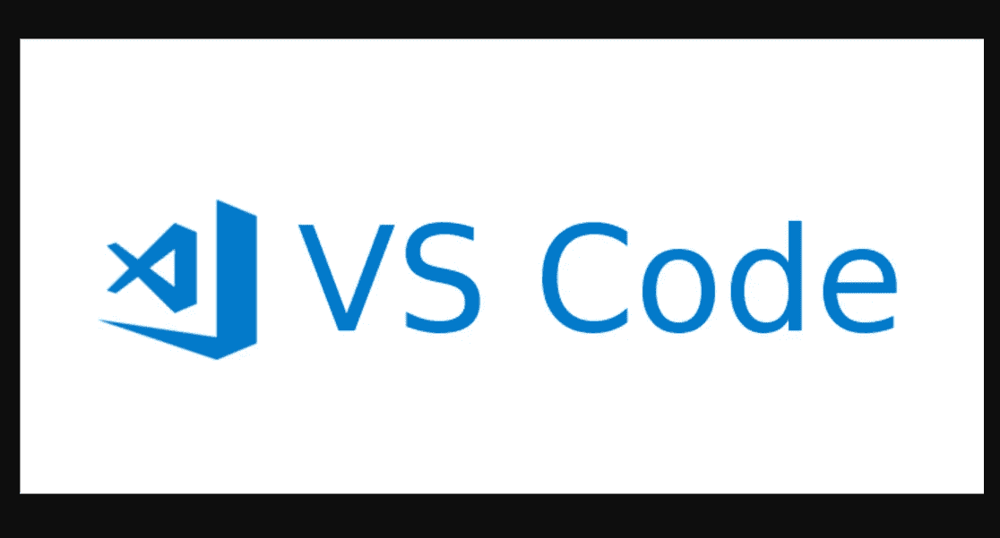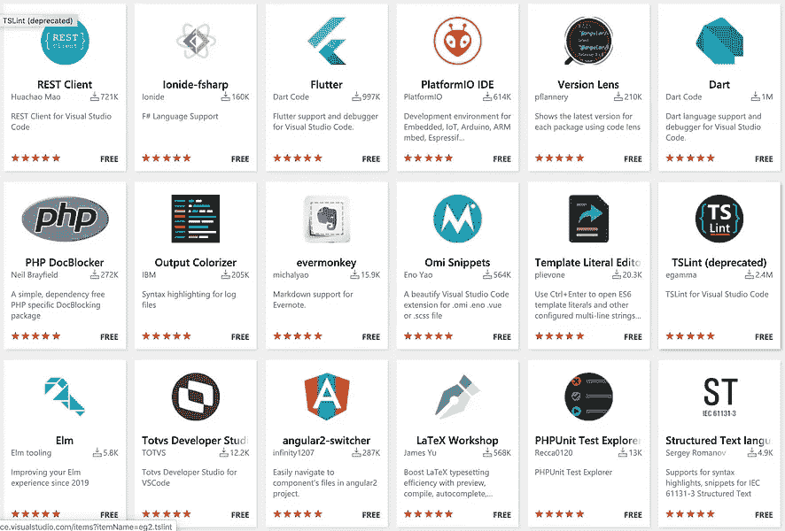

*最初发表于*[*【http://github.com】*](https://gist.github.com/shijiezhou1/ea4120b3795dc3f4e5df64fe3294b95d)*。*

# 1.项目管理人

非常有用和常见的项目管理工具

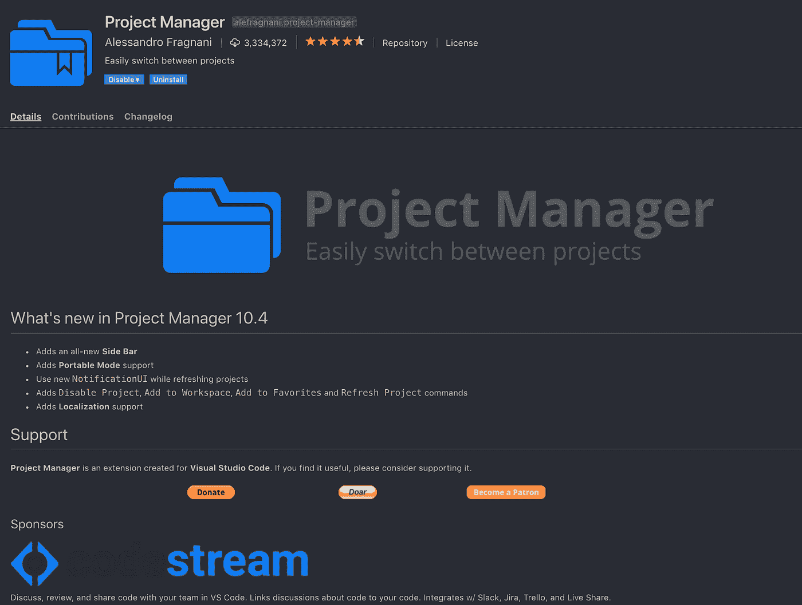

[https://marketplace.visualstudio.com/items?项目经理](https://marketplace.visualstudio.com/items?itemName=alefragnani.project-manager)

# 2.吉特朗斯

Github 桌面的替代工具。对于所有开发人员来说，这是一个非常简单明了的使用指南

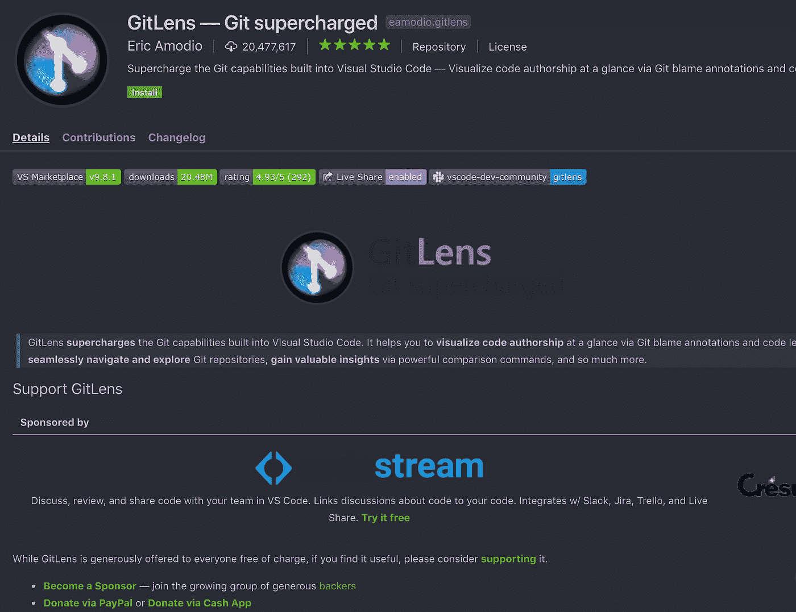

[https://marketplace.visualstudio.com/items?itemName=eamodio.gitlens](https://marketplace.visualstudio.com/items?itemName=eamodio.gitlens)

# 3.JavaScript (ES6)代码片段

JavaScript 最喜欢的工具，如果你熟悉 ES6 语法，这个扩展可以节省你大量的打字时间

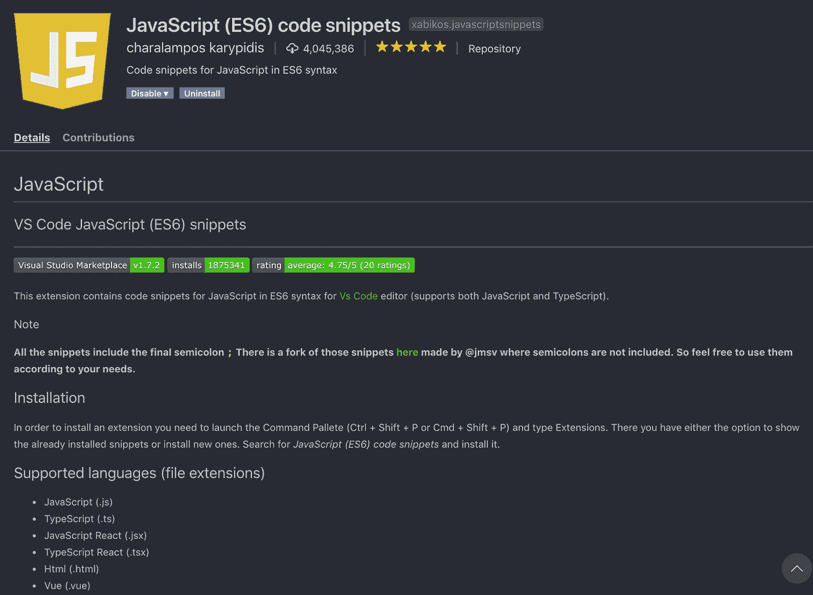

[https://marketplace.visualstudio.com/items?itemName=xabikos。JavaScriptSnippets 片段](https://marketplace.visualstudio.com/items?itemName=xabikos.JavaScriptSnippets)

# 4.npm 智能感知

总是忘记安装 npm 包，但是这可以提醒你你错过了什么优秀的项目

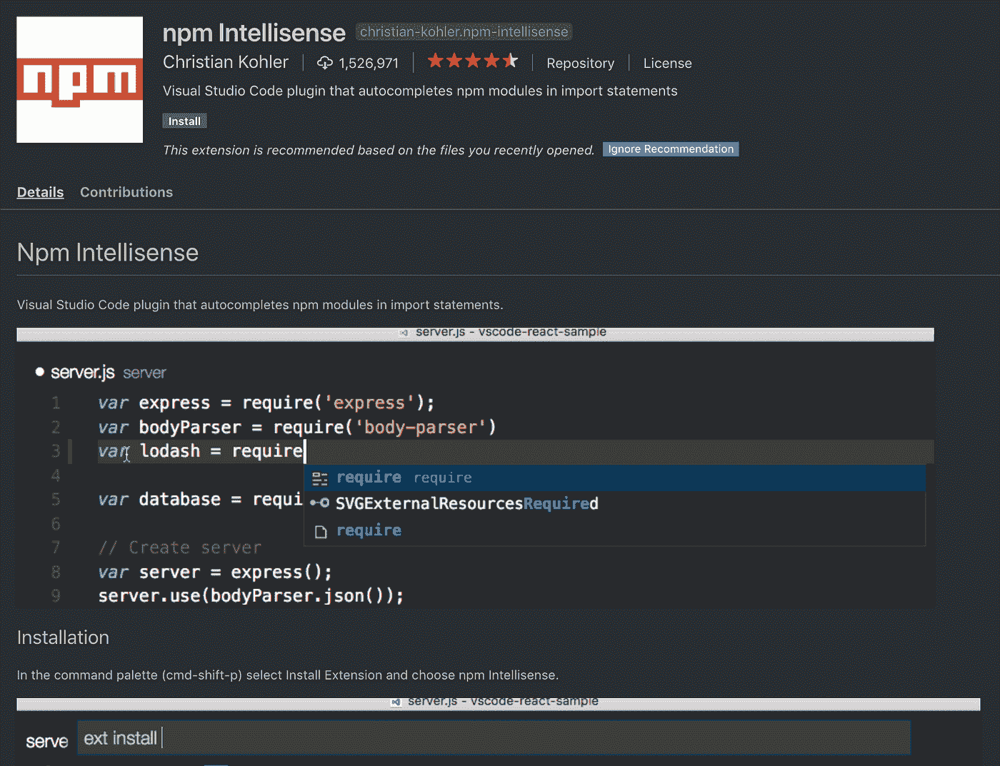

[https://marketplace.visualstudio.com/items?itemName = eg2 . vs code-NPM-script](https://marketplace.visualstudio.com/items?itemName=eg2.vscode-npm-script)

# 5.路径智能感知

当您键入时，会自动导入 npm 包

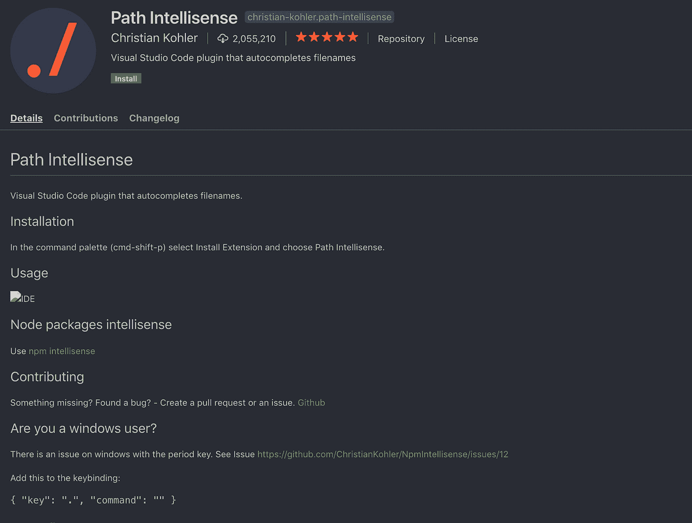

[https://marketplace.visualstudio.com/items?itemName = Christian-Kohler . path-intellisense](https://marketplace.visualstudio.com/items?itemName=christian-kohler.path-intellisense)

# 6.待办事项树

作为一名开发人员，一旦你有了一个很棒的项目，但后来忘记修复一个问题，待办事项永远不会过时

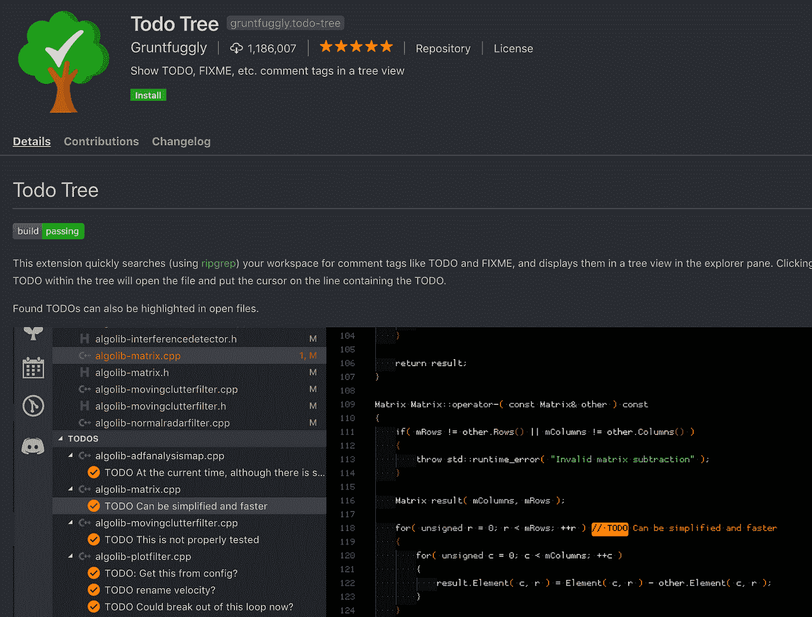

[https://marketplace.visualstudio.com/items?itemName = gruntfugly . todo-tree](https://marketplace.visualstudio.com/items?itemName=Gruntfuggly.todo-tree)

# 7.埃斯林特

Lint 可以帮助您更好地编写代码，并设计您自己的规则。

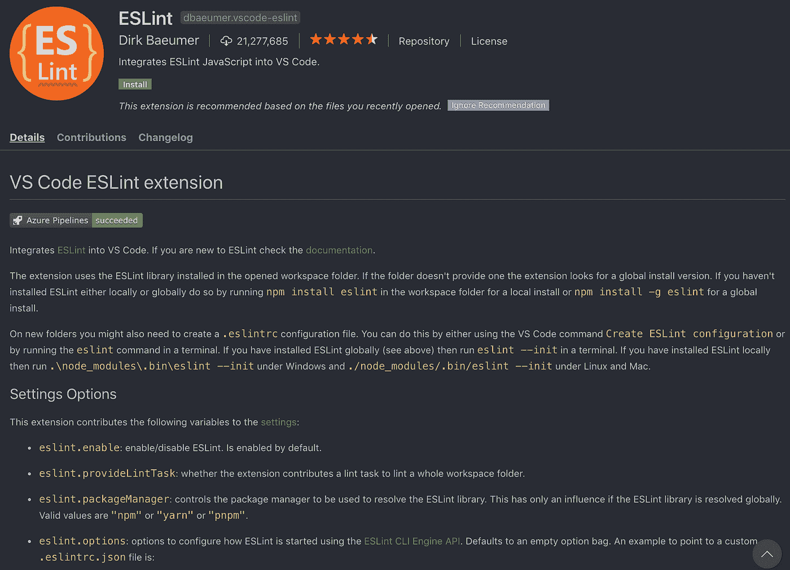

[https://marketplace.visualstudio.com/items?itemName = dbaeumer . vs code-eslint](https://marketplace.visualstudio.com/items?itemName=dbaeumer.vscode-eslint)

# 8.JS 参数注释

很难记住一个函数可以接受什么参数，这个插件可以告诉你你可以放什么。它类似于 Intellij 所拥有的，它显示了所有可选的参数，而不是猜测。它同时支持 JavaScript 和 TypeScript。

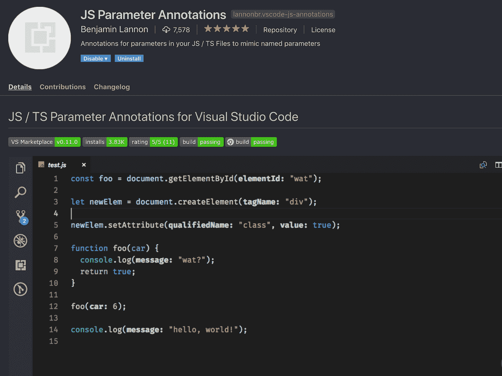

【https://marketplace.visualstudio.com/items? itemName = lannonbr . vs code-js-annotations

# 9.日志文件高亮显示

读日志文件有困难吗？有了它，你可以让你的生活更轻松

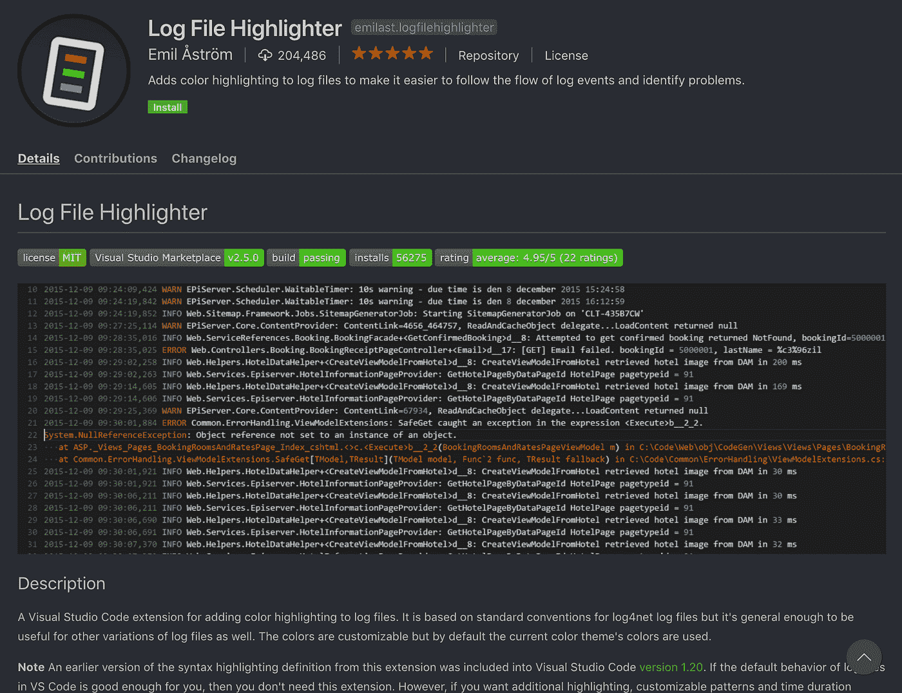

【https://marketplace.visualstudio.com/items? itemName=emilast。日志文件荧光笔

# 10.更漂亮—代码格式化程序

总是担心没有正确格式的混合代码？让你的代码更漂亮

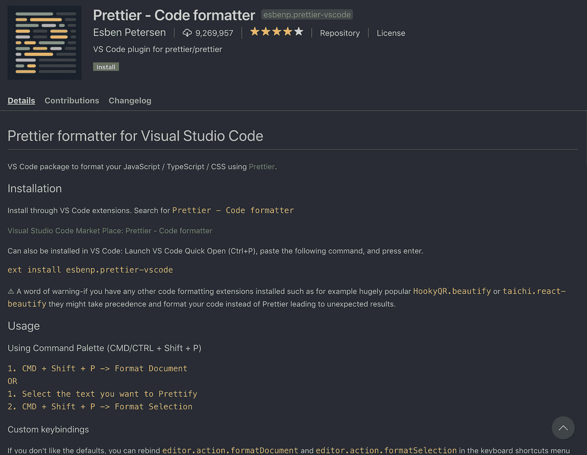

[https://marketplace.visualstudio.com/items?itemName = es benp . prettle-vs code](https://marketplace.visualstudio.com/items?itemName=esbenp.prettier-vscode)