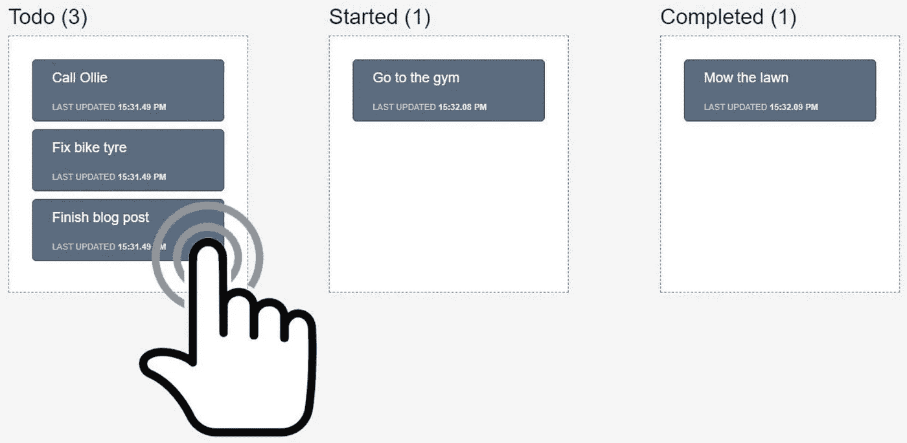

# 每个 Web 开发人员都应该知道的构建可持续应用程序的 11 个基本反应库

> 原文：<https://javascript.plainenglish.io/top-11-essential-react-libraries-every-web-developer-should-know-to-build-sustainable-applications-625110f8cf66?source=collection_archive---------4----------------------->

## 现在什么是趋势反应库？

Photo by [Halacious](https://unsplash.com/@halacious?utm_source=medium&utm_medium=referral) on [Unsplash](https://unsplash.com?utm_source=medium&utm_medium=referral)

如果您是 React 开发人员，并且想要跟上该领域的最新趋势，那么这个故事适合您。

你可以从数百个图书馆中进行选择。为了让你更容易理解，下面是我推荐的 11 个 React 库，每个开发者都应该知道。

让我们开始吧。

# 1.Redux

github:[https://github.com/reduxjs/react-redux](https://github.com/reduxjs/react-redux)

状态管理在任何 React 应用程序中都至关重要。当你的项目越来越大，你绝对需要有一个适当的方法来处理你的应用程序的状态。否则，从长远来看，这可能会给你带来很大的麻烦。

如果你是 React 开发者，你应该听说过 Redux。说到状态管理解决方案，Redux 是相当受欢迎的。它将整个应用程序的状态保存在一个存储中，每个组件都可以从这个存储中访问任何状态。

然而，Redux 并不是这个主题的唯一库。一些开发人员认为 Redux 有时很慢。这也是他们更喜欢 MobX 的原因。

# 2.MobX

github:【https://github.com/mobxjs/mobx 

MobX 是一个类似于 Redux 的状态管理解决方案，但是它比 Redux 更快，样板代码更少，也更容易学习。

MobX 与 React 配合得非常好。它们共同创建了一个可靠的机制来存储和更新应用程序的状态，以准确地呈现组件。

# 3.创建 React 应用

github:【https://github.com/facebook/create-react-app 

脸书的程序员开发了一个 CLI 工具，让你轻松创建 React 应用程序。当您执行该命令时，它会生成一个具有适当文件结构的项目文件夹，其中包含启动和测试应用程序所需的所有内容。

你应该使用这个工具来加速你的开发，而不是花时间从头开始设置一切。

# 4.UI 组件

如果你和我一样，UI 是最难做的部分之一。我过去花在 UI 上的时间比逻辑上的时间多得多。我在这里修复了一些像素，但不知何故它在别的地方坏掉了。

你不需要用那种艰难的方式来修饰你的应用程序。有许多引人注目的 UI 组件库等着您去利用。我在下面的故事中讲述了其中的 21 个。看看这个:

 [## 你应该从今天开始使用的 21 个 React UI 组件库

### 不要浪费你的时间去自己创造一切

medium.com](https://medium.com/javascript-in-plain-english/21-react-ui-component-libraries-you-should-start-using-from-today-6249758d188) 

# 5.反应 DnD

github:[https://github.com/react-dnd/react-dnd](https://github.com/react-dnd/react-dnd)

还有谁觉得一遍又一遍的为相似的皮肤写代码很无聊？尤其是在创建登陆页面的时候，我们经常会用到几个重复的 UI 块。因此，为了节省大量的时间，拥有拖放 UI 工具是很棒的。

在这个问题上，我想向你介绍的是 DnD。当我在一个电子商务平台工作时，我的团队必须为营销团队创建大量的登录页面。更多的是关于内容和模板。那么，为什么不为营销团队创建一个工具来独立完成这项任务呢？React DnD 是我的开发团队用来构建复杂的拖放界面的库，用于根据营销团队的需求生成登录页面。你猜怎么着？他们喜欢它。

# 6.酶

github:[https://github.com/enzymejs/enzyme](https://github.com/enzymejs/enzyme)

任何程序员都应该知道如何写测试，并把它们写好。这就是我们如何全心投入到我们伟大的产品中。

如果你是一个不经测试就写代码的人，那么，你肯定通不过我的第一轮团队面试(或者任何认真构建可持续应用的团队)。

尤其是 React 组件，它们是任何 React 应用的核心，你应该为它们编写测试。因此，为了让这项任务变得更容易，AirBnB 的开发者创造了 Enzyme。还想写无 bug 的组件？去看看这个图书馆。

# 7.样式组件

github:【https://github.com/styled-components/styled-components 

使用 CSS 可能有点棘手。如果你没有很好地组织它，它会一直乱下去。最糟糕的是在不知道选择器存在的情况下覆盖它。结果，它破坏了你的 UI 在站点的其他地方，然后你将花费大量的时间去调查问题。

如果你使用样式组件库，所有这些问题都不会发生，因为它允许你直接修饰你的组件。

# 8.反应虚拟化

github:【https://github.com/bvaughn/react-virtualized 

你对渲染一个巨大的数据集有问题吗？

React Virtualized 使您能够高效地显示大型数据列表或表格。当我们需要处理成千上万或更多的数据行时，性能总是一个问题。React Virtualized 帮助您优化对服务器的请求，并以正确的方式处理 DOM 元素。

# 9.冗余形式

github:[https://github.com/redux-form/redux-form](https://github.com/redux-form/redux-form)

在 web 开发中，我们几乎百分之百的时间都在处理表单。

如果你正在使用 Redux，最好有 Redux 表单。它将帮助您更容易地创建和定制复杂的表单。不需要太担心数据验证、控制输入格式、改变表单状态等。

# 10.反应路由器

github:[https://github.com/ReactTraining/react-router](https://github.com/ReactTraining/react-router)

导航对于单页面应用程序来说是一个大问题。这就是为什么你需要使用 React Router 在 React 应用中毫不费力地处理导航。此外，它支持屏幕过渡动画，使您的应用程序更具吸引力。

# 11.Axios

github:【https://github.com/axios/axios 

Axios 是一个基于 promise 的 HTTP 客户端。它允许您使用 async/await 语法从客户机向服务器调用 ajax 请求。它还支持 CRUD 操作，错误处理，你可以使用 Promise API。

你最喜欢的图书馆有哪些？它可能包含在上面的列表中，或者你可能有自己的列表。那么，我错过了哪一个？请在下面的评论中告诉我。

## 进一步阅读

 [## 15 种简单的编码技术，用更短的 JavaScript 代码完成任务

### 不要浪费时间写长代码，而你可以把它写得更短，更清晰，更易读。

medium.com](https://medium.com/javascript-in-plain-english/15-simple-coding-techniques-to-get-your-tasks-done-with-shorter-code-in-javascript-59d46801db0)