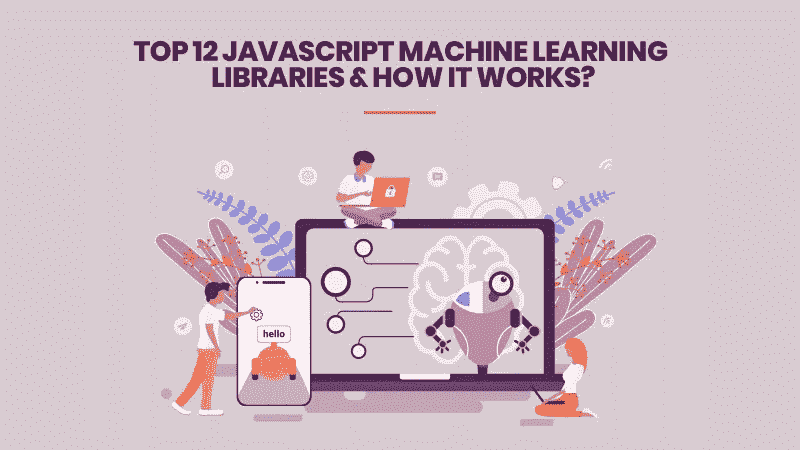
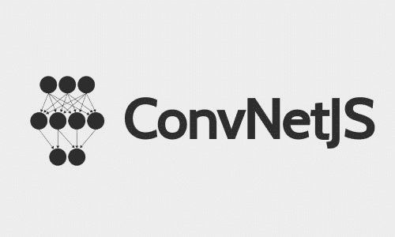
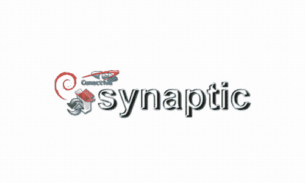

# 2021 年前 12 个 JavaScript 机器学习库

> 原文：<https://javascript.plainenglish.io/top-12-javascript-machine-learning-libraries-for-2020-8bec30ecfa58?source=collection_archive---------0----------------------->

机器学习目前正蓬勃发展，机器学习最新技术的发展帮助开发人员以比以往任何时候都更容易的方式创建新的基于人工智能的应用程序。而且，当谈到基于 web 的应用程序时，JS 被广泛用作核心编程语言。

**让我们来看看一些显示 2021 年机器学习受欢迎程度呈指数增长的统计数据:**

> 机器学习技术可以将任何企业的生产率提高高达 40%。([来源](https://techjury.net/blog/global-it-economics/)
> 
> 超过 100，000 名员工的公司更有可能拥有基于机器学习的战略。([来源](https://www.mit.edu/research/))
> 
> 47%的小型或大型企业都制定了基于机器学习的移动战略。([来源](https://www.standardfirms.com/web-design-development-stats-facts/))
> 
> 41%的客户认为人工智能或机器学习会以这样或那样的方式改善他们的业务。([来源](https://www.agilitypr.com/pr-news/public-relations/the-ai-revolution-better-business-with-smarter-machines/))

**在这篇博客中，我们将尝试把机器学习与 JavaScript 联系起来。我们将学习机器学习的各种最佳 JavaScript 框架，这将成为 2021 年的规则。**

**1。**

****

**ConvNetJS 是一个可信的 JS 库，它完全在 web 浏览器中处理深度学习模型(神经网络)。斯坦福大学的一名研究人员编写了这个 JS 库，它允许开发人员用 JavaScript 制定和解决神经网络和深度学习。它包括与包含非线性和全连接层的普通神经网络相关的模块。**

**此外，它支持回归(L2)成本函数和分类(SVM/Softmax)。ConvNetJS 还可以训练和指定处理图像的卷积网络。此外，它支持基于深度 Q 学习的实验性强化学习模块。**

****2**[**brain . js**](https://github.com/BrainJS)**

**Brain.js 是最著名的基于 JS 的库之一，是一个 GPU 加速库，广泛用于神经网络模型的开发。它快速、简单、易于使用，可以与 Node.js 合并使用，也可以在 web 浏览器中使用。除此之外，该库在使用或不使用图形处理单元的情况下执行计算，并在神经网络上提供多种实现。有许多 [**机器学习开发公司**](https://www.xicom.biz/latest-thinking/artificial-intelligence/) 正在使用这个库来轻松执行他们的项目。**

****3**[**deep learn . js**](https://www.npmjs.com/package/deeplearn)**

**这是一个硬件加速和开源的基于 JS 的库，用于深度学习模型开发。最初，由 Google 的 Brain PAIR 团队创建的这个 JavaScript 库有助于为 web 浏览器生成直观的深度学习工具。除此之外，这个库还允许研究人员在浏览器中训练神经网络。它还在推理模型中运行预先训练的模型。**

****4** [**头脑**](https://stevenmiller888.github.io/mindjs.net/)**

**它是一个灵活的神经网络库，适用于 Node.js 和 web 浏览器。该库利用矩阵实现来有效地处理训练数据，并允许开发者个性化网络拓扑。此外，它是可插拔的，这意味着开发人员可以轻松地上传或下载插件，这些插件用于配置预先训练好的网络，可以轻松地用于进行某些预测。**

****5**[**neuro . js**](https://neuro.js.org/)**

**它是一个著名的 JS 库，用于在 JS 中培训和开发深度学习模型，可以轻松部署在 web 浏览器或 Node.js 中。除此之外，它支持在线学习、多标签分类以及网站开发的实时分类，并可用于创建基于人工智能的聊天机器人和助手。**

****6** [**突触**](https://www.nongnu.org/synaptic/)**

****

**这个 JavaScript 库也有助于在 web 浏览器或 Node.js 中开发神经网络模型。因此，人们可以容易地训练和创建基本上任何类型的一阶或二阶神经网络架构。**

> **除此之外，该库还包括一些内置架构，例如多层长短期记忆网络(LSTM)、多层感知器、Hopfield 网络或液态状态机。**

**这个库还包括一个训练器，它能够训练任何给定的神经网络，包括内置的训练任务和测试，如完成分心的序列回忆任务，解决 XOR 或嵌入式 Reber 语法测试。此外，该库还有助于测试和比较不同神经网络的架构性能。**

****7**[tensor flow . js](https://www.tensorflow.org/js)**

**TensorFlow.js 是用 JavaScript 编写的开源硬件加速库，用于机器学习和深度学习模型的开发。TensorFlow.js 数据提供了简单的 API 来加载和解析来自磁盘或 web 的各种格式的数据，并准备这些数据以用于机器学习模型。有了这个库，人们可以使用直观而灵活的 API，以便在低级 JavaScript 线性代数库的帮助下从头开始构建各种模型。这个库因其易用性在 [**web 开发公司**](https://www.xicom.biz/cdn/web-development.html) 中相当受欢迎。**

****8**[**WebDNN**](https://mil-tokyo.github.io/webdnn/)**

**这是一个众所周知的 JavaScript 库，旨在运行深度神经网络以及 web 浏览器上的预训练模型。此外，该库还通过使用 web 浏览器作为 DNN 框架的免安装执行，向最终用户提供 DNN web 应用程序。这个基于 JS 的库优化了经过训练的 DNN 模型，以便压缩模型数据。它还加速了数据的实现，并使用 WebGPU 和 WebAssembly 之类的 JavaScript API 执行数据。**

## **9.[标准库](https://stdlib.io/)**

**这是一个巨大的基于 JavaScript 的库，用于创建数学和科学应用程序。除了构建高级统计模型之外，这个库还为您提供了各种工具和方法来可视化不同类型的信息、执行数据分析等等。广泛的数学函数(超过 150 个)和概率分布(超过 35 个)是这个库中最受欢迎的 USP 之一。**

## **10.[深锻](http://deepforge.org/)**

**它不仅仅是一个库，它还是一个易于使用的深度学习模型开发环境。此外，它为开发人员提供了一个直观的界面，以便从 Chrome 浏览器中快速训练、构建和迭代不同类型的神经网络模型。这个 JS 库不正式支持其他 web 浏览器，要运行您的项目，需要同时安装 MongoDB 和 Node.js。**

## **11.[neaptic](https://wagenaartje.github.io/neataptic/)**

**Neataptic 是一个著名的 JavaScript 库，它提供了灵活的神经网络；以及神经元和突触都可以用一行代码删除。除此之外，神经网络根本不需要固定的架构来完成功能。该库提供了很大的灵活性，允许使用神经进化(使用多线程执行)为您的数据集塑造和重新塑造网络。**

****12。** [**Ml.js**](https://github.com/mljs/ml)**

**这是一个用 JavaScript 编写的完整的通用机器学习库。该库是 mljs 组织开发的各种工具的汇编。然而，它主要是为在 web 浏览器中使用而编写的，开发人员也可以添加他们自己的依赖项，以便在 Node.js 中使用这个库:那些标有 ml 的库；因此，很容易找到。这个基于 JS 的机器学习库支持各种例程，如排序、数组上的位操作、随机数生成；哈希表、数组操作、线性代数、统计学；优化、交叉验证、无监督和有监督学习。**

**=====================================**

# *****那么，JavaScript 中的机器学习是如何工作的*****

**在这里，您可以获得关于 JS 中机器学习功能的所有问题的完整解决方案。**

**机器学习是计算机在没有明确编程的情况下学习和行动的能力。机器学习的工作原理是找到一个函数，或者从输入 X 到输出 y 的关系。**

## **假设，你想编写一个软件来玩一个游戏(例如国际象棋)。你可以用两种基本方法编写你的软件。**

1.  **第一种方法是用你的软件将采用的各种可能的指令对它进行显式编程。如果棋盘是特定的配置，让你的骑士移动到 B4。或者如果棋盘在另一个州，将你的棋子移动到 C2。因此，通过这种方式，你需要用棋盘上几乎所有可能出现的配置来指导你的软件。而这样做实际上是不可能的。**
2.  **第二种方法是简单地用国际象棋的规则给你的软件编程。然后让你的软件玩一些游戏，让它自己决定当棋盘处于一个特定的配置时该走哪一步。你可以在软件赢的时候奖励它，也可以在它输的时候惩罚它。它会学习哪些动作是好的，哪些动作是坏的。**

> **正如我前面提到的，机器学习通过找到一种关系，或者说从输入 X 到输出 Y 的函数来工作。这里，在象棋游戏中，输入将是棋盘配置(X)，输出将是软件的下一步棋(Y)。**

**在训练之后，你的软件将会找到在给定棋盘(X)的特定配置的情况下输出最佳走法(Y)的函数。请记住，函数只是输入和输出之间的关系。**

> **然而，这里最主要的是软件没有硬编码输出任何东西。你的软件做出的所有动作都是“通过训练学会的”。这个象棋游戏软件的例子属于强化学习，这是机器学习的一个分支。机器学习还有其他分支:有监督和无监督学习。**

**监督学习是一种既提供输入数据又提供期望输出数据的系统。输入和输出数据被有效地标记用于分类，以便为未来的数据处理提供学习基础。**

**监督学习系统提供具有已知量的学习算法，以促进未来的判断。在监督学习的情况下，你有输入(X)和输出(X)的知识，然后你监督程序通过试错预测正确的结果。**

> **监督学习的一个很好的例子是预测房价，在这个例子中，我们监督一个软件找到一个函数，这个函数给出输入的最佳输出:**

*   ****输入 X:万套房屋-给出房屋的面积、城市和房龄****
*   ****产出 Y(已知):1 万套房价****

**在这里，您可以看到我们已经为软件提供了输入和期望的输出。现在，这个软件将找出对于给定的输入(X)能够最准确地预测房价(Y)的最佳函数。这是监督学习。**

> **在无监督学习的情况下，软件对输出一无所知。在这里，软件试图在提供的数据中找出模式或分组。你可以考虑集群。举个例子，**

*   ****我们提供输入 X: a 城市****
*   ****输出 Y(未知):人口最密集的地区****

**在这里，您只告诉了您的软件关于输入的内容。该软件没有任何关于输出的知识。所以，在这种情况下，要找出投入和产出的最佳关系。该软件试图创建模式和分组。它也被称为聚类。这是无监督学习的一个例子。**

# ****结论****

**在本文中，您将了解 JavaScript 机器学习框架以及 JavaScript 如何用于机器学习。毫无疑问，机器学习是正在发展的技术之一，JavaScript 极大地帮助在 [**web 应用开发**](https://www.xicom.biz/cdn/web-development.html) **中实现机器学习。****

**希望看完这篇博客，你对机器学习是如何工作的，以及什么是监督学习、无监督学习和强化学习有一个清晰的认识。如果你是企业主，你可以为你的下一个 web 和 [**移动 app 开发项目**](https://www.xicom.biz/cdn/mobile-app-development.html) 聘请机器学习开发者。**