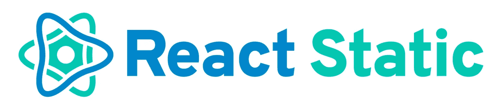
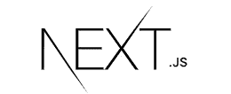
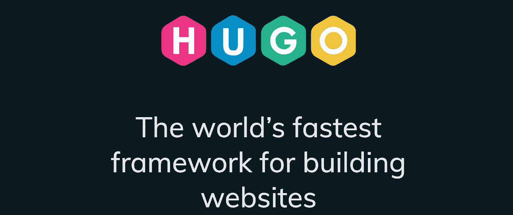
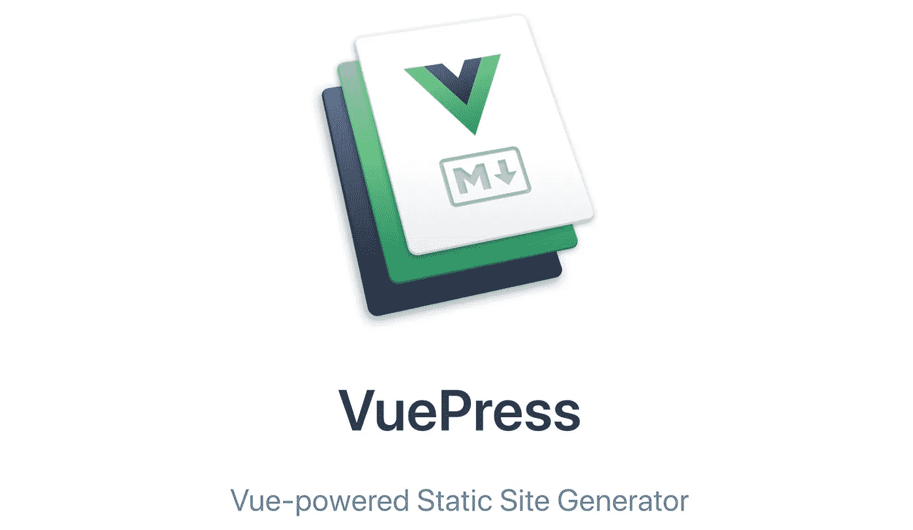
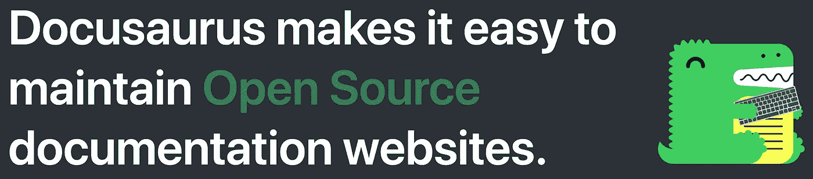
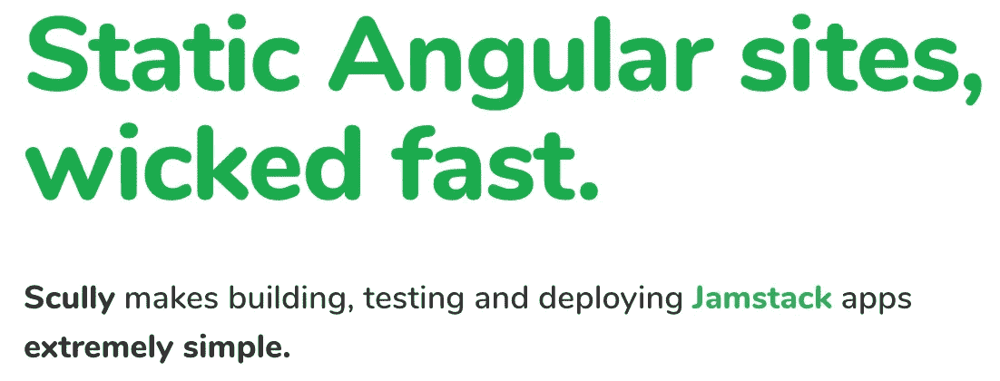
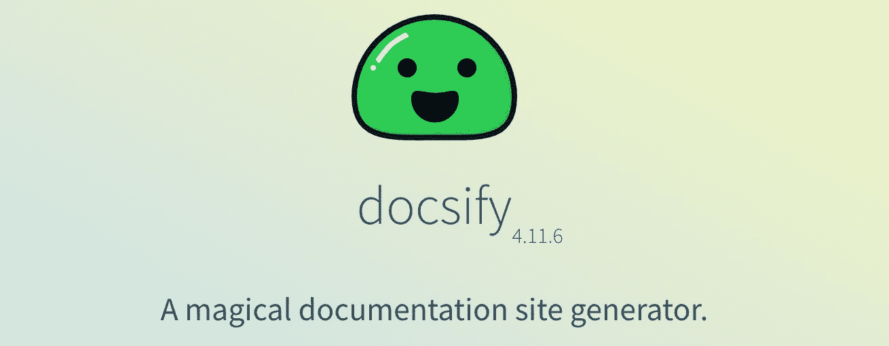
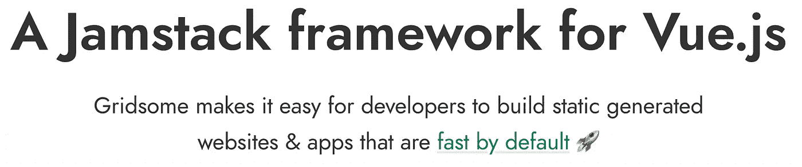

# 构建最快的 Web 应用程序的 14 大静态站点生成器

> 原文：<https://javascript.plainenglish.io/top-14-static-site-generators-for-building-fastest-web-applications-c17cf7c9c929?source=collection_archive---------5----------------------->

## 让我们进入最快网站的世界。

Photo by [Pankaj Patel](https://unsplash.com/@pankajpatel?utm_source=medium&utm_medium=referral) on [Unsplash](https://unsplash.com?utm_source=medium&utm_medium=referral)

静态站点生成器变得越来越流行。

在 web 开发的早期阶段，静态站点是为互联网服务的。然后，动态网站出现了，这被认为是一个伟大的进步。现在，静态网站又回来了，只不过这次是大规模的。

随着 [Jamstack](https://www.infoworld.com/article/3563829/jamstack-the-static-website-revolution-upending-web-development.html) 社区的发展，毫无疑问静态站点生成器是下一件大事。

这就是为什么今天，在这个故事中，我将向你介绍 14 个伟大的静态网站生成器。

让我们开始吧。

# 1.盖茨比（姓）

https://www.gatsbyjs.com/

如果你知道静态站点生成器的概念，你可能也知道 Gatsby，因为它是今天使用最多的。

让我爱上盖茨比的是它令人惊艳的外挂。每当我遇到问题时，总会有一个插件帮我解决。你应该慢慢来，试一试，每一秒都值得。

# 2.静电反应

【https://github.com/react-static/react-static 

React Static 是建立在 React 之上的另一个优秀的静态站点生成器。React Static 的目标是用一点点学习曲线提供一个简单且更好的开发。

# 3.工兵

[https://sapper.svelte.dev/](https://sapper.svelte.dev/)

Sapper 不仅仅是一个静态的站点生成器。不仅仅如此。您可以使用 Sapper 创建服务器呈现的页面，定义 API 端点，并构建高性能的 web 应用程序。

# 4.Nextjs

[https://nextjs.org/](https://nextjs.org/)

这一个构建在 React 之上，React 是迄今为止最流行的 JavaScript 框架，这使得 Nextjs 成为构建静态站点甚至服务器渲染应用程序和渐进式 web 应用程序的重要选择。

# 5.Nuxtjs

[https://nuxtjs.org/](https://nuxtjs.org/)

Nuxtjs 支持服务器渲染，也能够像 Nextjs 一样生成静态站点。虽然 Nextjs 是建立在 React 之上的，但是你需要 Vue 背景来使用 Nuxtjs。

Vue 给你自动路由的能力。这就是为什么你应该考虑给 Nuexjs 一个尝试，因为路由是单页面应用程序的一个问题。

# 6.吉基尔博士

[https://jekyllrb.com/](https://jekyllrb.com/)

如果你注意到了，Github 页面是由 Jekyll 支持的。

哲基尔出现已经十几年了。用 Jekyll 生成一个高速站点并不是什么太复杂的事情。你可以用它来创建你的静态网站和博客，就像 Github 页面一样。

Jekyll 使用 markdown，一种用于文本格式化的标记语言，来为你的站点设计一个简洁的布局。此外，模板引擎 Liquid 将使这项任务变得更加简单。

最重要的是，如果您有一个现有的网站，并希望将其迁移到 Jekyll，您可以使用其内置工具来简化过程。

# 7.雨果

[https://gohugo.io/](https://gohugo.io/)

Hugo 提供了数百个主题，您可以在构建静态站点时从中选择。加上雨果是快速在创建一个网站的过程中。

如果你想建立一个没有复杂配置的网站，请查看 Hugo。

# 8.Vuepress

https://vuepress.vuejs.org/

Vuepress 由 Vue 提供支持，是一款用于技术文档的极简静态网站生成器。

Vuepress 还配有 Vue 驱动的主题系统和很酷的插件。Vuepress 的更多功能正计划在未来推出。试试看。

# 9.Docusaurus

【https://docusaurus.io/ 

您只需专注于撰写博客内容或文档，Docusaurus 将负责静态 HTML 文件并发布。

Docusaurus 的版本控制特性很酷。随着每个项目的发布，该特性将使您的文档保持最新。

# 10.史高丽

[https://scully.io/](https://scully.io/)

你可以用 Scully 来搭建快速有角度的 app 和静态网站。Scully 将整个网站预渲染为普通的 HTML 和 CSS，并给你一个基于角度的单页应用程序的能力。

# 11.十一

[https://www.11ty.dev/](https://www.11ty.dev/)

Eleventy 是一个可以和很多模板语言一起工作的软件，比如。哈佛商学院。md，。html，。ejs 等等。您甚至可以在一个项目中使用所有这些模板语言。

# 12.Docsify

[https://docsify.js.org/#/](https://docsify.js.org/#/)

Docsify 是生成文档网站的好工具。它解析 markdown 文件以 HTML 格式显示它们。

Docsify 支持 Vue 组件。这意味着您可以将这些组件混合到 markdown 文件中并进行渲染。但这还不是全部。

Docsify 甚至用有用的主题、插件和像离线使用、搜索功能、表情符号显示等很酷的功能来满足你。

# 13.网格体

[https://gridsome.org/](https://gridsome.org/)

如果 React 有盖茨比，那么 Gridsome 就是 Vuejs 的答案。Gridsome 是一个新项目，尽管它的特性吸引了一些人。如果你有单页应用的 SEO 问题，Vuejs 可能是你需要的解决方案。

Gridsome 还附带了一个很棒的插件生态系统，这将简化您构建静态站点的任务。

# 14.杜父鱼

[https://sculpin.io/](https://sculpin.io/)

Sculpin 是用 PHP 编写的，PHP 是当今最流行的语言之一。

像任何其他生成器一样，Sculpin 将你的 markdown 文件转换成静态 HTML 来加快网站的速度。

如果你熟悉 PHP，你应该试试这个。

# 结论

我们回到了 web 开发的早期阶段，只有简单的静态 HTML 文件。不过，这不是倒退进化。

静态站点可以为您节省大量的时间和金钱，并且仍然可以生成高性能的 web 应用程序。

你现在正在使用静态站点生成器吗？你最喜欢哪一个？你对网络的发展有什么看法？

希望你喜欢这个故事。

# 进一步阅读

 [## 每个 Web 开发人员都应该遵循的最佳实践

### 无论 React 如何发展，这些实践永远不会过时。

medium.com](https://medium.com/javascript-in-plain-english/8-react-best-practices-every-web-developer-should-follow-c485beee7ea4)