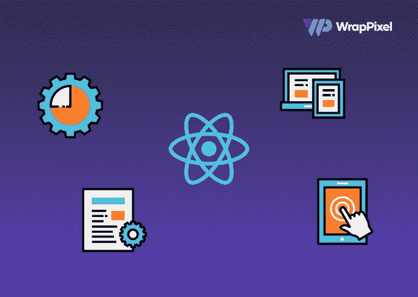

# 每个开发人员都应该收藏的 42 个资源

> 原文：<https://javascript.plainenglish.io/top-42-react-resources-every-developer-should-bookmark-latest-f35fa65e773b?source=collection_archive---------9----------------------->

每个开发者都需要资源！无论您是刚刚开始学习最流行的 JavaScript 库，还是已经是这方面的专家，都有大量的免费和付费资源，您可以从中获得一些灵感，学习新概念或只是听一些播客。

这里有一些最好的，你作为一个 React dev 应该收藏起来，并在需要的时候作为参考。他们从课程到学习，对世界上发生的一些最酷的事件做出反应。

# 课程

1.  [**React 教程**](https://react-tutorial.app/) :从零开始学习现代 React，在直观的环境中练习。在整个课程中，您将构建一个集成 Stripe 的在线超市购物应用程序。
2.  [**React 培训**](https://courses.reacttraining.com/) :这是 React 培训集团专业团队提供的一份全面的课程清单。制造 [React 路由器](https://reacttraining.com/react-router)的同一批人。
3.  [**React by ui . dev**](https://ui.dev/react/):从 React Redux 到路由器和独占事件你都在这个课程里得到。
4.  [**免费学习 React**](https://scrimba.com/learn/learnreact):通过 Scrimba 的直观平台，在构建两个应用程序和进行交互式编码挑战的过程中学习所有关键概念。
5.  [**React for 初学者**](https://reactforbeginners.com/) :这是 Wes Bos 的一个高级循序渐进的培训课程，让你构建真实世界的 React.js + Firebase 应用和网站组件。
6.  [**React 完整介绍，v5**](https://frontendmasters.com/courses/complete-react-v5/) :这个前端大师课程从头开始，开始使用 React 的最新特性，包括钩子、效果、上下文和门户。
7.  [**用 React**](https://www.pluralsight.com/paths/building-web-applications-with-react) 构建 Web 应用:Pluralsight 的个人资源全集。首先介绍 React 的基础知识。然后深入到如何设计，样式和服务器渲染组件，管理状态和测试和优化您的应用程序。
8.  [**Kati Frantz 的课程**](https://katifrantz.com/) : Kati 制作免费和付费的 React 课程，其中包括 TypeScript、NodeJS 和 testing 等技术。
9.  [**Epic React**](https://epicreact.dev/):Epic React 不仅仅是一门课程，它是由 Kent C. Dodds 主持的一系列代码交互式研讨会，包括高级 React 模式、React 性能等主题！
10.  [**React Security**](https://courses.reactsecurity.io/):Ryan Chenkie 的 React Security 是一系列课程，旨在帮助您了解如何在 React 应用程序中添加基本的安全特性。

# 播客

1.  [**React 30**](https://react30.com/) :关于 React 和所有 JavaScript 的 30 分钟播客。
2.  [**React 播客**](https://reactpodcast.simplecast.com/):React 生态系统中涵盖各种主题的最古老、最受欢迎的播客之一。它有 100 多集。
3.  [**React 综述**](https://dev.to/reactroundup):React 和社区专用播客。

# 事件

1.  [**reactjsday**](https://2020.reactjsday.it/) :从 jsday 这样的活动组织者来看，今年的 reactjsday 有行业领袖的演讲，他们将谈论测试、React Native、React Hooks 等等！
2.  [**reactiveconf**](https://reactiveconf.com/) :旨在连接欧洲技术社区的年度会议正在举办这项活动，共有 10 场研讨会，5 位以上的演讲人，主题包括 PWA、安全性、优化等。
3.  [**React Wednesdays**](https://www.telerik.com/react-wednesdays):React Wednesdays 是 React 世界中最优秀、最聪明的人与首席开发者倡导者 TJ VanToll 一起参加的每周访谈节目。
4.  [**Byteconf React**](https://www.bytesized.xyz/conferences/byteconf-react-2020/):Byteconf React 是一个 100%免费的两天会议，有世界上最好的 React 演讲者和老师。
5.  [**社区会议**](https://reactjs.org/community/conferences.html) :所有即将到来的 React 事件的官方集合。

# 文章/博客

1.  [**ReactJS 官方博客**](https://reactjs.org/blog/all.html/) :一个确定的东西要收藏！准备好在他们的官方网站上阅读 React 每个版本的所有新内容。
2.  [**scotch . io**](https://scotch.io/tag/react):scotch . io 网站上有更新的博文和文章列表。不同的作者聚集在一个平台下，与他人分享他们的教程和课程。
3.  [**Alligator.io**](https://alligator.io/) :该平台的目标是尝试让人们轻松快捷地理解包括 React 在内的各种技术中的事物。
4.  [**砸杂志**](https://www.smashingmagazine.com/category/react) :如果你在寻找高质量的 React 文章，那么砸杂志是必须的。他们有各种主题的广泛而深入的教程。
5.  [**LogRocket 博客**](https://blog.logrocket.com/) : LogRocket 的博客每周更新。他们还有关于参考指南的额外部分。
6.  [**开发者社区**](https://dev.to/t/react) :一个不断成长的开发者社区，他们撰写并分享他们对 React 生态系统的想法。
7.  [**【Freecodecamp】**](https://www.freecodecamp.org/news/tag/react/):初学者最喜欢的平台，有一堆 React 的更新优质文章定期贴出。
8.  Robin Wieruch 的博客 :大量的文章来自 Robin，他的主题包括 React Hooks、Redux、NodeJS 等。
9.  Dave Ceddia 的博客 : Dave 是一名软件工程师，他的文章主要涉及 React 生态系统以及各种其他技术，如 Tailwind、Git、Svelte 等。
10.  [**Flavio Copes 博客**](https://flaviocopes.com/tags/react/) :如果你需要一些一口大小的教程或者讲解，那么 Flavio 精通。文章解释了一个小问题和解决方案。

# 书籍/电子书

1.  凯·派勒 著 [**React from Zero:这是一本 20 课的书，用简单的 JavaScript 一步一步地教你 React 是如何工作的。**](https://www.newline.co/react-from-zero/)
2.  [**React JS Notes for Professionals by Goal Kicker**](https://goalkicker.com/ReactJSBook/):这本书是 Stackoverflow 的人写的，有 20 多个章节详细介绍了 React JS 的重要部分。
3.  [**【Flavio Copes**](https://reacthandbook.com/)的 React 手册:这本书在深入 React 主题之前，重点学习一些 come JavaScript 概念。
4.  Robin Wieruch 的《反应之路》(The Road To React):这是一本非常受欢迎的书，有三种形式——最基本的、基本的和专业的。
5.  戴夫·塞德迪亚 【纯 React】这本书超越了正确解释 React 为何重要的范围，教你如何构建 Slack、Reddit、Hacker News 和 Pinterest 等大型产品的克隆版。
6.  [**扎克戈登**](https://www.ostraining.com/books/react/) 解释 React:学习所有重要的 React 概念，并在最终数据库和 CRUD 功能上做一个最终项目。
7.  [**学习 React Hooks 作者:Daniel Bugl**](https://www.packtpub.com/product/learn-react-hooks/9781838641443) :在本指南中，你将使用 React Hooks 制作一个复杂的 UI 应用程序，同时学习上下文 API。
8.  亚历克斯·班克斯和伊芙·波尔切洛的《学习反应》，第二版 :首先你将学习如何使用函数式编程和最新的 ECMAScript 特性。然后，您将能够看到 React 是如何工作的。
9.  Anthony Accomazzo，Nate Murray，Ari Lerner，Clay 奥尔索普，David Guttman 和 Tyler McGinnis :这本书有 15 个章节的巨大资源，示例应用程序，详细的解释，并随着最近的变化而更新。
10.  Mark tie lens Thomas[**React in Action:这本书侧重于向前端开发人员介绍 React 世界，它有大量的例子可供参考，也涵盖 React 工具。**](https://www.manning.com/books/react-in-action)

# React 模板

1.  [**Reactjs 模板由 WrapPixel**](https://www.wrappixel.com/templates/category/react-templates/) 提供:他们在麻省理工学院许可下提供高质量和免费的 react 管理仪表板和网站模板。这可以帮助你在你的个人和商业项目中免费使用它。还包括高级 react 模板，其中有许多具有惊人设计的现成组件。一定要检查。
2.  [**React Themes by theme forest**](https://themeforest.net/search/react%20templates):有多种 React 模板。都是付费模板。
3.  [**React 模板 by Bootstrapdash**](https://www.bootstrapdash.com/react-admin-templates/) :提供一些不错的免费和高级 React 模板。
4.  [**按编码主题反应管理**](https://codedthemes.com/item/category/templates/react-admin-templates/) :他们有 1 个免费和 1 个高级反应管理模板。

我们希望这些能帮助你提高你需要的反应知识。通过关注他们的官方网站，继续探索 React 提供的巨大生态系统。