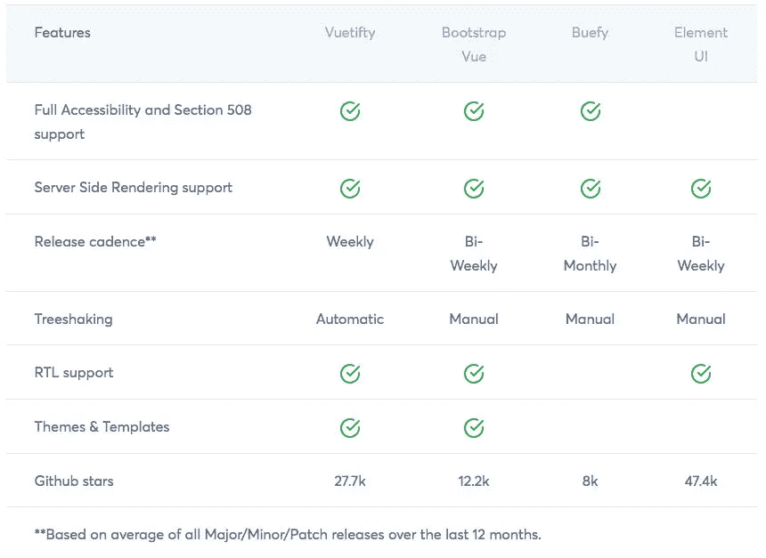
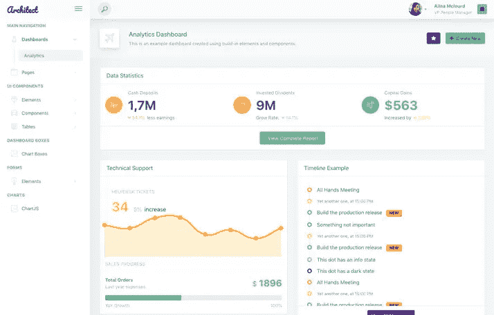
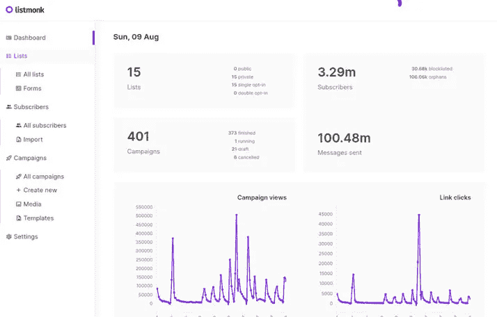
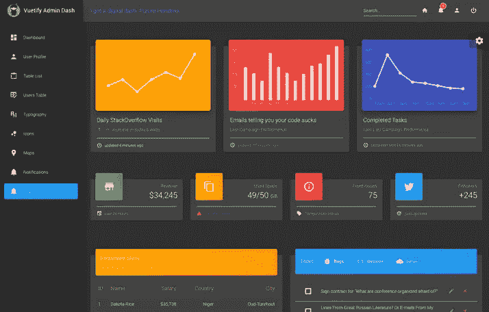
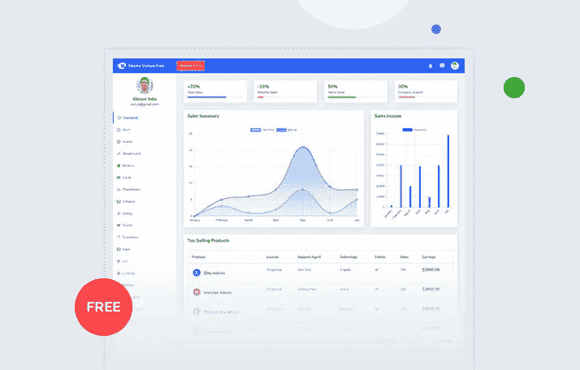

# 五大免费 Vue 仪表盘

> 原文：<https://javascript.plainenglish.io/top-5-free-vue-dashboards-framework-comparison-ae43aef9fb6b?source=collection_archive---------9----------------------->

市场上和世界各地还有许多人们经常喜欢的其他框架。但是 Vue.js 框架不一样，是 2020 的后起之秀。从一开始，Vue 就有不同的可用框架，它们非常棒。我们要比较它们，所以你可以选择最好的。

# Vue 框架对比 2020

# 2020 年的免费 Vue 仪表盘

[**Vue 仪表盘**](https://www.wrappixel.com/templates/category/vuejs-templates/) 是买家需求最多的模板之一。这只是因为有很多定制选项可用。然而，要使用 Vue 模板，你需要学习一些基本的编码技巧。

如果你担心编码，那么请保持冷静，因为这个模板非常简单，并且使用 Vue 路由器作为导航链接。

# MaterialPro 免费虚拟化仪表板精简版

您可以使用我们的 MaterialPro Vue.js dashboard Lite 为您的 web 应用程序创建一个整洁而令人惊叹的界面，或者您也可以介绍产品。它采用了谷歌基于材料的设计和一些令人难以置信的组件。

当你创建一个项目时，它使你的生活变得简单和容易。有很多令人惊奇的页面模板可以帮助你创建新的页面。

[**下载 material pro Vue Dashboard Lite**](https://www.wrappixel.com/templates/materialpro-vuetify-admin-lite/)
[**实时预览 material pro Vue Dashboard Lite**](https://www.wrappixel.com/demos/free-admin-templates/materialpro-vuetify-free/main/#/dashboard/basic-dashboard)

# 建筑师用户界面

Architect UI 由@ Vue/CLI 3 . 4 . 1 版提供支持。Bootstrap 4 在 vue 上实现，包含近 15 个精选的 Vue 小部件。它的组件彼此完美地集成在一起，形成了一种通用的设计语言。

如果你想使用 Vue admin，那么你需要知道一些基本的编码技巧。如果你担心编码，那么不用担心，因为它有一些简单的编码和导航链接的 Vue 路由器。

[**下载架构**](https://github.com/admin-dashboards/vue-dashboard-architectui-free)
[**实时预览架构**](https://vue-dashboard-architectui-free.admin-dashboards.com/#/)

# 李斯特蒙克

Listmonk 是自托管、独立、时事通讯和邮件列表管理器。它被打包成一个单一的二进制，功能丰富，速度非常快。为了存储数据，listmonk 使用 PostgreSQL 数据库。

[**下载 Listmonk**](https://github.com/knadh/listmonk)

# 验证管理仪表板

Vuex 和 Vuetify 都用于构建 Vuetify 管理仪表板。如果您想立即开发您的仪表板，Vuetify 和 Vues 可以帮助您开始。

Vuetify 仪表盘非常简单易用，但是您需要了解一点 Vue、Vue 路由器和 Javascript 知识才能使用它。

[**下载虚拟化管理仪表板**](https://github.com/ClintOxx/vuetify-admin-dashboard)

# Xtreme Vue 管理仪表板精简版

Xtreme Vuesax Admin Lite 是基于 Vue CLI、Vuex & Vuesax 组件框架的易用且功能强大的 VueJs 管理仪表板模板。

如果你想为自己或客户的项目建立一个后端管理面板，Xtreme Vuesax Admin Lite 是一个完美的选择。它具有易于使用的特性，并且高度可定制。你可以使用我们的[免费 Vuejs 模板](https://www.wrappixel.com/templates/category/vuejs-templates/)创建好看的应用或产品。

[**实时预览 Xtreme Vue 管理仪表盘 Lite**](https://www.wrappixel.com/demos/free-admin-templates/xtreme-vuesax-free/#/starterkit)
[**下载 Xtreme Vue 管理仪表盘 Lite**](https://www.wrappixel.com/templates/xtreme-vuesax-admin-lite/)