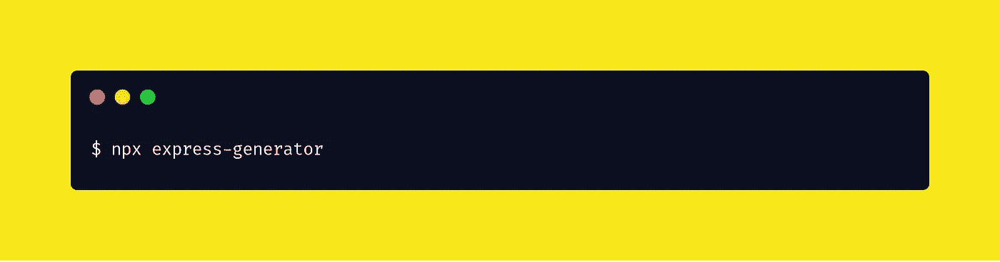
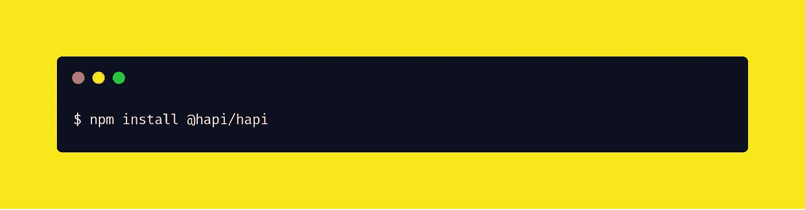
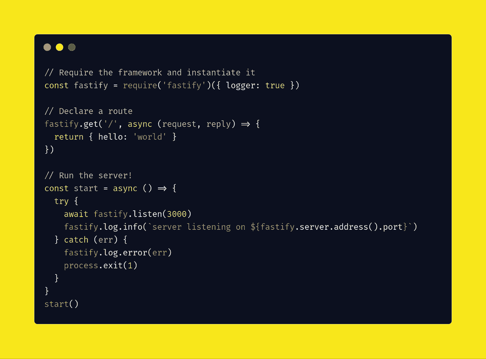

# Node.js 的 5 大框架

> 原文：<https://javascript.plainenglish.io/top-5-friendly-node-js-frameworks-for-developers-eee4a9d3ffa8?source=collection_archive---------0----------------------->

## 最佳节点框架

Fastify is twice as fast as Express

首先，框架旨在帮助您克服从头构建 web 应用程序时的一些常见开发挑战。在为自己选择 Node.js 框架之前，应该考虑哪些事情？为了帮助你回答这个问题，今天，我将介绍 5 个最好的 Node.js 框架。

让我们现在开始。

# express . js——node . js 的快速、无偏见、极简主义的 web 框架

如果您是 Node.js 新手，这是您应该开始使用的框架。它是 Node.Js 最著名的框架之一。

## Express.js 提供了哪些功能？

Express 是一个最小且灵活的 Node.js web 应用程序框架，为 web 和移动应用程序提供了一组强大的功能。

*   它允许您绘制单页和多页，以及不同的 web 应用程序。
*   自带 MVC(模型-视图-控制器)。
*   它允许用户动态呈现大型 HTML 页面，也允许您通过设置中间件来响应 HTTP 请求。
*   它实际上是一个路由表，即一组路由库。这些库集合基于 HTTP 方法执行各种 web 操作。
*   它还配备了多视图支持系统。用户对极快的 I/O 和它强大的 API 印象深刻，使路由更容易、更快。
*   它支持 23+模板引擎，简单的 HTTP 方法，异步，它总是关注性能。

## 如何安装 Express.js？

您可以使用如下命令将 Express.js 作为包依赖项安装。

或者，您可以使用 express-generator 命令行工具来快速创建应用程序框架。

例如，下面创建了一个名为`myapp`的 Express 应用程序。该应用程序将被创建在当前工作目录下名为`myapp`的文件夹中，视图引擎将被设置为`Pug`。

## 进一步阅读…

以下是一些有用的 Express.js 链接。

*   [首页](http://expressjs.com/)
*   [文档](http://expressjs.com/en/starter/installing.html)
*   [GitHub](https://github.com/expressjs/express)
*   [npm](https://www.npmjs.com/package/express)

# KOA . js——node . js 的下一代 web 框架

它由构建 Express.js 的开发人员设计，专注于 Express.js 中没有提供的方法库。事实上，它提高了 web 应用程序和错误管理的质量。

## Koa.js 提供了哪些功能？

Koa.js 可用于开发潜在的基于 web 的应用程序和 API。它提供如下功能。

*   它提供了更多的定制选项。
*   允许使用限制回调使用的生成器，这反过来为开发人员提供了一个更好的错误处理系统。
*   它没有在核心中打包任何中间件。这使得用 Koa.js 编写服务器更快更有趣。
*   Koa.Js 默认提供了一些有用的策略，用于一般任务，比如缓存的新鲜度、内容协商、代理支持。
*   它支持 syn/await 关键字，有助于整洁地管理您的代码。Koa 总是可以清理任何回调导致的代码混乱。

## Koa.js 怎么安装？

Koa 要求 ES2015 和异步功能支持`node v7.6.0`或更高版本。您可以使用您喜欢的版本管理器快速安装受支持的 node 版本。

## 进一步阅读…

社区链接，了解 Koa 的第三方中间件、完整的可运行示例、全面的指南等等！如果您有问题，请加入我们的 IRC！

*   [GitHub 资源库](https://github.com/koajs/koa)
*   [例题](https://github.com/koajs/examples)
*   [中间件](https://github.com/koajs/koa/wiki)
*   [维基](https://github.com/koajs/koa/wiki)
*   [G+社区](https://plus.google.com/communities/101845768320796750641)
*   [邮件列表](https://groups.google.com/forum/#!forum/koajs)
*   [指南](https://github.com/koajs/koa/blob/master/docs/guide.md)
*   [常见问题解答](https://github.com/koajs/koa/blob/master/docs/faq.md)
*   freenode 上的 **#koajs**

# 哈比神— t **他简单、安全的框架**

哈比神设计了与 Express.js 类似的架构，并专注于编写更少的代码。虽然 Hapi.js 是 web 应用程序的开源框架，但它也是一个服务器框架

## Api 提供了哪些特性？

它有助于构建功能强大、可伸缩的应用程序，同时具有最小的开销和完整的开箱即用功能。

*   它为用户提供路由、I/O 验证和缓存。
*   修正错误和增加新功能与哈比神。Js 提供了一个强大的插件网络，可以让你享受这些特性，因此它又快又聪明。
*   它允许用户使用 MySQL、MongoDB 和 Postgres 来创建潜在的静态网站。
*   它通过将请求从其主 API 转发到其他来源来帮助用户。
*   它还允许用户享受实时聊天应用程序和其他社交应用程序。
*   它使得呈现动态内容变得更加容易。

## 如何安装哈比神？

创建一个新目录`myapp`，并从那里开始:

*   运行:`cd myapp`，这将进入创建的项目文件夹。

*   运行:`npm init`并按照提示操作。这将为您生成一个 package.json 文件。

*   运行:`npm install @hapi/hapi`，这将在您的`package.json`文件中安装最新版本的 hapi 作为依赖项。

这是一个非常基本的 hapi 服务器。

## 进一步阅读…

这里是一些有用的哈比神链接。

*   [变更日志](https://hapi.dev/resources/changelog)
*   [模块状态](https://hapi.dev/resources/status)
*   [书籍](https://hapi.dev/resources/list#books)
*   [要点和代码示例](https://hapi.dev/resources/list#gists)
*   [样板文件](https://hapi.dev/resources/list#boilerplates)
*   [用 hapi 建造的项目](https://hapi.dev/resources/list#projects)
*   [教程](https://hapi.dev/resources/list#tutorials)
*   [视频](https://hapi.dev/resources/list#videos)

# fastify——用于 Node.js 的快速低开销 web 框架

Fastify 是一个受哈比神和 Express 启发的 Node.js 框架。它自豪地为一个庞大的组织和产品生态系统提供动力。

## Fastify 提供了哪些功能？

输入 Fastify。Fastify 是一个高度专注于以最少的开销和强大的插件架构提供最佳开发者体验的 web 框架。它是目前最快的 web 框架之一。Fastify 的速度是 Express 的两倍。

## 如何安装 Fastify？

使用 npm 快速安装。

然后创建`server.js`，添加以下内容。

最后，用。

你可以用。

在 Fastify 中，编写的代码比在 Express 中要少。例如，在 Express 中，您需要导入一个额外的包来处理 JSON 请求和响应。在 Fastify 中，您只需处理对象文字，JSON 部分由框架自动处理。

## 进一步阅读…

这里有一些有用的 Fastify 链接。

*   [首页](https://www.fastify.io)
*   [文档](https://www.fastify.io/docs/latest/)
*   [生态系统](https://www.fastify.io/ecosystem/)
*   [基准](https://www.fastify.io/benchmarks/)
*   [GitHub](https://github.com/fastify)

# restify——node . js REST 开发的未来

Restify 是 Node.Js 的一个知名 REST API 框架。

## Restify 提供了哪些功能？

Node.js web 服务框架针对构建语义正确的 RESTful web 服务进行了优化，可用于大规模生产。restify 针对自省和性能进行了优化，并被用于一些最大的 Node.js 部署中

*   它是 Node.Js 的早期框架之一。
*   它与 HTTP 动作、周期请求和响应直接协调工作。
*   它还提供对 DTrace 的自动支持。
*   它为 web 和客户端组件提供双向通信。它还可以帮助你广播和存储数据。
*   Restify 让您可以立即系统地处理错误。它提供了多个错误捕获函数，可以捕获发生的错误。

## 如何安装 Restify？

用 npm 重新定义。

设置服务器既快速又简单。这是一个准系统 echo 服务器。

## 进一步阅读…

这里有一些有用的 Restify 链接。

*   [首页](http://restify.com)
*   [文档](http://restify.com/docs/home/)

Node.js 框架在现代应用程序的发展中一直扮演着至关重要的角色。您应该尝试本文中的最佳 Node.js 框架列表。

有用吧？

感谢阅读😘，再见👋，别忘了👏最多 50 次并跟随！