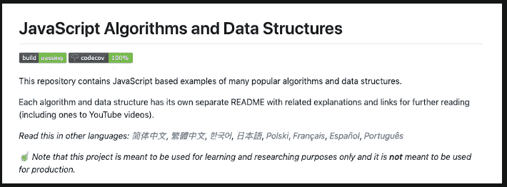
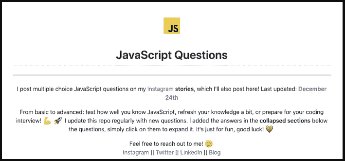
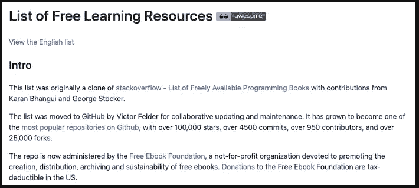
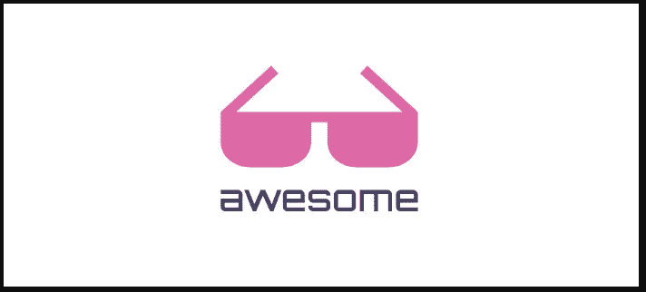
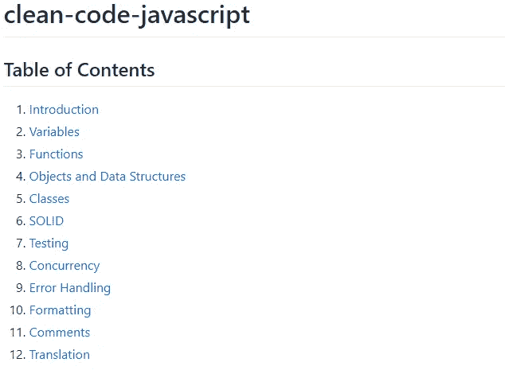

# 每个 Web 开发人员都应该知道的五大 Github 库

> 原文：<https://javascript.plainenglish.io/top-5-github-repositories-every-web-developer-should-know-d2feb3fdc214?source=collection_archive---------5----------------------->

## 面向 web 开发人员的 5 个出色的 Github 存储库

Photo by [Peter Scherbatykh](https://unsplash.com/@sm83?utm_source=medium&utm_medium=referral) on [Unsplash](https://unsplash.com?utm_source=medium&utm_medium=referral)

# 介绍

作为一名普通的开发人员，您需要不断学习新的工具和技术，因为这个行业正在发生很大的变化。成为所有公司都在寻找的开发人员的唯一方法是每天学习新的东西，并对你所做的事情充满热情。只要记住学习永不停止。

在这篇文章中，我收集了你可以在 GitHub 上找到的五个很棒的资源库，它们肯定会给你带来即时的知识提升。让我们开始吧。

# 1.JavaScript 算法和数据结构

这个知识库在 Github 上有超过 80，000 颗星星。它包含了许多流行算法和数据结构的基于 JavaScript 的例子。结构真的很好，因为这些例子被标记为初学者或高级。因此，无论你对密码学、排序、图形、甚至机器学习(以及更多)感兴趣，都会有适合你的东西。

JavaScript Algorithms and Data structures.

有兴趣的可以在这里查看[。](https://github.com/trekhleb/javascript-algorithms)

# 2.(高级)JavaScript 问题列表

这个知识库在 Github 上有超过 20，000 颗星星。它是由[莉迪亚·哈利](https://github.com/lydiahallie)创建的，她是一名独立的软件工程师，喜欢创建和分享关于计算机科学的有用内容。如果你想测试你的 JavaScript 知识或者准备工作面试，这是一个非常棒的知识库。莉迪亚不断给它添加新的问题。

JavaScript Questions.

有兴趣可以去查一下 [Github 库](https://github.com/lydiahallie/javascript-questions)。

# 3.免费学习资源列表

这个令人敬畏的资源库提供了大量免费的编程书籍、截屏、播客，甚至各种在线课程。它在 Github 上有超过 165，000 颗星，也有很多贡献。如果你正在寻找学习材料，这个资源库是一个很好的地方。

Free Learning Ressources.

你可以点击查看[。](https://github.com/EbookFoundation/free-programming-books)

# 4.可怕的

Awesome 是最受欢迎的 Github 库之一，它收集了从软件开发到硬件再到商业的所有主题。此刻它在 Github 上有超过 144，000 颗星。你可以花上几天几夜浏览它。如果你想学习新的东西，这是一个很好的资源。

Awesome.

如果你想探索的话，这里有 [Github 库](https://github.com/sindresorhus/awesome)。

# 5.JavaScript 中的干净代码

知道如何编写干净的代码对几乎每个开发人员来说都是一项有用的技能，并且是许多项目和公司的必备技能。这个库(超过 40，000 颗星)采用了 Robert C. Martin 的干净代码的概念，并将其应用于 JavaScript，以便您可以在未来的工作中使用它们。

Clean JavaScript Code.

有兴趣可以查看一下 [Github 库](https://github.com/ryanmcdermott/clean-code-javascript)。

# 结论

正如你所看到的，这是很多有用的内容，你可以从中受益，而不必付费。如果你想成为一名优秀的开发人员，你需要做的就是牺牲一些时间和精力在学习上，因为它永远不会停止。

感谢您阅读本文，希望您觉得有用。

# 进一步阅读

 [## 你应该知道的 5 个 JavaScript 面试问题

### 5 个 JavaScript 面试问题及答案

medium.com](https://medium.com/javascript-in-plain-english/5-javascript-interview-questions-that-you-should-know-b96de223a51b)