# 2020 年前端开发的五大热门 JavaScript 框架

> 原文：<https://javascript.plainenglish.io/top-5-in-demand-javascript-frameworks-for-front-end-development-in-2020-a59c4340d082?source=collection_archive---------0----------------------->

对现代 JavaScript 前端开发的顶级 JavaScript 框架进行深入分析和排名

Photo by [Judi Neumeyer](https://unsplash.com/@jneumeyer?utm_source=unsplash&utm_medium=referral&utm_content=creditCopyText) on [Unsplash](https://unsplash.com/s/photos/five?utm_source=unsplash&utm_medium=referral&utm_content=creditCopyText)

很久很久以前，软件工程师使用服务器端 MVC Web 框架如 **JSP/JSF、Ruby On Rails、PHP Laravel、Django** 来开发 Web 应用。2010 年，当基于 JavaScript 的客户端 Web 开发框架 **Knockout.js** 、 **Backbone.js、**尤其是 **AngularJS** 出现时，局面发生了逆转。目前，基于 JavaScript 的 Web 框架正主导着前端开发领域，这一趋势还将继续。

如果你想从前端开发开始你的职业生涯，或者如果你是一名经验丰富的 JavaScript 开发人员，现在想提升你的技术技能，那么你应该学习哪个框架？或者，如果您的组织最终计划更新其前端堆栈，那么选择哪个 JavaScript 框架呢？

> 答案很棘手。首先，市场上有太多基于 JavaScript 的 Web 开发框架。每年都有新的 JavaScript 框架大张旗鼓地加入市场，而其他一些 JavaScript 框架却退出了。一年之内，一个新的 JavaScript 框架可能会崛起，但第二年就会消失。

在这里我列出了**五个 JavaScript 框架**主要是给**想进入现代前端开发的求职者和 JavaScript 开发者**。此外，我给出了这些框架的概述和排名，以便**组织可以为他们的单页面应用项目选择正确的框架**。以下是我用来制作榜单和排名的标准:

*   这些框架已经**在行业内建立**并被公司和社区采用。
*   根据可靠和知名的消息来源(GitHub、NPM 趋势),它们非常受欢迎
*   他们得到一些大公司或工业的支持。
*   他们有一个庞大而充满活力的社区。
*   他们有优秀的工具和库。
*   他们在就业市场上有很高的需求(Indeed.com)
*   这些框架还没有走到生命周期的尽头，正在等待慢慢死去(比如 jQuery、AngularJS、Knockout.js)
*   他们不是 Preact，Next.js，Nuxt.js 这样的元框架。

# 1.反应

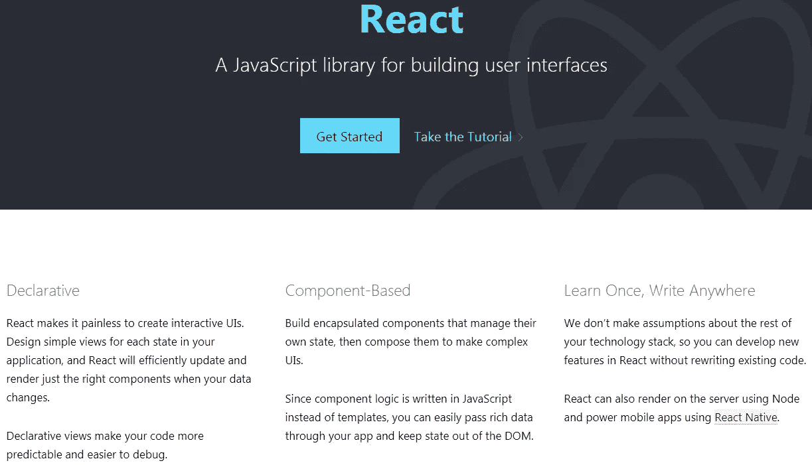

Source: [React](https://reactjs.org/)

服务器端前端框架严重影响了最早的 JavaScript 前端框架，如 AngularJS。所有这些框架都使用了 **MVC(模型-视图-控制器)模式或者它的变体(MVVM，MVW)** 。

2013 年，由 Jordan Walke 领导的一群年轻的脸书工程师质疑前端开发中的 MVC 框架和双向数据绑定。他们开发了前端库 React，作为基于组件的 **web 框架，具有单向数据流**。它还介绍了前端开发中的一些其他后端模式，例如，**事件源、声明式编程、不可变状态**。

React 的另一个主要创新是引入了虚拟 DOM。由于操作 DOM 是一项繁重的操作，它在内存中维护一个虚拟 DOM，并且只批量更新虚拟 DOM 和真实 DOM 之间的差异。因此，React 在高度交互的网页上提供了更好的用户体验。

React 是迄今为止最具破坏性的前端框架，对其他基于 JavaScript 的前端框架产生了重大影响。

今天，React 就像前端框架中 800 磅的大猩猩。此外，在我以前的一篇文章中，我将 React 列为基于 JavaScript 的 Web 开发框架的第一名:

 [## 关于 2020 年软件发展趋势的 20 个预测

### 云、容器、编程、数据库、深度学习、软件架构、Web、App、批处理、流、数据湖…

towardsdatascience.com](https://towardsdatascience.com/20-predictions-about-software-development-trends-in-2020-afb8b110d9a0) 

## 5 个主要特点:

*   React-Core 只是视图层的一个基于组件的**库。为了实现业务应用程序，额外的 react 库用于路由、状态管理、样式、开发。它是这个列表中最不受欢迎的框架。**
*   尽管 React 取得了巨大成功，但它并没有停滞不前，而是一直在努力改进。脸书已经通过引入 React-Fiber 项目对 React-Core 进行了全面检查，以获得更好的并发性。React 还引入了 **React 挂钩**来移除样板代码和**悬念**来改进渲染。
*   脸书正在全力支持 T21。与谷歌的 Angular 不同，脸书在所有应用程序中都使用 React。因此，脸书的功能是久经考验的。它还拥有出色的工具支持。
*   React 的座右铭是:“**学一次，写在任何地方。”**脸书跨平台手机 App 开发平台“**React Native”**基于 React。React 还可以用来开发桌面 App(用电子)和后端开发(用 Node.js)。因此，开发人员可以在 Web、移动、桌面和后端使用相同的 React 组件。
*   React 还提供了同类最佳的服务器端渲染(SSR)和出色的 SEO 支持。

## 前 3 名职业选手

*   排名第一的 Web 开发框架毫无疑问。
*   React 可用于 Web、移动、桌面和后端开发。
*   在科技巨头脸书的支持下， **React 功能首先在 23.7 亿脸书用户中进行测试**。

## 三大弊端

*   React 不是一个端到端的框架。团队中需要一些 React 专家来为正确类型的应用程序选择正确类型的库。
*   React 包的大小相对较大，与其他一些框架相比，DOM 呈现性能相对较慢。
*   因为有许多函数式编程范例，所以学习曲线是适中的。

## 流行

React 是最受欢迎和最常用的前端框架，如 NPM 下载趋势所示:

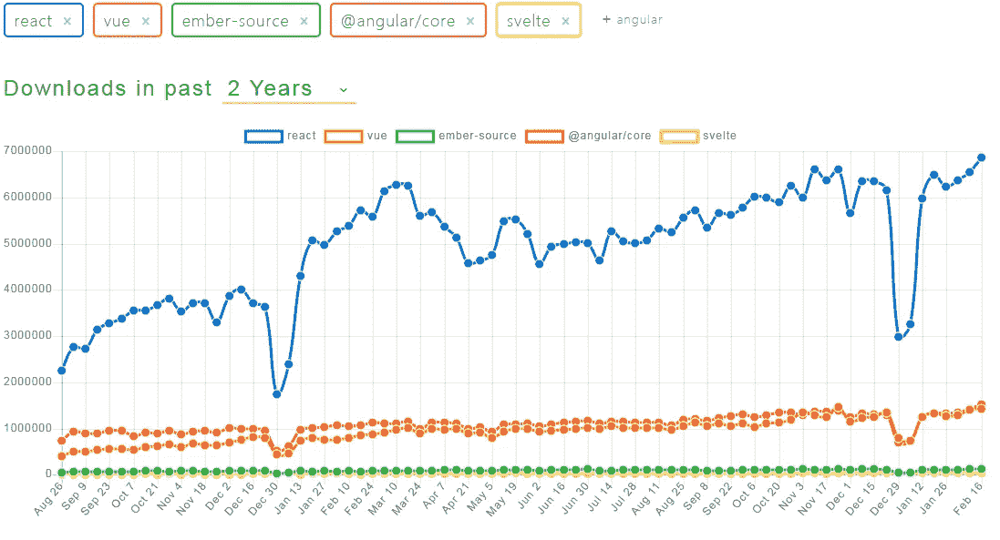

Source: [NPM trends](https://www.npmtrends.com/)

根据 GitHub 的说法，它是排名第二、贡献者数量第二的 Web 框架:

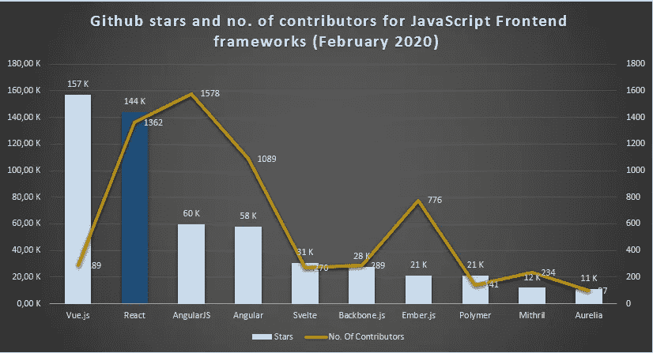

Source: [GitHub](https://github.com/)

StackOverflow 开发者调查将 React 列为第二大最常用的 Web 框架:

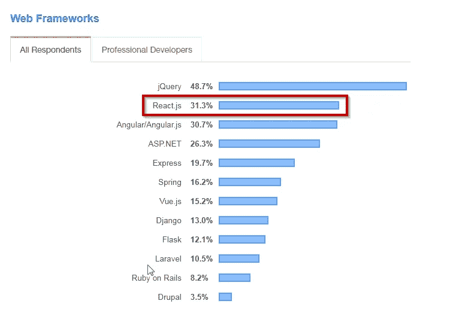

Source: [StackOverflow Developer Survey, 2019](https://insights.stackoverflow.com/survey/2019#most-popular-technologies)

根据“JavaScript 现状”调查，React 在满意度和认知度方面排名第一:

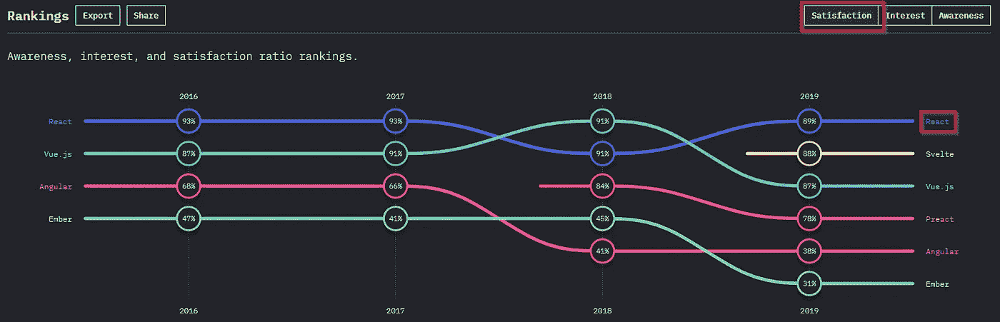

Source: [The State of JavaScript, 2019](https://2019.stateofjs.com/front-end-frameworks/)

根据 StackOverflow 开发人员调查，React 是最受欢迎的前端框架:

Source: [StackOverflow developer survey, 2019](https://insights.stackoverflow.com/survey/2019#most-loved-dreaded-and-wanted)

React 的排名第一是因为人们对 React 的兴趣仍在增加:

Source: [Google Trends](https://trends.google.com/)

## 工作市场

我正在使用流行的求职门户网站**寻找 JavaScript 框架的空缺职位。此外，我只显示美国的职位空缺。因此，这个数字并没有反映整个世界，但仍然显示了目前对前端框架的需求。**

和受欢迎程度一样，React 也主导着美国就业市场，如下图所示:

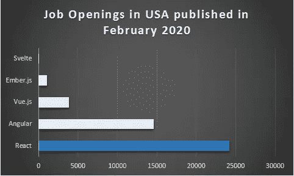

Source: [Indeed](http://www.indeed.com)

为了消除误报并获得准确的数字，我使用了搜索词“ *React(编程或开发人员或前端或软件或用户体验或用户界面)——反应堆工作”*

# 2.vue . j

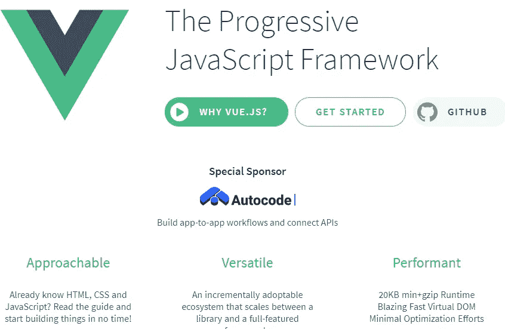

Source: Vue.js

当脸书发布 React 时，它一炮而红。突然谷歌发现 Angular JS (Angular 1)相比 React 已经过时，设计也很差。谷歌随后抛弃 AngularJS，发布 Angular (Angular 2)。但是一位谷歌软件工程师**尤雨溪**不这么认为，他结合了**AngularJS(视图层)和 React(虚拟 DOM)的优点，在 2014 年创建了一个新的 JavaScript 框架:Vue.js** 。

挑战谷歌和脸书这两大科技巨头并不是一件容易的事情。但从那以后，尤雨溪做得非常出色。目前，Vue.js 是最受欢迎和喜爱的 JavaScript 框架之一。它还成功地结合了 Angular，React 及其创新的许多好的部分。

在许多方面， **Vue.js 在 Angular 和 React** 之间提供了一条中间路线。它可以像 React 一样仅作为一个视图层使用，也可以作为一个具有路由、状态管理的端到端框架。它还提供了类似角度的数据绑定(带反应性)和类似使用虚拟 DOM 渲染的反应。

有了巨大的社区支持和大量的创新，尤其是在版本 3 中，Vue.js 只会变得更强大，并与 React 争夺头把交椅。

## 5 个关键特征

*   Vue.js 的主要设计目标是**通过提供渐进式应用程序开发和同类最佳文档来降低 JavaScript 前端开发的壁垒**。如果您有一个大型的 JavaScript 代码库，那么您可以使用 Vue.js 逐步更新您的代码库。
*   像 Angular 或 Ember.js 一样，Vue.js 也提供使用 Vue.js CLI 的端到端应用程序开发。它还像基于组件的框架一样提供了 React，具有外部数据流和状态管理。**它无疑是最灵活的 JavaScript 框架**。
*   它支持反应式**双向数据绑定(如 Angular)和虚拟 Dom、事件源(如 React)** 。
*   Vue.js 在这个行业已经有六年的历史，拥有大量的库、工具和框架。比如用 **Vuex** 做状态管理，用 **nuxt.js** 做应用框架。它是少有的同时支持 JavaScript 和 TypeScript 的 JavaScript 框架之一。
*   网络变化非常快，Vue.js 也在不断发展。最近， **Vue.js 在即将发布的 Vue.js 3.0 中用 TypeScript 完全重写了其核心库，在性能上有了很多改进**。

## 前 3 名职业选手

*   Vue.js 既作为自以为是的端到端框架**工作，也作为具有状态管理的视图层**。
*   更小的包，更快的加载时间。
*   Vue.js 拥有优秀的文档，进入门槛极低。

## 三大弊端

*   仍然缺乏行业内的大规模采用，尤其是大型企业。
*   没有 Angular 或 React 等科技巨头的支持。
*   它在移动应用程序开发中没有被广泛使用。

## 流行

在 GitHub 中，Vue.js 是最受瞩目的 JavaScript 框架:

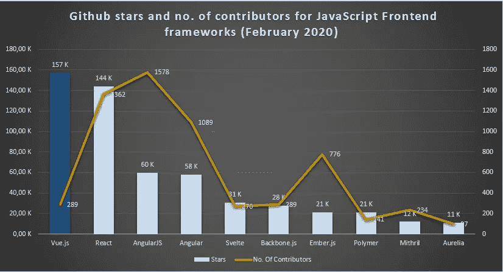

Source: [GitHub](https://github.com/)

StackOverflow 开发者调查将 Vue.js 排在所有 Web 框架的第 7 位:

Source: [StackOverflow developer survey, 2019](https://insights.stackoverflow.com/survey/2019#most-loved-dreaded-and-wanted)

根据“JavaScript 现状”调查，Vue.js 在兴趣方面排名第一:

Source: [The State of JavaScript, 2019](https://2019.stateofjs.com/front-end-frameworks/)

在 NPM 下载量方面，Vue.js 排名第三，正在缩小与 Angular 的差距:

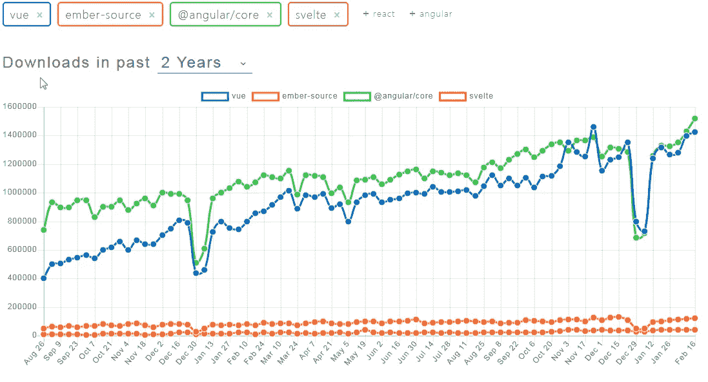

Source: [NPM trends](https://www.npmtrends.com/)

根据 2019 年 StackOverflow 开发者调查，它也是第二受欢迎的 Web 框架:

Source: [StackOverflow developer survey, 2019](https://insights.stackoverflow.com/survey/2019#most-loved-dreaded-and-wanted)

谷歌趋势也反映了对 Vue.js 的浓厚兴趣:

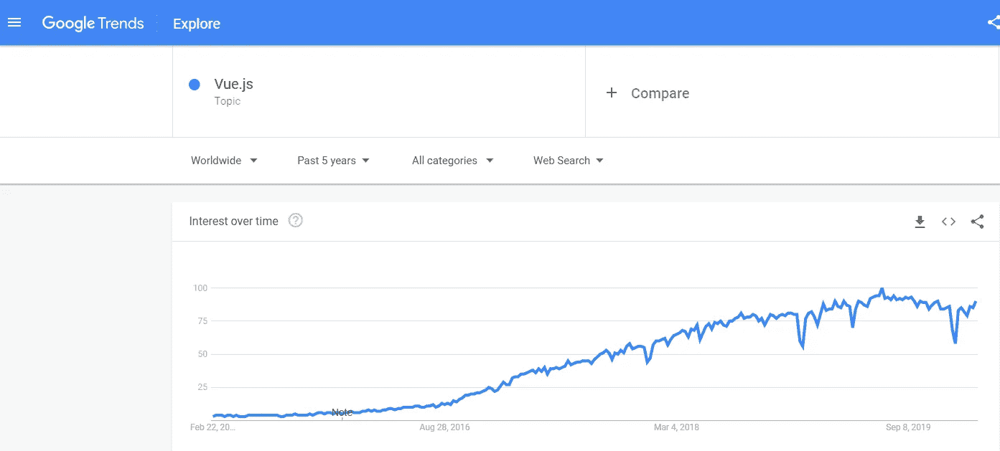

Source: [Google Trends](https://trends.google.com/)

## 工作市场

在美国，Vue.js 是要求第三高的 JavaScript 框架。

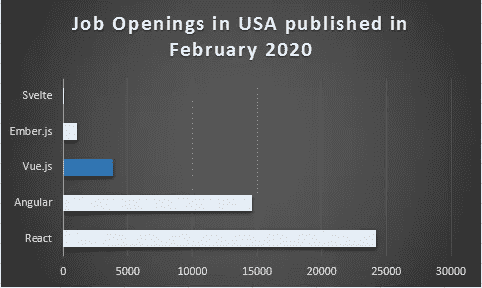

Source: [Indeed](http://www.indeed.com)

在亚洲，情况会有所不同，Vue.js 是最主要的框架。

# 3.有角的

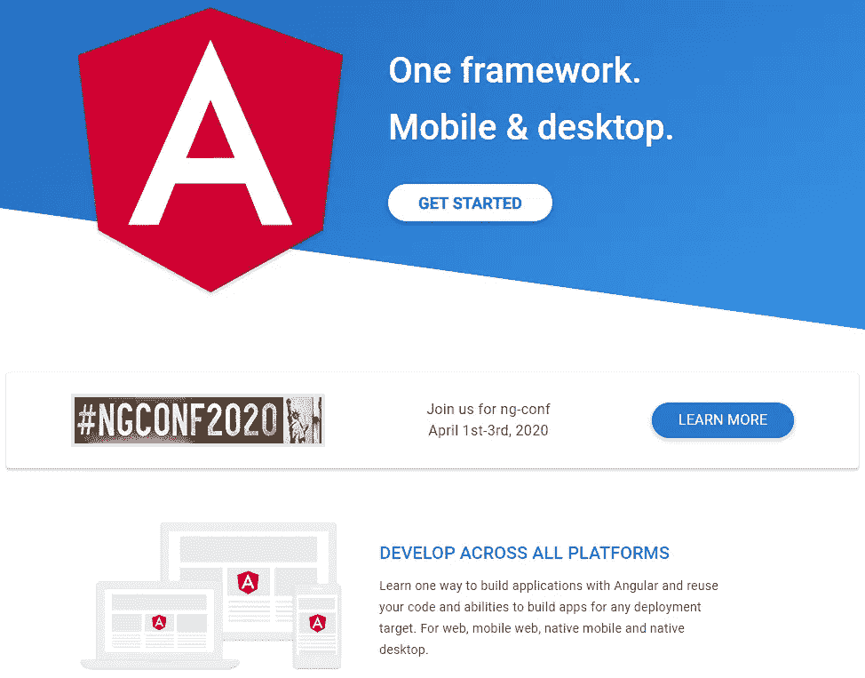

Source: [Angular](https://angular.io/)

当谷歌发布 **AngularJS** 时，它是一个巨大的成功，特别是它的**双向数据绑定**。一旦脸书在 2013 年发布 React，人们立刻**离开 AngularJS，加入 React 的潮流**。谷歌随后彻底重新设计了 AngularJS。他们花了很长时间，并在 2016 年发布了经过修改和重新设计的框架，名称为 Angular。

Angular 是一个**端到端框架，通过 watchers** 进行双向数据绑定。此外，它不使用虚拟 Dom，而是使用脏检查来同步模型和视图。Angular 从头开始使用反应式 JavaScript 平台 RxJS，并对函数式反应式编程提供了出色的支持。

Angular 的另一大贡献是**在 Web 开发中引入了 TypeScript，**在大型应用程序中提供了额外的优势。今天，所有其他主要框架也在向 TypeScript 发展。

Angular 没有像 React、Vue.js 或 Svelte 那样受到太多关注。但它仍然是一个**成熟而坚实的框架**，是大型企业的良好选择。

## 5 个关键特征

*   Angular 是一个固执己见的端到端框架。在 **Angular CLI** 中，它拥有 JavaScript 领域中最好的 CLI 之一。通过 angular CLI 中的一个命令，您可以安装所有的库来开发支持路由、双向数据绑定、HTML 客户端、验证等的企业级应用程序。
*   它也是最神奇的框架，因为它隐藏了大量的 Javascript 复杂性。如果有人有 JavaEE/ASP.NET 方面的经验，那么使用 Decorators、依赖注入、TypeScript 是完美的框架。
*   就安全性而言，它无疑是最安全的 JavaScript 框架。通过 DOM 清理，它消除了跨站点脚本攻击。
*   有一种误解认为 Angular 已经停滞不前，面临慢性死亡，我觉得这是错误的。谷歌和社区都在努力改进 Angular。最近它增加了**延迟加载，差异加载来改善模块**的加载时间。
*   Angular 因其庞大的包大小、缓慢的启动时间和缓慢的响应时间而臭名昭著。幸运的是，凭借其**新的渲染引擎 Ivy(在 Angular 9 中发布)**，Angular 已经改善了所有这些问题。

## 前 3 名职业选手

*   端到端自以为是的框架，支持开发企业应用。
*   使用 TypeScript 并将模板从样式和业务逻辑中分离出来，这特别适合于企业级大型代码库。
*   Angular 可以用来开发 **Web、移动和桌面**应用。

## 三大弊端

*   由于复杂性和高级特性，进入 Angular 的门槛非常高，尤其是对于 JavaScript 开发者和新开发者。
*   由于 Angular 的重量级特性，它不适合小型应用。
*   Angular 是一款功能丰富但是很重的。就捆绑包大小而言，它是最重的 JavaScript 框架，就渲染性能而言，它是最慢的。

## 流行

在 GitHub 中，Angular 是排名第四的 JavaScript Web 框架:

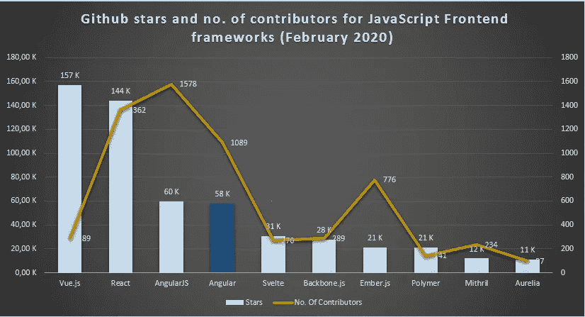

Source: [GitHub](https://github.com/)

StackOverflow 开发者调查将 Angular 排在所有 Web 框架的第三位:

Source: [StackOverflow developer survey, 2019](https://insights.stackoverflow.com/survey/2019#most-loved-dreaded-and-wanted)

根据“JavaScript 现状”调查，Angular 在认知度方面排名第二:

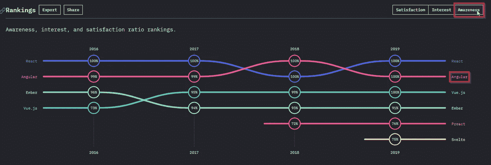

Source: [The State of JavaScript, 2019](https://2019.stateofjs.com/front-end-frameworks/)

在 NPM 下载量方面，Angular 排名第二，紧随其后的是 Vue.js:

Source: [NPM trends](https://www.npmtrends.com/)

根据谷歌趋势，Angular 正享受着稳步增长的牵引力:

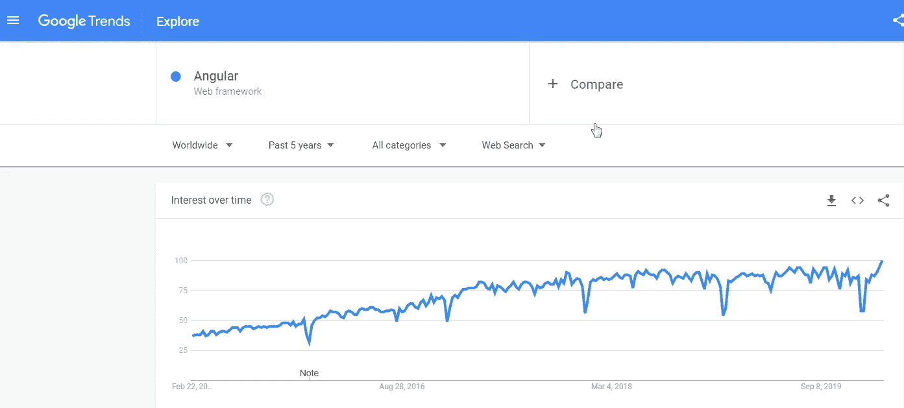

Source: [Google Trends](https://trends.google.com/)

## 工作市场

Angular 是美国要求第二高的 JavaScript 框架，这证实了一个流行的观点，即大型企业仍然更喜欢 Angular 而不是其他流行的框架:

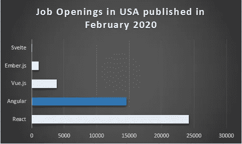

Source: [Indeed](http://www.indeed.com)

我使用了搜索词“Angular(编程或开发人员或前端或软件或 ux 或 ui) -AngularJS jobs”，通过明确排除 AngularJS，只获得 Angular 的职位空缺。

# 4.Ember.js

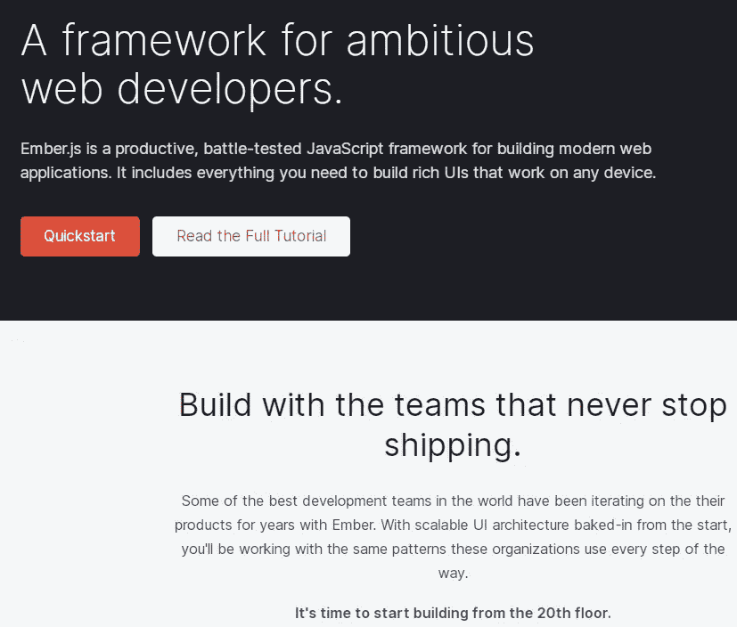

Source: [Ember](https://emberjs.com/)

2010 年，**苹果**开始基于 MVVM(模型-视图-视图模型)模式开发基于 JavaScript 的网络框架，命名为 **SproutCore** 。后来，苹果在 2011 年开源了 SproutCore 2.0 作为 **Ember.js** 。Ember.js 的创建者 Yehuda Katz 是 Ruby on Rails 核心团队的一员。他在 Ember.js 中大量使用了 Ruby on Rails principle "**conventi on over Configuration "**，这是最固执己见的 JavaScript 框架。

Ember.js 没有像 AngularJS 或 React 那样一夜成名。它也没有引入 React 或 Svelte 这样的突破性概念。对 Ember.js 最大的褒奖是，它是这个列表中最古老的框架。

同一时代的其他框架要么被削弱(Backbone.js，Knockout.js)，要么被完全重写(AngularJS)， **Ember.js 在没有引入重大突破性变化的情况下持续发展**。

如果你想学习一个只针对高开发速度 Web 的 JavaScript 框架，那么 Ember.js 是一个健壮而优秀的框架。

## 关键特征

*   Ember.js 是最固执己见的 JavaScript 框架，主要关注“约定胜于配置”它提供了一个几乎不需要配置的开箱即用的内聚框架。
*   Ember CLI 是 JavaScript 框架中最好的 CLI，在开发人员体验方面可与 Ruby on Rails CLI 相媲美。只需几个命令，它就可以构建并生成所有具有正确结构的必要代码，包括所有的依赖项。
*   Ember 的**向后兼容性是传奇的**并且是同类中最好的。Ember 是在 ES3 时代发布的，缺少很多现代特性，比如 JavaScript 类和模块。这些年来，Ember 增加了一些现代的特性，并不断发展，但严格保持了向后兼容性和 API。
*   Ember.js 在其最新发布的 **Ember Octane** 中进行了重大改革，而没有破坏与现有应用**的互操作性。**它引入了 **HTML 优先和组件优先方法，改进了对状态管理和反应能力的支持**。
*   Ember 不是由一个公司或一个人开发的，而是由来自不同公司的开发人员组成的社区开发的。Ember 的社区是最有活力和最受欢迎的，他们使用 RFC 过程(像 Rust 一样)对框架进行任何更改/增强。

## 前 3 名职业选手

*   端到端的自以为是的内聚框架主要关注“**约定胜于配置。”**
*   Ember 得到了 Linkedin、雅虎等几家科技巨头的支持，而不是一家科技巨头。因此，**它不是由一家公司的需求驱动的**。
*   Ember 的**数据库**是最好的一次访问多个数据源的数据，建立异步关系。

## 三大弊端

*   如果你的需求不符合 Ember 的做法，那么**你必须调整，**这很难。
*   与许多其他框架不同，它只面向 Web。因此，Web、移动和桌面之间没有代码共享。
*   它与 **jQuery** 紧密耦合。

## 流行

在 GitHub 中，Ember.js 是排名第七的 JavaScript 框架:

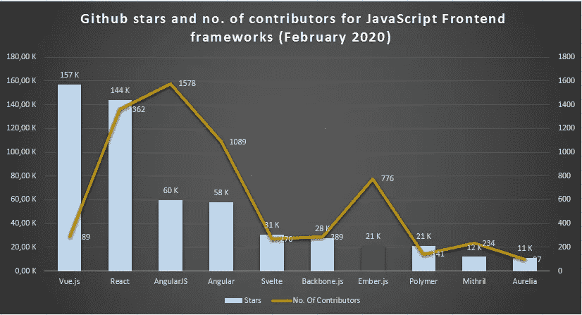

Source: [GitHub](https://github.com/)

根据“JavaScript 现状”调查，Vue.js 在兴趣方面排名第一:

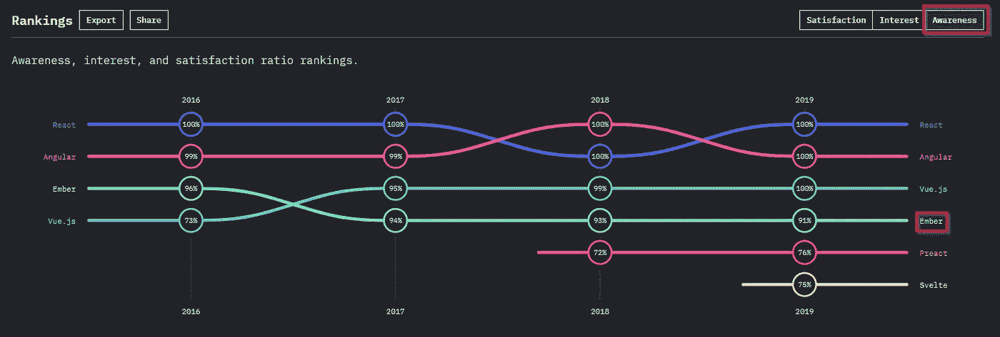

Source: [The State of JavaScript, 2019](https://2019.stateofjs.com/front-end-frameworks/)

就 NPM 下载量而言，Ember.js 每周的下载量超过 10 万次:

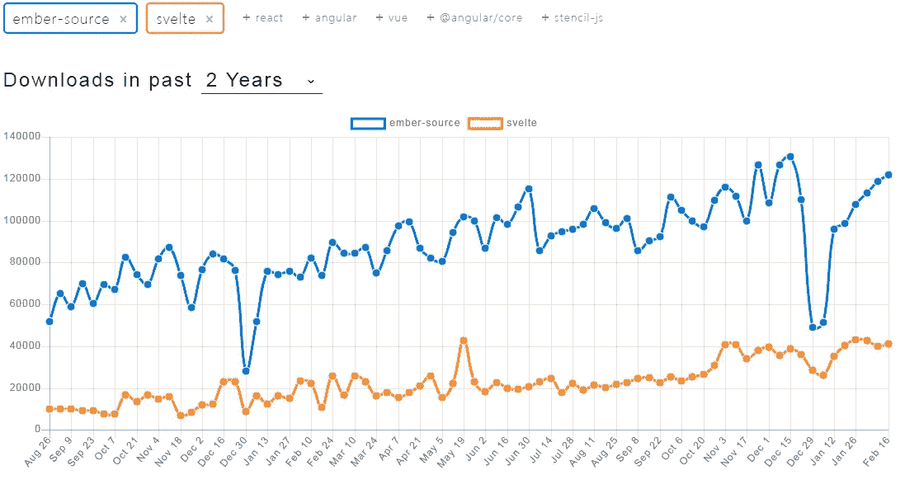

Source: [NPM trends](https://www.npmtrends.com/)

谷歌趋势也反映了对 Vue.js 的浓厚兴趣:

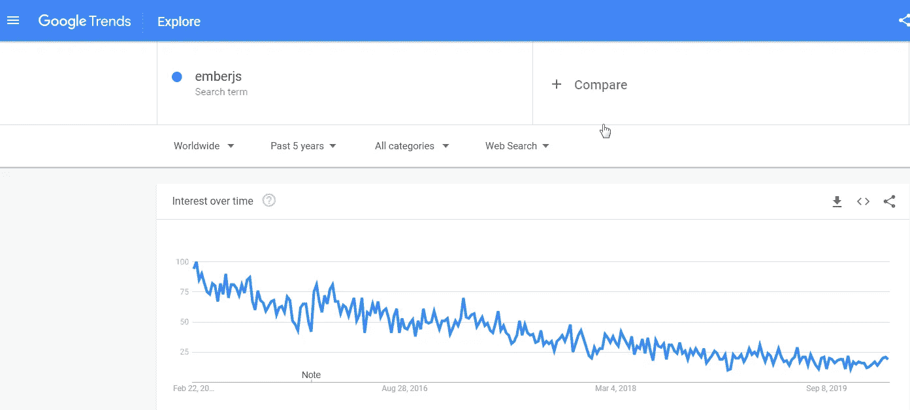

Source: [Google Trends](https://trends.google.com/)

## 工作市场

对 Ember.js 开发人员的需求相当高，尽管它不像其他框架那样受到重视，这从美国的职位空缺中可以明显看出:

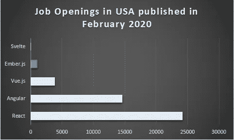

Source: [Indeed](http://www.indeed.com)

# 5.苗条的

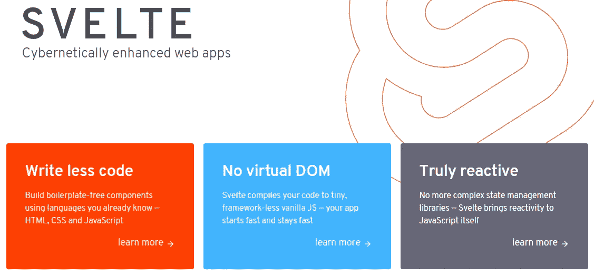

Source: [Svelte](https://svelte.dev/)

JavaScript 前端开发的第一个突破性创新来自于 React，它在前端开发中引入了许多传统的后端特性。

记者出身的软件工程师 Rich Harris 在他的开源 JavaScript 编译器 Svelte 中引入了另一个突破性的想法。传统框架(React、Vue.js、Angular)在浏览器中提供了特定于框架的运行时以及编译后的代码。这个运行时帮助执行特定于框架的任务(例如，角度路由)。但是 **Svelte 在编译时做所有的事情，并且只在浏览器中传递编译后的代码，而不需要额外的运行时间**。

在编译步骤中，它生成反应式 JavaScript 代码。在运行时，Svelte 提供了惊人的快速渲染，不使用虚拟 DOM 或脏检查。下面是 Rich Harris 关于苗条身材中反应能力的精彩演讲:

最近，Svelte 很受欢迎，它可能成为网络开发的下一个大事件。

## 5 个关键特征

*   在编译期间，Svelte 将代码转换为反应式 JavaScript 代码，并且不需要任何特定于框架的运行时。在所有框架中，它拥有最小的包大小。
*   Svelte 通过反应式编程执行 DOM 渲染，这在大多数情况下比虚拟 DOM 快**。因此，Svelte 是所有框架中渲染速度最快的。**
*   **Svelte 只是一个像 React-Core 一样的视图层。但是在 **Sapper** ，它有一个端到端的应用开发框架。**
*   **使用 Sapper，一个应用程序可以被开发为 SPA 或服务器端渲染(SSR ),并提供出色的 SEO 支持。**
*   **Svelte 打开了 JavaScript 前端开发中**未知领域**的大门。在跨平台应用程序开发或桌面应用程序开发中，类似的编译时优化也是可能的。**

## **前 3 名职业选手**

*   **由于其创新的编译步骤，它的速度快得惊人，而包的大小却很小。**
*   **Svelte 同时支持客户端和服务器端渲染，具有出色的 SEO 支持。**
*   **与其他框架相比，它的模板更接近 HTML。**

## **三大弊端**

*   **它仍然是正在进行的工作，缺乏成熟度、工具支持和库支持。**
*   **没有官方对**类型脚本**的支持。**
*   **缺乏运行时间意味着它不能提供其他框架所提供的**许多附加功能(例如 Angular 的数据验证、路由)****

## **流行**

**在 GitHub 中，Svelte 是排名第五的 JavaScript 框架，已经超过了老牌 JavaScript 框架，如 Backbone.js 和 Ember.js:**

**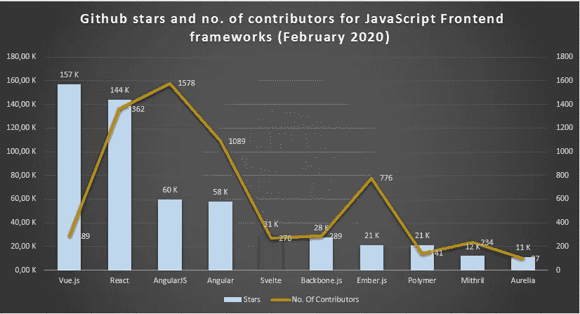**

**Source: [GitHub](https://github.com/)**

**根据“JavaScript 现状”调查，Svelte 在兴趣方面排名第一:**

****

**Source: [The State of JavaScript, 2019](https://2019.stateofjs.com/front-end-frameworks/)**

**从 NPM 的下载量可以明显看出，Svelte 还没有在业界广泛使用。根据 NPM 趋势，这是排名最后的框架:**

****

**Source: [NPM trends](https://www.npmtrends.com/)**

**在 2018 年发布 Svelte 3 后，从谷歌趋势中可以明显看出，Svelte 引起了很多兴趣:**

**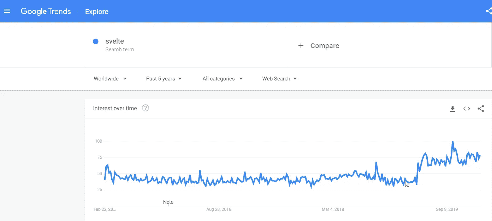**

**Source: [Google Trends](https://trends.google.com/)**

## **工作市场**

**虽然 Svelte 在 2016 年发布(与 Angular 同时发布)，但它只是在最近几年才受到关注。目前，美国只有 22 个苗条开发者的职位空缺:**

****

**Source: [Indeed](http://www.indeed.com)**

# **类似文章:**

** [## 2021 年十大最受欢迎的 JavaScript 库

### 最受欢迎的 JavaScript 库的精选列表，可以提高您的工作效率

medium.com](https://medium.com/javascript-in-plain-english/top-10-most-popular-javascript-libraries-to-use-in-2021-5da60f187992)  [## 2020 年服务器端开发的十大 JavaScript 框架

### 最重要的后端 JavaScript 框架的精选列表

medium.com](https://medium.com/javascript-in-plain-english/top-10-javascript-frameworks-for-server-side-development-in-2020-6d265016c02)  [## 2020 年高效 Web 开发的 20 个最佳代码扩展

### Visual Studio 代码扩展可以提高您的工作效率，并使编码变得更加有趣

towardsdatascience.com](https://towardsdatascience.com/20-best-vs-code-extensions-for-productive-web-development-in-2020-95bf904ceb69)**