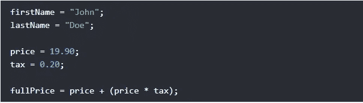
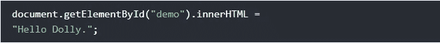
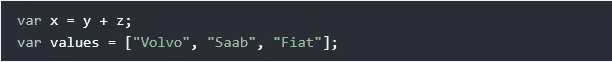
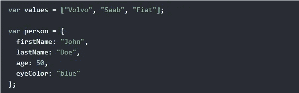
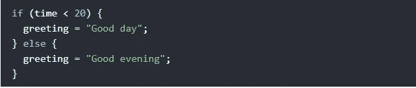

# 你应该知道的 5 大 JavaScript 编码惯例

> 原文：<https://javascript.plainenglish.io/top-5-javascript-coding-conventions-that-you-should-know-98ca7451c872?source=collection_archive---------6----------------------->

## 面向初学者的 JavaScript 风格指南和编码约定

Photo by [Azharul Islam](https://unsplash.com/@azhar93?utm_source=medium&utm_medium=referral) on [Unsplash](https://unsplash.com?utm_source=medium&utm_medium=referral)

# 介绍

在使用 JavaScript 编程语言时，有很多编码约定。编码约定是编程的风格指南。遵循这些约定将会改进您的 JavaScript 编码，并使您的代码易于维护和阅读。所以在本文中，我决定向您展示一些您应该知道的简单编码约定。

Photo by [Christopher Robin Ebbinghaus](https://unsplash.com/@cebbbinghaus?utm_source=medium&utm_medium=referral) on [Unsplash](https://unsplash.com?utm_source=medium&utm_medium=referral)

# 1.变量命名

在 JavaScript 中使用变量似乎是一项非常简单的任务，但是在命名变量时，您必须遵循一些规则，例如，您必须使用 **camelCase** 作为标识符名称。所有名字都应该以一个**字母**开头。以下示例遵循这些规则:

Variable Naming.

这些规则将使你的代码易于阅读和理解。

# 2.线长度

为了可读性，请确保避免超过 80 个字符的行。但是如果您的 JavaScript 语句不适合放在一行中，那么您可以在逗号或操作符之后断开它。看看下面的例子:

Broken Line in JavaScript.

# 3.运算符周围的空格

在你的 JavaScript 代码中，总是在操作符之间加空格( **= + — * /** )，因为这样看起来更好读。如果你像我们在下面的例子中做的那样做，那很好。

Spaces Around Operators.

# 4.使用小写文件名

大多数 web 服务器(apache…)对文件名区分大小写，另一方面，一些 web 服务器(Microsoft)对文件名不区分大小写。假设您从 Apache 服务器转移到 Microsoft 服务器，在那里您使用大写的文件名。Apache 是区分大小写的，所以它可以破坏你的网站。为了避免混淆，总是使用小写文件名(如果可能的话)。

# 5.语句规则

当您编写 JavaScript 语句时，需要考虑一些编码约定:

*   总是用分号结束一个简单的语句。
*   将左括号放在第一行的末尾。
*   在左括号前使用一个空格。
*   将右括号放在新的一行，不带前导空格。

看看下面的例子:

Writing Objects and Arrays in JavaScript.

Conditionals in JavaScript.

# 结论

如您所见，遵循 JavaScript 中的编码约定使得我们的代码易于维护，并且易于被其他开发人员阅读。我只是想列出这些简单的规则，因为每个 JavaScript 开发人员都应该考虑它们。这就是本文的内容，如果你正在使用所有这些约定，那很好，你正在成为一名优秀的开发人员，或者你已经是一名优秀的 JavaScript 开发人员。