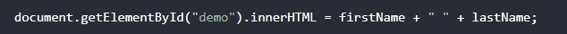
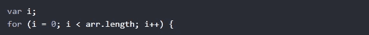
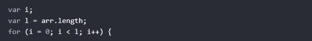
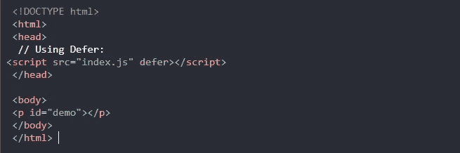

# 提高性能的 5 大 JavaScript 技巧

> 原文：<https://javascript.plainenglish.io/top-5-javascript-tips-for-improving-performance-e57bdf2542e2?source=collection_archive---------12----------------------->

## 利用 5 个技巧提高应用程序的性能

Photo by [Max Duzij](https://unsplash.com/@max_duz?utm_source=medium&utm_medium=referral) on [Unsplash](https://unsplash.com?utm_source=medium&utm_medium=referral)

## 介绍

为了让你的网站或应用程序更快，你需要一些关于 JavaScript 性能的知识。你的应用程序有一个好的性能是非常重要的，因为用户不喜欢使用缓慢的应用程序。这就是为什么在本文中，我想向您展示一些简单的技巧，它们将有助于提高 JavaScript 的性能，并使您的网站或应用程序更流畅、更快。

Photo by [Marc-Olivier Jodoin](https://unsplash.com/@marcojodoin?utm_source=medium&utm_medium=referral) on [Unsplash](https://unsplash.com?utm_source=medium&utm_medium=referral)

## 1.避免不必要的变量

代码中包含不必要的变量对性能没有好处，因为变量会占用内存。所以，如果你不打算保存值，就不要创建新的变量。看看下面的例子:

像这样替换代码:

Bad Performance.

有了这个:

Good Performance.

## 2.减少循环中的活动

编程中经常使用循环。每次迭代都执行 for 循环。可以放在循环外部的语句或赋值将使循环运行得更快。看看下面的例子:

错误代码:

Bad Code.

更好的代码:

Better Performance.

坏代码在循环中每次迭代都要访问数组的长度，这对性能不好，尤其是当程序中有很多语句时。另一方面，更好的代码在循环外访问 length 属性，使循环运行得更快。

## 3.延迟 JavaScript 加载

将脚本放在页面主体的底部可以让页面加载得更快，因为 JavaScript 将在页面加载后执行。另一种方法是在脚本中使用 **defer** 关键字，如下所示:

Delay JavaScript Loading.

**defer** 属性指定脚本应该在页面完成解析后执行，但是它只对外部脚本有效。

## 4.减少 DOM 访问

在 JavaScript 中使用文档对象模型比使用 JavaScript 语句要慢，因为 DOM 是由浏览器构造的，它不是语言的一部分。如果您希望多次访问一个 DOM 元素，那么只需访问一次，并将其用作局部变量。这将有助于提高性能。看看下面的例子:

Reduce DOM Access.

## 5.减小 DOM 大小

尽可能减少 DOM 元素的数量，因为拥有大量的元素会使你的加载非常缓慢，尤其是在较小的设备上。

## 结论

你的网站或应用程序有良好的性能有利于用户体验，如果你的网站能更快地满足用户的需求，用户会一直访问你的网站。这就是这篇文章，我希望你今天学到了一些新的东西。

喜欢这篇文章吗？如果有，通过 [**订阅获取更多类似内容解码，我们的 YouTube 频道**](https://www.youtube.com/channel/UCtipWUghju290NWcn8jhyAw) **！**