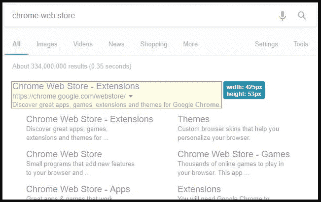

# 前端开发人员最有用的 5 个浏览器扩展

> 原文：<https://javascript.plainenglish.io/top-5-useful-browser-extensions-for-front-end-developers-e365ab4d0b95?source=collection_archive---------6----------------------->

## 5 个强大的浏览器扩展来加速你的开发过程

Photo by [Tim van der Kuip](https://unsplash.com/@timmykp?utm_source=medium&utm_medium=referral) on [Unsplash](https://unsplash.com?utm_source=medium&utm_medium=referral)

# 介绍

作为一名前端开发人员，您每天都有许多任务要做。这就是为什么你需要使用一些工具来促进你的开发过程，并且更有效率。现代浏览器通过一些有用的扩展为您提供了这种能力，使事情变得更加简单。

在本文中，我们将为前端开发人员发现一些有用的浏览器扩展。让我们开始吧。

Image Created with ❤️️ By [author](https://mehdiouss315.medium.com/).

# 1.色彩奇拉

ColorZilla 是一个先进的吸管，颜色选择器，渐变生成器工具。它是最受欢迎的火狐开发者扩展之一，下载量超过 500 万次，也适用于 chrome。使用 ColorZilla，您可以轻松地从浏览器中的任何位置提取颜色，快速调整颜色并将其粘贴到另一个程序中。它可以做更多的事情。

ColorZilla.

有兴趣的可以在这里查看[。](https://chrome.google.com/webstore/detail/colorzilla/bhlhnicpbhignbdhedgjhgdocnmhomnp)

# 2.网站调色板

站点调色板是一个浏览器扩展，用于创建全面的调色板。是设计师和前端开发者的必备工具。

这个有用的扩展将提取网站上使用的所有颜色，并创建一个调色板。您可以共享调色板并将其导出到 Sketch、Adobe 样本等。

Site Palette.

如果你想下载，这里有一个[链接](https://chrome.google.com/webstore/detail/site-palette/pekhihjiehdafocefoimckjpbkegknoh?ref=designrevision.com)。

# 3.字体忍者

这个令人敬畏的扩展允许你识别任何网站上使用的字体，给它们做书签，试用它们，并购买它们。

这是一个很棒的工具，可以检测网页上使用了哪些字体，并在你自己的代码中使用它们(当然，如果免费且可用的话)。

Fonts Ninja.

如果你有兴趣，可以在这里查看[。](https://chrome.google.com/webstore/detail/fonts-ninja/eljapbgkmlngdpckoiiibecpemleclhh)

# 4.页面标尺

页面标尺是测量网页上对象的一个很好的扩展。它以像素为单位测量其宽度和高度。这对于设计人员和前端开发人员来说非常有用，因为它给出了网页上所有元素的维度。

Page Ruler.

你可以点击查看[。](https://chrome.google.com/webstore/detail/page-ruler/idhjfgkakeliobkfbijghiaklmiaheag?hl=en)

# 5.JSON 格式化程序

这是一个非常棒的扩展，可以在浏览器中以清晰易读的方式显示 JSON 内容。

以下是该扩展的一些有用特性:

*   JSON 和 JSONP 支持。
*   语法突出显示。
*   带缩进参考线的可折叠树。
*   可点击的网址。
*   在原始和解析的 JSON 内容之间切换。
*   对于 URL 或本地文件。

JSON Formatter.

有兴趣的可以在这里查看[。](https://chrome.google.com/webstore/detail/json-formatter/bcjindcccaagfpapjjmafapmmgkkhgoa?hl=en)

# 结论

作为开发人员，使用这些扩展将使事情变得更容易。你不再需要手动做这些事情，因为你已经有了工具。

感谢您阅读这篇文章。希望你觉得有用。

# 进一步阅读

 [## 每个 Web 开发人员都应该知道的五大 Github 库

### 面向 web 开发人员的 5 个出色的 Github 存储库

medium.com](https://medium.com/javascript-in-plain-english/top-5-github-repositories-every-web-developer-should-know-d2feb3fdc214)