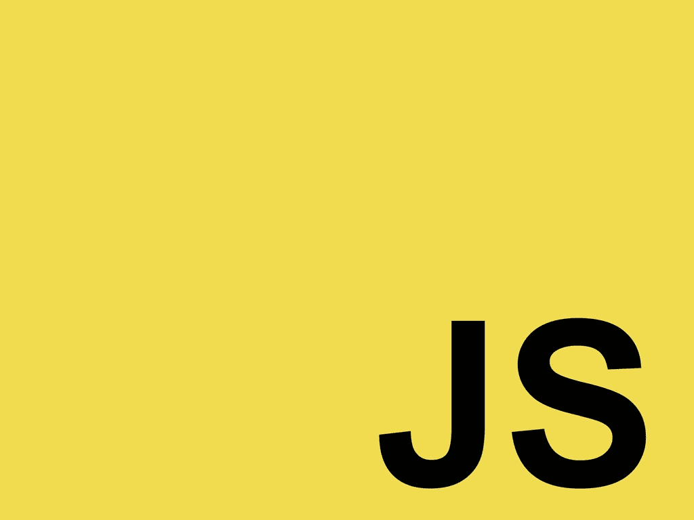
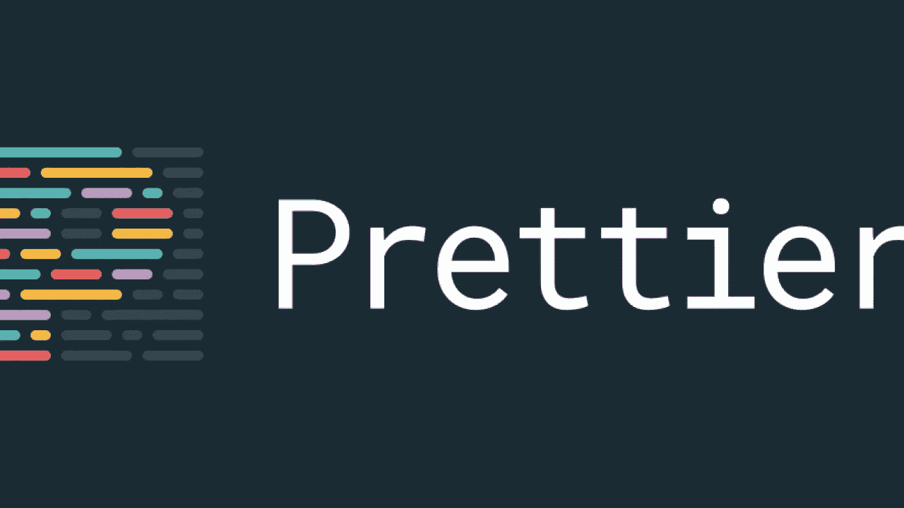

# 所有 JavaScript 开发人员都应该使用的 5 个 VSCode 扩展

> 原文：<https://javascript.plainenglish.io/top-5-vs-code-extensions-for-javascript-developers-a44ed410cfb6?source=collection_archive---------12----------------------->

## JS 开发人员必备的 VS 代码扩展

# 1.代码片段扩展

VS 代码附带了许多内置的代码片段，这些代码片段帮助你以最高效的方式更快地编写代码，你可以很容易地用代码片段中使用的一些关键字的引用来创建函数。以下是一些顶级的 JS 代码片段。

**。javascript(ES6)代码片段**、(**charalappos Karypidis**):目前最流行的 JavaScript 代码片段扩展，下载量超过 300 万次。

**。JavaScript Snippets，*****(Nathan Chapman):***用于 33K+安装的 JavaScript Snippets，提供对 Node.js、BDD 测试框架如 Mocha 和 Jasmine 的扩展支持

# 2.NPM 扩展公司

每个 JS 项目都需要 npm 包，除非你想用困难的方式做事，有一些用于包管理的 VS 代码扩展

**。npm**

**。搜索 node_modules*****(Jason Nutter):***超过 470k+安装这个扩展可以让你快速打开 node _ modules 中的文件。

# **3。格式扩展**

***。*更漂亮*(埃斯本·彼得森):*** 这是目前最受欢迎的扩展，支持 javascript、typescript 和 CSS，已经安装了超过 570 万个。

**。JavaScript Booster*(Stephen Burguchev):***这是一个令人惊叹的重构工具，几个编码动作如将 **var** 转换为 **const** 或 **let，**还移除了多余的 if-else 语句，并合并声明。

# 4.自动完成插件

**。Kite:** Kite 是一个 AI 驱动的自动完成插件，它学习你的代码模式，并使用存储在你机器上的数据提出建议，VSCode 中有许多自动完成插件，但 Kite 是迄今为止对我来说最有效的。

# 5.括号对着色机

这个扩展最受开发人员的喜爱，因为它消除了用识别颜色来识别括号的麻烦，每对括号都有不同的颜色，当你用它编码时，甚至很容易确定你在使用哪个部分。