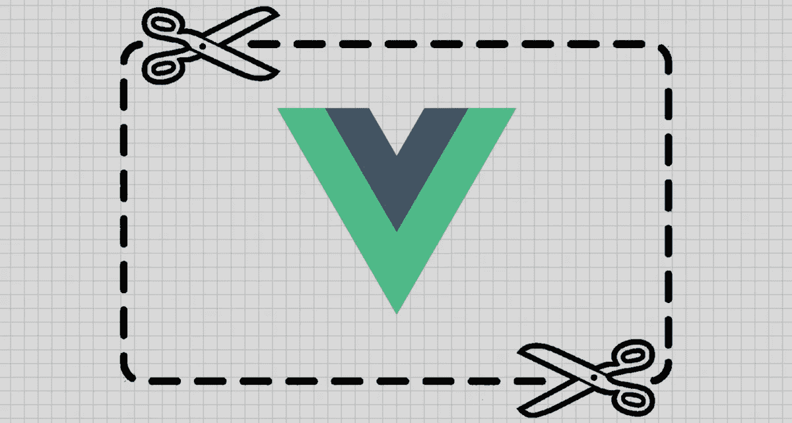
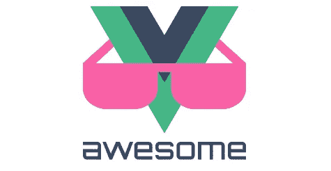
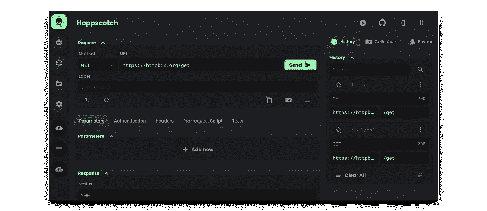
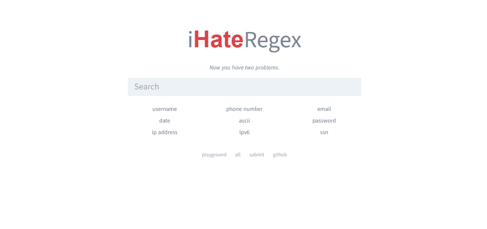

# GitHub 上排名前 7 的 Vue.js 项目

> 原文：<https://javascript.plainenglish.io/top-7-vue-js-projects-on-github-19ba006d34e8?source=collection_archive---------3----------------------->

## 你应该检查的 Vue.js 项目

Source — [Vue.js Developer](https://vuejsdevelopers.com/2018/04/23/vue-boilerplate-template-scaffold/)

# 1.Vue 元素管理

[Preview](https://panjiachen.github.io/vue-element-admin)

**储存库**:【https://github.com/PanJiaChen/vue-element-admin】T2

**星星** : 61.1k

**Vue Element Admin** 是潘家辰开发的一款可量产的前端管理仪表盘，带有 Vue 和 Element UI。它附带了许多特性，如登录/注销、权限认证、多构建环境、国际化、动态面包屑、表格、预构建组件等。已经有一个项目结构，所以你可以马上开始开发。

# 2.Awesome Vue.js

[Awesome Vue.js](https://github.com/vuejs/awesome-vue)

**储存库**:[https://github.com/vuejs/awesome-vue](https://github.com/vuejs/awesome-vue)

**星星** : 57k

**Awesome Vue.js** 是一个由 Vue.js 创建和维护的包含 Vue.js 内容的精选列表。它非常适合学习 Vue 的新开发人员，甚至是那些有更多经验、正在寻找示例、框架、库、工作等的人。这里列出的内容太多了，所以值得看一下资源库，有一个目录可以帮助您浏览内容。

# 3.元素

[Element](https://element.eleme.io/)

**储存库**:[https://github.com/ElemeFE/element](https://github.com/ElemeFE/element)

**星星** : 47.7k

**Element** 是为 Vue.js 2 打造的最流行的 UI 工具包。它由 ElemeFE 创建，旨在实现一致性、效率和可控性。它的重点是网络和桌面应用程序，因此它不专注于移动开发。

# 4.霍普斯科奇

[Hoppscotch](https://hoppscotch.io/realtime)

**储存库**:[https://github.com/hoppscotch/hoppscotch](https://github.com/hoppscotch/hoppscotch)

**星星** : 24.2k

Hoppscotch 是一个由 Hoppscotch 创建的免费使用的 API 请求生成器。这是视觉上惊人的和超级快。除了 REST API 支持，它还支持 GraphQL。它能够以简单快捷的方式为您的 API 生成文档。它是高度可配置的，提供认证、国际化等等。这是我肯定会使用的一个工具。

# 5.史上最佳简历

[Sample Template](https://github.com/salomonelli/best-resume-ever/blob/master/src/assets/preview/resume-creative.png)

**储存库**:[https://github.com/salomonelli/best-resume-ever](https://github.com/salomonelli/best-resume-ever)

**星星** : 13.6k

**有史以来最好的简历**由 salomonelli 创建，可帮助您建立快速、漂亮的简历。它支持使用 Vue 和 LESS 构建的各种模板。您可以在本地预览您的简历，并在模板之间进行交换，为您选择合适的模板。

# 6.vue-type script-admin-模板

[Preview](https://armour.github.io/vue-typescript-admin-template)

**仓库**:[https://github.com/Armour/vue-typescript-admin-template](https://github.com/Armour/vue-typescript-admin-template)

**星星** : 2.9k

与潘家臣的 Vue Element Admin 相似，**Vue TypeScript Admin Template**具有相同的特性和功能，但是支持 type script。

# 7.iHateRegex

**储存库**:[https://github.com/geongeorge/i-hate-regex](https://github.com/geongeorge/i-hate-regex)

**星** : 2.4k

**通过 geongeorge 的 iHateRegex** 提供了正则表达式的可视化表示。您可以在测试区域用字符串测试正则表达式，并在您的网站上嵌入可视化效果。有计划支持登录来保存正则表达式，以及一个“游乐场”来分享它们。