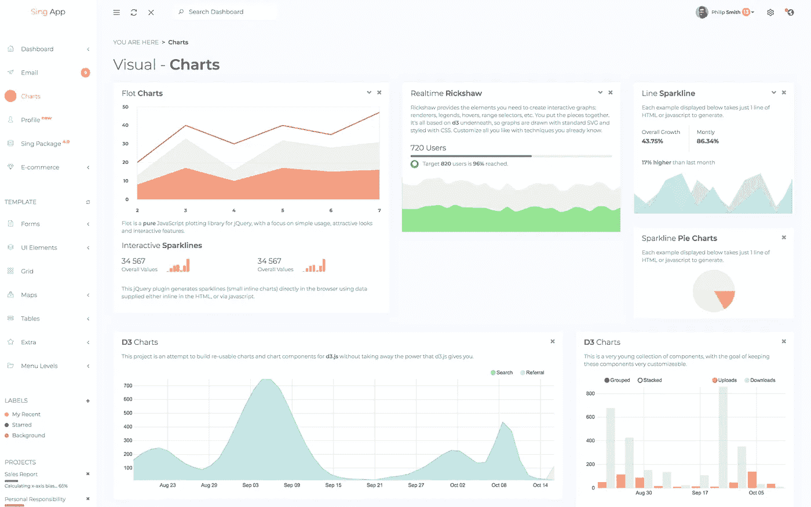
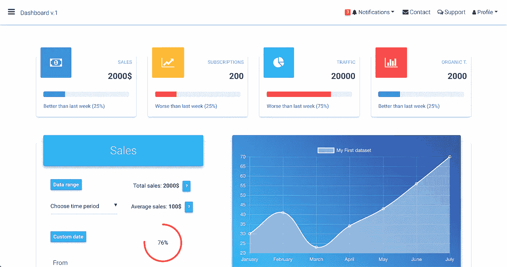
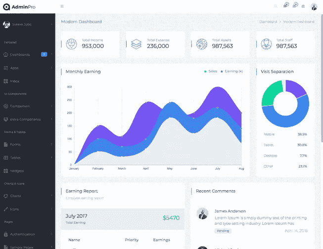
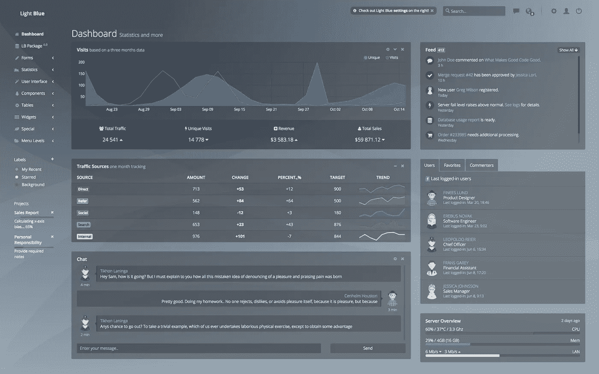
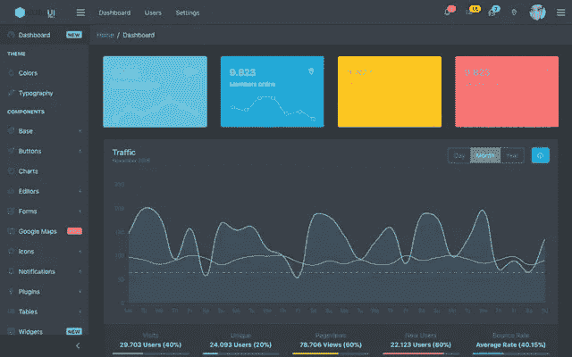
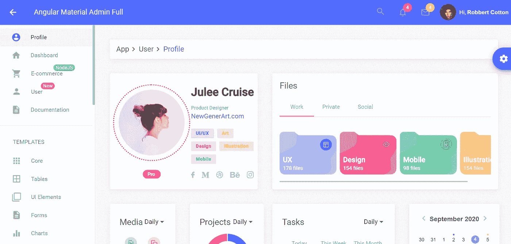
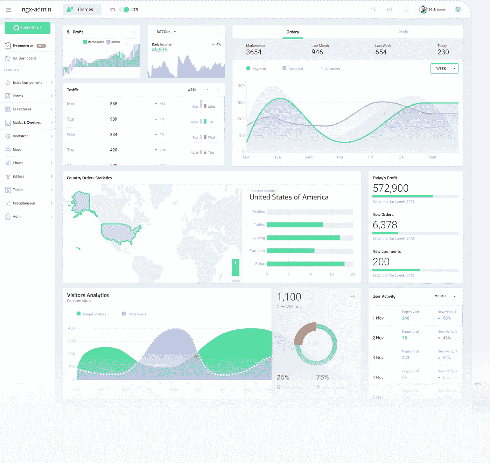
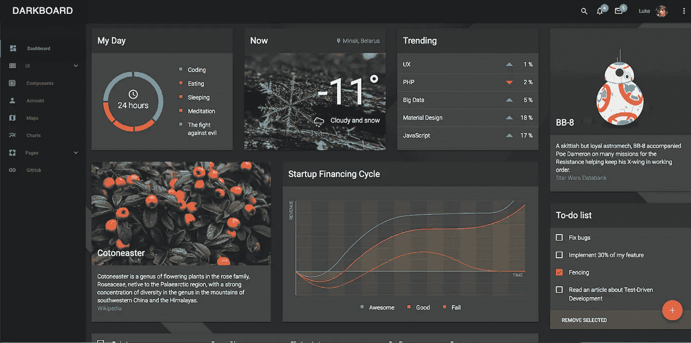
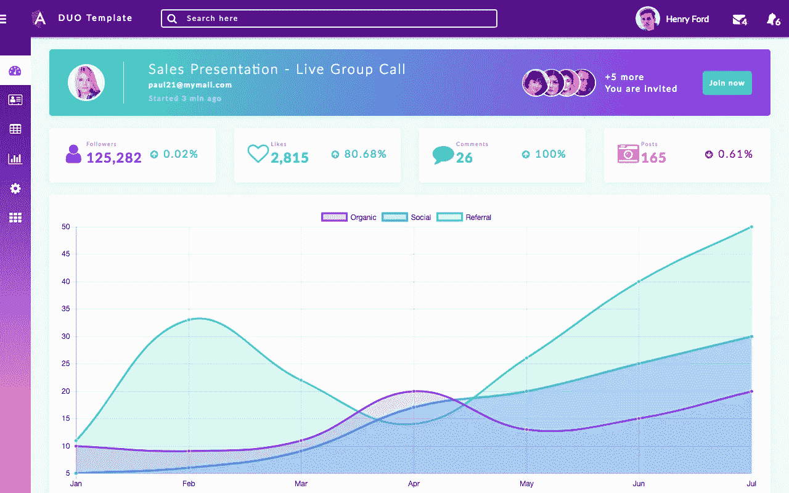

# 2020 年顶级角度管理模板

> 原文：<https://javascript.plainenglish.io/top-angular-admin-templates-in-2019-75ee10b69c79?source=collection_archive---------2----------------------->

我们理解您是来研究管理面板模板的，这些模板将为您的项目提供最佳价值。因此，我们将通过一个冗长的介绍为您省去阅读的麻烦。今天，我们将直接对行业中的顶级角度管理模板进行公正的审查。

评估管理面板的标准如下所示。经过多年的尝试和错误，我们简化了这些标准。这些因素作为管理模板性能基准的重要性将在本次审查过程中显而易见。这些标准是:

*   设计质量
*   代码质量
*   安装程序
*   证明文件
*   唯一页数
*   更新频率
*   支持质量
*   成本
*   公司经历
*   客户

我们已经将列表简化为我们测试过的免费和高级模板。它们都包含仪表板、页面、警告框、图标、导航方案、表格和图形/图表库。我们相信这些模板将为您的项目提供最合适的用户界面。

# 歌唱应用角度

Flatlogic 是 Sing App Angular 的开发人员，使用 Angular 5 和 Bootstrap 4 创建了这个响应模板。它包装了许多高质量的用户界面组件、小部件、设计元素和页面。Sing App Angular 是创建 SaaS 应用程序、网络应用程序、CMS、仪表盘、电子商务应用程序、CRM 等的优秀工具。

设计以浅色和标准字体为主。它允许创建一个体面的界面，这是完美的企业应用程序，其中当代设计趋势是必须的。

开发人员一致地更新代码，并且它需要最少的外部依赖性。该模板已经过广泛测试。文档很详细。甚至有一个快速入门指南，可以引导您完成安装仪表板所需的步骤。该文档包含对所有结构和组件的详细说明。

有了 Sing 管理仪表板，您可以访问 30 多个页面甚至更多组件。还有分析图表、电子邮件模板、聊天组件和降价编辑器。还有处理登录、错误、发票和日历的专用页面。该仪表板的开发人员每月提供大约一到两次更新。

歌唱管理仪表板的费用是 59 美元。如果您想要延长许可，您可能需要支付高达 449 美元的费用。开发者免费提供基本支持，通常在 24 小时内回复支持咨询。

总之，如果你想快速构建一个商业应用程序，这个模板是一个很好的选择。大量的内置组件将加快应用程序开发的进程。此外，考虑到该模板中的大量资源，价格是合理的，扩展许可证也是如此。

[**更多详情**](https://flatlogic.com/admin-dashboards/sing-app-angular)

[**实时预览**](https://flatlogic.com/admin-dashboards/sing-app-angular/demo)

# MDBootstrap 角度管理仪表板

当涉及到各种各样的样式和数据表示时，MD bootstrap Angular admin dashboard 拥有一切。它还包含相当多的组件。这个模板是用 Angular CLI 和 Bootstrap 4 开发的。它是在麻省理工学院的许可下提供的，这允许你完全免费地将它用于个人和商业应用。

由于设计中内置的引导组件，MDBootstrap 是一个可靠的模板。该界面类似于谷歌工具，它允许你清楚地查看你的数据。此外，这种风格使它易于使用，即使是第一次。每一条信息都很容易跟踪并链接到正确的类别。

代码很干净，设计也很棒。开发人员用普通的类型脚本完全重写了 Bootstrap 脚本，并最终编译成 Javascript。这个版本的管理仪表板不使用 jQuery。

该模板可以直接下载，您可以简单地提取文件夹，并在下载后立即开始使用模板。您将能够访问 400 多个材质设计 UI 元素、600 多个图标和 74 个基于 CSS 的动画。

该模板有详细的文档，对每个组件进行了全面的描述。该项目每月推出大约 1-2 次更新。

开发人员有一个知识库资源，用户可以在其中访问大多数支持问题的答案。这个管理仪表板还有一个活跃的社区，用户可以在那里获得帮助。如果您购买商业许可证，您将获得免费支持。

虽然该程序对个人使用是免费的，但它提供了一系列商业许可，范围从€79 到€149。

总的来说，模板的质量非常好，产品背后的经验丰富的团队会积极地更新它。知识库和社区提供的支持质量很好，至少对于 MIT 授权的产品来说是这样。

[**更多详情**](https://mdbootstrap.com/products/angular-ui-kit/)

[**实时预览**](https://mdbootstrap.com/docs/angular/components/demo/)

# AdminPro Angular 7 管理

AdminPro Angular 模板非常适合管理仪表板和管理面板。这个管理面板为用户提供了多种设计选项的独特优势。仪表板可以设置为现代、经典或分析显示选项。仪表板的布局也是可定制的。你可以选择黑暗，水平，甚至 RTL 布局。设计很现代，但并不前卫。

该模板是用 Sass、Angular 7 和 NgBootstrap 4x 创建的，这使得它很容易定制。唯一看起来具有挑战性的方面是 Angular 7，这是一个非常新的更新。该模板以应用程序的形式交付，随时可以部署。

AdminPRo Angular 包含 30 多个现成可用的角度组件。它还有一系列独特的仪表板、五个不同的演示，以及许多表格、图表和表单选项。

这个模板没有公开的 Github 存储库，也没有关于开发人员多久发布一次项目更新的信息。

该网站的详细信息称，开发者免费提供一年的专门支持。对于基本版本，支持媒体可能会通过电子邮件或实时聊天，但没有关于响应时间的信息。

这个管理面板的价格从 29 美元的单机版到 399 美元的扩展版不等。多用户许可费为 69 美元，扩展许可费为 999 美元。开发者为你购买的每个许可证提供一年的支持和终身更新。

管理面板在 Wrap Pixel marketplace 中列出，这使得很难获得关于创建者和客户的信息。但是，考虑到 WrapPixel 的声誉，我们相信这个管理面板是可靠的。而且，它已经被下载了超过 38000 次，这证明它有一个像样的用户群。

这个项目非常适合那些希望有布局选项的人。它支持使用 RTL 布局的国家的用户。

[**更多详情**](https://wrappixel.com/templates/adminpro-angular-dashboard/)

[**实时预览**](https://wrappixel.com/demos/angular-admin-templates/admin-pro-angular/main/dashboard/dashboard1)

# 浅蓝色棱角分明

浅蓝色的 Angular 是一个具有现代、时尚和简单界面的响应式模板。这个多功能的管理模板有一个灵活的设计和反应，这使它能够完美地适应任何屏幕尺寸。该模板简单且无干扰。它有一个节点，js 后端，以增强您的开发过程，并利用服务器端的搜索引擎优化渲染。

用纱线安装仪表板的过程很简单。这些命令是:运行纱线安装和运行纱线启动。之后，您需要键入两个 npm 命令:yarn run build 和 yarn run lint。“yarn run lint”将帮助您检查源代码中的语法错误和其他可能的问题，如果您构建的应用程序没有在开发服务器上运行的话。

有了这个仪表板，您将可以访问 30 多个页面。您还将每月收到 1-2 次更新。它有详细的文档，其中描述了每个组件。

单个许可证的价格为 59 美元，扩展许可证的价格为 499 美元。每个许可证都附带基本支持，永远免费。您也可以选择购买扩展支持包，为期六个月，价格为 99 美元。该公司还提供额外的定制和集成服务。

[**更多详情**](https://flatlogic.com/admin-dashboards/light-blue-angular)

[**实时预览**](https://flatlogic.com/admin-dashboards/light-blue-angular/demo)

# 科锐棱角分明

Angular 和 Bootstrap 4 是 CoreUI 管理模板的核心组件。虽然这个模板被描述为开源的，但是免费版本中可用的特性非常有限。

该模板有一个体面的设计，这使得它非常适合企业应用程序。您可以在浅色和深色主题之间更改布局。这个模板的开发者也创造了许多高质量的图标和旗帜。

所有的组件都有很好的文档记录，但是安排不是很好的结构化，并且到处都有一些 404 错误。

开发者网站声称该项目有 50 多个组件，包括编辑器、图表、表格、小部件等等。这个产品的一个优点是用户社区可以贡献模板的开源版本。

该公司通过其网站上的支持表格提供免费支持。他们还承诺在 48 小时内响应支持请求。

开发者提供了从 69 美元到 699 美元的各种许可。除了每个席位每月 69 美元的订阅费之外，您还可以选择以 999 美元的价格购买整个框架。

该公司成立于 2013 年，自那时以来一直在开发管理模板。CoreUI 管理模板的用户包括 DHL 和 OLX 等许多其他公司。

[**更多详情**](https://coreui.io/angular/)

[**实时预览**](https://coreui.io/angular/demo/dark/#/dashboard)

# 角度材料管理

Angular 材料管理模板是用 Angular 8 和材料设计构建的。既不使用 jQuery 也不使用 Bootstrap。有趣的是，该模板是用微软开发的开源编程语言 TypeScript 创建的。

管理模板可用于创建数据可视化应用程序、CMS、SAAS 和项目管理工具，因为它包含用于数据可视化的仪表板、表格、图表、地图和图形。谨慎的设计和适量的用户界面元素使得这个模板简单而不繁琐。

如果你正在寻找一些清晰、简洁、实用的东西，选择 Angular Material Admin Template 是不会错的。

[**更多详情**](https://flatlogic.com/templates/angular-material-admin-full)

[**实时预览**](https://flatlogic.com/templates/angular-material-admin-full/demo)

# Akveo NGX 管理

鉴于这个项目在 GitHub 上有超过 15，000 颗星星，Akveo NGX Admin 是目前最受欢迎的 Angular 项目之一。该项目有几十个通用组件，它们被编译成一个不同的软件包，称为 Nebular，可以通过 npm 安装。这个项目有全面的文档，可以通过 GitHub 上的项目社区获得支持。Akveo 团队维护项目并定期推出更新。该模板附带了三个引人注目的视觉主题，它们是:公司、光和宇宙主题。它有超过 40 页和两个仪表板。

Ngx-admin 团队在 Angular 社区中享有很高的声誉。该团队与 Angular 团队积极合作，经常在 Angular 博客上发布帖子。因为该项目在麻省理工学院的许可下可用，所以个人和商业使用都是完全免费的。

[**更多详情**](https://akveo.github.io/ngx-admin/)

[**实时预览**](http://akveo.com/ngx-admin/?utm_source=ngx_admin_landing&utm_medium=main_section#/pages/dashboard)

# CreativeIT 材料角度仪表板

CreativeIT 仪表盘为用户呈现了经典的深色材质设计。它利用了 Angular 框架，反应灵敏，在多种设备上都能很好地显示。这是绝对免费的商业和私人使用。

仪表板可以通过包管理器安装，这个过程有很好的文档记录。但是，除了安装过程之外，似乎没有其他文档。

这个工具可以大大减少你在开发上花费的时间。它有 40 个随时可用的小部件，以及几个组件和页面。我们不能确定这个项目多久推出一次更新，因为它相对较新。

这个管理面板是开源的，可以免费使用。开发者通过 GitHub 问题提供支持。该公司成立于 2016 年，这个项目是它此时开发的第一个仪表盘。

[**更多详情**](https://github.com/CreativeIT/material-angular-dashboard)

[**实时预览**](http://material-angular-dashboard.creativeit.io/#/app/dashboard)

# 角度管理模板(按角度模板 IO)

该模板基于 Angular、HTML5 和 CSS3 的最新版本。它包含了开发项目所需的所有组件。它还有详细的文档向您展示如何立即开始使用它。

虽然设计是干净的，但在颜色的选择方面，开发人员并不擅长，但图表非常棒。

您需要下载 zip 文件并设置开发环境，以便开始使用该模板。所以你必须安装 npm 和 Angular 命令终端。您可以在仪表板文档中访问安装过程和其他指南。文档的其他有用部分包括“changelog”、“已知问题”和“即将推出的功能”这给我们的印象是该项目正在积极发展。

仪表板包含 30 多个组件，每月更新一次。开发者通过电子邮件提供免费支持，也提供许多教程。这个仪表板的价格范围是每个许可证 30 美元，扩展许可证 99 美元。

开发该模板的公司在行业中相对较新，所以我们没有关于其客户群或产品下载数量的信息。

这个模板非常适合那些喜欢尝试颜色的人。但是你应该意识到有关键期限的项目没有时间进行设计实验。

[**更多详情**](https://angular-templates.io/product/angular-admin-template)

[**实时预览**](https://angular-templates.io/product/angular-admin-template/full-preview)

# 总结和结论

angular admin templates market place 与来自全球开发者的大量产品竞争激烈。一些公司在市场上销售他们的模板，而其他公司更喜欢在他们自己的电子商务网站上销售。为大公司开发企业应用程序时，选择正确的管理面板至关重要。你应该寻找一个管理面板，它有一个体面的设计，适当的文档，客户光顾的跟踪记录，以及支持的快速响应时间。

如果您是 Angular 开发的新手，您应该从开源版本开始尝试。