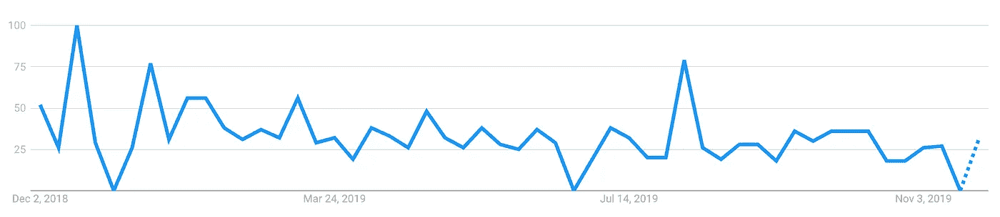

# 2020 年最值得学习的 JavaScript 框架

> 原文：<https://javascript.plainenglish.io/top-javascript-frameworks-to-learn-in-2020-7ec198d05bfa?source=collection_archive---------1----------------------->

## 就像在这里一样快，2019 年正在离去。今天，我将讨论 2020 年需要学习的顶级 JavaScript 框架，让你的游戏更上一层楼

编程场景是不断变化的，对于 JavaScript 也是如此。要想在这场残酷的竞争中生存下来，请与 JavaScript 神话中的三大巨头一较高下。

# 快递:

[Express](https://expressjs.com/) 是一个轻量级、极简的 JavaScript 框架。大多数 JavaScript 开发人员更喜欢 Node.js，纯粹是因为它的速度，还有什么比使用 Express 更好的方式来称赞它呢？Express 可以毫不费力地创建您的应用程序，它也没有陡峭的学习曲线。即使 Express 是无人驾驶的，你也可以使用 [express-generator](http://expressjs.com/en/starter/generator.html) 来启动它。

使用 express 的一大优点是数据库。因为它是一个极简框架，express 并不真的倾向于一个特定的数据库，因此，你可以安装 MySQL，MongoDB，Redis 或者任何你想要的东西。你所需要做的就是用 npm install 安装驱动程序，然后你就可以开始了！

再加上我有点偏向快递。因为 express 是我学习的第一个框架，所以它在我心中占有特殊的位置。

# 反应:

React 是另一个著名的框架，基于“[反应式编程](https://en.wikipedia.org/wiki/Reactive_programming)”。当然，要掌握 react，还需要学习很多其他技术，比如 Redux、MobX、Fluxy、Fluxible 或 RefluxJS。React 也可以与 jQuery AJAX、fetch API、Superagent 和 Axios 一起使用。React 还引入了悬念，以改善开发者在 React 应用中处理异步数据获取时的体验。简而言之，对暂记的新更新让组件等待，直到满足某个条件。

React 还引入了对象，比如状态和道具。使用 state 和 props 对象，您可以简单地将数据从组件传递到布局，或者从父组件传递到子组件。

React 是目前最流行的框架之一，通常是首选。

# 流星. js

好吧，我会给我的第三个位置一个非传统的选择。一旦你真正投入其中，Meteor 是一个非常有趣的框架。是的，它也有自己的问题，但是其他框架也是如此！这是我偶然发现的一个有趣的博客，我将推荐大家阅读。

 [## 我为什么选择流星 JS

### 从我第一次进入网络开发世界，到现在我和流星们在一起

codeburst.io](https://codeburst.io/why-i-chose-meteor-js-6bddab6d48f3) 

Meteor 在 Github 上有超过 40k 颗星星，这是一个不小的成就。它带有一个“持续测试工具”,这无疑提高了编码器的效率。

Source: Google Trends

这是对 meteor.js 的兴趣随时间变化的图表，一些炒作已经死去，是的，但它仍然值得骄傲！我肯定会推荐学习 meteor.js，因为它可能是一个真正强大的框架。

这些并不是 2020 年唯一有用的框架，但是还有很多其他的框架，比如 Koa，Vue，Angular 等等。我纯粹根据自己的看法整理了这个小清单。我会说我一直说的话作为结束。

> 你真的不需要拘泥于一个框架或一门语言。一个好的程序员能适应他面前的情况，如果需要使用新技术来解决这个问题，他会这样做。

几个月前，我还对 Node.js 和 Ruby 进行了比较。你也可以去看看。

 [## 现在我们有了 Node，Ruby 在 2019 年还有相关性吗？

### 如果你在 10 年前问这个问题，答案肯定是肯定的。然而，时代在变，所以…

medium.com](https://medium.com/javascript-in-plain-english/is-ruby-still-relevant-in-2019-6ee3093909f9)