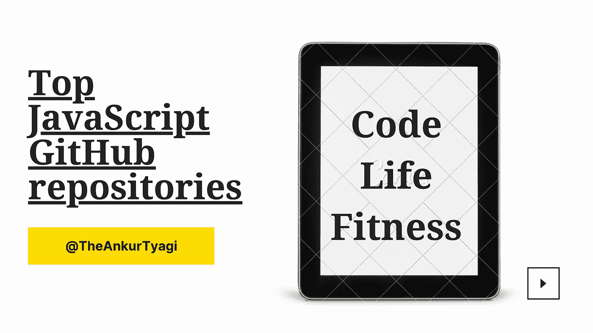

# 你应该看看 14 个 JavaScript GitHub Repos

> 原文：<https://javascript.plainenglish.io/top-javascript-github-repositories-for-you-79b4a20cc0b?source=collection_archive---------1----------------------->

## 一些流行的 JavaScript GitHub 库

JavaScript 的一些主要优势是它的社区和生态系统。生态系统是巨大的，有时很容易迷路。在这里，我将为你分享一些流行的 JavaScript GitHub 库。

这些是社区目前最感兴趣的内容。

## **1。Airbnb JavaScript**

Airbnb，Inc .是一家美国度假租赁在线市场公司，总部位于美国加利福尼亚州旧金山。

[airbnb](https://github.com/airbnb/javascript)

## **2。算法 JavaScript**

用 JavaScript 实现的所有算法的存储库(仅用于教育目的)

[算法](https://github.com/TheAlgorithms/Javascript)

## **3。JavaScript 算法和数据结构**

这个库包含许多流行算法和数据结构的基于 JavaScript 的例子。每种算法和数据结构都有自己独立的自述文件，其中有相关的解释和链接供进一步阅读(包括 YouTube 视频)。

[JavaScript 算法](https://github.com/trekhleb/javascript-algorithms)

## **4。Git 用 JavaScript 教编程基础的书**

这本书将教你编程和 JavaScript 的基础知识。无论你是否是一个有经验的程序员，这本书都是为每一个想学习 JavaScript 编程语言的人准备的。

[GitbookIO](https://github.com/GitbookIO/javascript)

## **5。30 天普通 JS 挑战**

起始文件 JavaScript 30 天挑战的完整解决方案。

[JavaScript30](https://github.com/wesbos/JavaScript30)

## 6。JavaScript-问题

一长串(高级)JavaScript 问题及其解释

[JavaScript-问题](https://github.com/lydiahallie/javascript-questions)

## 7。牛逼的 JavaScript

一个很棒的浏览器端 JavaScript 库、资源和亮点的集合。

[牛逼的 JavaScript](https://github.com/sorrycc/awesome-javascript)

## 8。清理代码 JavaScript

适用于 JavaScript 的干净代码概念

[清理代码 JavaScript](https://github.com/ryanmcdermott/clean-code-javascript)

## **9。乔纳斯完成 JavaScript 课程**

该报告包含课程中所有项目的起始文件和完成项目文件。

[乔纳斯完成 JavaScript 课程](https://github.com/jonasschmedtmann/complete-javascript-course)

## **10。JavaScript 模式**👇

[JavaScript 模式](https://github.com/shichuan/javascript-patterns)

## 11。现代 JavaScript 教程

这个存储库包含现代 JavaScript 教程的英文内容，发布在 [https://javascript.info](https://javascript.info) 中。

[恩。JavaScript.info](https://github.com/javascript-tutorial/en.javascript.info)

## **12。JavaScript:测试驱动学习**

这个项目旨在帮助用户用测试驱动的方法进一步学习 JavaScript。每个单元包含一个带注释的教程和一个平台，你可以在这里测试你对主题的理解。

[JavaScript](https://github.com/MartinChavez/Javascript)

## **13。初学 JavaScript**

这些是初级 JavaScript 课程[初级 JavaScript](https://github.com/wesbos/beginner-javascript) 的入门文件和解决方案

## 14。JavaScript 中的计算机科学

用 JavaScript 编写的经典计算机科学范例、算法和方法的集合。

[JavaScript 中的计算机科学](https://github.com/humanwhocodes/computer-science-in-javascript)

如果你正在寻找一些高级课程，那么零到精通学院在这里做得非常好。结账本课程[链接](https://academy.zerotomastery.io/p/advanced-javascript-concepts?affcode=441520_wsppjmp_)

你正在寻找建立一些实时项目，那么这可能是你职业生涯中的一个游戏改变者

希望你喜欢这个💙

喜欢这篇文章吗？如果有，通过 [**订阅解码获得更多类似内容，我们的 YouTube 频道**](https://www.youtube.com/channel/UCtipWUghju290NWcn8jhyAw) **！**