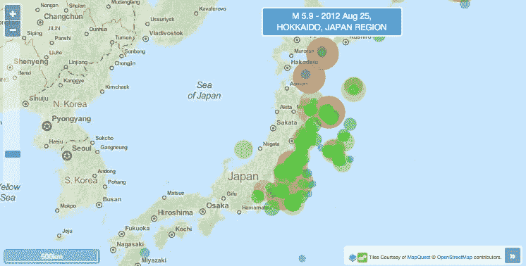
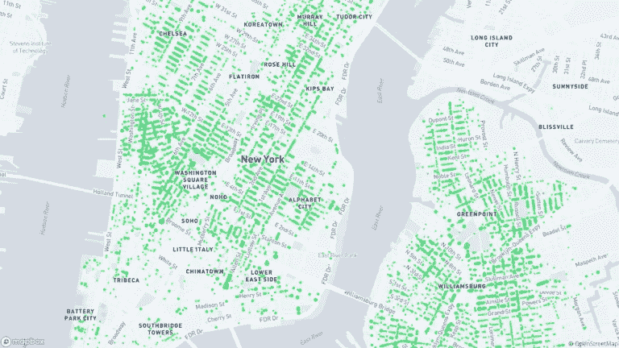
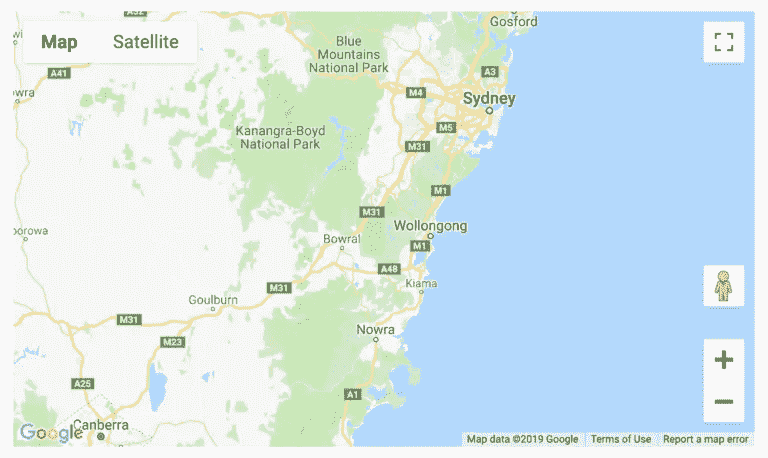
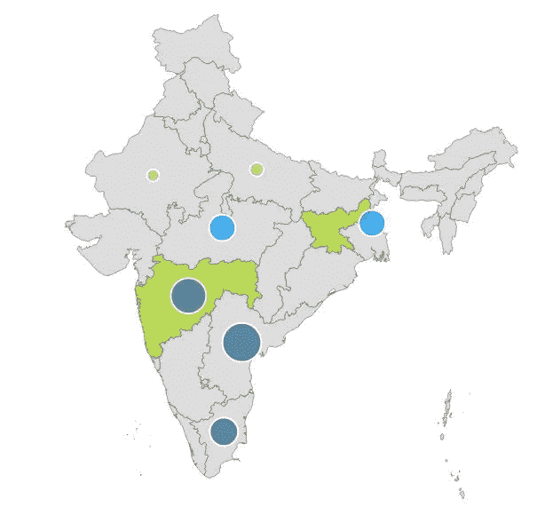
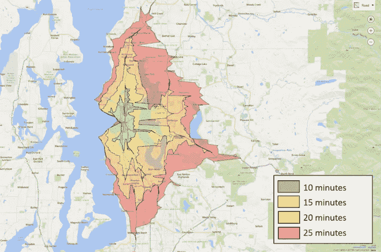
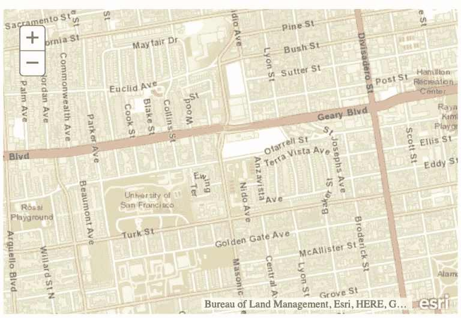
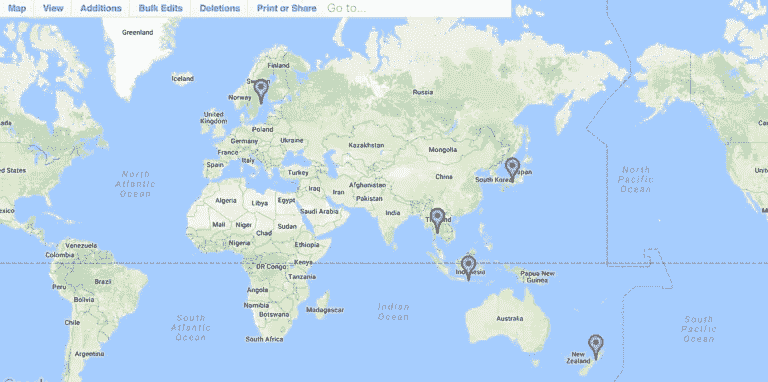

# JavaScript 中的 Top Maps API 和库

> 原文：<https://javascript.plainenglish.io/top-maps-api-and-libraries-in-javascript-e01b01ad5d2c?source=collection_archive---------5----------------------->

## 在创建第一个地图应用程序之前，想知道 JavaScript 中的顶级地图 API 和库吗？

Photo by [henry perks](https://unsplash.com/@hjkp?utm_source=medium&utm_medium=referral) on [Unsplash](https://unsplash.com?utm_source=medium&utm_medium=referral)

我们今天在日常生活中使用的大多数应用程序将在地图上显示实时位置和数据。例如，从在线商店到食品配送应用，我们都在使用地图。

地图被广泛用于表示数据，我们总是希望更具互动性。有许多不同的付费或开源地图库和插件。

谷歌地图并不适合你的地图应用。它不提供任何定制选项来让你自己更方便。如果你想用你的功能实现它，你必须去寻找市场上的开源软件。

在本文中，我们将看到包含 JavaScript 工具的不同地图，用于处理地图库。

# 用 JavaScript 函数对地图进行分类

有很多工具可以用来处理 JavaScript。所以我们可以据此对它们进行分类。

*   库:它将通过允许类和函数在更高的编程层次上构建应用程序来公开它们。
*   **包装器**:它充当调用者和被包装代码之间的接口。
*   **工具包**:它非常模块化，很容易集成到定制的应用程序中。
*   **框架**:支持服务的可重用组件，配置并集成应用程序代码。
*   **客户**:最终产品需要使用网络地图应用。

# 如何选择正确的解决方案？

这取决于你将如何使用它们，以及你想在多大程度上定制它以使其更具互动性。

为地图选择工具时。你必须首先选择付费或开源框架。它们都有很多功能。

# 版本和升级

考虑两大产品，谷歌地图和传单。谷歌地图由谷歌控制。任何可用的更新将由谷歌安排。对于传单更新频繁，它发布新版本的新功能。插件更新独立于整个更新。

# 地图工具和库

一些工具将减少制作交互式地图的工作量。它允许你只用几行代码就可以制作一个动态地图。

JS 库将使你能够添加标记功能，在地图上绘制关于某些点的自定义路线。

CSS 将允许你在你的地图中添加自定义样式。通过考虑所有这些功能，我们整合了以下库，这些库将帮助开发人员轻松快速地制作复杂的地图。

# 小册子

**网站**:【https://leafletjs.com/
GitHub stars:28.1k，[https://github.com/Leaflet/Leaflet/](https://github.com/Leaflet/Leaflet/)
**定价**:免费
**地图数据源** : OpenStreetMap
**依赖关系**:无
**类别**:库
**示例/演示/图库**:[https://leafletjs.com/examples.html](https://leafletjs.com/examples.html)

传单是创建移动友好地图的最好的 JavaScript 开源库之一。它包含了很多插件来添加到你的地图中。它得到了许多公司的支持，如 GitHub、脸书、Flickr 等..

它包含强大的文档和各种例子，供初学者开始他们的项目。

# 开放层

**网站**:[https://openlayers.org/](https://openlayers.org/)
**GitHub stars**:7.1k、[https://github.com/openlayers/openlayers](https://github.com/openlayers/openlayers)
**定价**:免费
**地图数据源** : OpenStreetMap
**依赖关系**:无
**类别**:库
**示例**:[https://openlayers.org/en/latest/examples/](https://openlayers.org/en/latest/examples/)

OpenLayers 也是创建交互式地图的最佳开源 JavaScript 框架。您可以使用矢量单幅图块选择不同类型的样式地图。它还能够将矢量数据转换成 GeoJson 格式。

它还为开发人员提供了更好的文档和工作代码示例。

# 地图框

**网站**:[https://www.mapbox.com/](https://www.mapbox.com/)
**git hub star**:6.1k、[https://github.com/mapbox/mapbox-gl-js](https://github.com/mapbox/mapbox-gl-js)
**定价:**免费，1000 次加载从 2.4 美元开始
**地图数据源:** : Mapbox
**依赖项:**无
**类别:**Web 应用程序
**:示例**

Mapbox 是用于创建高性能交互式地图的最先进的地图解决方案。它是由具有更多功能的开发人员构建的，比如自定义标记、矢量图块、静态地图、地理编码。它提供卫星图像和方向。

它还提供了在线编辑器，可以使用您自己的数据快速制作自定义地图。该文档设计精良，易于使用。

# 谷歌地图应用编程接口

**网站**:[https://developers.google.com/maps/documentation
**定价**:免费，从静态地图
**地图数据源** : Google
**依赖项**:无
**类别** : Web 应用程序
**示例**:](https://developers.google.com/maps/documentation)[https://developer . Google . com/maps/documentation/javadoc](https://developers.google.com/maps/documentation/javascript/examples)

谷歌地图应用编程接口最适合每个人，无论是有经验的还是初学者。谷歌地图很容易与任何应用程序或网站集成。此外，WordPress 用户有更多的插件来添加 JavaScript 谷歌地图应用编程接口。

# 数据映射

**网站**:[https://datamaps.github.io/](https://datamaps.github.io/)
**git hub star**:3.4k、[https://github.com/markmarkoh/datamaps](https://github.com/markmarkoh/datamaps)
**定价** : Free
**地图数据源** : D3.js
**依赖项**D3 . js 和 TopoJSON
**类别**:库

Datamaps 是一个用于数据可视化的交互式地图。它被捆绑到一个 JavaScript 文件中。它以 JSON 格式存储，您可以使用以下结构轻松创建任何自定义地图。

# 必应地图

**网址**:[https://www . Microsoft . com/en-us/Maps/choose-your-Bing-Maps-API](https://www.microsoft.com/en-us/maps/choose-your-bing-maps-api)
定价:免费、定制(按需)
**地图数据源** : Bing 地图
**依赖关系**:无
**类别** : Web 应用
**示例**:[https://docs . Microsoft](https://docs.microsoft.com/en-us/bingmaps/v8-web-control/index)

这个地图是由微软创建的，它是一个非常受欢迎的地图平台。它包含 AJAX SDK，为开发人员构建自定义地图提供示例代码和代码片段。它提供了多个 API 函数，如 REST 服务和空间数据服务。

# ArcGIS

**网站**:[https://developers.arcgis.com/](https://developers.arcgis.com/)
**定价**:免费，每月 125 美元起
**地图数据来源** : Esri
**依赖关系**:无
**类别**:框架
**示例**:[https://developers.arcgis.com/javascript/3/jssamples/](https://developers.arcgis.com/javascript/3/jssamples/)

ArcGIS 是一个 JavaScript 轻量级地图框架，可轻松嵌入到任何应用程序或网站中。它装载了大量的特性和示例。开发者门户包含 ArcGIS API 和 SDK。它为开发者提供了很好的文档。

# Zeemaps

**网站**:[https://www.zeemaps.com/](https://www.zeemaps.com/)
**定价**:免费，每月 19.95 美元起
**依赖**:无
**类别**:网络应用
**示例**:[https://www.zeemaps.com/mobile?group=1971477](https://www.zeemaps.com/mobile?group=1971477)

Zeemaps 是一个企业级地图服务，可以轻松创建和发布交互式地图。您可以使用众包内置函数在此地图中创建更多的数据可视化。所有数据都存储在地图服务器中，您可以随时随地访问。

# 结论

我希望你喜欢并了解 JavaScript 中的地图 API 和库，并根据你的需要选择最佳框架，为你的应用程序或网站创建高度交互式的地图。

感谢阅读！

## 简单英语的 JavaScript

你知道我们有三份出版物和一个 YouTube 频道吗？在 [**寻找一切的链接 plainenglish.io**](https://plainenglish.io/) ！