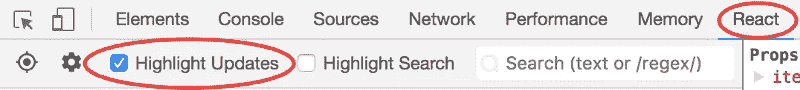

# 反应应用 2019 的顶级性能提示

> 原文：<https://javascript.plainenglish.io/top-performance-tips-for-react-app-c688fc4942dd?source=collection_archive---------8----------------------->

想象一下:你必须提高你的反应应用的性能。为了获得更好的性能，在开发和部署应用程序时，您应该注意哪些措施？

就性能而言，React 做得很好，但是，如果您有一个复杂的应用程序，您可能会发现它有问题。您仍然可以做一些事情来提高它的性能，具体分类如下:

1.  发育
2.  部署

# 开发过程提示

## 1.避免和测量渲染时间

首先，我们必须避免在没有任何要求的情况下重新渲染我们的组件。我们还需要计算渲染时间，以便减少渲染时间。一种简单的方法是使用 [Use-Timing-API](https://developer.mozilla.org/en-US/docs/Web/API/User_Timing_API) 。此外，您可以使用以下选项在浏览器中检查反应渲染。

React rendering updates

## 2.使用纯组分

为了避免反应的协调过程，我们必须使用纯组件，因为,`shouldComponentUpdate()`已经有了一个默认实现，只是简单的道具和状态比较。因此，纯组件是仅在`props/state`不同于先前的*道具*和*状态*时才重新渲染的组件。

## 3.动态加载长列表

如果你有一长串你想在页面上呈现的项目，那么把它分解成更小的列表，并在滚动或任何其他事件监听器上呈现。您可以通过[反应-窗口](https://react-window.now.sh/#/examples/list/fixed-size) & [反应-虚拟化](https://bvaughn.github.io/react-virtualized/#/components/List)来完成。

## 4.反应并发模式

如果性能在你的反应应用中是最重要的，那么你必须选择反应并发模式。实现并发的最简单的方法之一是对组件进行反应暂挂和惰性加载。

## 5.使用骨架用户界面

我已经写了一篇关于这一点的文章，请查收:[反应骨架界面](https://medium.com/javascript-in-plain-english/speed-up-your-react-ux-with-skeleton-screens-f7b5831ef635)

## 6.使用挂钩

反作用挂钩大大减少了应用程序中的代码。如果你不太熟悉反作用生命周期方法，尽可能多地尝试钩子。你也可以在[反作用钩](https://medium.com/javascript-in-plain-english/react-hooks-usestate-useeffect-useref-usememo-926fc2a86a6a?source=your_stories_page---------------------------)上找到我的文章。

## 7.构建渐进式应用程序

尝试构建渐进式应用程序，以便它可以在客户端浏览器上加载大量静态内容，从而实现平稳运行。

## 8.删除失效代码

您可以使用 SonarQube 删除您的死代码[检查](https://blog.sonarsource.com/detect-dead-code-and-calls-to-deprecated-methods-with-sonar-squid/)。你也可以通过记录应用程序的重新渲染来检查你的代码覆盖率。

## 9.使用 React 上下文 API

不要使用任何状态管理库，如 redux 或 mobx，使你的应用程序变得复杂。

# 部署流程提示

## 10.使用生产版本

React 最小化 react 和 react-dom 的文件大小。这意味着我们用户的浏览器需要下载、解析和执行更少的东西，因此我们的页面加载更快。

例如，对于 React 16.5.1，这些是我得到的大小:

*   652K `react-dom.development.js`
*   92K `react-dom.production.min.js`
*   85K `react.development.js`
*   9.5K `react.production.min.js`

这是一个显著的差异！

## 11.使用 Preact

Preact 是 react 的轻量级版本。如果您喜欢使用 react 构建视图，但性能、速度和大小是您的优先考虑事项，您可能更喜欢使用 Preact 作为轻量级替代方案，例如，在移动 web 应用程序或渐进式 web 应用程序的情况下。

React 和 Preact 之间有许多不同之处，我们可以总结为三点:

*   **特性和 API** : Preact 只包含 react API 的一个子集，而不是 React 中所有可用的特性。
*   **大小** : Preact 比 react 小很多。
*   **性能** : Preact 比 react 快。

## 12.配置 Webpack 包以最小化 js 文件。

有几种方法可以做到这一点，但最简单的是更新 webpack 配置，将某些模块的任何导入别名化到该模块的概要版本。有两个这样的模块:

*   `react-dom`->-`react-dom/profiling`
*   `scheduler/tracing`->-

这些是我的顶级绩效构建技巧，希望你喜欢并学到了一些东西。