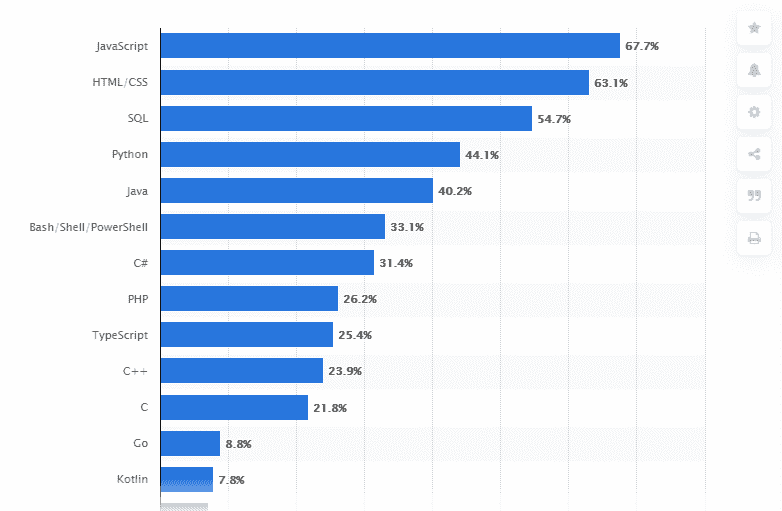
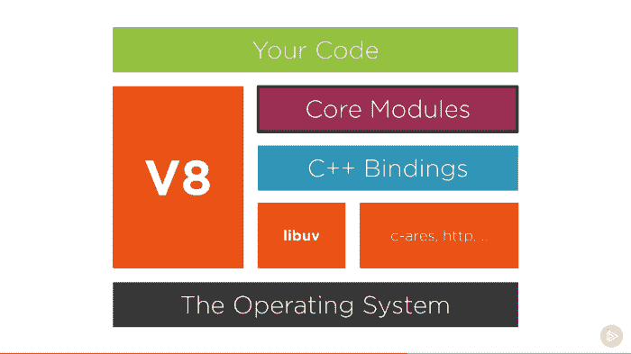
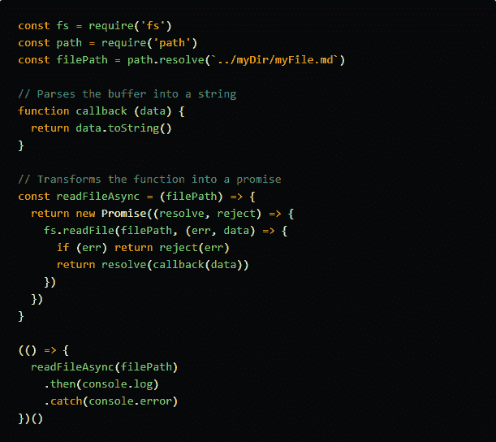
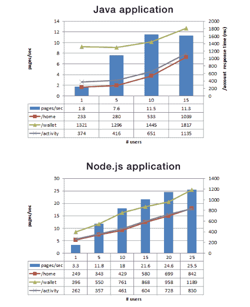
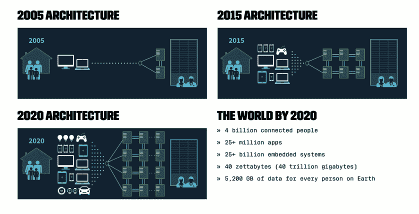
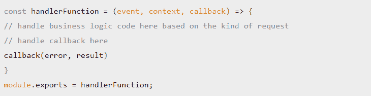
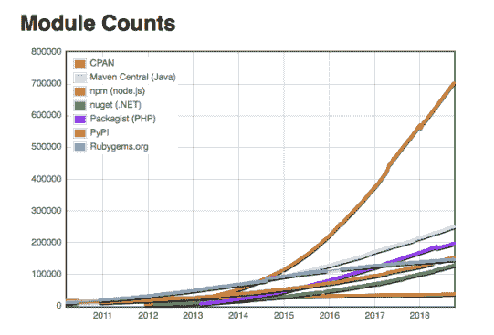

# 选择 Node 的几大理由。Web 应用开发的 JS(最新更新 2021)

> 原文：<https://javascript.plainenglish.io/top-reasons-to-choose-node-js-for-web-app-development-in-2020-575e77c4b339?source=collection_archive---------2----------------------->

随着软件开发行业和技术堆栈的快速增长，选择正确的 web 应用程序开发方式已经成为一项复杂的任务。这些年来，有许多技术和编程语言来来去去，但 JavaScript 是一种独立的技术，它不仅保持了自己的地位，还影响了软件开发公司构建高端应用程序。

Image Source: [https://www.statista.com/statistics/793628/worldwide-developer-survey-most-used-languages/](https://www.statista.com/statistics/793628/worldwide-developer-survey-most-used-languages/)

> [根据调查](https://www.statista.com/statistics/793628/worldwide-developer-survey-most-used-languages/)，67.7%的开发者仍然更倾向于使用 JavaScript 进行 web app 开发。

然而，现在节点。Js 不仅仅是 JavaScript 的变体，而且主要是基于它。根据[的调查报告，51.4%的受访者使用过 Node。Js](https://www.statista.com/statistics/793840/worldwide-developer-survey-most-used-frameworks/) 抛开一些最强大的框架、库和其他软件开发工具。

Image Source: [https://www.statista.com/statistics/793840/worldwide-developer-survey-most-used-frameworks/](https://www.statista.com/statistics/793840/worldwide-developer-survey-most-used-frameworks/)

此外，贝宝公司的工程总监杰夫·哈勒尔称“**T5”节点。Js 为我们的网络应用提供了动力，让我们的团队能够更快地将他们的设计变成现实”。**

> *但是，制作节点的关键特性是什么。Js 2021 准备好了吗？对于创业公司或企业来说，选择 Node.js 而不是其他技术是一个成功的选择吗？让我们来学习…*

如果你是那些不太了解 Node.js 的新技术人员之一，那么最好从 Node 的概述开始。Js！

# **节点的基本概况。Js**

节点。Js 最初是由 Ryal Dahl 推出的，作为一组用于在 V8 引擎上运行的库，允许在服务器上运行 JavaScript 代码。如果用简单的话来说，那么 Node.js 既不是库，也不是框架。其实， ***节点。Js 是一个跨平台、开源的 JavaScript 运行时，它实际上是在服务器端工作的。这仅仅意味着您可以通过使用该运行时在您的计算机上执行 JavaScript 代码，而不是在浏览器中运行它。*** 听起来很有趣，对！这就是 Node.js 的工作方式，并赋予开发人员权力。

此外，将 Node.js 称为一个强大而功能丰富的框架也不会错，因为它提供了库、助手和各种工具的独特组合，使整个 web 应用程序开发过程更加简单和易于操作。此外，它为构建您的 web 应用程序和保护您的在线状态提供了坚实的基础。

# **到底是什么使得节点。Js 是一项强大的技术吗？**

Node.js 的元素有 V8、libuv、Http-parser、C-ares、OpenSSL 和 zlib。而 Node.js 自推出以来一直备受开发者关注，并特别用于实时应用。节点。毫无疑问，Js 拥有一系列独一无二的特性，这些特性帮助它成为开发人员在进行**网络应用开发时的首选。**

**然而，仍然有很多人想知道到底是什么设置了 Node。Js 不同于其他库和框架。这个问题的简单答案就是它的*核心要素。***

> **为了更好地理解，让我们分割节点。Js 分成两部分:V8 和 Libuv。一方面 V8 由 70%的 C++和 30%的 JavaScript 组成，另一方面 Libuv 完全是用 C 写的。**

****

**Image Source: [https://dev.to/khaosdoctor/node-js-under-the-hood-1-getting-to-know-our-tools-1465](https://dev.to/khaosdoctor/node-js-under-the-hood-1-getting-to-know-our-tools-1465)**

# ****让我们用简单的语言来理解:****

**如果您有机会仔细查看 Node.js 代码，您会发现两个主要文件夹“Lib 和 SRC”。“Lib”文件夹包含项目所需的所有 JavaScript 函数和模块，“SRC”文件夹包含所有 C++实现。**

## **例如:**

****

**Image Source: [https://dev.to/khaosdoctor/node-js-under-the-hood-1-getting-to-know-our-tools-1465](https://dev.to/khaosdoctor/node-js-under-the-hood-1-getting-to-know-our-tools-1465)**

**所以现在，你必须对 Node.js 到底是什么有一个公平的想法，它的核心元素使它比其他的更强大。然而，核心问题仍然是一样的，即什么是节点的顶级功能。2021 年 Js 发展趋势。**

# ****node . js 为 2021 年做好准备的主要特性****

**投资 web 应用程序开发是一个至关重要的决定，因此在进入顶级 [**web 开发公司**](https://www.xicom.biz/offerings/web-development/) 之前，你应该了解 Node.js 的优势。**

**因此，当谈到选择 Node.js 开发 web 应用程序时，毫无疑问，51%的开发人员喜欢使用它，因为它的速度和多用户能力。其次，由于它主要基于 JavaScript，因此，使用 Node.js. All-in-all，Node 制作实时应用程序变得更加容易。Js 是库、框架和其他开发工具的组合，它简化了全栈 web 开发人员的工作，并确保毫不费力的开发。**

> **让我们了解一下 Node 的关键特性。Js 详解，为 web app 开发做出更好的选择:**

## ****1。高性能和基于事件的模型****

> **这不是神话！**

**随着业务的快速增长，他们正在寻找能够随着用户群的增长而轻松适应和扩展的框架。Node.js 有能力无缝地容纳任何规模的受众。**

*   ****V8 引擎:** Node.js 建立在谷歌 Chrome 的 V8 引擎上，用 C++编写，这不仅使它超级快，而且有助于创建能够以更高性能处理多个并行连接的 web 应用程序。此外，V8 和 Node 经常更新性能增强器、安全补丁，并支持添加现代 Javascript 功能。**
*   ****单线程架构:**node . js 的事件驱动单线程架构，使其能够无延迟地处理多个并发请求。大多数流行的平台为每个新请求创建一个额外的线程，这需要很长时间来处理，并阻塞一个线程来发出其他请求。另一方面，Nodejs 通过利用 I/O 操作的事件循环和回调以及委托任务来用单线程管理请求。**
*   ****基于事件的模型:**无论是关于非阻塞响应、单线程特性，还是对客户端/服务器端、节点使用公共语言。对于需要频繁更新数据的各种解决方案，例如聊天、视频会议等等，Js 是一个受欢迎的选择。**

> ****结论:许多领先的公司，如 PayPal，已经将他们的技术转向开发 Node.js 应用程序，并注意到与从 Java 迁移相比，响应时间减少了 35%。****

****

**Image Source: [https://medium.com/paypal-engineering/node-js-at-paypal-4e2d1d08ce4f](https://medium.com/paypal-engineering/node-js-at-paypal-4e2d1d08ce4f)**

## ****2。节点。Js 支持微服务****

**随着应用需求的不断增加，微服务已经成为努力提高 web 应用性能的企业的主要需求之一。**

**每个项目开始时都很小，或者有基本的 MVP，但迟早它会开始成长，并需要新的特性。随着你的用户群增长，你的应用程序增加了新功能，你可能会面临一个巨大的项目，而你的 [**网络开发公司**](https://www.xicom.biz/offerings/web-development/) 将继续努力应对。一方面，您可能需要添加新功能，另一方面，您需要为用户提供一流的性能。这是企业应用程序中最常见的问题之一。但是这个问题的简单答案是寻找微服务模式。**

***它的意思是“微服务是一个独立的单元，与许多其他单元一起构成一个大型应用程序。通过将你的应用分成小单元，它的每个部分都可以独立部署和扩展，可以由不同的团队用不同的编程语言编写，并且可以单独测试。***

> **一个开源开发者描述得很好——[麦克斯·斯托伊伯](https://mxstbr.blog/2017/01/your-first-node-microservice/)**

> ****例如:****

## ****当** [**沃尔玛**](https://blog.risingstack.com/how-enterprises-benefit-from-microservices-architectures/) **转移到具有节点的微服务架构。Js，他们得到了直接的好处:****

*   **无缝处理超过 5 亿次页面浏览，零宕机**
*   **98%的移动转化率瞬间增长**

****

**Image Source: [https://blog.risingstack.com/how-enterprises-benefit-from-microservices-architectures/](https://blog.risingstack.com/how-enterprises-benefit-from-microservices-architectures/)**

## ****3。无服务器 Web 开发易于维护****

**使用 Node.js 实现无服务器可以帮助您节省大量成本和时间，因为大多数 web 应用程序都运行在高维护成本的服务器上。**

**既然如今 [**软件开发公司**](https://www.xicom.biz/) 都有专门的工程师团队来帮助管理和维护服务器，那么 Node.js 无服务器和无硬件解决方案来拯救你的时候，又何必让事情变得复杂呢。**

**这不仅有助于减少时间和成本，还能提高使用该框架的开发者和软件开发公司的效率和生产力。**

> ****使用无服务器应用程序的一些** [**好处**](https://blog.logrocket.com/going-serverless-with-your-node-js-apps/)**

**无服务器应用程序就像一段代码，其功能通常与 AWS Lambda 非常相似。这意味着，它是根据触发的事件类型来执行的。此外，它确保通过一个命令运行更快的部署周期。**

**请看一个例子:**

****

**Image Source: [https://blog.logrocket.com/going-serverless-with-your-node-js-apps/](https://blog.logrocket.com/going-serverless-with-your-node-js-apps/)**

## ****4。丰富的企业生态系统- NPM****

**简单地说，NMP 是 Node.js 的默认包管理器，它允许程序员安装、更新和访问现代 web 应用程序的开源 JavaScript 工具。NPM 有超过 836，000 个可用的库，并且每周都有超过 10，000 个新的库发布，Node.js 生态系统变得非常丰富，只需点击几下鼠标就能为开发者提供各种各样的免费工具。**

****

**[Image Source](https://blog.npmjs.org/post/180868064080/this-year-in-javascript-2018-in-review-and-npms#:~:text=With%20over%20836%2C000%20libraries%20currently,entirely%20apples%2Dto%2Dapples.)**

**[根据调查](https://javascriptsurvey.com/)，7%的用户正在使用 NPM 构建前端 web 应用，而 77%的企业正在构建 Node.js 应用。这背后的一个主要原因是，NPM 发布了“企业版”的软件包管理器，确保高端隐私和网络应用程序的安全性。**

**此外，您可以选择 [**雇佣 web 开发人员**](https://www.xicom.biz/offerings/hire-web-developers/) 来利用 NPM 包管理器，避免从头开始编写通用特性，并消除给开发过程增加新的复杂性层的风险。**

## ****5。用 Node 开发跨平台应用程序。Js****

**像 [Electron](https://www.electronjs.org/) 和 [NW.js](https://nwjs.io/) 这样的平台已经引入了一种用 Node.js 这样的技术编写跨平台应用程序的新方法。这意味着，现在您可以使用 Node.js 开发桌面应用程序，只需使用 web 应用程序中的一些代码行来创建主要适用于 macOS、Windows 和 Linux 的桌面版本。最棒的是，开发 web 应用程序的同一个团队可以在不具备 Objective-C、C#或构建本地应用程序所需的其他编程语言的专业知识的情况下交付桌面应用程序。**

**此外，大多数 Node.js 工具是跨平台的，因此开发人员不需要特定的机器来编写、调试和构建 Windows、macOS 或 Linux 应用程序。**

> **高度现代化的企业已经知道，使用 Node.js 开发 web 应用程序可能是提高应用程序性能、提高编码效率以及为他们的开发团队带来整体快乐的最佳方式。**

# ****结论****

**在这篇文章的最后，值得一提的是 Ruby on Rail 是开发行业最大的巨头，但是 [**web 开发解决方案**](https://www.xicom.biz/offerings/web-development/) 的很大一部分仍然围绕着 JavaScripts 框架。对于前端— Vue.js，React 和 Angular。Js 当道但是 Node.js 是后端开发的最大选择。**

**因此，有了上面给出的未来特性，我有充分的理由选择 Node.js 来构建 web 应用程序，提供流畅和出色的用户体验。对于企业来说，仍然发现自己卡在功能之间的任何地方，可以选择与合适的开发人员团队合作，他们能够充分利用这一现代 web 应用程序开发框架，使您的应用程序为未来做好准备。**